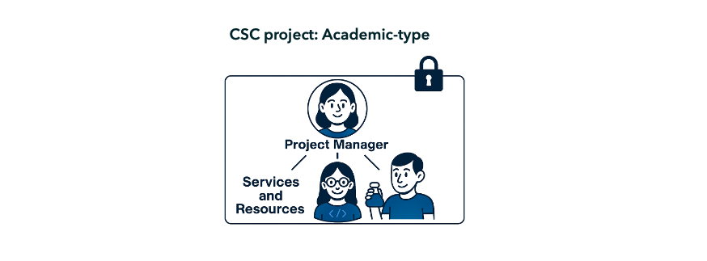

[Table of contents of user guide :material-arrow-right:](sd-services-toc.md)

# Start here: creating a CSC account and a CSC project Academic type

To access CSC Sensitive Data (SD) Connect or Desktop, you should first create a CSC project. A CSC project serves as your team’s shared workspace: all members access the same data and services. It is also where you define who can access the data, which CSC services the team can use, and what types of data the project will handle. To work with sensitive research data (such as consented data or confidential data), the project must be created as an **Academic-type CSC project**.

This guide explains how to get started, whether you are a project manager or a project member. The steps you need to follow depend on your role in the research team:

1. [Read project manager's responsibilities](#project-manager)

2. [Read project member's responsibilities](#project-member)

3. [Next, select tutorial](#select-tutorial)

### Project Manager

The project manager is the primary owner of the CSC project and acts as the representative of the Data Controller (typically the home organisation of the researchers). According to CSC’s Terms of Use, only group leaders and postdoctoral researchers may serve as CSC project managers. The role can be delegated to other research specialists after project creation by submitting a request to servicedesk@csc.fi.

Responsibilities include:

* Creating and managing CSC projects in the MyCSC portal.
  
* Defining data access by deciding who can join the project.

* Define what type of data are processed (personal sensitive data, confidential data) and describe it in the Description of processing acitivity form via the MYCSC portal. 
  
* Managing project lifetime, storage space (quota) and resources (here called Billing Units) via the MyCSC portal. 
  
* Deciding which services are suitable for data processing by adding services in the MYCSC portal.
  
* Exporting data from SD Desktop (only project managers can do this).

* Familairising with SD Services data retention policy. 

Please note: Academic-type CSC projects cannot be used for processing register data under the Finnish Act on Secondary Use of Health and Social Data.

### Project Member

A project member is invited into a CSC project by the project manager. All members of the same project have equal access to project data stored in SD services.

  
* All project members have equal access to the project's content (e.g. data access).
  
* **SD Connect:** project members can upload, download and delete files same way as project manager.
  
* **SD Desktop:** project members can upload data and analyze it, but they can not export anything from SD Desktop. Only the project manager can export data from SD Desktop.
  
* Project mebers can not add services via the MyCSC portal.
  
* Project memebers can apply for storage space (quota) and resources (here called Billing Units) via the MyCSC portal. 

## Select tutorial: 

* [Step by step tutorial for project manager](./sd-use-case-new-user-project-manager.md)

* [Step by step tutorial for project member](./sd-use-case-new-user-project-member.md)

!!! Note
    If you encounter any difficulties with these steps, feel free to reach out to us at servicedesk@csc.fi (subject: Sesntive Data services). We provide step-by-step online support to guide you through the process.

