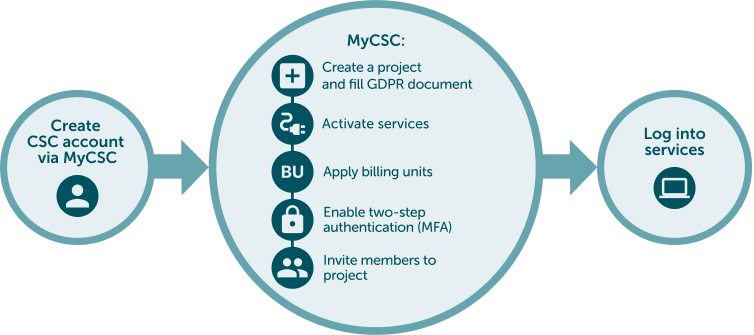

# How to get access to SD Services: Project manager

## Use case

You need to access to SD services. You are manager of research team or work independently.

## Solution

1. [Create a CSC account](#1-create-a-csc-account)
2. [Create new CSC project](#2-create-new-csc-project)
3. [Data protection](#3-data-protection)
4. [Activate SD Services for your project](#4-activate-sd-services-for-your-project)
5. [Apply resources (billing units) for your project](#5-apply-billing-units-for-your-project)
6. [Activate MFA Authentication](#6-activate-mfa-authentication)
7. [If you have a research team, add them to be your project members](#7-if-you-have-a-research-team-add-them-to-be-your-project-members)
8. [Closing your project and data retention](#8-closing-your-project-and-data-retention)
9. [Log into SD Services](#9-log-into-sd-services)
    

## Step by step tutorial

### 1. Create a CSC account
    
- **Go to [MyCSC portal](https://my.csc.fi){ target="_blank" }**
- Log in with Virtu or Haka depending on which federation your home organization is a member of. Select your home organization and log in to their identity service. [How to get an account without Haka or Virtu](../../accounts/how-to-create-new-user-account.md#getting-an-account-without-haka-or-virtu). 
- Fill in your information on the Sign up page.
- Set your password using 12 characters or more, containing both upper and lowercase letters and at least one number. No special characters are allowed.
 - You will receive your CSC user account confirmation via email.

### 2. Create new CSC project

- Go to ”Projects” page (left side menu or a hamburger menu at the top right corner).
- On the top of the page choose **”New project”**
- Fill in the project name and project description. You can edit these later if needed.
- Choose the Project category to be **“Academic”** (if you are a researcher and a member of Finnish higher education institution)
- If your project involves handling personal data, choose "Yes" for the field: **We handle personal data in this project**.
- Next, under Terms of Use, ensure you meet the **Prerequisites and Responsibilities** to be a CSC Project Manager. For research projects, the Project Manager should be an experienced researcher (e.g., postdoc, group leader, professor, or doctoral researcher employed by a research organization). **Note for Students:** If you are a student, please have your supervisor create the CSC project or contact us at servicedesk@csc.fi (subject: sensitive data) for assistance. Is is not possible to access SD Services with a student account.
- Finally, read and accept the terms of use.
- Click **“Create a project”**.

### 3. Data protection

#### 3.1 GDPR Form

When you first access your project, you’ll be prompted to complete the GDPR document (Description of Processing Activity form) if your project handles personal data. This form requires key details such as the types of data collected (e.g. sensitive personal data), how it is used and secured, and the data controller (usually your home organization). The form will be linked to your CSC project and guide CSC in managing the data. You can edit the document later if needed.

#### 3.1 Data Transfer Outside the EEA

When transferring personal or sensitive data outside the EEA, ensure you have the appropriate legal basis and comply with relevant data protection legislation. Be mindful of this when sharing sensitive data with collaborators via SD Connect or SD Desktop.

#### 3.2 Contact your organization’s legal office

If you need assistance with the above points or support to verify if SD service are suitable for processing your research data, contact your organization's data protection officer or [legal office](./../accounts/when-your-project-handles-personal-data/#contact-information-of-finnish-universities-data-protection-legal-offices). You can provide them with supporting documents such as:

1. [Technical and Organizational Measures (TOMS)](../../data/sensitive-data/technical-organisational-sec-measures.pdf)
2. Service descriptions of [SD Connect](https://research.csc.fi/-/sd-connect)and [SD Desktop](https://research.csc.fi/en/-/sd-desktop)
3. [The CSC Data Processing Agreement (DPA)](https://research.csc.fi/data-processing-agreement)
4. The GDPR form (Description of processing activity ) that can be downloaded from your CSC project
5. [The CSC Data Policy](https://www.csc.fi/en/data-policy)

### 4. Activate SD Services for your project

- Services are listed in **Services** window in the bottom right of the project page.
- Select **SD Connect** (Allas will be added automatically as it is the underlying storage solution).
- Read and accept the terms of use and click **“Add service”**.
- Select **SD Desktop** and add it also.

### 5. Apply billing units for your project

- CSC project consumes billing units (BU's).
- All new academic CSC projects are initially granted 10 000 BU's, so you can get started. However, you should estimate how many BU’s your project will consume **during 1 year** and apply more if needed. When you start a new project, you should plan ahead for your project's billing unit and storage usage.
- Use the billing unit calculator for estimating your billing unit consumption.
- Apply more billing units by clicking **"Apply for resources"** in Resource applications window.
- You will get more info after your application to your MyCSC inbox.
- You can always ask help from Service Desk _Subject: Sensitive Data_

Example using SD service for 6 months /one year:

| **Desktop Option** | **Billing Units (6 Months)** | **Billing Units (1 Year)** |
|--------------------|------------------------------|----------------------------|
| Small Computation | 22,464 units | 44,928 units |
| Medium Computation | 44,928 units | 89,856 units |
| Heavy Computation | 224,640 units | 449,280 units |
| Small GPU Computation | 518,400 units | 1,036,800 units |
| Medium GPU Computation | 864,000 units | 1,728,000 units |

Here’s a table summarizing the billing units required for storing data in **SD Connect/Allas** over **6 months** and **1 year** for various storage sizes:

| **Storage Size** | **Billing Units (6 Months)** | **Billing Units (1 Year)** |
|------------------|------------------------------|----------------------------|
| 500 GB (0.5 TB) | 2,160 units | 4,320 units |
| 1 TB | 4,320 units | 8,640 units |
| 10 TB | 43,200 units | 86,400 units |
| 100 TB | 432,000 units | 864,000 units |

### 6. Activate MFA Authentication

- You need to activate MFA (multi-factor authentication) to be able to log in the Sensitive Data services. [More about multi-factor authentication](../../accounts/mfa.md).
- Before activating MFA you need to have some authentication application in your mobile, for example Google Authenticator or Microsoft Authenticator.
- Go to the **Profile** page (Left side menu or top right hamburger menu).
- Enable Multi-Factor Authentication by clicking **“Activate”**.
- This will create a QR code which you can read with your authentication application (for example Google Authenticator).
- You authentication application will provide a verification code which you can now write to MyCSC **“Verification code”** field and click **“Verify”**.

### 7. If you have a research team, add them to be your project members

- Go to project page and select the correct project (Left side menu or hamburger menu).
- Add members from **Members** window at the top right of the project page.
- You can add members from your own organization by clicking **“Manage”**.
- Or you can create an invitation link by clicking **“Invite”** and use it in email or webpage.
- People can apply a membership for your project by clicking the invite link. After that you still have to approve them to be member of your project in MyCSC.

!!! Note 
    You project members must also create a MyCSC user account (this happens when they apply membership to your project), activate the MFA and approve the terms of use of the services you have activated (SD Connect, SD Desktop).

### 8. Closing your project and data retention

- As a project manager you should familiarize yourself how to [close CSC project](sd-csc-project.md#closing-csc-project).
- **All data in SD Connect and SD Desktop will be automatically deleted after 90 days after project closure.**
- CSC projects must be renewed each year to help CSC monitor resources and ensure that all researchers have access to the services. Project members will receive reminders about the project's expiration. If a CSC project expires, you will be notified. You can also directly close your project after completing your research.

### 9. Log into SD Services

- Now all the preparations are already and you can start to use SD Connect and SD Desktop.
    - [SD Connect login instructions](sd-connect-login.md)
    - [SD Desktop login instructions](sd-desktop-login.md)
