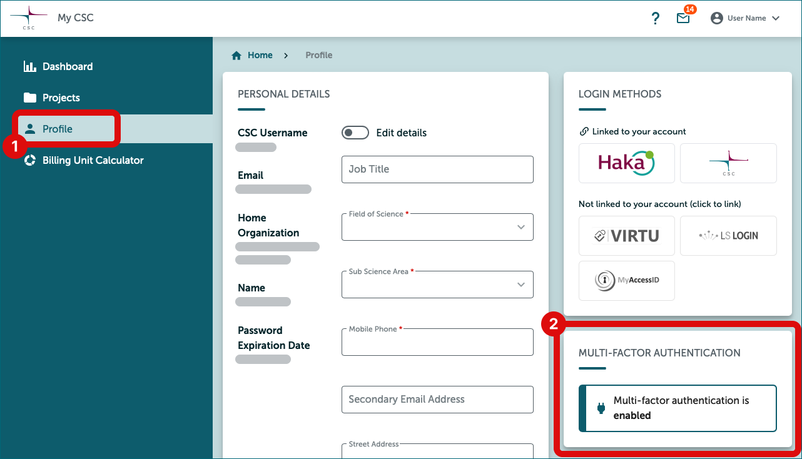

# How to get access to SD Services: Project manager

## Use case

You need to access to SD services. You are manager of research team or work independently.

## Solution

1. [Create a CSC account](#1-create-a-csc-account)
2. [Create new CSC project](#2-create-new-csc-project)
3. [Fill the GDPR document](#3-fill-the-gdpr-document)
4. [Activate SD Services for your project](#4-activate-sd-services-for-your-project)
5. [Apply resources (billing units) for your project](#5-apply-billing-units-for-your-project)
6. [Activate MFA Authentication](#6-activate-mfa-authentication)
7. [If you have a research team, add them to be your project members](#7-if-you-have-a-research-team-add-them-to-be-your-project-members)
8. [Log into SD Services](#8-closing-your-project)

## Step by step tutorial

### 1. Create a CSC account
    
- **Go to [MyCSC portal](https://my.csc.fi){ target="_blank" }**
- Log in with Virtu or Haka depending on which federation your home organization is a member of. Select your home organization and log in to their identity service. [How to get an account without Haka or Virtu](../../accounts/how-to-create-new-user-account.md#getting-an-account-without-haka-or-virtu). 
- Fill in your information on the Sign up page.
- Set your password using 12 characters or more, containing both upper and lowercase letters and at least one number. No special characters are allowed.
 - You will receive your CSC user account confirmation via email.

### 2. Create new CSC project

- Go to ”Projects” page (left side menu or a hamburger menu at the top right corner).
- On the top of the page choose **”New project”**
- Fill in the project name and project description. You can edit these later if needed.
- Choose the Project category to be **“Academic”** (if you are a researcher and a member of Finnish higher education institution)
- Fill all required fields. Read and accept the terms of use.
- Click **“Create a project”**.

### 3. Fill the GDPR document

- Since your project handles personal data, you need to fill the GDPR document i.e. *Description of processing activity* -form.
- The document appears when you create a new project. You can edit this document later.
- Please check with your home organization  who is the **data controller** (CSC is the data processor, never the controller). [Read more about the roles and GDPR](../../support/faq/sensitive-data-legal.md#what-are-the-roles-of-csc-and-its-service-users-under-gdpr).

### 4. Activate SD Services for your project

- Services are listed in **Services** window in the bottom right of the project page.
- Select **Allas** (You need Allas to use SD Connect).
- Read and accept the terms of use and click **“Add service”**.
- Select **SD Desktop** and add it also.

### 5. Apply billing units for your project

- CSC project consumes billing units (BU's). 
- All new academic CSC projects are initially granted 10 000 BU's, so you can get started. However, you should estimate how many BU’s your project will consume **during 1 year** and apply more if needed. When you start a new project, you should plan ahead for your [project's billing unit and storage usage](sd-csc-project.md).
- Use the [billing unit calculator](sd-csc-project.md#billing-unit-calculator-for-estimating-billing-units-consumption) for estimating your billing unit consumption.
- Apply more billing units by clicking **"Apply for resources"** in Resource applications window.
- You will get more info after your application to your MyCSC inbox.
- You can always ask help from [Service Desk](../../support/contact.md) *Subject: Sensitive Data*

### 6. Activate MFA Authentication

- You need to activate MFA (multi-factor authentication) to be able to log in the Sensitive Data services. [More about multi-factor authentication](../../accounts/mfa.md).
- Before activating MFA you need to have some authentication application in your mobile, for example Google Authenticator or Microsoft Authenticator.
- Go to the **Profile** page (Left side menu or top right hamburger menu).
- Enable Multi-Factor Authentication by clicking **“Activate”**.
- This will create a QR code which you can read with your authentication application (for example Google Authenticator).
- You authentication application will provide a verification code which you can now write to MyCSC **“Verification code”** field and click **“Verify”**.

### 7. If you have a research team, add them to be your project members

- Go to project page and select the correct project (Left side menu or hamburger menu).
- Add members from **Members** window at the top right of the project page.
- You can add members from your own organization by clicking **“Manage”**.
- Or you can create an invitation link by clicking **“Invite”** and use it in email or webpage.
- People can apply a membership for your project by clicking the invite link. After that you still have to approve them to be member of your project in MyCSC.

!!! Note 
    You project members must also create a MyCSC user account (this happens when they apply membership to your project), activate the MFA and approve the terms of use of the services you have activated (SD Connect, SD Desktop).

### 8. Closing your project

- As a project manager you should familiarize yourself how to [close CSC project](sd-csc-project.md#closing-csc-project).

### 9. Log into SD Services

- Now all the preparations are already and you can start to use SD Connect and SD Desktop.
    - [SD Connect login instructions](sd-connect-login.md)
    - [SD Desktop login instructions](sd-desktop-login.md)
