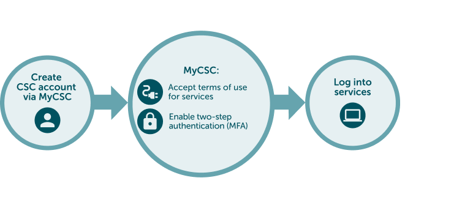

# How to get access to SD Services: Project member

## Use case

You need to access to SD services. You are member of a research team and research team manager has invited you to join CSC project.

## Solution

1. [Create a CSC account](#1-create-a-csc-account)
2. [Join to CSC project](#2-join-to-csc-project)
3. [Accept SD Services terms of use](#3-accept-sd-services-terms-of-use)
4. [Activate MFA Authentication](#4-activate-mfa-authentication)
5. [Log into SD Services](#5-log-into-sd-services)

## Step by step tutorial
    
### 1. Create a CSC account
- **Go to [MyCSC portal](https://my.csc.fi){ target="_blank" }**
- Log in with Virtu or Haka depending on which federation your home organization is a member of. Select your home organization and log in to their identity service. [How to get an account without Haka or Virtu](../../accounts/how-to-create-new-user-account.md#getting-an-account-without-haka-or-virtu). 
- Fill in your information on the Sign up page.
- Set your password using 12 characters or more, containing both upper and lowercase letters and at least one number. No special characters are allowed.
- You will receive your CSC user account confirmation via email.

### 2. Join to CSC project

- Project manager has either add you as a member automatically or sent you an invitation link to join their project.
- Option A: Project manager has added your email to the project and you are a member of the project automatically. You have received a notification trough email and you can find the project when you log in to MyCSC.
- Option B: Project manager has sent you an invitation link through email. You have to click the link and apply for membership to the project. After your membership application the project manager can approve you to the project.

### 3. Accept SD Services terms of use

- The project manager has added services to the project already. You as a project member has to **accept the terms of use**, so you can use the services.

### 4. Activate MFA Authentication

- You need to activate MFA (multi-factor authentication), to be able to log in the Sensitive Data services. [More about multi-factor authentication](../../accounts/mfa.md).
- Before activating MFA you need to have some authentication application in your mobile, for example Google Authenticator or Microsoft Authenticator.
- Go to the **Profile** page (Left side menu or top right hamburger menu).
- Enable Multi-Factor Authentication by clicking **“Activate”**.
- This will create a QR code, that you can read with your authentication application (for example Google Authenticator).
- You authentication application will provide a verification code, that you can now write to MyCSC **“Verification code”** field and click **“Verify”**.
 
 

### 5. Log into SD Services

- Now all the preparations are already and you can start to use SD Connect and SD Desktop.
    - [SD Connect login instructions](sd-connect-login.md)
    - [SD Desktop login instructions](sd-desktop-login.md)

