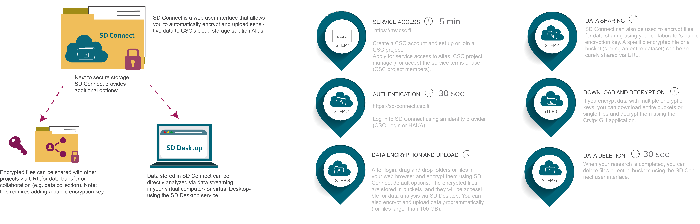

# Store and share with Sensitive Data Connect

!!! note "New version of SD Connect is available for testing purposes"
    - A new version of SD Connect is now available for testing purposes (Dec 2023). The updated user interface offers automated file encryption and decryption (up to 100 GB) along with key management. Additionally, three levels of sharing permissions are accessible across CSC projects. 

    - This version is in Open Beta. Kindly use it for testing scenarios and avoid relying on it for storing critical data until it transitions to a stable release. Please provide feedback by [contacting CSC Service Desk](../../support/contact.md) (subject: Sensitive Data) to contribute to service improvement.
    
    - Overview and intructions available in a preliminary user guide [here](../../data/sensitive-data/sd-connect-beta.md).

## Overview

Sensitive Data (SD) Connect allows you to store sensitive research data in the CSC's cloud storage solution Allas. With this user interface, you can easily encrypt and upload files from your web browser. As a result, SD Connect can serve as a workspace for collaborative research projects, facilitating data collection and sharing.  In addition, encrypted files stored in SD Connect are directly available for analysis, annotation or editing via the SD Desktop service. 

Contents:

* [Key features](./sd_connect.md#key-features)

* [Limitations](./sd_connect.md#limitations)

* [User interface](./sd_connect.md#user-interface)

You can browse through the main topics of the manual using the navigation bar on the left side of this page or the search function.

## Key features

* Accessible via web browser from your computer (Mac, Linux, or Windows) and any location (no need to install specific programs or use a VPN).

* Automated encryption and data upload via a web browser for small files (<1GB). Larger files (<100GB) can be encrypted using an application and uploaded to the web browser or programmatically (>100GB).

* Supports encryption and storage of any file type: text files, images, audio files, video, and genetic data (default space 10 TB, additional space required contact [CSC Service Desk](../../support/contact.md)). In addition, you can describe or organize each file or bucket with specific tags. 

## Limitations

* SD Connect is based on an object storage solution. Files are called objects, they are stored as file segments and can not be directly edited. All files (sensitive or non-sensitive, e.g. scripts) stored in SD Connect must be encrypted. 

* Automated encryption is currently limited to files <1GB. Larger files (up to 100 GB) can be encrypted with the Cryp4GH application and uploaded using SD Connect or programmatically (>100GB).

* SD Connect user interface is compatible with all modern web browsers but not supported during Firefox private browsing. 

*  The storage space remains available as long as the CSC project is active. All data will be deleted 90 days after account termination or project closure, accordingly to [CSC's General Terms of Use](https://research.csc.fi/general-terms-of-use). 

* CSC does not provide backups of the data stored in SD Connect. Therefore, we advise you to maintain **backups** of important datasets.

!!! Note
    Files uploaded using the automated encryption option between November 2, 2022, and December 2022 might be corrupted. This is because during data upload, files are split into short segments, and in some cases, the correct segment's order has been lost, making the files unreadable. Therefore, if you have used this function and can not re-upload a copy of the same data, don't hesitate to contact us at [CSC Service Desk](../../support/contact.md). We need to evaluate individual cases to determine if the files can be retrieved. Currently, SD Connect automated encryption is supported only for files <1GB.

!!! Note
    SD Connect is unsuitable for data processing under the Act on the Secondary Use of Health and Social Data. Please check [SD Desktop for secondary use](./sd-desktop-audited.md) to learn about the precise requirements.

## User interface 

As SD Connect is a service based on a cloud object storage solution, all files uploaded to CSC are stored in buckets or containers. Buckets are the main folder that holds your data. All buckets are associated with a CSC project. You can use buckets to organize data and control access via your CSC project or the share-bucket functionality. However, you can not merge buckets or change the order of the folders and subfolders stored in them. You can edit buckets or folder content only by making a complete copy inside the SD Desktop service or downloading the encrypted files back to your organization's secure computing environment for decryption. 

Once you log in to SD Connect, you can access three main pages: 

* The default _Browser page_, where are listed the buckets (or main folders) in which your encrypted files are stored;
* The _Shared_page_, where you can manage shared buckets;
* The _User information_ page, where you can visualize the resources consumed by your CSC project and the Project Identifier.

### Browser page

On the _Browser page_, you can :

* View all the buckets available in your CSC project, where you can store encrypted data.

* The buckets can be created, downloaded, deleted, or shared using the appropriate icons. Note: SD Connect displays all the data uploaded in Allas using CSC interfaces for non-sensitive data management. 
   
* List and select your CSC project from the drop-down menu bar (top left corner) to visualize buckets belonging to a specific CSC project;

* Open any bucket (double click) and view its content (uploaded files or folders). Any file can be downloaded or shared using the download link. From this view, you can also download the entire bucket, delete files or upload new files and folders;

* Clicking on _edit_, you can type in and add appropriate tags to describe buckets or files. 

### User information page

On this page, you can:

* in _Currently Consumes_ view statistics about the selected CSC project resource usage: billing unit consumption and the total project storage usage (default storage 10 TiB);

* in _Project usage_, you can view the SD Connect _Project Identifier_, an ID associated with your CSC project. This ID is required when sharing buckets with other CSC projects using the SD Connect user interface. It does not contain sensitive information. Thus, it can be shared with your colleagues or collaborators via email.

* access the _Sharing API tokens_ to generate a temporary token (necessary for data upload programmatically, using Swift client).

### Shared page

On the _Shared_ page:

* clicking on _Shared to the project_, you can view the buckets that other CSC projects (belonging to your colleagues or collaborators) shared with you. Next to the bucket name, under _Bucket Owner_, it displays the ID associated with the CSC project to which the bucket belongs (also called SD Account). With a double click, you can access the bucket and view the content (if you have reading access) or add files to the container (if you have edit rights).

!!! Note
    All the buckets listed here are owned by other users, which can decide when to revoke your access. You will not be able to access the file from SD Desktop until you make a copy of the bucket.

* clicking on _Shared from the project_, you can view the buckets you shared with other CSC projects. In this case, you own the shared buckets, and you can decide when to revoke access. 

