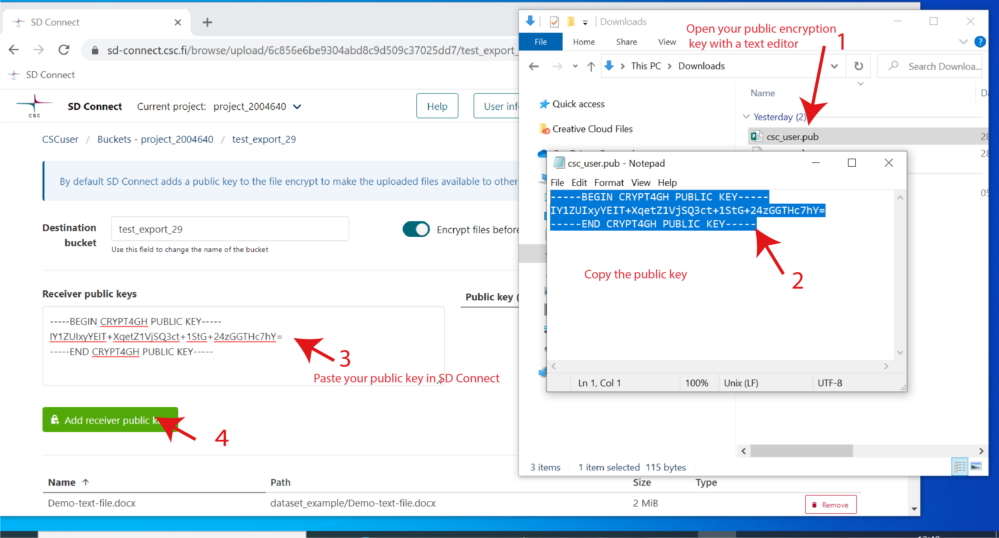

# SD Connect (Sensitive Data Connect)

SD Connect is an interface that allows you to encrypt and upload sensitive data to Allas (CSC cloud storage solution) from your web browser. No specific expertise is required to use the service. SD Connect is designed to store and easily share sensitive data, providing a secure workspace for collaborative research projects. All the data stored in SD Connect/Allas and encrypted using the default user interface options can be directly analysed via SD Desktop.

In the following user guide, you can learn how to:

* Apply for service access;
* Encrypt and upload sensitive data via a web browser using SD Connect;
* Encrypt and upload sensitive data programmatically;
* Download and decrypt data using the Crypt4gh application;
* Encrypt, upload and download sensitive data programmatically.

## Key features

* Accessible via web browser from your computer (Mac, Linux, or Windows) and from any location (no need to install specific programs or use a VPN).

* Only your colleagues (or CSC project members) can access encrypted files stored in the same CSC project. 

* Data upload and automated encryption via drag-drop using a web browser (less than 100 GB, larger datasets can be uploaded programmatically).

* Can store any file type: text files, images, audio files, video, and genetic data (default space 10 TB, additional space required contact servicedesk@csc.fi). You can define or manage each file or bucket with specific tags. By default, a project can store up to 10 TiB of data.

* Facilitates secure data sharing (via URL) with other CSC projects.

* Data stored in SD Connect can be accessed via SD Desktop for data analysis (if they are encrypted using the Sensitive Data services public encryption key, the default option for data upload via SD Connect).

**Limitations**:

* Data (sensitive or non-sensitive, e.g. scripts) stored in SD Connect must be encrypted. Files and folders are stored in buckets: the technical definition for the main folder in which all the files or folders uploaded to SD Connect (also called objects) are located. 

* Files stored in SD Connect/Allas (CSC cloud storage solution) can be directly analysed in read-only mode from SD desktop, but they can not be directly edited unless they are copied inside the virtual Desktop. 

## Before you start

* According to CSC policies and [general terms of use](https://research.csc.fi/general-terms-of-use), sensitive data must be encrypted when uploaded or stored in CSC services for sensitive data. 
    
* SD Connect facilitates working with sensitive data, and it is a user interface for Allas, CSC cloud storage solution. By default, a project can store up to 10 TiB of data. The storage space remains available as long as the CSC project is active. CSC does not make backups of the data in SD Connect. You need to **make your own backups** of important datasets.
   
* SD Connect and SD Desktop have not yet been security audited. Because of that, users may not process any personal data granted for the purposes of the Act on the Secondary Use of Health and Social Data (552/2019) by ***Findata.***


## Overview


## Service access 

To access SD Connect go to [MyCSC](https://my.csc.fi) and:

* set up [a CSC account](../../accounts/how-to-create-new-user-account.md);
* [join](../../accounts/how-to-add-members-to-project.md) or set up [a CSC project](../../accounts/how-to-create-new-project.md);
* fill in the [description of data processing activities](../../accounts/when-your-project-handles-personal-data.md) form;
* add [service access to Allas](../../accounts/how-to-add-service-access-for-project.md);


For specific guidance regarding these steps, check the [Accounts](../../accounts/index.md) paragraph at the beginning of this user guide.


## Authentication

Login to SD Connect is currently possible only with CSC credentials and  Haka (a user identity federation system) at:

   * [https://sd-connect.csc.fi](https://sd-connect.csc.fi) 

The interface is compatible with all modern web browsers. 


## User Interface 


<iframe width="280" height="155" srcdoc="https://www.youtube.com/embed/CMMwzl82dBI" title="YouTube video player" frameborder="0" allow="accelerometer; autoplay; clipboard-write; encrypted-media; gyroscope; picture-in-picture" allowfullscreen></iframe>


Once you log in to SD Connect, you can access three main pages: 

* the default **Browser** page, where are listed the buckets (or main folders) in which your encrypted files are stored;
* the **Shared** page, where you can manage shared buckets;
* the **User information** page, where you can visualise the resources consumed by your CSC project and the Project Identifier.


### Browser page

In this page, you can :

* View all **the buckets available in your CSC project**, where you can store encrypted data. The buckets can be created, downloaded, deleted or shared using the appropriate icons. Note: SD Connect displays all the data uploaded in Allas using CSC interfaces for non-sensitive data management. 
   
*  **list and select your CSC project** from the drop-down menu bar (top left corner) to visualize buckets belonging to a specific CSC project;

*  open any bucket (double click) and view its content (uploaded files or folders). Any file can be downloaded or shared using the download link. From this view, you can also download the entire bucket, delete files or upload new files and folders;


* clicking on **edit**, you can type in and add **appropriate tags** to describe buckets or files. 


### User information page

In this view, you can:

* in **Currently Consumes** view statistics about the selected CSC project resource usage: billing unit consumption and the total project storage usage (default storage 10 TiB);

* in **Project usage**, you can view the SD Connect **Project Identifier**, an ID associated with your CSC project. This ID is required when you want to share containers with other CSC projects using the SD Connect user interface. It does not contain sensitive information. Thus it can be shared with your colleagues or collaborators via email.

* access the **Sharing API tokens** through which you can generate a temporary token (necessary for data upload programmatically, using Swift client).


### Shared page


On the **Shared** page:

* in **Shared to the project**, you can view the **buckets that other CSC projects (belonging to your colleagues or collaborators) shared with you**. Next to the bucket name, under **Bucket Owner**,  it displays the ID associated with the CSC project to which the bucket belongs (also called SD Account). With a double click, you can access the bucket and view the content (if you have reading access) or add files to the container (if you have edits rights).

!!! note
    All the buckets listed here are owned by other users, which can decide when to revoke your access. You will not be able to access the file from SD Desktop until you make a copy of the bucket.


* in **Shared with the project**, you can view the buckets which  **you shared with other CSC projects**. In this case, you own the shared buckets, and you can decide when to revoke access. 


## Introduction to data encryption compatible with Sensitive Data services

Files uploaded to Sensitive Sensitive data services via SD Connect need to be encrypted. Once uploaded to CSC, encrypted data are accessible from each service component. At the same time, the original files are always encrypted during data storage or analysis. **Data encryption does not require technical expertise**. 

We integrated the encryption **as an automated step in the SD Connect user interface**, specifically for files less than 100 GB. All the data uploaded using SD Connect are automatically encrypted with the Sensitive Data services public encryption key. However, you can choose different options to encrypt your data for analysis or sharing. 

Briefly, the services use an encryption method called  _asymmetric encryption_,  based on two interlinked encryption keys:

   * A **public key** is always **used for data encryption**, but it can not be used to decrypt the data. You can share your public key with others, e.g. your collaborators and they will then be able encrypt data with your public key. 

   * A **secret key**, (also called a private key) is **used to decrypt** a file encrypted with the corresponding public key. This key is password protected and can not be shared with others. 


When using SD Connect to upload your data to CSC, you have three possibilities for encryption:

* You can simply upload the data using SD Connect, via your web browser, with the **default encryption options**. The files will be encrypted with the services encryption key and they will become compatible with other services components. They will be decrypted in an automated manner when accessed using SD Desktop, but you will not be able to decrypt the files after download.  We are developing a new feature that will simplify the download option and it will soon be available as part of the SD Connect user interface.
   
*  You can upload the data using SD Connect via web browser and **add your public encryption key**. The files will be encrypted with your enycyption key and with the services encryption key by default, thus, they will be compatible with other services components. Moreover, you will also be able to download and decrypt the data when necessary.
   
*  You can upload the data using SD Connect via your web browser and add **multiple encryption keys**. For example, your public encryption key and your collaborator's public encryption key. In this case, the files will be encrypted with the services encryption key by default and they will be compatible with other services components. Moreover, you and your collaborator will also be able to download and decrypt the data when necessary.

   
This encryption method is based on Crypt4GH, a tool initially designed to encrypt and share human genetic data according to the [Global Alliance for Genomics and Health](https://www.ga4gh.org/) (GA4GH) standard. Crypt4GH can be used to encrypt any file (images, audio, video, text files, etc.).
CSC has developed a simple application that will allow you to **generate your encryption keys**. 

The following paragraphs illustrate all the necessary steps to generate encryption keys, upload and encrypt your data using SD Connect, and decrypt the files once downloaded back to your computer. Of course, you can also execute each of these steps programmatically.


## Sensitive data encryption and upload (less than 100 GB) 

SD Connect allows you to encrypt and upload files or folders directly from your web browser (for files smaller than 100 GB). With the following workflow, the file will be **encrypted by default** with the services encryption key (also called here Sensitive Data services public key). In this manner, encrypted files will be safely stored in SD Connect and can be directly analysed using other Sensitive Data services components (for example, in SD Desktop). However, you will not be yet able to decrypt the files after download. We are developing a new feature that will soon provide also this option.


The necessary steps are the following: 
 
1- To upload folders and files to SD Connect, use the **drag and drop function**. You can also use the **upload** icon in the SD Connect browser window to select and upload files.


2-  Next, you will be **redirected to a new page displaying the default encryption options**. 


3- Here, you can specify the bucket's name to which the data should be uploaded. If you don't fill in a specific term, the user interface will automatically create a bucket named: upload-nnn (where nnn is replaced with a 13 digit number based on creation time). Note that **it is not possible to rename buckets**.


4- If you create a new bucket use the following **suggestions to name it**:

* Bucket **names must be unique** across all existing buckets in all projects in SD-Connect and Allas. If you can't create a new bucket, it's possible that some other project is already using the name you would like to use. To avoid this situation, it is good practice to include some project-specific identifiers (e.g., project ID number or acronym) in the bucket names.  
    
* **Avoid using spaces and special characters in bucket names**. Preferred characters are Latin alphabets (a-z), numbers (0-9), dash (-), underscore (\_) and dot (.). SD Connect can cope with other characters too, but they may cause problems in some other interfaces.

* All bucket **names are public**, so please do not include any confidential information in the bucket names


5- With the icon  **Select Files for Upload**, you will open a browser window in which you can select and add more files. 


6-  Next, click on **Encrypt and upload**: each file will be automatically encrypted and uploaded to the bucket in SD Connect. 


7- Once the process is completed, you can return to the SD Connect **browser** window. The encrypted files will be displayed in the correct bucket, in a **default folder called DATA**, and each encrypted file will have the extension *.c4gh*. 


## Sensitive data encryption and upload with multiple encryption keys (less than 100 GB) 


Using the SD Connect user interface, you can simultaneously encrypt your files with multiple encryption keys and the default services encryption key. Below, we will present how to generate your encryption key pair using an application called Crypt4GH and how your public encryption key (or your collabrator's public key) can then be used to encrypt files via web browser using SD Connect. 

1-**Install the Crypt4GH application**:

CSC has developed a simple application that will allow you to generate your encryption keys and decrypt files when necessary. 
Download the version specific to your operating system from the [GitHub repository](https://github.com/CSCfi/crypt4gh-gui/releases):  

  - [Linux](https://github.com/CSCfi/crypt4gh-gui/releases/download/v1.2.0/crypt4gh-gui-python3.8-linux-amd64.zip)
   - [Mac](https://github.com/CSCfi/crypt4gh-gui/releases/download/v1.2.0/crypt4gh-gui-python3.8-macos-amd64.zip)
   - [Windows](https://github.com/CSCfi/crypt4gh-gui/releases/download/v1.2.0/crypt4gh-gui-python3.8-windows-amd64.zip)

Please check that the tool for Windows has been digitally signed by CSC - IT Center for Science. After the download, you can find the Crypt4GH application in your downloads folder.

When you open the application for the first time, you might encounter an error message. In this case, click on _More info_ and verify that the publisher is CSC-IT Center for Science (or Finnish CSC-Tieteen tietotekniikan keskus Oy) and then click on _Run anyway_.


2-**Generate your encryption keys**:

* Open the Crypt4GH application and click on _Generate Keys_ (on the top right corner).
* The tool will open a new window and ask you to insert a password (_Private Key Passphrase_). This password will be associated with your secret key. **Please, use a strong password**.
* When you click on _OK_, the tool will generate a key pair consisting of a secret key (your username_crypt4gh.key) and a public key (your username_crypt4gh.pub).
* The keys/file names will be displayed in the Activity Log with the following message:

```
Key pair has been generated, your private key will be auto-loaded the next time you launch this tool:
Private key: username_crypt4gh.key
Public key: username_crypt4gh.pub
All the fields must be filled before file encryption will be started
```

The keys will be generated and saved to the **same folder in which the application resides**.

!!! Note
    * If you lose or forget your secret key or the password, you will be unable to decrypt the files.
    * Do not share your secret key or your password.
    * You need to **create your keys only once** and use them for all your encryption needs, but you can of course, choose to generate separate keys for encryption as you wish.


3-Upload upload folders and files to SD Connect using the **drag and drop function**. You can also use the **upload** icon in the SD Connect browser window to select and upload files.


4- Next, you will be **redirected to a new window displaying the default encryption options**.


5- Here, you can **turn on the button**: *Add other's receivers' public keys*. A new window called *Receiver public keys* will then appear on the page's left side. Here you can add multiple public encryption keys:

* Open your public key using Notepad or another text files reader. Copy the public key, **paste it** into the appropriate window, and click on *Add receiver public key*.



* Now, you will see the public key listed on the right side of the page.


* If, for example, you plan to share your data with a collaborator, you can add a second public key. Let's assume that your collaborator shared their public key with you via email. First, your should copy the public key and paste it into the *Receiver keys public window*. Next, we clicked on *Add receiver key*. Now you can see two keys listed in the right window.


6- You can specify the bucket's name in which the data should be uploaded. If you don't fill in a specific term, the user interface will automatically create a bucket named with a 13 digit number based on creation time). Note that **it is not possible to rename buckets**.


7-  Next, click on **Encrypt and upload**: each file will be automatically encrypted and uploaded to the specified bucket in SD Connect. 


8- Once the process is completed, you can return to the SD Connect **browser** window. The encrypted files will be displayed in the correct bucket, in a default folder called **DATA**, and each encrypted file will have the extension *.c4gh*. 

The files are now encrypted with three encryption keys:

- With the **default Sensitive Data services encryption key**. Thus, you will be able to **access and analyse** the data stored in SD Connect via SD Desktop (for further information, see SD Desktop user guide).

- With **your public ke**y. This allows you to download the data stored from SD Connect to, for example, different services and **decrypt** them using the correspondent secrete key. 

 - With **your collaborator's public key**. This allows sharing (or transferring) the data with your collaborator using SD Connect. Next, they will be able to download and decrypt the files in their secure computing environment, using the correspondent secrete key. 

Using this workflow allows to securely manage only one copy of the data for different purposes.


## Data Sharing 


<iframe width="280" height="155" srcdoc="https://www.youtube.com/embed/fj-KADK1ykY" title="YouTube video player" frameborder="0" allow="accelerometer; autoplay; clipboard-write; encrypted-media; gyroscope; picture-in-picture" allowfullscreen></iframe>

SD Connect user interface provides a simple way of sharing containers between different projects.

To share a container with another CSC project (and thus one of your colleagues or collaborators), you need to:

* **know in advance the project identifier you want to share a container with** (see above in *User Interface* paragraph);

* in the browser page, click on the **share** button on the row of the container in the bucket listing;

Clicking the button takes you to **Share the container**  view, in which the user needs to specify the project/projects the bucket is going to be shared with and what rights to give: 

* select **Grant read permission** if you want your colleagues to be able to see the files and folder inside the bucket and download them

* select also **Grant write permissions** if you want your colleague to be able to add files and folders to the shared bucket. If you select only this option, your colleague or collaborator will be only able to add files to the bucket but not be able to see its content.

* in **Project Identifiers to share with** add the SD Connect Project Identifier of the project you want to share the bucket with 

* Next click on **Share**

At this point, the user interface will redirect you to the **Shared** page, and the bucket will be listed under **Shared from project**. Here you will be able to interrupt the sharing by clicking on **Revoke bucket access**. 


## Data download and decryption

You can easily download entire buckets or single encrypted files from the SD Connect Browser page by clicking on download. 

After download, you can decrypt the data using the Crypt4GH application and your secret encryption key. Unfortunately, it is currently not possible not to decrypt more than one file at a time. However, we are working on adding this option and integrating it with the SD Connect user interface.

1- Open the Crypt4GH application and click on _load Your Private Key_.

2- Click on _Select File_ and upload the file you want to decrypt.

3- Click on _Open_.

4- Next, click on _Decrypt File_.

5-The tool will ask you to write the secret key's password, press _ok_. Then, the file will be decrypted in the same location as the original file.

The secret key must match the public key used to encrypt the data in the decryption process.
In the case of decryption, adding the public key is not mandatory, but if you have the public key of the person who has encrypted the file, you can use it to verify the encryption signature. If you don't select a public key, the activity log will display the following (the decryption will be executed anyway):

```
Sender public key has not been set, authenticity will not be verified.
```

If your decryption runs successfully, the activity log will display the following:

```
Decrypting.....

Decryption has finished

Decrypted file: C:/users/username/exampledirectory/examplefile
```


## Command Line Interface: data encryption and upload 


<iframe width="280" height="155" srcdoc="https://www.youtube.com/embed/l9BjVuUJ4zA" title="YouTube video player" frameborder="0" allow="accelerometer; autoplay; clipboard-write; encrypted-media; gyroscope; picture-in-picture" allowfullscreen></iframe>


!!! note
        Files encrypted with the _Sensitive Data services public key_, can be accessed for data analysis in SD Desktop. If you wish to encrypt the data to transfer them to other services or share them with your collaborators, you can add multiple encryption keys, such as your public key or your collaborator's public key to the encryption.


For general information about using Crypt4GH at CSC check: 
   * [crypt4gh GIT site](https://github.com/EGA-archive/crypt4gh.git)
 
  

1- Install the latest version of Crypt4GH encryption tool

**Python 3.6+ required** to use the crypt4gh encryption utility. 
To install Python: https://www.python.org/downloads/release/python-3810/

If you have a working python installation and you have permissions to add libraries to your python installation, you can install Crypt4GH with the command:

```text
pip install crypt4gh
```

2- Download CSC Sensitive Data services Public key

Download CSC Sensitive Data Services public key from the link [here](./csc-sd-services.pub), or copy/paste the three lines from the box below into a new file.
The file should be saved in text-only format. Here we assume that the key file is named as _csc-sd-services.pub_.

```text
-----BEGIN CRYPT4GH PUBLIC KEY-----
dmku3fKA/wrOpWntUTkkoQvknjZDisdmSwU4oFk/on0=
-----END CRYPT4GH PUBLIC KEY-----
```

3- Encrypt a file

Crypt4GH can use several public keys for encryption. This can be very handy in cases where the encrypted data needs to be used by several users or services. In this case, the syntax of the encryption command two encrypt the fikes with the Sensitive Data services public key, and your public key is:

```text
crypt4gh encrypt --recipient_pk public-key --recipient_pk public-key < input > output
```
For example

```text
crypt4gh encrypt --recipient_pk services.pub --recipient_pk username.pub < my_data1.csv > my_data1.csv.c4gh
```
The encrypted file (_my_data1.csv.c4gh_) can now be uploaded to SD Connect and will be automatically decrypted when imported into your private computing environment in SD Desktop. Moreover, you will also be able to download and decrypt the data. 
 

### Data encryption and upload with Allas help tool: a-put

The [allas client utilities](https://github.com/CSCfi/allas-cli-utils/) is a set of command-line tools that can be installed and used in Linux and MacOSX machines. If you have these tools, you can use data upload command _a-put_ with command-line option _--sdx_ to upload data to Allas/SD Connect so that the uploaded files are automatically encrypted with the CSC Sensitive Data Services public key before the upload. The public key is included in the tool so that you don't need to download your copy of the key.

You can upload a single file with a command like:

```text
a-put --sdx my_data1.csv
```
By default _a-put --sdx_ uploads the encrypted file into the bucket named _project-number-SD_CONNECT_ . 

You can also upload complete directories and define a specific target bucket. For example, the command below will encrypt and upload all the files in directory _my_data_ to SD Connect into bucket _1234_SD_my_data_.

```text
a-put --sdx my_data -b 1234_SD_my_data
```
You can use a-put to encrypt the data with several keys so that the uploaded data can be used in SD Desktop and other environments.

```text
a-put --sdx my_data -b 1234_SD_my_data --encrypt c4gh --public-key my-key.pub --public-key collaborator-key.pub
```


### Programmatic data upload and download with SD Connect

To upload encrypted data to SD Connect programmatically, you need to use your CSC credentials (CSC username and password).

SD Connect is a user interface for CSC Allas object storage. As SD Connect is based on Swift protocol, it is recommended that you use upload tools that are based on swift protocol. However, you can also use any of the Allas compatible clients to upload your data to SD-Connect programmatically.


These include:

   * [rclone](../Allas/using_allas/rclone.md) (with normal Allas configuration)
   * [swift command line client](../Allas/using_allas/swift_client.md)
   * [Horizon web interface](../Allas/using_allas/web_client.md) in [https://pouta.csc.fi](https://pouta.csc.fi)
   * [CyberDuck](../Allas/using_allas/cyberduck.md) Graphical data transport tool for Windows and Mac.

Note that if you use these tools, you must encrypt your sensitive data before uploading it to SD Connect.


## Command Line Interface: encryption for data sharing 

For documentation and more information, you can check the [Crypt4GH Encryption Utility](https://github.com/EGA-archive/crypt4gh.git) page.

In this example, we first generate your key pair (a password-protected private key and a public key that can be shared with collaborators). Next, we encrypt a file with your private key and the public keys of two different collaborators (research group A and research group B).

**Python 3.6+ is required** to use the Crypt4GH encryption utility. If you need help installing Python, please follow [these instructions](https://www.python.org/downloads/release/python-3810/).

1- Install the Crypt4GH encryption CLI tool

You can install Crypt4GH directly with pip tool:

```bash
pip install crypt4gh     
```

or, if you prefer the latest sources from GitHub:

```bash
pip install -r crypt4gh/requirements.txt
pip install ./crypt4gh
```

or even:

```bash
pip install git+https://github.com/EGA-archive/crypt4gh.git
```

The usual `-h` flag shows you the different options that the tool accepts:

```bash
$ crypt4gh -h

Utility for the cryptographic GA4GH standard, reading from stdin and outputting to stdout.

Usage:
   {PROG} [-hv] [--log <file>] encrypt [--sk <path>] --recipient_pk <path> [--recipient_pk <path>]... [--range <start-end>]
   {PROG} [-hv] [--log <file>] decrypt [--sk <path>] [--sender_pk <path>] [--range <start-end>]
   {PROG} [-hv] [--log <file>] rearrange [--sk <path>] --range <start-end>
   {PROG} [-hv] [--log <file>] reencrypt [--sk <path>] --recipient_pk <path> [--recipient_pk <path>]... [--trim]

Options:
   -h, --help             Prints this help and exit
   -v, --version          Prints the version and exits
   --log <file>           Path to the logger file (in YML format)
   --sk <keyfile>         Curve25519-based Private key.
                          When encrypting, if neither the private key nor C4GH_SECRET_KEY are specified, we generate a new key
   --recipient_pk <path>  Recipient's Curve25519-based Public key
   --sender_pk <path>     Peer's Curve25519-based Public key to verify provenance (akin to signature)
   --range <start-end>    Byte-range either as  <start-end> or just <start> (Start included, End excluded)
   -t, --trim             Keep only header packets that you can decrypt

Environment variables:
   C4GH_LOG         If defined, it will be used as the default logger
   C4GH_SECRET_KEY  If defined, it will be used as the default secret key (ie --sk ${C4GH_SECRET_KEY})
```

You may notice that crypt4gh uses `--sk` option for the private key. This might seem odd but apparently, crypt4gh uses term _secure key_ for private key, hence `sk`, and consequently `pk` refers to public key instead of the private key.

2- Generate your public-private keypair

You use `crypt4gh-keygen` command to create your private and public keys:

```bash
$ crypt4gh-keygen --sk mykey.sec --pk mykey.pub
Generating public/private Crypt4GH key pair.
Enter passphrase for meykey.sec (empty for no passphrase): 
Enter passphrase for mykey.sec (again): 
Your private key has been saved in mykey.sec
Your public key has been saved in mykey.pub
```

where `--sk mykey.sec` is your private (secret, sk) key and `--pk mykey.pub` is your public key (pk). The tool will ask you to enter a password (passphrase) for your private key. For security reasons, the password is not shown when you type it so the tool will ask you to enter it a second time to make sure you made no typing errors (or, you make the same errors twice…). Please, use a strong password!

!!! Note
    If you lose or forget your private key, or the password to it, you will be unable to decrypt the files. Do not share your private key or your password.

!!! Note
    You need to create your keys only once and use them for all your encryption needs, but you can of course, choose to generate separate keys for encryption as you wish.

3- Encrypt a file

To ecrypt files you will need 1) your private and public keys, and 2) your recipients' public keys. As stated before, in this example we are sharing the data with two recipients (research groups A and B) and hence, we have received their public keys somehow (e.g. via email). To encrypt a file you use `crypt4gh encrypt` command:

```bash
$ crypt4gh encrypt --sk mykey.sec --recipient_pk groupA.pub --recipient_pk groupB.pub <dog.jpg >dog.jpg.c4gh
Passphrase for mykey.sec: 
```

where `--sk mykey.sec` is your private key, `--recipient_pk groupA.pub` is the research group A's public key, and `--recipient_pk groupB.pub` is the research group B's public key. The `crypt4gh` command uses only standard input (stdin) and standard output (stdout) so you must use shell redirections: `<` denotes an input file and `>` and denotes an output file, hence `<dog.jpg` reads in a file called _dog.jpg_ and `>dog.jpg.c4gh` writes out an encrypted file named _dog.jpg.c4gh`.

The command will ask you to enter the password (passphrase) of your private key. For security reasons, the password is not displayed when you type it.

!!! Note
    If you want to be able to decrypt the file yourself you must add your own public key also as a recipient.

4- Decrypt a file

To decypt a file you will need a private key which corresponds to one of the public keys used in encryption phase. Let's assume in our example that the research group A is decrypting a file you've sent them. To decrypt a file you use `crypt4gh decrypt` command:

```bash
crypt4gh decrypt --sk groupA.sec <dog.jpg.c4gh >dog.jpg
Passphrase for groupA.sec: 
```

where `--sk groupA.sec` is a corresponding private key to one of the public keys used in the encryption. The `crypt4gh` command uses only standard input (stdin) and standard output (stdout) so you must use shell redirections: `<` denotes an input file and `>` and denotes an output file, hence `<dog.jpg.c4gh` reads in an ecrypted file called _dog.jpg.c4gh_ and `>dog.jpg` writes out a decrypted file named _dog.jpg_.

The command will ask you to enter the password (passphrase) of your private key. For security reasons the password is not displayed when you type it.

!!! Note
    In case you are decrypting the file in SD Desktop and the CSC Sensitive Data public key has been used in encryption, decryption will be done automatically and you do not need to specify any decryption keys.
    
    
    


    
 
## Troubleshooting


| Problem           |                                                                                       | Possible Solution                                                                                                                                                                                                                                                                                                                                                            |
|-------------------|---------------------------------------------------------------------------------------|------------------------------------------------------------------------------------------------------------------------------------------------------------------------------------------------------------------------------------------------------------------------------------------------------------------------------------------------------------------------------|
| Decryption        | I cannot decrypt the data I downloaded from CSC services.                             | You can decrypt the data only if you have also used your public key for the encryption. If you used only the Sensitive Data Services public for the encryption, the data can be decrypted only in SD Desktop. In that case, the decryption is automatic. If you used your collaborator’s public key to encrypt the data, only they can decrypt the data with their private key.  |
| Encryption        | Encryption takes a long time.                                                         | For large files and datasets, the encryption can take up to a few minutes.                                                                                                                                                                                                                                                                                                   |
| Folder encryption | I can not select the folder I want to encrypt with Crypt4GH application. | It is not possible to encrypt/decrypt an entire folder, just single files                                                                                                                                                                                                                                                                                                            |


| Problem       |                                                                                          | Possible solution                                                                                                                                                                                                                               |
|---------------|------------------------------------------------------------------------------------------|-------------------------------------------------------------------------------------------------------------------------------------------------------------------------------------------------------------------------------------------------|
| Data upload   | I am trying to upload a big file/folder with the user interface and the upload is stuck. | To upload files or folders that are larger than 100 GB, the data should be uploaded programmatically.                                                                                                                                           |
|               | Low upload speed (programmatically)                                                      | Average upload speed can go from 100 to 200 MiB/s. Specific scripts can be used to optimize the upload of large files.                                                                                                                          |
| Bucket        | I am not able to create a new bucket.                                                    | 1)      Check in MyCSC portal that your current project has service access for Allas 2)      Try to use a bucket name that is unique and doesn’t contain special characters. 3)  Select the correct project in SD Connect user interface        |
|               | I cannot find my bucket.                                                                 | Check if the bucket is stored under a different project. If someone has shared the bucket with you, you can find it under the ‘Shared to’ section and copy it. If someone has shared the bucket with you, they could have revoked the sharing.  |
|               | I cannot upload data into my bucket                                                      | Check that your project still has storage space left.                                                                                                                                                                                           |
| Shared bucket | I cannot upload data into a shared bucket.                                               | Your colleague didn’t add editing rights when they shared the bucket.                                                                                                                                                                           |
|               | I cannot see the content of a shared bucker.                                             | Your colleague didn’t add reading rights when they shared the bucket.  


    
