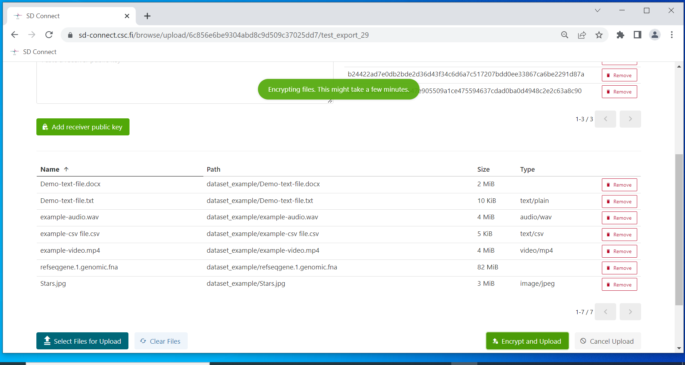

# Store and share with Sensitive Data Connect


## Overview

Sensitive Data (SD) Connect allows you to store sensitive research data in the CSC's cloud storage solution Allas. With this user interface, you can easily encrypt and upload files from your web browser. As a result, SD Connect can serve as a workspace for collaborative research projects, facilitating data collection and sharing.  In addition, encrypted files stored in SD Connect are directly available for analysis, annotiation or editing via the SD Desktop service. 

[](images/connect/connect_overviewnew.png)

Contents:

* [Key features](./sd_connect.md)
  
* [Authentication](./sd_connect.md#authentication)

* [User Interface](./sd_connect.md#user-interface)
  
* [Introduction to data encryption compatible with sensitive data services](./sd_connect.md#introduction-to-data-encryption-compatible-with-sensitive-data-services)
 
 * [Data encryption and upload for analysis (less than 1 GB)](./sd_connect.md#sensitive-data-encryption-and-upload-for-analysis-less-than-1-gb) (Default analysis)

* [Data encryption and upload for analysis (up to 100 GB)](./sd_connect.md#sensitive-data-encryption-and-upload-for-analysis-up-to-100-gb)
 
* [Data encryption and upload for storage and sharing (less than 1 GB)](./sd_connect.md#sensitive-data-encryption-and-upload-for-storage-and-sharing-less-than-1-gb) (Data storage and transfer)
 

* [Data sharing](./sd_connect.md#data-sharing) 
 
* [Data download and decryption](./sd_connect.md#data-download-and-decryption) (Data storage and transfer)
 
* [Command Line Interface: data encryption and upload](./sd_connect.md#command-line-interface-data-encryption-and-upload) (Advanced)
 
 
* [Command Line Interface: data encryption for data sharing](./sd_connect.md#command-line-interface-encryption-for-data-sharing) (Advanced)
 
* [Troubleshooting](./sd_connect.md#troubleshooting)


You can browse through the main topics of the manual using the navigation bar on the left side of this page or the search function.

## Key features

* Accessible via web browser from your computer (Mac, Linux, or Windows) and any location (no need to install specific programs or use a VPN).

* Automated encryption and data upload via a web browser for small files (1<GB). Larger files (100<GB) can be encrypted using an application and uploaded to the web browser or programmatically (100>GB).

* Supports encryption and storage of any file type: text files, images, audio files, video, and genetic data (default space 10 TB, additional space required contact servicedesk@csc.fi). In addition, you can describe or organize each file or bucket with specific tags. 


**Limitations**:

* SD Connect is based on an object storage solution. Files are called objects, they are stored as file segments and can not be directly edited. All files (sensitive or non-sensitive, e.g. scripts) stored in SD Connect must be encrypted. 

* Automated encryption is currently limited to files <1GB. Lager files (up to 100 GB) can be encrypted with the Cryp4GH application and uploaded using SD Connect or programmatically (>100GB).

* SD Connect user interface is compatible with all modern web browsers but not supported during Firefox private browsing. 

*  The storage space remains available as long as the CSC project is active. All data will be deleted 90 days after account termination or project closure, accordingly to [CSC's General Terms of Use](https://research.csc.fi/general-terms-of-use). 

* CSC does not provide backups of the data stored in SD Connect. Therefore, we advise you to maintain **backups** of important datasets.

!!! Note
    Files uploaded using the automated encryption option between November 2, 2022, and December 2022 might be corrupted. This is because during data upload, files are split into short segments, and in some cases, the correct segment's order has been lost, making the files unreadable. Therefore, if you have used this function and can not re-upload a copy of the same data, don't hesitate to contact us at servicedesk@csc.fi. We need to evaluate individual cases to determine if the files can be retrieved. Currently, SD Connect automated encryption is supported only for files <1GB.


!!! Note
    SD Connect is unsuitable for data processing under the Act on the Secondary Use of Health and Social Data. Please check [SD Desktop for secondary use](./sd-desktop-audited.md) to learn about the precise requirements.


## Authentication

After creating a CSC account, a CCS project and appling for Allas service access, login to SD Connect is currently possible only with CSC credentials and  Haka (a user identity federation system) at:

   * [https://sd-connect.csc.fi](https://sd-connect.csc.fi) 


!!! Note
    The interface is compatible with all modern web browsers but does not support Firefox private browsing (incognito mode). 

[](images/connect/SDConnect-login.png)


## User Interface 

As SD Connect is a service based on a cloud object storage solution, all files uploaded to CSC are stored in buckets or containers. Buckets are the main folder that holds your data. All buckets are associated with a CSC project. You can use buckets to organize data and control access via your CSC project or the share-bukcet functionality. However, you can not merge buckets or change the order of the folders and subfolders stored in them. You can edit buckets or folder content only by making a complete copy inside the SD Desktop service or downloading the encrypted files back to your organization's secure computing environment for decryption. 

Once you log in to SD Connect, you can access three main pages: 

* The default _Browser page_, where are listed the buckets (or main folders) in which your encrypted files are stored;
* The _Shared_page_ , where you can manage shared buckets;
* The _User information_ page, where you can visualise the resources consumed by your CSC project and the Project Identifier.


### Browser page


On the _Browser page_ , you can :

* View all the buckets available in your CSC project, where you can store encrypted data.

* The buckets can be created, downloaded, deleted, or shared using the appropriate icons. Note: SD Connect displays all the data uploaded in Allas using CSC interfaces for non-sensitive data management. 
   
* List and select your CSC project from the drop-down menu bar (top left corner) to visualize buckets belonging to a specific CSC project;

* Open any bucket (double click) and view its content (uploaded files or folders). Any file can be downloaded or shared using the download link. From this view, you can also download the entire bucket, delete files or upload new files and folders;

* Clicking on _edit_, you can type in and add appropriate tags to describe buckets or files. 


### User information page

On this page, you can:

* in _Currently Consumes_ view statistics about the selected CSC project resource usage: billing unit consumption and the total project storage usage (default storage 10 TiB);

* in _Project usage_, you can view the SD Connect _Project Identifier_, an ID associated with your CSC project. This ID is required when sharing buckets with other CSC projects using the SD Connect user interface. It does not contain sensitive information. Thus it can be shared with your colleagues or collaborators via email.

* access the _Sharing API tokens_ to generate a temporary token (necessary for data upload programmatically, using Swift client).


### Shared page


On the _Shared_ page:

* clicking on _Shared to the project_, you can view the buckets that other CSC projects (belonging to your colleagues or collaborators) shared with you. Next to the bucket name, under _Bucket Owner_,  it displays the ID associated with the CSC project to which the bucket belongs (also called SD Account). With a double click, you can access the bucket and view the content (if you have reading access) or add files to the container (if you have edit rights).

!!! Note
    All the buckets listed here are owned by other users, which can decide when to revoke your access. You will not be able to access the file from SD Desktop until you make a copy of the bucket.

* clicking on _Shared from the project_, you can view the buckets you shared with other CSC projects. In this case, you own the shared buckets, and you can decide when to revoke access. 


## Introduction to data encryption compatible with Sensitive Data services


<iframe width="280" height="155" srcdoc="https://www.youtube.com/embed/dI1Py_1gA-k" title="YouTube video player" frameborder="0" allow="accelerometer; autoplay; clipboard-write; encrypted-media; gyroscope; picture-in-picture" allowfullscreen></iframe>


Sensitive data uploaded to CSC's cloud services using SD Connect or programmatically must be encrypted. Files encrypted following the guidelines provided in this chapter will be compatible and accessible via all Sensitive Data (SD) Service components. This way, encrypted files stored in the SD Connect service will be available for analysis (using the SD Desktop service) or publishing and reuse under controlled access (via SD Submit, Federated EGA, or SD Apply). 

!!! Note
    Data encryption does not require technical expertise but requires you to become familiar with the following user guide and video tutorials. We also provide step-by-step guidance online or via the help desk. If you have any questions or the instructions below need clarification, don't hesitate to contact us at servicedesk@csc.fi (subject: Sensitive Data). 

We integrated the encryption as an automated step in the SD Connect user interface, specifically for files smaller than 1 GB. All the data uploaded using SD Connect are automatically encrypted with the Sensitive Data services public encryption key. However, you can choose different options to encrypt your data for analysis or sharing. 

Briefly, the services use an encryption method called  _asymmetric encryption_,  based on two interlinked encryption keys:

   * A public key is used for data encryption. A public can not be used to decrypt the data. You can share your public key with others, e.g. your collaborators and they will then be able encrypt data with your public key. 

   * A secret key (also called a private key) is used to decrypt a file encrypted with the corresponding public key. This key is password protected and can not be shared with others. 


When using SD Connect to upload your data to CSC, you have several possibilities for encryption:

1- Default option for data analysis:

* With the default encryption options, you can upload the data using SD Connect via your web browser for data analysis. The files will be automatically encrypted and accessible for analysis via SD Desktop. However, you cannot decrypt the files after downloading them to your laptop or organization's computing environment. Therefore, we are developing a new feature that provides automated decryption via SD Connect. For more information, contact us at: servicedesk@csc.fi (Sensitive Data).

2- Adding multiple encryption keys for data storage, sharing and transfer:
   
*  You can upload the data using SD Connect via a web browser and add your public encryption key. The files will be encrypted with the SD services by default, but you can also add your encryption key. In this manner,  you will also be able to download and decrypt the data when necessary
   
*  You can upload the data using SD Connect via your web browser and add several encryption keys. For example, your public encryption key and your collaborator's public encryption key. Also, in this case, the files will be encrypted with the SD services encryption key by default and available for data analysis via SD Desktop. Moreover, you and your collaborator can also download and decrypt the data when necessary.

   
This encryption method is based on Crypt4GH, a tool initially designed to encrypt and share human genetic data according to the [Global Alliance for Genomics and Health](https://www.ga4gh.org/) (GA4GH) standard. Crypt4GH can be used to encrypt any file (images, audio, video, text files, etc.).
CSC has developed a simple application that will allow you to **generate your encryption keys**. 

The following paragraphs illustrate all the necessary steps to generate encryption keys, upload and encrypt your data using SD Connect, and decrypt the files once downloaded back to your computer. Of course, you can also execute each of these steps programmatically.


## Sensitive data encryption and upload for analysis (less than 1 GB) 

<iframe width="280" height="155" srcdoc="https://www.youtube.com/embed/yAKtGs6FkMc" title="YouTube video player" frameborder="0" allow="accelerometer; autoplay; clipboard-write; encrypted-media; gyroscope; picture-in-picture" allowfullscreen></iframe>

With SD Connect, you can encrypt and upload files or folders from your web browser (<1GB). Each file will be encrypted with the default automated option, uploaded, and safely stored in SD Connect and can be directly analysed using SD Desktop. Please view the following paragraph for guidance on encrypting and uploading larger files. 

Automated encryption via SD Connect is suitable for any file type and format. However, uploading large files might take several hours, depending on the internet connection. Data upload will be interrupted after 8 hours. 

The necessary steps to automatically upload and encrypt small files are the following: 

1- From the SD Connect browser page, select the correct CSC project.
 
2- To upload folders, drag and drop them to the browser or click the _upload_ icon.

3- You will be redirected to a new page displaying the default encryption options. 

4- You can specify the bucket's name to which the data should be uploaded. If you don't fill in a specific term, the user interface will automatically create a bucket named: upload-nnn (where nnn is replaced with a 13-digit number based on creation time). Note that it is not possible to rename buckets.

5- If you create a new bucket, use the following suggestions to name it:

* Bucket names must be unique across all existing buckets in all projects in SD-Connect and Allas. If you can't create a new bucket, some other project may already use the name you would like to use. To avoid this situation, it is good practice to include project-specific identifiers (e.g., project ID number or acronym) in the bucket names.  
    
* Avoid using spaces and special characters in bucket names. Preferred characters are Latin alphabets (a-z), numbers (0-9), dash (-), underscore (\_), and dot (.). SD Connect can also support other characters, but they may cause problems in other interfaces.

* All bucket names are public, so please do not include any confidential information in the bucket names

6- Clicking on the icon  _Select files for Upload_, you will open a browser window in which you can select and add more files. 

7-  Next, click on _Encrypt and Upload_: each file will be automatically encrypted and uploaded to the bucket in SD Connect. The upload bar will display the state of data encryption and upload. 

8- Once the process is completed, you can return to the SD Connect browser page by clicking on _Browser_. The encrypted files will be displayed in the correct bucket, in a default folder called DATA, and each encrypted file will have the extension .c4gh. 

9- Encrypted files are now available for data analysis, editing or annotation via the SD Desktop service. 

!!! Note
    Due to a technical issue, buckets containing encrypted files might look empty (white) after data upload. This problem can be solved by clearing the browser cookies. 

[](images/connect/SDConnect-upload.png)

## Sensitive data encryption and upload for analysis (up to 100 GB) 

As the workflow described above is still being developed, files up to 100 GB can be encrypted with an additional step with an application called Crypt4GH. Encrypted files can then be uploaded to CSC using SD Connect (via a web browser) and directly analysed using SD Desktop. This method is suitable for any file type and format. 

!!! Note
    With this workflow, it is possible to encrypt only single files. If you have any questions or the instructions below need clarification (e.g. encryption of multiple files), don't hesitate to contact us at servicedesk@csc.fi (subject: Sensitive Data). We also provide step-by-step guidance online (e.g. via Zoom). 


The necessary steps for encryption with Cryp4GH application and upload with SD Connect are the following: 

1- First, download the encryption application specific to your operating system from the [GitHub repository](https://github.com/CSCfi/crypt4gh-gui):

* [Mac](https://github.com/CSCfi/crypt4gh-gui/releases/download/v1.3.0/crypt4gh-gui-python3.10-macos-amd64.zip)

* [Windows](https://github.com/CSCfi/crypt4gh-gui/releases/download/v1.3.0/crypt4gh-gui-python3.10-windows-amd64.zip)

* [Linux](https://github.com/CSCfi/crypt4gh-gui/releases/download/v1.3.0/crypt4gh-gui-python3.10-linux-amd64.zip)

2- After downloading and unzipping the  Crypt4GH application, you can find it in your download folder. When you open it, you might encounter an error message. In this case, click on _More info_ and verify that the publisher is CSC-IT Center for Science (or in Finnish CSC-Tieteen tietotekniikan keskus Oy) and click on _Run anyway_.

3- Open the Crypt4GH application and press _ Select File_. This will allow you to access a small browser that you can use to select the File that needs to be encrypted.  

4- Click on _Open_ . The file name will be displayed under _File to encrypt_. Next, press on _Encrypt_.

5- The Cryot4GH application will create an encrypted file in the same folder as the original file, with the extension being .c4gh.

For example, encrypting the file my_data1.csv will produce a new, encrypted file named my_data.csv.c4gh. 
Unfortunately, the Cryp4GH application does not provide a progress bar, and the encryption process can last up to several minutes.

[](images/connect/connect_encryption_large.png)

6- Now, you can upload the encrypted file (or a folder containing encrypted data) to SD Connect using the drag-and-drop function.

7- Next, you will be redirected to a new page. Here deselect the option: _Encrypt file before Upload._

8- Next, you can specify the bucket name to which the data should be uploaded. If you don't fill in a specific name, the user interface will automatically create a bucket named: upload-nnn (where nnn is replaced with a 13-digit number based on creation time). Note that it is not possible to rename buckets.
If you create a new bucket, use the following suggestions to name it. Bucket names must be unique across all existing buckets in all projects in SD-Connect and Allas. If you can't create a new bucket, some other projects may already use the name you want to use. To avoid this situation, it is good practice to include project-specific identifiers (e.g. project ID number or acronym) in the bucket names. Avoid using spaces and special characters in bucket names. Preferred characters are Latin alphabets (a-z), numbers (0-9), dash (-), underscore (_), and dot (.). SD Connect can also support other characters, but they may cause problems in other interfaces. All bucket names are public, so please do not include any confidential information in the bucket names.

9- Next, click on _Upload_. A progress bar will visualise the upload's status. Once the process is completed, you can return to the SD Connect browser window, open the bucket and visualize the encrypted file, here named .c4hg.

[](images/connect/connect_encryption_large_upload.png)


## Sensitive data encryption and upload for storage and sharing (less than 1 GB) 


<iframe width="280" height="155" srcdoc="https://www.youtube.com/embed/xpUF0ig-4MI" title="YouTube video player" frameborder="0" allow="accelerometer; autoplay; clipboard-write; encrypted-media; gyroscope; picture-in-picture" allowfullscreen></iframe>

<iframe width="280" height="155" srcdoc="https://www.youtube.com/embed/oQxz_0Mz5pU" title="YouTube video player" frameborder="0" allow="accelerometer; autoplay; clipboard-write; encrypted-media; gyroscope; picture-in-picture" allowfullscreen></iframe>


Using the SD Connect, you can simultaneously encrypt your files ith multiple encryption keys. In this manner, the files can be used for several purposes: data analysis with SD Desktop, data storage or data sharing with SD Connect.

 Below, we will illustrate how to generate your encryption key pair using an application called Crypt4GH and how your public encryption key (or your collabrator's public key) can then be used to encrypt files via a web browser using SD Connect. 

1-Install the Crypt4GH application:

CSC has developed a simple application that will allow you to generate your encryption keys and decrypt files when necessary. 
Download the version specific to your operating system from the [GitHub repository](https://github.com/CSCfi/crypt4gh-gui):

* [Mac](https://github.com/CSCfi/crypt4gh-gui/releases/download/v1.3.0/crypt4gh-gui-python3.10-macos-amd64.zip)

* [Windows](https://github.com/CSCfi/crypt4gh-gui/releases/download/v1.3.0/crypt4gh-gui-python3.10-windows-amd64.zip)

* [Linux](https://github.com/CSCfi/crypt4gh-gui/releases/download/v1.3.0/crypt4gh-gui-python3.10-linux-amd64.zip)


You might encounter an error message when you open the application for the first time. In this case, click on _More info_ and verify that the publisher is CSC-IT Center for Science (or Finnish CSC-Tieteen tietotekniikan keskus Oy) and then click on _Run anyway_.


2-Generate your encryption keys:

* Open the Crypt4GH application and click on _Generate Keys_ (on the top right corner).
* The tool will open a new window and ask you to insert a password (_Private Key Passphrase_). This password will be associated with your secret key. Please, use a strong password.
* When you click on _OK_, the tool will generate a key pair consisting of a secret key (your username_crypt4gh.key) and a public key (your username_crypt4gh.pub).
* The keys/file names will be displayed in the Activity Log with the following message:

```
Key pair has been generated, your private key will be auto-loaded the next time you launch this tool:
Private key: username_crypt4gh.key
Public key: username_crypt4gh.pub
All the fields must be filled before file encryption will be started
```

The keys will be generated and saved to the same folder in which the application resides.

!!! Note
    * If you lose or forget your secret key or password, you will be unable to decrypt the files.
    * Do not share your secret key or your password.
    * You need to create your keys only once and use them for all your encryption needs, but you can choose to generate separate keys for encryption as you wish.


3-Upload folders and files to SD Connect using the drag and drop function. You can also use the upload icon in the SD Connect browser window to select and upload files.


4- Next, you will be redirected to a new window displaying the default encryption options.

5- Select the button: _Add other's receivers' public key_. A new window called _Receiver public keys_ will then appear on the left side. Here you can add multiple public encryption keys:

* Open your public key using Notepad or another text file reader. Copy the public key, paste it into the appropriate window, and click on _Add receiver public key_.


* Now, you will see the public key listed on the right side of the page.


* If, for example, you plan to share your data with a collaborator, you can add a second public key. Let's assume that your collaborator shared their public key with you via email. First, copy and paste the public key into the _Receiver public keys_ window. Next, we click on _Add receiver key_. Now you can see two keys listed in the right window.


6- You can specify the bucket's name in which the data should be uploaded. If you don't fill in a specific term, the user interface will automatically create a bucket named with a 13-digit number based on creation time). Note that it is not possible to rename buckets.


7-  Next, click on _Encrypt and upload_: each file will be automatically encrypted and uploaded to the specified bucket in SD Connect. 



8- Once the process is completed, you can return to the SD Connect browser window. The encrypted files will be displayed in the correct bucket, in a default folder called _DATA_, and each encrypted file will have the extension *.c4gh*. 

The files are now encrypted with three encryption keys:

- With the default Sensitive Data services encryption key. Thus, you can access and analyse the data stored in SD Connect with the SD Desktop service (for further information, see SD Desktop user guide).

- With your public key. This allows you to download the data stored from SD Connect to, for example, different services and decrypt them using the correspondent secrete key. 

 - With your collaborator's public key. This allows sharing (or transferring) the data with your collaborator using SD Connect. Next, they will be able to download and decrypt the files in their secure computing environment using the correspondent secret key. 

This workflow allows managing only one copy of the data for different purposes.

!!! Note
    With this workflow is possible to encrypt only small files (up to 1GB). If you have any questions or the instructions above need clarification (e.g. encryption of larger files), don't hesitate to contact us at servicedesk@csc.fi (subject: Sensitive Data). We also provide step-by-step support online (e.g. via Zoom).


## Data sharing 

SD Connect user interface provides a simple way of sharing buckets between different projects.

To share a bucket with another CSC project (and thus one of your colleagues or collaborators), you need to:

* know in advance the project identifier you want to share a bucket with (see above the _User Interface_ paragraph);

* in the browser page, click on the _share_ button next to the  bucket's name;


Next:

1-   In the _Browser_ page, next to the bucket same, click the _share_ icon

 2- You will be redirected to the _Share the bucket_  page. Here you can select:

*only  _Grant read permission_ if you want your colleagues to be able to access the files and folder stored in the bucket, download them or access them via the SD Desktop service;

* or _Grant write permissions_ if you want your colleague to be able to add files and folders to the shared bucket. If you select only this option, your colleague will be only able to add files to the bucket but not be able to see its content.

3- Under _Project Identifiers to share with_, you can add the identifiers corresponding to your collaborator's CSC project. It is possible to add multiple identifiers. 

4- Next, click on _Share_. If the operation is successful, you will be redirected to the _Share from the project_ view, where are listed all the buckets shared with other CSC projects. From the same page, it is possible to interrupt the sharing by clicking on _Revoke bucket access_.


## Data download and decryption


<iframe width="280" height="155" srcdoc="https://www.youtube.com/embed/SQJ8QEKV7BE" title="YouTube video player" frameborder="0" allow="accelerometer; autoplay; clipboard-write; encrypted-media; gyroscope; picture-in-picture" allowfullscreen></iframe>

You can easily download entire buckets or single encrypted files from the SD Connect _Browser page_ by clicking on _download_. 

Next, you can decrypt the data using the Crypt4GH application and your secret encryption key. Unfortunately, it is currently only possible to single files. However, we are working on adding this option and integrating it with the SD Connect user interface.

1- Open the Crypt4GH application and click on _load Your Private Key_.

2- Click on _Select File_ and upload the file you want to decrypt.

3- Click on _Open_.

4- Next, click on _Decrypt File_.

5-The tool will ask you to write the secret key's password. Press _ok_. 

The secret key must match the public key used to encrypt the data.
In the case of decryption, adding the public key is not mandatory, but if you have the public key of the person who has encrypted the file, you can use it to verify the encryption signature. If you don't select a public key, the activity log will display the following (the decryption will be executed anyway):

```
Sender public key has not been set, authenticity will not be verified.
```

If your decryption runs successfully, the activity log will display the following:

```
Decrypting.....

Decryption has finished

Decrypted file: C:/users/username/exampledirectory/examplefile
```


The decrypted file will no longer display the .c4gh extension and will be saved in the same folder from which the original file was uploaded.  

## Command Line Interface: data encryption and upload 


!!! note
        Files encrypted with the _Sensitive Data services public key_, can be accessed for data analysis in SD Desktop. If you wish to encrypt the data to transfer them to other services or share them with your collaborators, you can add multiple encryption keys, such as your public key or your collaborator's public key to the encryption.


For general information about using Crypt4GH at CSC check: 
   * [crypt4gh GIT site](https://github.com/EGA-archive/crypt4gh.git)
 
  

1- Install the latest version of Crypt4GH encryption tool

**Python 3.6+ required** to use the crypt4gh encryption utility. 
To install Python: https://www.python.org/downloads/release/python-3810/

If you have a working python installation and you have permissions to add libraries to your python installation, you can install Crypt4GH with the command:

```text
pip install crypt4gh
```

2- Download CSC Sensitive Data services Public key

Download CSC Sensitive Data Services public key from the link [here](./csc-sd-services.pub), or copy/paste the three lines from the box below into a new file.
The file should be saved in text-only format. Here we assume that the key file is named as _csc-sd-services.pub_.

```text
-----BEGIN CRYPT4GH PUBLIC KEY-----
dmku3fKA/wrOpWntUTkkoQvknjZDisdmSwU4oFk/on0=
-----END CRYPT4GH PUBLIC KEY-----
```

3- Encrypt a file

Crypt4GH can use several public keys for encryption. This can be very handy in cases where the encrypted data needs to be used by several users or services. In this case, the syntax of the encryption command two encrypt the fikes with the Sensitive Data services public key, and your public key is:

```text
crypt4gh encrypt --recipient_pk public-key --recipient_pk public-key < input > output
```
For example

```text
crypt4gh encrypt --recipient_pk services.pub --recipient_pk username.pub < my_data1.csv > my_data1.csv.c4gh
```
The encrypted file (_my_data1.csv.c4gh_) can now be uploaded to SD Connect and will be automatically decrypted when imported into your private computing environment in SD Desktop. Moreover, you will also be able to download and decrypt the data. 
 

### Data encryption and upload with Allas help tool: a-put

The [allas client utilities](https://github.com/CSCfi/allas-cli-utils/) is a set of command-line tools that can be installed and used in Linux and MacOSX machines. If you have these tools, you can use data upload command _a-put_ with command-line option _--sdx_ to upload data to Allas/SD Connect so that the uploaded files are automatically encrypted with the CSC Sensitive Data Services public key before the upload. The public key is included in the tool so that you don't need to download your copy of the key.

You can upload a single file with a command like:

```text
a-put --sdx my_data1.csv
```
By default _a-put --sdx_ uploads the encrypted file into the bucket named _project-number-SD_CONNECT_ . 

You can also upload complete directories and define a specific target bucket. For example, the command below will encrypt and upload all the files in directory _my_data_ to SD Connect into bucket _1234_SD_my_data_.

```text
a-put --sdx my_data -b 1234_SD_my_data
```
You can use a-put to encrypt the data with several keys so that the uploaded data can be used in SD Desktop and other environments.

```text
a-put --sdx my_data -b 1234_SD_my_data --encrypt c4gh --public-key my-key.pub --public-key collaborator-key.pub
```


### Programmatic data upload and download with SD Connect

To upload encrypted data to SD Connect programmatically, you need to use your CSC credentials (CSC username and password).

SD Connect is a user interface for CSC Allas object storage. As SD Connect is based on Swift protocol, it is recommended that you use upload tools that are based on swift protocol. However, you can also use any of the Allas compatible clients to upload your data to SD-Connect programmatically.


These include:

   * [rclone](../Allas/using_allas/rclone.md) (with normal Allas configuration)
   * [swift command line client](../Allas/using_allas/swift_client.md)
   * [Horizon web interface](../Allas/using_allas/web_client.md) in [https://pouta.csc.fi](https://pouta.csc.fi)
   * [CyberDuck](../Allas/using_allas/cyberduck.md) Graphical data transport tool for Windows and Mac.

Note that if you use these tools, you must encrypt your sensitive data before uploading it to SD Connect.


## Command Line Interface: encryption for data sharing 

For documentation and more information, you can check the [Crypt4GH Encryption Utility](https://github.com/EGA-archive/crypt4gh.git) page.

In this example, we first generate your key pair (a password-protected private key and a public key that can be shared with collaborators). Next, we encrypt a file with your private key and the public keys of two different collaborators (research group A and research group B).

**Python 3.6+ is required** to use the Crypt4GH encryption utility. If you need help installing Python, please follow [these instructions](https://www.python.org/downloads/release/python-3810/).

1- Install the Crypt4GH encryption CLI tool

You can install Crypt4GH directly with pip tool:

```bash
pip install crypt4gh     
```

or, if you prefer the latest sources from GitHub:

```bash
pip install -r crypt4gh/requirements.txt
pip install ./crypt4gh
```

or even:

```bash
pip install git+https://github.com/EGA-archive/crypt4gh.git
```

The usual `-h` flag shows you the different options that the tool accepts:

```bash
$ crypt4gh -h

Utility for the cryptographic GA4GH standard, reading from stdin and outputting to stdout.

Usage:
   {PROG} [-hv] [--log <file>] encrypt [--sk <path>] --recipient_pk <path> [--recipient_pk <path>]... [--range <start-end>]
   {PROG} [-hv] [--log <file>] decrypt [--sk <path>] [--sender_pk <path>] [--range <start-end>]
   {PROG} [-hv] [--log <file>] rearrange [--sk <path>] --range <start-end>
   {PROG} [-hv] [--log <file>] reencrypt [--sk <path>] --recipient_pk <path> [--recipient_pk <path>]... [--trim]

Options:
   -h, --help             Prints this help and exit
   -v, --version          Prints the version and exits
   --log <file>           Path to the logger file (in YML format)
   --sk <keyfile>         Curve25519-based Private key.
                          When encrypting, if neither the private key nor C4GH_SECRET_KEY are specified, we generate a new key
   --recipient_pk <path>  Recipient's Curve25519-based Public key
   --sender_pk <path>     Peer's Curve25519-based Public key to verify provenance (akin to signature)
   --range <start-end>    Byte-range either as  <start-end> or just <start> (Start included, End excluded)
   -t, --trim             Keep only header packets that you can decrypt

Environment variables:
   C4GH_LOG         If defined, it will be used as the default logger
   C4GH_SECRET_KEY  If defined, it will be used as the default secret key (ie --sk ${C4GH_SECRET_KEY})
```

You may notice that crypt4gh uses `--sk` option for the private key. This might seem odd but apparently, crypt4gh uses term _secure key_ for private key, hence `sk`, and consequently `pk` refers to public key instead of the private key.

2- Generate your public-private keypair

You use `crypt4gh-keygen` command to create your private and public keys:

```bash
$ crypt4gh-keygen --sk mykey.sec --pk mykey.pub
Generating public/private Crypt4GH key pair.
Enter passphrase for meykey.sec (empty for no passphrase): 
Enter passphrase for mykey.sec (again): 
Your private key has been saved in mykey.sec
Your public key has been saved in mykey.pub
```

where `--sk mykey.sec` is your private (secret, sk) key and `--pk mykey.pub` is your public key (pk). The tool will ask you to enter a password (passphrase) for your private key. For security reasons, the password is not shown when you type it so the tool will ask you to enter it a second time to make sure you made no typing errors (or, you make the same errors twice…). Please, use a strong password!

!!! Note
    If you lose or forget your private key, or the password to it, you will be unable to decrypt the files. Do not share your private key or your password.

!!! Note
    You need to create your keys only once and use them for all your encryption needs, but you can of course, choose to generate separate keys for encryption as you wish.

3- Encrypt a file

To ecrypt files you will need 1) your private and public keys, and 2) your recipients' public keys. As stated before, in this example we are sharing the data with two recipients (research groups A and B) and hence, we have received their public keys somehow (e.g. via email). To encrypt a file you use `crypt4gh encrypt` command:

```bash
$ crypt4gh encrypt --sk mykey.sec --recipient_pk groupA.pub --recipient_pk groupB.pub <dog.jpg >dog.jpg.c4gh
Passphrase for mykey.sec: 
```

where `--sk mykey.sec` is your private key, `--recipient_pk groupA.pub` is the research group A's public key, and `--recipient_pk groupB.pub` is the research group B's public key. The `crypt4gh` command uses only standard input (stdin) and standard output (stdout) so you must use shell redirections: `<` denotes an input file and `>` and denotes an output file, hence `<dog.jpg` reads in a file called _dog.jpg_ and `>dog.jpg.c4gh` writes out an encrypted file named _dog.jpg.c4gh`.

The command will ask you to enter the password (passphrase) of your private key. For security reasons, the password is not displayed when you type it.

!!! Note
    If you want to be able to decrypt the file yourself you must add your own public key also as a recipient.

4- Decrypt a file

To decypt a file you will need a private key which corresponds to one of the public keys used in encryption phase. Let's assume in our example that the research group A is decrypting a file you've sent them. To decrypt a file you use `crypt4gh decrypt` command:

```bash
crypt4gh decrypt --sk groupA.sec <dog.jpg.c4gh >dog.jpg
Passphrase for groupA.sec: 
```

where `--sk groupA.sec` is a corresponding private key to one of the public keys used in the encryption. The `crypt4gh` command uses only standard input (stdin) and standard output (stdout) so you must use shell redirections: `<` denotes an input file and `>` and denotes an output file, hence `<dog.jpg.c4gh` reads in an ecrypted file called _dog.jpg.c4gh_ and `>dog.jpg` writes out a decrypted file named _dog.jpg_.

The command will ask you to enter the password (passphrase) of your private key. For security reasons the password is not displayed when you type it.

!!! Note
    In case you are decrypting the file in SD Desktop and the CSC Sensitive Data public key has been used in encryption, decryption will be done automatically and you do not need to specify any decryption keys.
    
    
    

    
 
## Troubleshooting 


| Problem                                                       | Description                                                                                                                                                                   | Solution                                                                                                                                                                                                                                                                                                                                                                               |
|---------------------------------------------------------------|-------------------------------------------------------------------------------------------------------------------------------------------------------------------------------|----------------------------------------------------------------------------------------------------------------------------------------------------------------------------------------------------------------------------------------------------------------------------------------------------------------------------------------------------------------------------------------|
| Access                                                        | I can not access SD Connect                                                                                                                                                   | 1) Verify in the MyCSC portal if your CSC project  has service access to the  Allas and accepted CSC’s terms of use.  2) Link your Haka account to your CSC account 3) SD Connect is not supported during private browsing with Firefox (incognito mode).                                                                 |
|                                                               | I can not access files stored in SD Connect using SD Desktop                                                                                                                  | Unencrypted files are not accessible via the SD Desktop service. Only files encrypted using the SD service encryption key are visible in the secure computing environment (or encrypted using SD Connect default option). Refresh the Data Gateway application.                                                                                                                        |
| Bucket creation                                               | I can not create a new bucket.	                                                                                                                                                | 1) Check in the MyCSC portal that your current project has service access for Allas  2) Try using a unique bucket name that doesn’t contain special characters. 3) Select the correct project in the SD Connect user interface                                                                                                                                                         |
| Bucket not visible                                            | I cannot find my bucket.                                                                                                                                                      | Check if the bucket is stored under a different project. If someone has shared the bucket with you, you can find it under the ‘Shared to’ section and copy it. If someone shared the bucket with you, they could have revoked it.	                                                                                                                                          |
| Bucket deletion                                               | I can  not delete an empty bucket                                                                                                                                             | 1)This problem is due to a technical issue. It can be solved by clearing cookies in your browser. We are working on solving the underlying issue. If the bucket has been created in November or December 2022 contact us at servicedesk@csc.fi                                                                                                                                         |
| Decryption with Crypt4gh                                      | Cannot open or decrypt files downloaded from SD Connect.                                                                                                                      |  You can not decrypt files that have been encrypted with the SD Connect user interface and default option. In this case, the files have been encrypted with the service-specific encryption key and are automatically decrypted when accessed using the SD Desktop service. If the bucket has been created in November or December 2022 contact us at servicedesk@csc.fi               |
| Data upload                                                   | I am trying to upload a big file/folder with the user interface, and the upload is not responding.                                                                            |  Files or folders larger than 100 GB  should be uploaded programmatically. SD Connect user interface supports only data uploads that last up to 8 hours.                                                                                                                                                                                                                               |
| Data upload                                                   | I cannot upload data into my bucket                                                                                                                                           | Check if your CSC project has storage space left and apply for more quota (more info available in the first chapter of this guide under Accounts).                                                                                                                                                                                                                                     |
| Data upload                                                   | Low upload speed (programmatically)                                                                                                                                           |  The average upload speed can go from 100 to 200 MiB/s. Specific scripts can be used to optimize the upload of large files.                                                                                                                                                                                                                                                            |
| Data upload and empty bucket                                  | After uploading several files, the bucket looks empty, and the total number of files (object) is zero. However, if I open the bucket, I see the encrypted files stored in it. | This problem is due to a technical issue. It can be solved by clearing cookies in your browser. We are working on solving the underlying issue.                                                                                                                                                                                                                                        |
| Encryption with crypt4gh                                      | Encryption takes a long time.                                                                                                                                                 | Encryption can take up to several minutes for large files and datasets.                                                                                                                                                                                                                                                                                                                |
| Encrypting a folder with Crypt4g or SD Connect user interface | Can not select the folder I want to encrypt with the Crypt4GH application.                                                                                                    |  It is not possible to encrypt or decrypt all the files saved in one folder with the Crypt4GH application, only single files. However, we can provide specific scripts to help you with this operation. Moreover, uploading and encrypting all the files saved in one folder with the SD Connect user interface is possible. However, this option is available only via drag-and-drop. |
| Shared bucket                                                 | I cannot upload data into a shared bucket.                                                                                                                                    | Your colleague didn’t add editing rights when they shared the bucket.                                                                                                                                                                                                                                                                                                                  |
|                                                               | I cannot see the content of a shared bucket.                                                                                                                                  | Your colleague didn’t add reading rights when they shared the bucket.                                                                                                                                                                                                                                                                                                                  |
