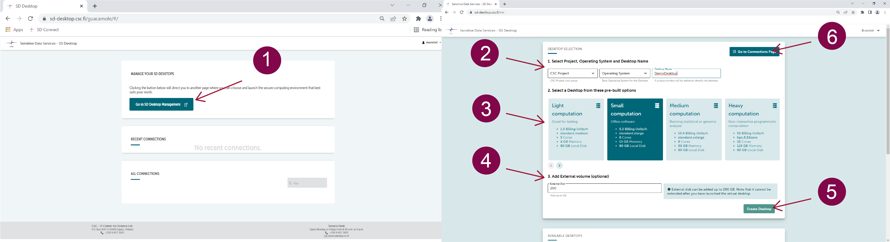
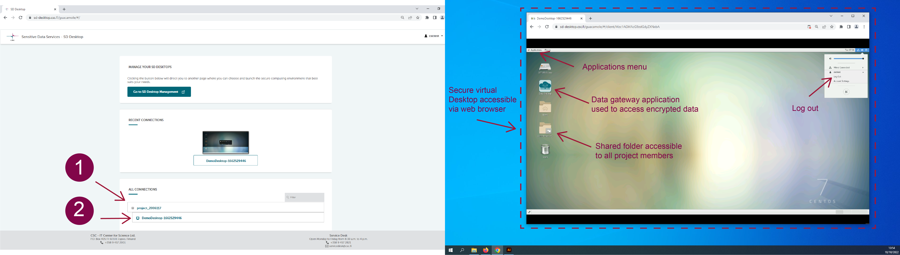
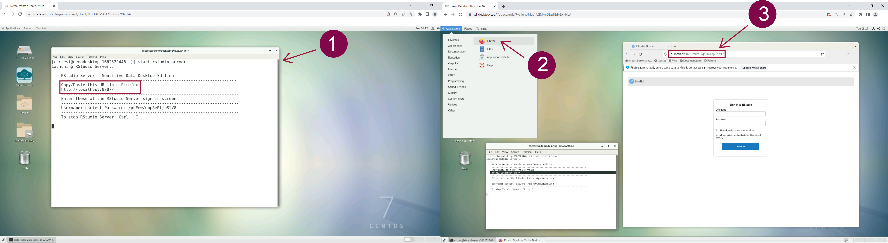
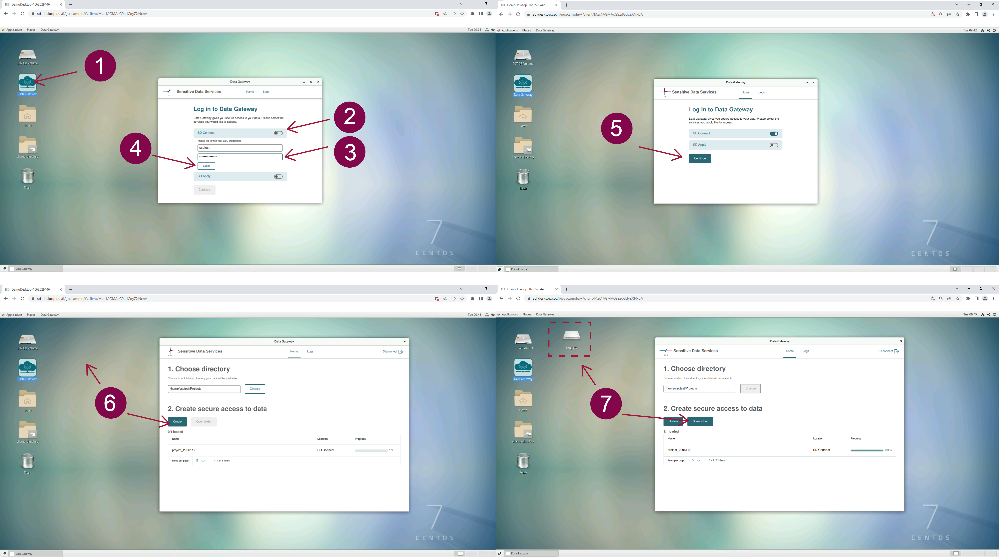
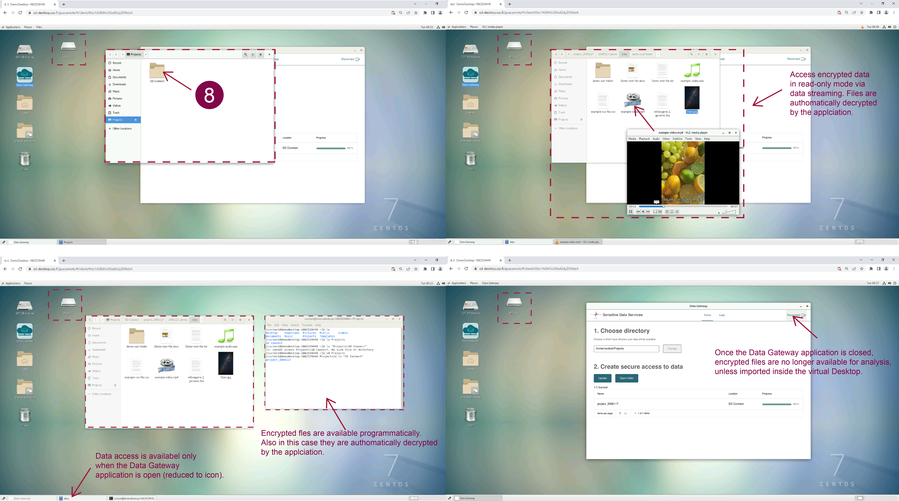
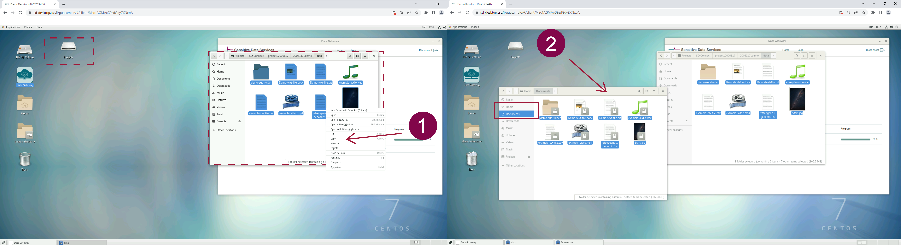
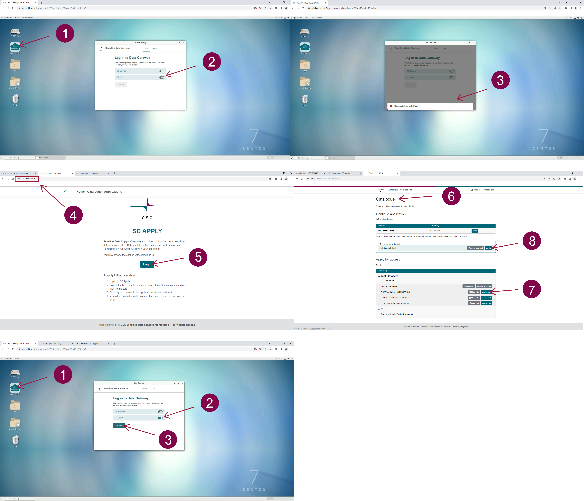
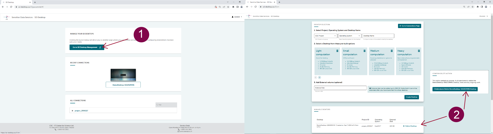

# Analyse and compute with Sensitive Data Desktop

## Overview

Sensitive Data (SD) Desktop allows you to analyze sensitive research data from your web browser securely. With this user interface, you can easily manage (start, use, delete) a virtual computer (here called a desktop, technically defined as a virtual machine). In addition, SD Desktop provides a secure workspace for collaborative research projects. 

[](images/desktop/desktop_overviewnew1.png)

In the following user guide, you can learn how to:

* Set up your virtual Desktop

* Analyse data uploaded and stored in SD Connect;

* Reuse published research data stored under controlled access via SD Apply (pilot phase);

* Export non-sensitive results.

You can browse through the main topics of the manual using the navigation bar on the left side of this page or the search function.


## Key features

* Accessible from any operating system (Mac, Linux or Windows) via a web browser (e.g., Google Chrome, Firefox) from the public internet (without the need to install a client or use a VPN).

* Only the same CSC project members can access the same virtual desktop. Currently, it is possible to launch three virtual desktops (or computing environments) for each CSC project. In addition, each CSC project has its private desktop, which is isolated from other CSC projects or CSC accounts unless you authorize it.

* After login into SD Desktop, the user can start a pre-built computing environment (Linux OS), on-demand; available options offer the capability of doing simple statistical analysis to machine learning and work with any data: text files, images, audio files, video, and genetic data. Further customization is possible by writing to servicedesk@csc.fi (subject: Sensitive data);

* Virtual Desktops are not connected to the internet: the only way to import and export data is SD Connect service;


**Limitations**:

* The project manager's or group leader's responsibility is to frequently review the list of members belonging to a project in MyCSC and verify who can access SD Desktop or SD Connect. Remove the project members who do not need access to the data when their contribution is no longer needed.

* Only open-source software is available. We do not provide virtual desktop with GPUs, Windows, or Linux Ubuntu operating systems. 

!!! Note 
The standard SD Desktop service is unsuitable for data processing under the Secondary Use of Health and Social Data Act. Please check this specific user guide: [SD Desktop for secondary use](./sd-desktop-audited.md) to learn about the precise requirements to access datasets approved by the Findata authority.


### Authentication

Login to SD Desktop is possible with identity federation systems (Haka, Virtu, CSCLogin or LSLogin) at:

[**https://sd-desktop.csc.fi**](https://sd-desktop.csc.fi)

from any modern web-browser.

After entering your username and password, you need to  verify your identity with a second verification step (or Multi-factor Authentication, MFA). Enter the verification code provided via mobile application and press on *Continue*.

!!! Note
    Please click on the *Continue* button. Due to a technical problem, pressing Enter on your keyboard will re-directed you to a stall request error page.


For specific guidance regarding activating the second verification step on your CSC account, see the [MFA paragraph](../../accounts/mfa.md).

[](images/desktop/desktop_login-mfa1.png)

### Creating your virtual desktop


<iframe width="280" height="155" srcdoc="https://www.youtube.com/embed/t6xXKPTB6H0" title="YouTube video player" frameborder="0" allow="accelerometer; autoplay; clipboard-write; encrypted-media; gyroscope; picture-in-picture" allowfullscreen></iframe>

Once you can access the service, you can create your virtual computer (desktop), choosing between four pre-built options. This operation can be carried out with a few simple steps and does not require any technical expertise. The services will automatically start your virtual desktop (or, in technical terms: launch a virtual machine) and create a secure connection between CSC and your browser. After this operation, your virtual desktop will be directly available whenever you log in to the service and will consume billing units (or resources) from your CSC project until paused or deleted.

Each CSC project supports the launch of 3 virtual Desktops. In addition, each desktop supports the simultaneous connection of 10 project members. Therefore, all project members can connect to the virtual desktop and access the data stored in your project. Furthermore, all the desktops are provided with the same open-source software (pre-installed and managed by CSC). The complete and updated list can be found in the following paragraph.


To start your virtual desktop, log in to the services and on the **Connection** page, click on **Go To SD Desktop Management**. 

Here you can specify several parameters:

1. **Select CSC project, operating system and desktop name**.
Currently, the only possible operating system is Linux CentOS 7. Assigning a descriptive name for a Desktop so that all project members can quickly identify it, later on is good practice.

2. **Select a desktop from the pre-built options**. Based on the computing needs, choose one of the pre-built options (Light, Small, Medium, or Heavy computing).

3. **Add external volume (optional)**. All desktops' default disk (or storage) space is 80 GB. With this option you can extend the disk space up to 200 GB. Note: you can't extend the disk space after you have created the virtual desktop. Additional disk space can be required by writing to servicedesk@csc.fi (subject: Sensitive data);

4. Finally, press on **Create desktop**. The operation is entirely automated and can take **up to 30 minutes**. If you try accessing the virtual desktop during this process, an error message will be displayed asking you to return later.


You can choose between **four different pre-built virtual Desktop options **:

*  **Light computation**. Technical specifications: **Core:3; memory 4 GiB; Root disk: 80 GB; Correspondent Pouta Flavour: standard.medium; Billing Units: 1.3 units/h**. This option is ideal for testing the services (for example: starting a virtual desktop, accessing data stored in SD Connect, and deleting the desktop). For this reason, we advise you to start this option only for testing purposes and delete it when the testing is completed. 

* **Small computation**. Technical specifications: **Core:6; memory 15 GiB; Root disk: 80 GB; Correspondent Pouta Flavour: standard.xlarge; Billing Units: 5.2 units/h**. This option is ideal for analyzing sensitive data using office software (for example: similar to simple statistical analysis with Excel, watching videos, listening to audio files, and working on text files). You can compare this desktop to your laptop. 

* **Medium computation**. Technical specifications:**Core:8; memory 30 GiB; Root disk: 80 GB; Correspondent Pouta Flavour: standard.xxlarge; Billing Units: 10.4 units/h**. This option is ideal for running complex statistical or genome analysis (for example: using the command line to run specific scripts). You can compare this desktop to a powerful laptop provided by your organization's  IT unit. 

* **Heavy computation**: Technical specifications: **Core:32; memory 116 GiB; Root disk: 80 GB; Correspondent Pouta Flavour: hpc.5.32core; Billing Units: 52 units/h**. This option is ideal for running non-interactive programmatic analysis (machine learning) that requires heavy computation. Please do not choose this option for simple analysis, as it consumes considerable resources. 


!!! Note
        For support in choosing the correct desktop option for your needs, don't hesitate to contact us at servicedesk@csc.fi (email subject: Sensitive Data). 

The following paragraphs will discuss how to work with your virtual desktop, which software is available, and how to customize your workspace.

[](images/desktop/desktop_launch.png)


### Working with your virtual Desktop


<iframe width="280" height="155" srcdoc="https://www.youtube.com/embed/EhuAYNLS90g" title="YouTube video player" frameborder="0" allow="accelerometer; autoplay; clipboard-write; encrypted-media; gyroscope; picture-in-picture" allowfullscreen></iframe>


Once your private virtual computer (Desktop) is launched, each CSC project member can securely access it from their browser at any time.

When you log in to SD Desktop **Homepage**,  you will be able to access your virtual Desktop in:

* **Recent connections**, clicking on the image of your Desktop (visible only if you recently accessed it)

* **All connections** if you click on + you can see all the connections associated with each project (e.g. project_NNNNN_NNNN). If you click on the connection ID you will also access your Desktop. 


When you open the connection, a virtual computing environment (Linux Centos operating system) will open into your browser. When you access the virtual Desktop for the first time, you will see the getting started panel, from which you can, for example, adjust the screen resolution.

You can work with this virtual Desktop like in a standard computing environment.  From the applications menu bar (top left corner) you can access several pre-installed programs. Examples include Open Office, image viewing applications, video and audio players, Jupiter Notebook etc. You can also open a terminal and use Linux from command line. To start using R-Studio please check the paragraph below.


Security-related features SD Desktop include:

* the computing environment (visible from your browser) is isolated from the internet. You can, for example, open a Firefox web browser, but you are not able to access any site on the internet. At this moment, you will also not be able to access any repositories directly.

* you can access or import data only data stored in SD Connect using the Data Gateway application (see below for more information);

* the copy-paste function from your computer/laptop to the browser visualizing your virtual Desktop is entirely disabled for security reasons. You can anyhow use this function inside your browser.


You can close your connection to your virtual Desktop in two ways:

1.  _Log out_ from your Desktop (in the workspace view, top right corner of the browser, select your _username_ and _log out_). This will close all applications in your virtual Desktop and disconnect the work session. You will be able to access the virtual Desktop at any time after logging in to the services.

2. If you started a data analysis programmatically (you are running a script) you can close the browser window. This doesn't interfere with the processes running. Thus, when you reconnect to your Desktop, you have all your tools and interfaces still open and can continue working. However, remember to log out from the Desktop once the analysis is finished. If you leave more than ten connections open, you will be unable to re-access the services. 


!!! Note
    **Never use the lock or reboot buttons** in SD Desktop as you will not be able to connect to the Desktop again after that.
 
 
 [](images/desktop/desktop-access.png)

     

### RStudio in SD Desktop

To access RStudio in SD Desktop, open the terminal in your virtual Desktop and launch RStudio with:

```text
start-rstudio-server
```

This will return a URL and a service-specific password:

```
RStudio Server - Sensitive Data Desktop Edition
---------------------------------------------------------------------------------------
Copy/Paste this URL into Firefox:

http://localhost:8787/

-----------------------------------------------------------------------------------------
Enter these at the RStudio Server sign-in screen
----------------------------------------------------------------------------------------
Username: accountname  Password: Example23241232
----------------------------------------------------------------------------------------
To stop RStudio Server: Ctrl+C
```

Next:

* paste the URL in Firefox 
* after a few seconds, you can input the username and password (service-specific) and access the server.

!!! Note
    Also when using RStudio, you need to save your data in **Shared-directory** if your colleagues need to work on the same files.


[](images/desktop/desktop-rstudio.png)


## Accessing encrypted sensitive data within SD Desktop

As the virtual Desktop is isolated from the internet, the only way to access data for analysis is by utilizing a specific application called _Data Gateway_.
This application will allow you to access encrypted data stored in SD Connect or a specific dataset for which you have been granted access via SD Apply for re-use.
Encrypted files will be **visible in read-only mode (similarly to opening a pdf file or streaming a YouTube video)**. This solution allows you to process large amounts of data without storing any copy on your virtual Desktop. 

!!! Note
    In SD Desktop, you can access only files encrypted with the Sensitive Data Services encryption key or using SD Connect. If you try to access unencrypted data or files encrypted only with your public encryption key, this will result in an error. If you experience any problem with Desktops launched before March 2022, don't hesitate to contact us at servicedesk@csc.fi (subject: sensitive data). 
   
### Accessing encrypted data stored in SD Connect using Data Gateway

<iframe width="280" height="155" srcdoc="https://www.youtube.com/embed/7iGQ7gWb-Pk" title="YouTube video player" frameborder="0" allow="accelerometer; autoplay; clipboard-write; encrypted-media; gyroscope; picture-in-picture" allowfullscreen></iframe>


Once you sign in to your virtual Desktop, you can access encrypted data stored in SD Connect by following these steps:

* Open **Data Gateway** (you can find the application on your Desktop);

* select SD Connect;

* add your **CSC credentials** (username and password. Note: we disabled the copy/paste options for security reasons; thus, you need to type in your password);

* **Click on Login** and next click on **Continue**;

* In the new window, at the end of the page, click on **create Data Gateway**. The application will create a new folder called **Projects** accessible from your Desktop or programmatically the terminal. Next, click on **Open folder**.

 
 [](images/desktop/desktop-gateway-part1.png)


*   If the files have been encrypted using SD Connect or the **sensitive data public encryption key**, you will be able to access their content in read-only mode. The current streaming speed can be up to 50 MB/s. 

!!! Note 
    The Projects folder is **available only when the Data Gateway application is open**. If you sign out from the application, you will not access the data stored in other Sensitive Data services unless you previously made a full copy of it inside your Desktop. Thus, Data Gateway needs to be open during data processing in streaming mode.

 [](images/desktop/desktop-gateway-part2.png)

### Importing data inside the Desktop

**If you need to edit the files/data**:

 * access the files of interest in the Project folder **using Data Gateway**;
 
 *  select the files from the Project folder, make a **copy** and save it in the virtual Desktop **home directory** (the files will be visible only from your browser) or in the **shared folder** (in this case, the files will be accessible also by all the CSC project members). 

The files have been decrypted during the copy/paste process and are available for analysis or editing. 

 
!!! Note
    Your private workspace in SD Desktop is completely isolated from the internet for security reasons. However, you can use the procedure described above if you need to import specific scripts into your Desktop (for example, from GitHub or other trusted repositories).
    
     
 [](images/desktop/desktop-gateway-import.png)


###  Accessing published data for re-use via SD Apply

<iframe width="280" height="155" srcdoc="https://www.youtube.com/embed/1cF_NQV6vyk" title="YouTube video player" frameborder="0" allow="accelerometer; autoplay; clipboard-write; encrypted-media; gyroscope; picture-in-picture" allowfullscreen></iframe>


Data Gateway can also be used to access data published under controlled access via other CSC services for sensitive data. To access a specific dataset in your virtual Desktop, you need first to apply for it using SD Apply service. When the data owner (or Data Access Committee) has granted you access, you will be able to access the dataset in SD Desktop for a limited time.


If you did not yet apply for access to a specific dataset or if the access period has ended and you try to access the data using the Data gateway application, you will encounter an error message. 


 [](images/desktop/desktop-apply.png)


SD Apply is currently in the pilot phase. Please contact us at servidesk@csc.fi (subject: sensitive data) for more information.


## Default programs available on SD Desktop

Each virtual Desktop (or virtual computer) is pre-built and contains a limited set of default open-source software (listed below). 

!!! Note
    If the list below is not clear or you need specific software to analyze your data, please don't hesitate to contact us at servicedesk@csc.fi (subject: Sensitive Data). We can support you in your Desktop customization. Moreover, we are working on developing our services to provide proprietary software. Follow our webpage for constant updates. 


### Pre-installed software:


* CentOS7

* Emacs

* htlib

* LibreOffice

* miniconda

* minimap2

* pigz

* pyro.ai

* Python

* R + R studio

* samtools

* nextflow

* golang


 
### Scientific software 

   * Python 3.7.9 including following packages:      
        * tensorflow nltk spacy scikit-learn seaborn plotly bokeh pydot xgboost lightgbm catboost eli5 torch keras dist-keras elephas gensim scrapy beautifulsoup4 numpy scipy pandas statsmodels matplotlib pyfuse3 crypt4gh trio httpx qrcode 
   * R / RStudio Server

      * Installation matching the `r-env-singularity/4.0.5` module on Puhti (R 4.0.5 + RStudio Server 1.4.1106, Bioconductor 3.12)
      * 1000+ pre-installed R packages (versions available on Apr 20 2021)
      * Intel® oneAPI Math Kernel Library (oneMKL)
      * GIS software (PROJ, GDAL, SAGA)
      * CUDA drivers 
      * TensorFlow (used with R TensorFlow back-end)
      * R + RStudio Server versions matched with Puhti r-env-singularity module (R 4.0.5 + RStudio Server 1.4.1106, MRAN, Bioconductor 3.12) 


### Software customisation

Users can install their user-level software to SD Desktop, but this requires technical expertise. As SD Desktop is isolated from the internet, you can't use installation tools like _git_, _coda_, _cpan_ or _pip_ dependent on internet connections to external repositories. Further, SD Desktop users can't do any operation that needs superuser access.

The most convenient way to add new software to your SD Desktop is to build a Singularity container outside SD Desktop and then import the Singularity image through SD Connect to SD Desktop. The two documents below describe two sample cases on adding software with containers.

   1. [Importing ready-made software containers from a public repository to SD Desktop](./sd-desktop-singularity.md)
   2. [Creating you own Singularity container and importing it to SD Desktop](./creating_containers.md)


!!! Note
    Please don't hesitate to contact us at servicedesk@csc.fi (subject: Sensitive Data). We can support you in your Desktop customization. 

##  Data export from SD Desktop

Your virtual Desktop is isolated from the internet for security reasons. Only the CSC project manager can export results or data from the secure workspace using the Airlock application, currently available only programmatically. The results are exported to SD Connect, where they will be available for download to your computer. 


Below you can find step-by-step instructions to encrypt and export data from SD Desktop to SD Connect, where you can download and decrypt it. 

[](images/desktop/airlock.png)


**1- Generate your encryption key pair** (secret key and public key) with the Crypt4GH application (you can skip this paragraph if you already have a key pair).

* Install the Crypt4GH application:

CSC has developed a simple application that will allow you to generate your encryption keys and decrypt data when necessary. 
Download the version specific to your operating system from the [GitHub repository](https://github.com/CSCfi/crypt4gh-gui/releases):  

  - [Linux](https://github.com/CSCfi/crypt4gh-gui/releases/download/v1.2.0/crypt4gh-gui-python3.8-linux-amd64.zip)
  - [Mac](https://github.com/CSCfi/crypt4gh-gui/releases/download/v1.2.0/crypt4gh-gui-python3.8-macos-amd64.zip)
  - [Windows](https://github.com/CSCfi/crypt4gh-gui/releases/download/v1.2.0/crypt4gh-gui-python3.8-windows-amd64.zip)

Please check that the tool for Windows has been digitally signed by CSC - IT Center for Science. After the download, you can find the Crypt4GH application in your downloads folder.

* When you open the application for the first time, you might encounter an error message. In this case, click on _More info_ and verify that the publisher is CSC-IT Center for Science (or in Finnish CSC-Tieteen tietotekniikan keskus Oy) and then click on _Run anyway_.

* Generate your encryption keys:

- Open the Crypt4GH application and click on _Generate Keys_ (on the top right corner).
- The tool will open a new window and ask you to insert a password (_Private Key Passphrase_). This password will be associated with your secret key. Please, use a strong password.
- When you click on _OK_, the tool will generate a key pair consisting of a secret key (your username_crypt4gh.key) and a public key (your username_crypt4gh.pub).
- The keys/file names will be displayed in the Activity Log with the following message:

```
Key pair has been generated, your private key will be auto-loaded the next time you launch this tool:
Private key: username_crypt4gh.key
Public key: username_crypt4gh.pub
All the fields must be filled before file encryption will be started
```

The keys will be generated and saved to the same folder in which the application resides.

!!! Note
    * If you lose or forget your secret key, or the password, you will be unable to decrypt the files.
    * Do not share your secret key or your password.
    * You need to **create your keys only once** and use them for all your encryption needs, but you can of course, choose to generate separate keys for encryption as you wish.


**2- Upload the public key to SD Connect**. 

* You can easily upload the public key to SD Connect via drag and drop. You will be **redirected to a new window displaying the default encryption options**. 

* Next, you can specify the bucket's name to which the public encryption key should be uploaded. If you don't fill in a specific term, the user interface will automatically create a bucket named with a 13 digit number (based on creation time). 

* Click on **Encrypt and upload**: the public key will be encrypted and uploaded to the bucket in SD Connect. Only encrypted files are visible and accessible via SD Desktop; thus, even your public encryption key must be encrypted during upload.


**3- Import the public key inside the Desktop**.

Once the upload process is completed, you can access your virtual Desktop. Using the Data Gateway application, access the bucket with the public key. You can now import a copy of your public key inside the virtual Desktop (via copy/paste function). 


**4- Encrypt the results**.

Open the terminal (right-click) and encrypt with your public key the files you want to export. Crypt4GH is already installed on each Desktop and accessible programmatically. 

The syntax of the encryption command is:

```text
crypt4gh encrypt --recipient_pk public-key < input > output
```

Where public-key is your public key (username.pub), input is the file you want to export (my_results.csv), and output is the encrypted file (my_results.csv.c4gh)

For example:

```text
crypt4gh encrypt --recipient_pk your-username.pub < my_results.csv > my_results.csv.c4gh
```

**5- Exporting the results from the private Desktop**.

Once the results are encrypted, only the CSC project manager can export the files with the Airlock client. 

Open the terminal (right click) and  type the following syntax:

```text
airlock-client  <<username>> <<data_output_bucket>> <<filename>>
```

Where *username* is your CSC account username, *data_output_bukcet* is the name that you want to give to the bucket into which the results are exported. The airlock client will generate the bucket automatically in the same CSC project in which your Desktop is. *Filename* is the name of the encrypted files that you want to export.

For example:

```text
airlock-client cscuser  analysis-2022  results-03.csv.c4gh
```

Press enter and add your password. Note: if you try to upload an unencrypted file, the airlock client will automatically encrypt it with the Sensitive Data public key for security reasons and export it to SD Connect. Here, you will be able to download the file but you will not be able to decrypt it.

**6- Download and decrypt the files**.

The exported file is now available in SD Connect/Allas. After downloading the file in your local environment, you can decrypt it with your secret encryption key, using the Crypt4GH application or programmatically. For specific guidance check the following [paragraph](./sd_connect.md#data-download-and-decryption).
For more information and support, write to servicedesk@csc.fi (email subject Sensitive Data)

## Deleting your virtual Desktop
  
At the end of your analysis, you can delete your virtual Desktop and all the files in it.

You can not undo this action:
  
* On SD Desktop Homepage, click on **Go To SD Desktop Management**. 
* Here, under **Available Desktops** click on **Delete Desktop**. 


!!! note
    All the data present in the computing environment will be deleted, and it will not be possible to retrieve them. You will delete the entire virtual workspace,       and your colleagues (or the other CCS project members) will lose their results and data imported to it. For this reason, please get in touch with all the           project members and export all the results of your analysis from the virtual workspace, before deleting a virtual Desktop.


 [](images/desktop/desktop-delete.png)


## Troubleshooting

| Problem               |                                                                                                                                    | Possible solution                                                                                                                                                                                                                                                                                                                |
|-----------------------|------------------------------------------------------------------------------------------------------------------------------------|----------------------------------------------------------------------------------------------------------------------------------------------------------------------------------------------------------------------------------------------------------------------------------------------------------------------------------|
| Access                | Launched a new Desktop, but now the screen is black/frozen.                                                                       | The creation of a new Desktop can take up to 30 minutes. Come back later.                                                                                                                                                                                                                                                        |
|                       | Cannot log in to SD Desktop                                                                                                         | Create a CSC account and a project in the MyCSC portal. Add service access for Allas (a CSC storage solution) and SD Desktop to your project.                                                                                                                                                                                    |
|                       | Cannot turn off my Desktop.                                                                                                        | You can log out from Desktop at any moment (in the workspace view, top right corner of the browser, select your username and log out). You will always be able to reaccess your Desktop after logging in. Never use the lock or reboot buttons in SD Desktop as after that, you will not be able to connect the Desktop again |
| Collaborative project | My collaborator added me to their CSC project, but I cannot access SD Desktop.                                                     | Accept the terms of use and add service access for SD Desktop in the MyCSC portal.                                                                                                                                                                                                                                               |
|                       | Me and my colleague are members of the same CSC project. I cannot see the data they have analysed/edited in our private Desktop.  | Save the files in the Shared directory if you need to work on/edit files or datasets with your colleagues.                                                                                                                                                                                                                      |
|                       | Cannot add more project members to the same Desktop.                                                                               | Your Desktop has too many simultaneous connections. Max 10 users can use the same Desktop at the same time. Furthermore, each user can have only one active connection to one Desktop. Remember to log out of the Desktop to end the active session.                                                                  |
| Copy- Paste Function  | I cannot copy and paste my password or commands from outside the Desktop.                                                          | We disabled the copy/paste options for security reasons. Thus you need to type in everything manually. Alternatively, you can import documents or scripts to SD Connect and do the copy-paste process inside SD Desktop.                                                                                                         |
| Data export           | Cannot export results.                                                                                                             | Only the CSC project manager can export encrypted results from the SD Desktop for security reasons.                                                                                                                  |
| Data Access           | The Data Gateway application doesn’t work when I add my credentials.                                                           | Use the username and password of your CSC account. Check that your project has service access for Allas (a CSC storage solution). Check that you haven’t changed your environment variables. Do not use passwords that contain @                                                                                                 |
|                       | I imported data from SD Connect with the Data gateway application but the data isn't decrypted.                                           | If you want the data to be automatically decrypted in SD Desktop, you need to encrypt the files using also the CSC Sensitive Data Services public key.                                                                                                                                                                                   |
|                       | Need to import more than 80 GB of data. I already have an extra volume.                                                            | You can link the added volume from your terminal: `ls -s /path_to_volume_mount_point ~/SDCONNECTDATA`                                                                                           |
| Disk space/ Volume    | Cannot add disk space to my Desktop.                                                                                               | It’s possible to add disk space only when launching a new Desktop.                                                                                                                                                                                                                                                       |
|                       | Cannot make a copy of a big dataset.                                                                                               | Check that you have enough disk space on your Desktop. The maximum disk space of each Desktop is 280 GB, but it can be extended contacting servicedesk@csc.fi                                                                                                                                                                                                                        |
| Mac OS                | Mac keyboard is not recognized e.g. command+C is not translated to CTRL+C.                                                         | You need to change the keyboard settings.                                                                                                                                                                                                                                                                                        |
| Software              | Cannot open RStudio on my Desktop.                                                                                                 | To access RStudio in SD Desktop, you need to open the terminal in your virtual Desktop and launch RStudio with start-rstudio-server.Check for more instructions above in the user guide.                                                                                                                                          |
|                       | Need software not provided in Desktop                                                                                            | Contact us at servicedesk@csc.fi (subject SD Desktop)                                                                                                                                                                                                                                                                            |


