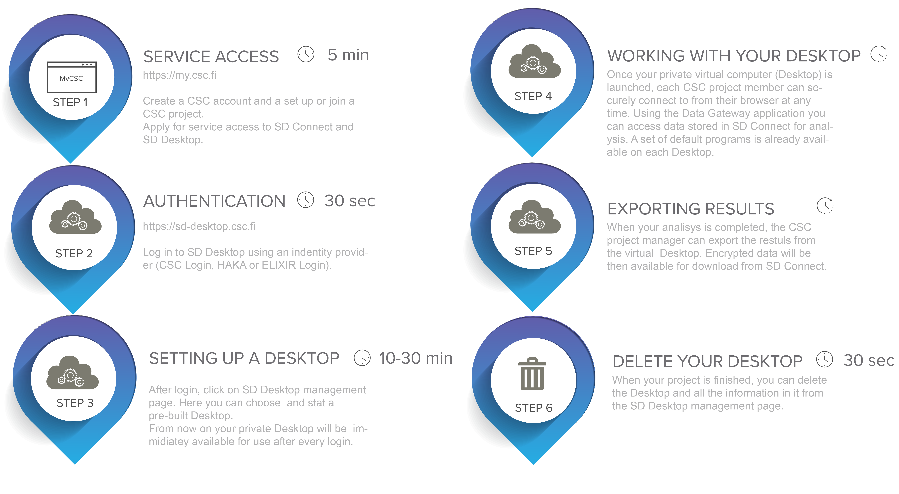
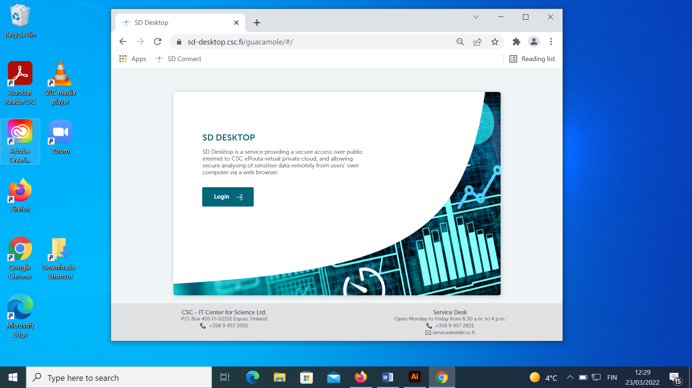
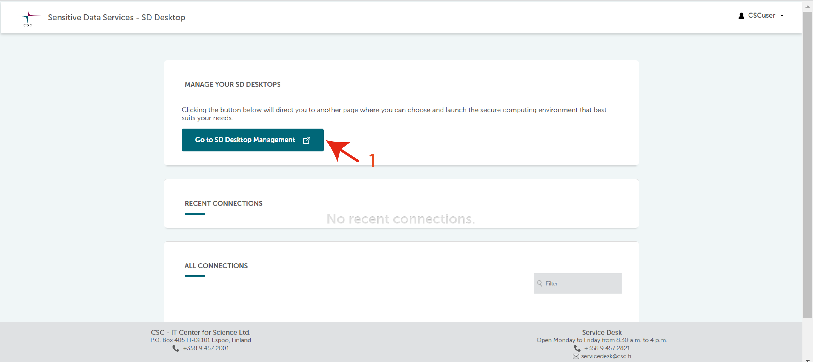
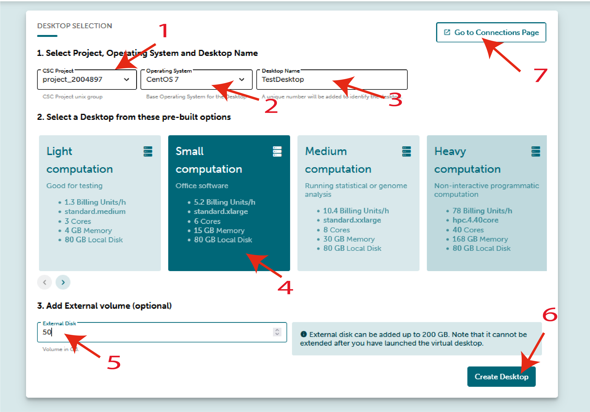
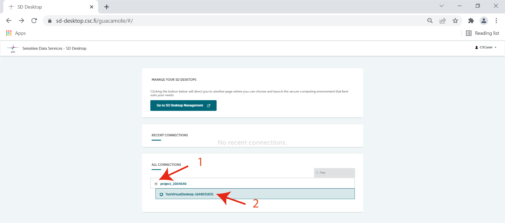
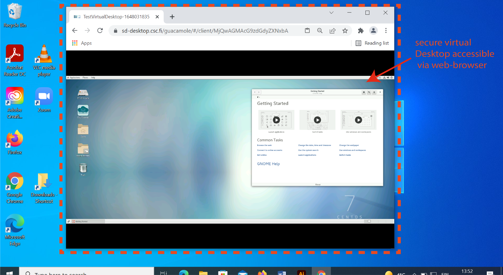
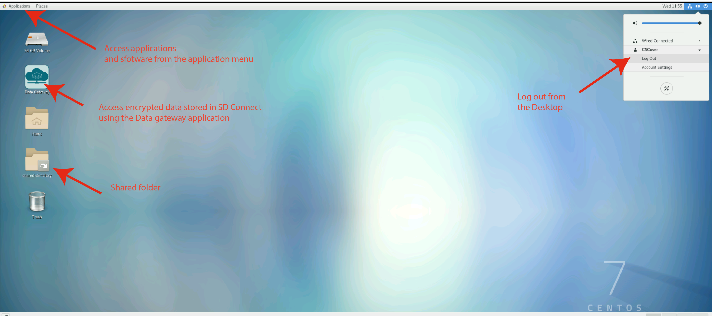
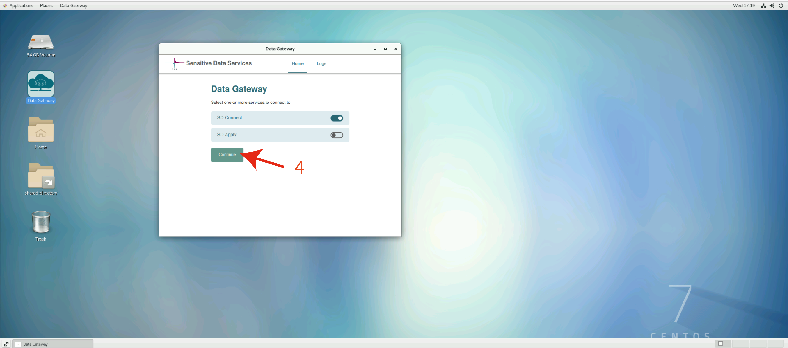

# SD Desktop (Sensitive Data Desktop)


SD Desktop service is a virtual computing environment that is designed for processing sensitive data. It provides a secure workspace for analysing sensitive data from any location. It can be used by individual users but is especially usefull for collaborative research projects. 

SD Desktop is accessed through an easy to use graphical interface running in a web browser. The interface 
allows you to launch new vitual machines, delete them and connect to active virtual machines without any previous knowledge of cloud computing.   

SD Desktop is used together with other SD services (SD Connect and SD Apply), that provide a controlled way to import and export data to and from this service.

In the this user guide, you can learn how to:

* apply for service access;
* set up your virtual Desktop;
* analyze data stored in SD Connect;
* re-use published data stored under controlled access,
* export non-sensitive results from the secure virtual Desktop.

## Key features

* Accessible via web browser from any operating system (Mac, Linux or Windows) and from any location.

* Only project members can access the VMs.

* At the moment only VMs with Linux operating system (Centos7) are available.

* VMs are not connected to internet: the only way to import and export data is SD Connect service.

* VMs can be used to work with any type of data: text files, images, audio files, video, and genetic data. However the VMs include only a limited set of pre-installed software. Additional tools can be imported through SD Connect or by requesting from CSC.

* **process a large amount of data** stored encrypted in SD Connect via data streaming (default disk space 280 GB, if additional space required contact servicedesk@csc.fi (subject: Sensitive data).


## Before you start

Access to SD Desktop is based on CSC user accounts and projects. If you don't have CSC account and project you need to:

* set up [a CSC account](../../accounts/how-to-create-new-user-account.md);
* [join](../../accounts/how-to-add-members-to-project.md) or set up [a CSC project](../../accounts/how-to-create-new-project.md);
* fill in the [description of data processing activities](../../accounts/when-your-project-handles-personal-data.md) form;
* add [service access to SD Connect and SD Desktop](../../accounts/how-to-add-service-access-for-project.md);
* activate [multi-factor authentication](../../accounts/mfa.md) on your account.

Note that even though you may be able login SD Desktop using your local account (haka) you will need to use your CSC username and password when you import data from SD Connect to into your Virtual Machine. If you don't remember your CSC password, you can [reset it](../../accounts/how-to-change-password.md).  

Make sure that your CSC project always includes only those persons who are allowed to work with all the data of the project. All the members belonging to a CSC project can access all the VMs that this propject has in SD Desktop. Project manager, not CSC, is reponsible for keeping the list of project members up to date.

!!! Note
   SD Connect and SD Desktop have not yet been security audited. Because of that, users may not process any personal data granted for the purposes of the Act on the Secondary Use of Health and Social Data (552/2019) by Findata.


## Overview




## Service access 

## Authentication

<iframe width="280" height="155"srcdoc="https://www.youtube.com/embed/VebHTUonOSs" frameborder="0" allow="accelerometer; autoplay; encrypted-media; gyroscope; picture-in-picture" allowfullscreen></iframe>

Login to SD Desktop is possible with identity federation systems (Haka, Virtu and [Elixir Login](https://elixir-europe.org/register) or with CSC Login at:

[**https://sd-desktop.csc.fi**](https://sd-desktop.csc.fi)

SD Desktop uses two factor authentication. In practice this means that after password login, you need to **verify your identity** by entering the verification **code** provided via the mobile application. For specific guidance regarding the verification step, check the [multi-factor authentication](../../accounts/mfa.md) paragraph at the beginning of CSC user guide.



The SD Desktop interface is composed of two parts:**Connections page** that allows you to see your active virtual machines and connect to these machines. From this page you can move to **SD Desktop Management page** were you can launch new virtual machines and delte old ones. The same SD Desktop interface is used to manage VMs of all your CSC projects that have access to SD Desktop. If you are member in several SD Desktop projects you must always make sure that you are using the right project when managing or using virtual machines.


## Setting up a Virtual Machine
  
<iframe width="280" height="155"srcdoc="https://www.youtube.com/embed/VebHTUonOSs" frameborder="0" allow="accelerometer; autoplay; encrypted-media; gyroscope; picture-in-picture" allowfullscreen></iframe>

Once you have logged in to the SD Desktop service, you can launch virtual machines for your project. Each project can have 3 Virtual Machines running in the same time. These virtual machines can be used by all project members. Thus, if you add colleagues/collaborators as project members in the same CSC project, they will also be able to connect to the Virtual Machine and access the data stored in your project. However, note that there can be in maximum 10 simutaneous connections to one VM at a time.
Once a Virtual Machine is launced it will run utill it is deleted. 

---------------------------
(Desktop), choosing between four pre-built options. This operation can be carried out with a few simple steps and does not require any technical knowledge. Next, the services will start your virtual Desktop (or, in technical terms: launch a virtual machine) and create a secure connection between CSC and your browser. After launch, your virtual Desktop will be directly available for use every time you log in to the service. Moreover, the running Desktop will consume billing units (or resources) from your CSC project until it is deleted. 

Each Virtual Machine is CSC project-specific and supports the launch of **3 virtual Desktops**. In addition, each Desktop supports the simultaneous connection of **10 project members**.
Thus, if you add colleagues/collaborators as project members in the same CSC project, they will also be able to connect to a virtual Desktop and access the data stored in your project. Furthermore, all the Desktop are provided with the same software (pre-installed and managed by CSC). The complete and updated list can be found in the following [paragraph](sd_desktop.md#default-programs-available-on-sd-desktop).
----------------------

To start a new virtual Machine in SD Desktiop click first: **Go To SD Desktop Management page**

This opens an interface that is used to launch and delete Virtual machines. Before you can launch a virtual machine, you need to specify following parameters: 

* **select your CSC project**. Only the members of the selected project are able to use the virtual machine. 

* **choose the operating system**. Currently the only possible operating system is Linux CentOS 7 but in the future there will be other options too.
  
* **assign a name for a Virtual Machine**. It is good practice to assign a descriptive name for a virtual machine so that all project members can easily identify it later on.

* Choose one of the **Virtual Machine flavours**, (Light, Small, Medium or Heavy computing), based on your computing and memory needs. The default disk space for all flavours is 80 GB. You can extend your VM's disk space by selecting option: **add an external disk**. You can add up to 200 GB. Note: you can't extend the disk space after you have lauched the Virtual Machine. Additional disk space later on can be required writing at servicedesk@csc.fi (subject: Sensitive data);

When all the settings are done, press the **Launch Desktop** button of the selected VM flavour. The launch operation is entirely automated and can take **up to 30 minutes**. If you try to access the virtual Desktop and see a black screen, come back later. 





Virtual machine flavours in SD Desktop:  

*  **Light computation**: 

This option is ideal for testing the services (for example, test how to start a Desktop, check out how it looks, try to access data stored in SD Connect). You can compare this Desktop to a laptop with limited capacities, which probably freezes when you open too much software or more than three colleagues connect to it simultaneously. For this reason, we advise you to start this type of Desktop only for testing purposes and delete it when the testing is completed. Techincal specifications: **Core:3; memory 4 GiB; Root disk: 80 GB; Correspondent Pouta Flavour: standard.medium; Billing Units: 1.3 units/h**.

* **Small computation**:

This option is ideal for analyzing sensitive data using office software (for example: similar to simple statistical analysis with Excel, watching videos, listening to audio files, working on text files). You can compare this Desktop to your working laptop. Techincal specifications: **Core:6; memory 15 GiB; Root disk: 80 GB; Correspondent Pouta Flavour: standar.xlarge; Billing Units: 5.2 units/h**.

* **Medium computation**:

This option is ideal for running complex statistical or genome analysis (for example: use the command line to run specific scripts). You can compare this Desktop to a powerful laptop provided by your IT unit. Techincal specifications:**Core:8; memory 30 GiB; Root disk: 80 GB; Correspondent Pouta Flavour: standar.xxlarge; Billing Units: 10.4 units/h**.

* **Heavy computation**:

This option is ideal for running non-interactive programmatic analysis (for example, machine learning) that require heavy comTechnical specifications: **Core:40; memory 168 GiB; Root disk: 80 GB; Correspondent Pouta Flavour: hpc4.40core; Billing Units: 78 units/h**. Please do not choose the Heavy computation option for simple computing or analysis, as it consumes much resources. 





!!! Note
        If you don't know the best Desktop option for your needs, please contact us at servicedesk@csc.fi (email subject: Sensitive Data). 


Unfortunately, we are not yet providing a virtual Desktop with GPUs or Windows, Linux Ubuntu operating systems. However, we are working on it, and you can find more information on the future developments of the services on our webpage.  


## Working with your virtual machine

Once your private virtual machine is launched, each CSC project member can securely connect it from their browser at any time.

When you log in to SD Desktop **Homepage**,  you will be able to access your virtual Desktop in:

* **Recent connections**, clicking on the image of your Desktop (visible only if you recently accessed the virtual Desktop)

* **All connections** if you click on + you can see all the connections associated with each project (e.g. project_NNNNN_NNNN). If you click on the connection ID you will also access your Desktop. 




When you open connection to your Virtual Machine, a graphical Liunx Desktop opens to your browser. When you access the virtual Desktop for the first time, you will be able to see the getting started pane, from which you can, for example, adjust the screen resolution.

After that you can work in this Desktop much like in a normal linux linux desktop: From the applications menu bar (top left corner), you can access several pre-installed programs. For example, Open Office, image viewing applications, video player, Jupiter Notebook etc. You can also open a terminal and use linux from command line.

To start using R-Studio please check the paragraph below.

Each user, connecting the virtual machine will have their personal account and Desktop in the virtual machine. Each user has also a private home directory but all users are able to access files that are moved to the **Shared-directory** in the desktop ( _/shared-directory_ in command line use).


There are several security related features in the Virtual Machine running in SD Desktop that makes it bit different from as standard Linux based Virtual Machinnes. These include:

* the computing environment (visible from your browser) is isolated from the internet. You can for example open a Firefox web browser, but you are not able to access any site in internet. This same applies to all tools that ned to use services over the internet: they don't work.

* you can access or import data in the virtual Desktop only using the Data Gateway application (see below for more information);

* the copy-paste function from your computer/laptop to the browser visualizing your virtual Desktop is entirely disabled for security reasons. You can anyhow copy-paste data inside your Desktop.

* from the applications menu bar (top left corner), you can access several pre-installed programs. For example, Open Office, picture/image/ viewing applications, video/audio player, Jupiter Notebook etc. To start using R-Studio please check the paragraph below.

You can close connection to your virtual machine in two ways:

1. Often the best way is just to close the browser window. This doesn't interfere the processes running in the desktop of your Virtual Machine. Thus when you reconnect to your own virtual machine specific Desktop, you have all you tools and interafces still open and you can just continue working. 
2. Other option is to _log out_ from your Desktop (in the workspace view, top right corner of the browser, select your _username_ and _log out_). This  will close all applications in your desktop and disconnect the work session. A new Destop will be opened when you reconnect your Virtual machine again.


!!! Note
    **Never use the lock or reboot buttons** in SD Desktop as you will not be able to connect to the Desktop again after that.
 
    

     


### RStudio in SD Desktop

To access RStudio in SD Desktop open the terminal in your virtual Desktop and launch RStudio with:

```text
start-rstudio-server
```

This will return a URL and a service specific password:

```
RStudio Server - Sensitive Data Desktop Edition
---------------------------------------------------------------------------------------
Copy/Paste this URL into Firefox:

http://localhost:8787/

-----------------------------------------------------------------------------------------
Enter these at the RStudio Server sign-in screen
----------------------------------------------------------------------------------------
Username: accountname  Password: Example23241232
----------------------------------------------------------------------------------------
To stop RStudio Server: Ctrl+C
```

Next:

* paste the URL in Firefox 
* after a few seconds, you can input the username and password (service-specific) and access the server.

!!! Note
    Also when using RStudio, you need to save your data in **Shared-directory** if your colleagues need to work on the same files.


  
## Accessing encrypted sensitive data within SD Desktop

As the virtual Desktop is isolated from the internet, the only way to access data for analysis is utilizing a specific application called _Data Gateway_.
This application will allow you to access encrypted data stored in SD Connect or a specific dataset for which you have been granted access via SD Apply for re-use.
Encrypted files will be **visible in read-only mode (similarly to opening a pdf file or streaming a YouTube video)**. This solution allows you to process large amounts of data without storing any copy on your virtual Desktop. 

!!! Note
    In SD Desktop, you can access only files encrypted with the Sensitive Data Services encryption key or using SD Connect. If you try to access unencrypted data or files encrypted only with your public encryption key, this will result in an error. If you experience any problem with Desktops launched before March 2022, don't hesitate to contact us at servicedesk@csc.fi (subject: sensitive data). 
   
### Accessing encrypted data stored in SD Connect using Data Gateway

Once you sign in to your virtual Desktop, you can access encrypted data stored in SD Connect by following these steps:

* Open **Data Gateway** (you can find the application on your Desktop);

* select SD Connect;

* add your **CSC credentials** (username and password. Note: we disabled the copy/paste options for security reasons; thus, you need to type in your password);

* **Click on Login** and next clic on **Continue**;





* In the new window, at the end of the page, click on **create Data Gateway**. The application will create a new folder called **Projects** accessible from your Desktop or programmatically the terminal. Next, click on **Open folder**.


*   If the files have been encrypted using SD Connect or the **sensitive data public encryption key**, you will be able to access their content in read-only mode. The current streaming speed can be up to 50 MB/s. 


!!! Note 
    The Projects folder is **available only when the Data Gateway application is open**. If you sign out from the application, you will not access the data stored in other Sensitive Data services unless you previously made a full copy of it inside your Desktop. Thus, Data Gateway needs to be open during data processing in streaming mode.


### Importing data inside the Desktop

**If you need to edit the files/data**:

 * access the files of interest in the Project folder **using Data Gateway**;
 
 *  Select all the necessary files from the Project folder, make a **copy** and save it in the virtual Desktop **home directory** (the files will be visible only from your browser) or in the **shared folder** (in this case, the files will be accessible also by all the CSC project members). 

 
!!! Note
    Your private workspace in SD Desktop is completely isolated from the internet for security reasons. If you need to visualize or import specific scripts into your Desktop (for example, from GitHub or other trusted repositories), you can use the procedure described above.


## Default programs available on SD Desktop

Each virtual Desktop (or virtual computer) is pre-built and contains a limited set of default open source software (listed below). 

!!! Note
    If the list below is not clear or you need specific software to analyze your data, please don't hesitate to contact us at servicedesk@csc.fi (subject: Sensitive Data). We can support you in your Desktop customization. Morevere, we are working on developing our services to provide proprietary software. Follow our webpage for constant updates. 


### Pre-installed software:


* CentOS7

* Emacs

* htlib

* LibreOffice

* miniconda

* minimap2

* pigz

* pyro.ai

* Python

* R + R studio

* samtools

* nextflow

* golang


 
### Scientific software 

   * Python 3.7.9 including following packages:      
        * tensorflow nltk spacy scikit-learn seaborn plotly bokeh pydot xgboost lightgbm catboost eli5 torch keras dist-keras elephas gensim scrapy beautifulsoup4 numpy scipy pandas statsmodels matplotlib pyfuse3 crypt4gh trio httpx qrcode 
   * R / RStudio Server

      * Installation matching the `r-env-singularity/4.0.5` module on Puhti (R 4.0.5 + RStudio Server 1.4.1106, Bioconductor 3.12)
      * 1000+ pre-installed R packages (versions available on Apr 20 2021)
      * Intel® oneAPI Math Kernel Library (oneMKL)
      * GIS software (PROJ, GDAL, SAGA)
      * CUDA drivers 
      * TensorFlow (used with R TensorFlow back-end)

      * R + RStudio Server versions matched with Puhti r-env-singularity module (R 4.0.5 + RStudio Server 1.4.1106, MRAN, Bioconductor 3.12) 
   * GIS software (PROJ, GDAL, SAGA) 
   * CUDA drivers 
   * TensorFlow (used with R TensorFlow back-end) 


### Software customisation

Users can install their user-level software to SD Desktop, but this requires technical expertise. As SD Desktop is isolated from the internet, you can't use installation tools like _git_, _coda_, _cpan_ or _pip_ dependent on internet connections to external repositories. Further, SD Desktop users can't do any operation that needs superuser access.

The most covienient way to add new software to your SD Desktop is to build a Singularity container outside SD Desktop and then import the Singularity ilmage through SD Connect to SD Desktop. The two documents below describe two sample cases on adding software with containers.

   1. [Importing ready-made software containers from a public repository to SD Desktop](./sd-desktop-singularity.md)
   2. [Creating you own Singularity container and importing it to SD Desktop](./creating_containers.md)


!!! Note
    Please don't hesitate to contact us at servicedesk@csc.fi (subject: Sensitive Data). We can support you in your Desktop customization. 

##  Data export from SD Desktop

Your virtual Desktop is isolated from the internet for security reasons. Only the CSC project manager can export resutls or data from the secure workspace using the airlock application, currently available only via commandilne. 

Below you can find step-by-step intructions to encryped and export data from SD Deskotp. 

For more information, write to servicedesk@csc.fi (email subject SD Desktop)


## Deleting your computing environment
  
At the end of your research or analysis, you can delete your  Desktop (or virtual computer) and all the data. 

In SD Desktop Homepage, click on **Go to the launching page**. Here, in **Available instances** click on **Delete Desktop**. 


!!! note
    All the data present in the computing environment will be deleted, and it will not be possible to retrieve them.


## Troubleshooting

| Problem               |                                                                                                                                    | Possible solution                                                                                                                                                                                                                                                                                                                |
|-----------------------|------------------------------------------------------------------------------------------------------------------------------------|----------------------------------------------------------------------------------------------------------------------------------------------------------------------------------------------------------------------------------------------------------------------------------------------------------------------------------|
| Access                | Launched a new Desktop, but now the screen is black/frozen.                                                                       | The creation of a new Desktop can take up to 30 minutes. Come back later.                                                                                                                                                                                                                                                        |
|                       | Cannot log in to SD Desktop                                                                                                         | Create a CSC account and a project in the MyCSC portal. Add service access for Allas (a CSC storage solution) and SD Desktop to your project.                                                                                                                                                                                    |
|                       | Cannot turn off my Desktop.                                                                                                        | You can log out from Desktop at any moment (in the workspace view, top right corner of the browser, select your username and log out). You will always be able to reaccess your Desktop after logging in. Never use the lock or reboot buttons in SD Desktop as after that, you will not be able to connect the Desktop again |
| Collaborative project | My collaborator added me to their CSC project, but I cannot access SD Desktop.                                                     | Accept the terms of use and add service access for SD Desktop in the MyCSC portal.                                                                                                                                                                                                                                               |
|                       | Me and my colleague are members of the same CSC project. I cannot see the data they have analysed/edited in our private Desktop.  | Save the files in the Shared directory if you need to work on/edit files or datasets with your colleagues.                                                                                                                                                                                                                      |
|                       | Cannot add more project members to the same Desktop.                                                                               | Your Desktop has too many simultaneous connections. Max 10 users can use the same Desktop at the same time. Furthermore, each user can have only one active connection to one Desktop. Remember to log out of the Desktop to end the active session.                                                                  |
| Copy- Paste Function  | I cannot copy and paste my password or commands from outside the Desktop.                                                          | We disabled the copy/paste options for security reasons. Thus you need to type in everything manually. Alternatively, you can import documents or scripts to SD Connect and do the copy-paste process inside SD Desktop.                                                                                                         |
| Data export           | Cannot export results.                                                                                                             | Only the CSC project manager can export encrypted results from the SD Desktop for security reasons.                                                                                                                  |
| Data Access           | The Data Gateway application doesn’t work when I add my credentials.                                                           | Use the username and password of your CSC account. Check that your project has service access for Allas (a CSC storage solution). Check that you haven’t changed your environment variables. Do not use passwords that contain @                                                                                                 |
|                       | I imported data from SD Connect with the Data gateway application but the data isn't decrypted.                                           | If you want the data to be automatically decrypted in SD Desktop, you need to encrypt the files using also the CSC Sensitive Data Services public key.                                                                                                                                                                                   |
|                       | Need to import more than 80 GB of data. I already have an extra volume.                                                            | You can link the added volume from your terminal: `ls -s /path_to_volume_mount_point ~/SDCONNECTDATA`                                                                                           |
| Disk space/ Volume    | Cannot add disk space to my Desktop.                                                                                               | It’s possible to add disk space only when launching a new Desktop.                                                                                                                                                                                                                                                       |
|                       | Cannot make a copy of a big dataset.                                                                                               | Check that you have enough disk space on your Desktop. The maximum disk space of each Desktop is 280 GB, but it can be exteded conacting servicedesk@csc.fi                                                                                                                                                                                                                        |
| Mac OS                | Mac keyboard is not recognized e.g. command+C is not translated to CTRL+C.                                                         | You need to change the keyboard settings.                                                                                                                                                                                                                                                                                        |
| Software              | Cannot open RStudio on my Desktop.                                                                                                 | To access RStudio in SD Desktop, you need to open the terminal in your virtual Desktop and launch RStudio with start-rstudio-server.Check for more instructions above in the user guide.                                                                                                                                          |
|                       | Need software not provided in Desktop                                                                                            | Contact us at servicedesk@csc.fi (subject SD Desktop)                                                                                                                                                                                                                                                                            |


