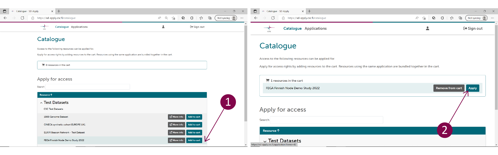
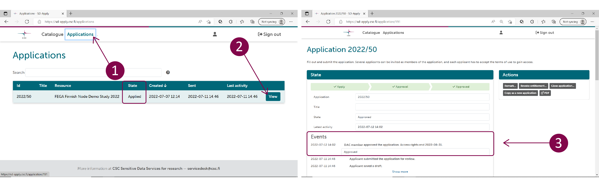

# Accessing the service with a permit from a single register

**[Instructions in Finnish (PDF)](https://a3s.fi/docs-files/sensitive-data/PDF_instructions/SD_toisiolaki_yksittainenRekisteri.pdf){ target="_blank" }**

These instructions are for researchers who have received a permit for the secondary use of social and health data **directly from a single public register**. In other words, the permit is not from Findata, and **the permit is issued for SD Desktop**.

Processing data issued directly from a single register differs from processing data issued by Findata. If you have received a permit directly from a single register, you need to use **SD Apply** to access the data on SD Desktop. The following instructions will direct you on how to apply for access to data issued by a single register.

!!! Note
    * [SD Connect](sd_connect.md), a service used for storing sensitive research data, is **not accessible for registry data processing**. It is not possible to directly import any additional data, script, or software into the virtual desktop. 
    * If you need software that is not available on the SD Desktop by default, please contact [Service Desk](../../support/contact.md) (*Subject: Sensitive Data, Secondary use*) well in advance - even before applying for a data permit.

*Please note that you can create a test project and test regular SD Desktop independently, to make sure that SD Desktop is suitable for your needs. [Instructions how to access regular SD Desktop](sd-use-case-new-user-project-manager.md).*

## Get access to single register data

### Create a project in MyCSC

* First you need to create a project in MyCSC and CSC will activate SD Desktop for it.
* [Follow steps 1 - 8 from Findata instructions](findata-permit.md#get-access-to-sd-desktop-for-secondary-use). Return here after step 8.
___

### Apply access for the dataset with SD Apply

After creating the project in MyCSC, you need to apply for access to the dataset in SD Apply. This is a technical security step and does not affect the permission granted in the data permit. Plese note that all project members need to be added to the application in order for them to be able to access the data on SD Desktop.

#### 1. Login to SD Apply
Log in to SD Apply at [https://sd-apply.csc.fi/](https://sd-apply.csc.fi/). Logging in to SD Apply is possible either with user identity federation systems (Haka or Virtu login) or with a CSC account.

!!! Note
    Always use the same identity provider when you log in to SD Apply, because all your actions are connected to your login identity.

#### 2. Apply for access
After login, you will access the SD Apply "Catalogue" page. On this page, you can search for a specific dataset and start the application process. Start a new application by clicking *Add to cart* next to the name of the dataset. By clicking *Apply*, you will be redirected to the application form.

You can find the correct dataset from the *Registry Datasets* catalogue list with the identification information provided by the data controller. Usually, the name of the dataset corresponds with the identifier of the organisation (same as their email domain) combined with the journal number of your data permit. The datasets are grouped in the catalogue by organisation.

#### 3. Submit the application
Follow the instructions on the application form and fill in the required fields:

 * **State**. Contains basic details like title and state of your application.
 * **Applicants**. Everyone who has been granted access in the data permit must be named in the Applicants field. Members can be added, changed, or removed without re-applying. You can invite other people to join the data access application by selecting *Invite members* and providing their names and email addresses. They will then get an invitation via email. By following the invitation link, they can log in to SD Apply and accept the terms of use. When the application is approved, all members of the application will be granted access to the same dataset.
 * **Resources**. Shows the datasets you are applying for.
 * **Terms of use**. Lists all of the licenses defining the terms and conditions for data access. To access, click on *Accept terms of use.*
 * **Application**. Access to a secondary use dataset is granted only based on the data permit. Provide the possible verification information requested by the data controller here.

To submit your application, select *Send application* under Actions. Editing or deleting the application is no longer possible after sending the application. However, removing members is still possible.

!!! Note ""
    #### 4. Wait for approval from data controller
    * After you have sent the application, it will be forwarded to the data controller, who approves or rejects it. 
    * You will receive an email notification whenever the state of your application changes.

During the approval process, the data controller can:

* Approve or reject your application
* Close your application and cancel the application process.

You can follow the approval process and read the possible comments from the *Events* section of the application. In addition, you can find all your applications and see their state from the *Applications* tab:

* **Draft**. Your application is still a draft and cannot be seen by the data controller. You can continue working on your application or delete it entirely from the system.
* **Submitted**. The application has been sent to the data controller and cannot be edited anymore unless specifically requested.
* **Approved**. The application has been approved, and you have been granted access rights.
* **Rejected**. To see why your application was rejected, navigate to the application and select *View*. Data controller comments will be shown in the *Events* section.
* **Revoked**. Your application, and thus your access rights, have been revoked by the data controller.

#### 5. Finalize the linkage of the data and your CSC project
Once your application has been approved, you will receive a notification and further instructions via email. In addition, you need to export the application as a PDF-file from SD Apply and send it to the CSC service desk to finalize the linkage of your data and the CSC project created for you.
___

### Access the data with SD Desktop
Once you have received confirmation that all above steps are completed, you can access the data with SD Desktop.

* [Follow steps 10 - 11 from Findata instructions](findata-permit.md#10-log-into-sd-desktop).
