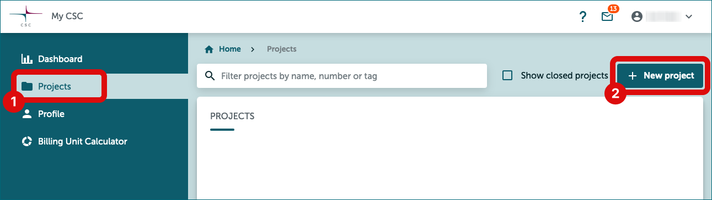

# How to get access to SD Desktop with a single register permit

**[Instructions in Finnish (PDF)](https://a3s.fi/docs-files/sensitive-data/PDF_instructions/SD_toisiolaki_yksittainenRekisteri.pdf){ target="_blank" }**

## Use case

You need to access to SD Desktop. You have a permit from a single register.

## Solution

1. [Create a CSC account](#1-create-a-csc-account) 
2. [Create new CSC project](#2-create-new-csc-project)
3. [Fill GDPR document](#3-fill-gdpr-document)
4. [Contact CSC service desk](#4-contact-csc-service-desk)
5. CSC adds members to your project, please wait
6. CSC activates SD Desktop for your project, please wait
7. [Accept SD Desktop terms of use](#7-accept-sd-desktop-terms-of-use)
8. [Activate MFA Authentication](#8-activate-mfa-authentication)
9. [CSC project is ready](#9-your-csc-project-is-ready)
10. Apply access for the dataset with SD Apply
11. Register processes application, please wait
12. Send approved application to CSC

### 1. Create a CSC account

!!! warning-label
    Team manager
!!! info-label
    Team member

- **Go to [MyCSC portal](https://my.csc.fi){ target="_blank" }**
- Log in with Haka. Select your home organization and log in to their identity service. [How to get an account without Haka](../../accounts/how-to-create-new-user-account.md#getting-an-account-without-haka-or-virtu). 
- Fill in your information on the Sign up page.
- Set your password using 12 characters or more, containing both upper and lowercase letters and at least one number. No special characters are allowed.
 - You will receive your CSC user account confirmation via email.

### 2. Create new CSC project

!!! warning-label
    Team manager

- Go to ”Projects” page (left side menu or a hamburger menu at the top right corner).
- On the top of the page choose **”New project”**.
- Fill in the project name and project description. You can edit these later if needed.
- Choose the Project category to be **“Findata”**.
- Fill all required fields. Read and accept the terms of use.
- Click **“Create a project”**.

### 3. Fill GDPR document

!!! warning-label
    Team manager

- Since your project handles personal data, you need to fill the GDPR document i.e. *Description of processing activity* -form.
- The document appears when you create a new project. You can edit this document later.
- Your home organization is the **data controller**. [Read more about the roles and GDPR](../../support/faq/sensitive-data-legal.md#what-are-the-roles-of-csc-and-its-service-users-under-gdpr).

### 4. Contact CSC service desk

!!! warning-label
    Team manager

- Send email to **sensitivedata-support@csc.fi**, subject: *Sensitive Data, Secondary use*.
- Write your project number to the email (e.g. *project_1234567*).
- Attach a copy of your **data permit** to the email.
- Write down a list of your research teams email addresses. Please use same emails that they created the CSC-account with.
- Put your research team as cc.

!!! Note ""
    ### 5. CSC adds members to your project
    - Please wait that Sensitive Data Support team ads your research team to your project
    - Note! All team members must have a [CSC-account](#1-create-a-csc-account), so they can become project members.

!!! Note ""
    ### 6. CSC activates SD Desktop -service for your project
    - Please wait that Sensitive Data Support team activates SD Desktop service for your project.
    - You will receive an email notification, when everything is ready.

### 7. Accept SD Desktop terms of use

!!! warning-label
    Team manager
!!! info-label
    Team member

- If you haven't accept the terms of use before, please go to MyCSC - navigate to the project view - see left side **Service** list - click SD Desktop and **accept the terms of use**.
- Please note that every team member must accept the SD Desktop terms of use.

### 8. Activate MFA Authentication

!!! warning-label
    Team manager
!!! info-label
    Team member

- You need to activate MFA (multi-factor authentication) to be able to log in the Sensitive Data services. [More about multi-factor authentication](../../accounts/mfa.md). *If your multi-factor authentication is already enabled, you can move to step 9.*
- Before activating MFA you need to have some authentication application in your mobile, for example Google Authenticator or Microsoft Authenticator.
- Go to the **Profile** page (Left side menu or top right hamburger menu).
- Enable Multi-Factor Authentication by clicking **“Activate”**.
- This will create a QR code which you can read with your authentication application (for example Google Authenticator).
- You authentication application will provide a verification code which you can now write to MyCSC **“Verification code”** field and click **“Verify”**.

### 9. Your CSC project is ready!

!!! warning-label
    Team manager
!!! info-label
    Team member
    
- Write down your project number, you might need it later (e.g. *project_1234567*).
- Now you can log out from MyCSC.

### 10. Apply access for the dataset with SD Apply

!!! warning-label
    Team manager
!!! info-label
    Team member

After creating the project in MyCSC, you need to apply for access to the dataset in SD Apply. This is a technical security step and does not affect the permission granted in the data permit.

* You have received a message from the controller that your data is available in the SD Apply service
* Go to SD Apply: 
* Log in using the same method as when logging in to SD Desktop (CSC ID or Haka) 

!!! Warning ""
    Always use the same identity provider when you log in to SD Apply, because all your actions are connected to your login identity.

* On the Catalogue page, under Apply for access, find the material you want and click Add to cart 
* The material will go to the shopping cart, click Apply.

*** You can find the correct dataset from the *Registry Datasets* catalogue list with the identification information provided by the data controller. Usually, the name of the dataset corresponds with the identifier of the organisation (same as their email domain) combined with the journal number of your data permit. The datasets are grouped in the catalogue by organisation. ***

* You are now on the Applications page.
* Add your research team members to the application.
    * Go to the Applicants section and click Invite member. 
    * Send invitations to all members of your research group 
* Fill in the application created by the controller:
    * **State**. Contains basic details like title and state of your application.
    * **Applicants**. Everyone who has been granted access in the data permit must be named in the Applicants field. Members can be added, changed, or removed without re-applying. You can invite other people to join the data access application by selecting *Invite members* and providing their names and email addresses. They will then get an invitation via email. By following the invitation link, they can log in to SD Apply and accept the terms of use. When the application is approved, all members of the application will be granted access to the same dataset.
    * **Resources**. Shows the datasets you are applying for.
    * **Terms of use**. Lists all of the licenses defining the terms and conditions for data access. To access, click on *Accept terms of use.*
    * **Application**. Access to a secondary use dataset is granted only based on the data permit. Provide the possible verification information requested by the data controller here.

* Also accept the terms of use if required by the controller
* Click Send application under Actions. Editing or deleting the application is no longer possible after sending the application. However, removing members is still possible.

!!! Warning ""
    All persons mentioned in the application must log in to the SD Apply service and approve the conditions for using the application (if the controller agrees to accept the terms of use).

!!! Note ""
    #### 11. Wait for approval from data controller
    * After you have sent the application, it will be forwarded to the data controller, who approves or rejects it. 
    * You will receive an email notification whenever the state of your application changes.

During the approval process, the data controller can:

* Approve or reject your application
* Close your application and cancel the application process.

You can follow the approval process and read the possible comments from the *Events* section of the application. In addition, you can find all your applications and see their state from the *Applications* tab:

* **Draft**. Your application is still a draft and cannot be seen by the data controller. You can continue working on your application or delete it entirely from the system.
* **Submitted**. The application has been sent to the data controller and cannot be edited anymore unless specifically requested.
* **Approved**. The application has been approved, and you have been granted access rights.
* **Rejected**. To see why your application was rejected, navigate to the application and select *View*. Data controller comments will be shown in the *Events* section.
* **Revoked**. Your application, and thus your access rights, have been revoked by the data controller.

#### 12. Finalize the linkage of the data and your CSC project
Once your application has been approved, you will receive a notification and further instructions via email. In addition, you need to export the application as a PDF-file from SD Apply and send it to the CSC service desk to finalize the linkage of your data and the CSC project created for you.