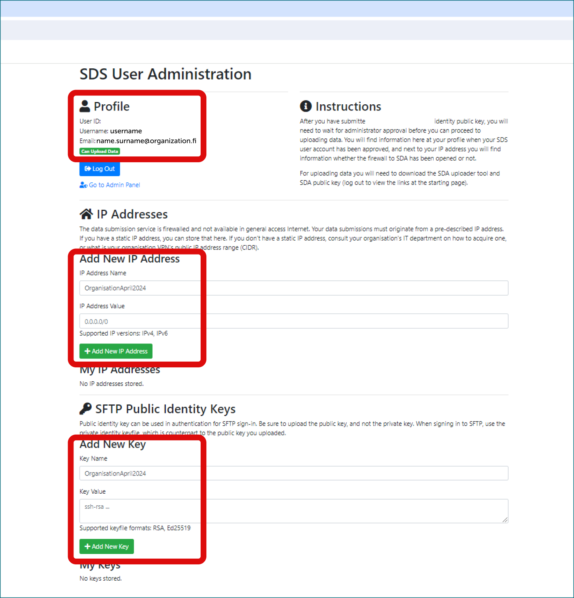

# Terveys- ja sosiaalidatan toissijainen käyttö tutkimuksessa SD Applyn kautta

Nämä ohjeet on tarkoitettu rekisterinpitäjille, jotka ovat myöntäneet tutkimusluvan ja tarvitsevat saattaa tietonsa saataville SD Desktopilla.

!!! Huomio   
    Ennen kuin aineisto voi olla tutkijoiden käytettävissä Sensitive Data -palveluissa, sinun on vahvistettava, että rekisterinpitäjän ja CSC:n väliset tarvittavat sopimukset ovat kunnossa. Ensimmäinen rekisteriaineisto on aina toimitettava yhteistyössä CSC:n Sensitive Data -tiimin kanssa. Voit aloittaa keskustelun SD-tiimin kanssa lähettämällä viestin [CSC Service Deskiin](../../support/contact.md) (aihe: Sensitiivinen Data).

Kun prosessi on ensimmäisen kerran luotu, rekisterinpitäjän edustaja voi hallita seuraavia aineistotoimituksia itsenäisesti. Apua on aina saatavilla palvelupisteestä. Alla on ohjeet aineistotoimitukseen ja käyttöoikeuksien hallintaan.

## Datan toimittaminen {#data-submission}

!!! Huomio
    Rekisterinpitäjän ja aineistonsiirrosta vastaavien henkilöiden on luotava CSC-tunnukset kirjautumalla Hakan tai Virtun tunnuksilla [MyCSC-portaaliin](https://my.csc.fi/). Jos sinulla ei ole Hakan tai Virtun tunnuksia, sinun on pyydettävä tunnusta [CSC Service Deskiltä](../../support/contact.md) (aihe: Sensitive Data).

### Vaihe 1: Organisaatioprofiili SD Applyssä {#step-1-organizational-profile-in-sd-apply}

Rekisterinpitäjän edustajan on tehtävä aineisto saataville tutkimusryhmälle SD Apply -palvelussa. Tutkijat käyttävät SD Applytä hakeakseen pääsyä aineistoon, johon heillä on tutkimuslupa, ja rekisterinpitäjän edustaja hyväksyy tai hylkää heidän hakemuksensa.

Kun olet luonut CSC-tunnuksen, voit kirjautua [SD Apply -palveluun](https://sd-apply.csc.fi/).

[](images/apply/apply_login.png)

!!! huom
    Käytä aina samaa identiteettipalveluntarjoajaa, kun kirjaudut SD Applyyn, koska kaikki toimintosi liittyvät kirjautumistunnukseesi (eli käytä aina vain Haka/Virtu-kirjautumista tai CSC-kirjautumista).

Ensimmäisen kirjautumisen jälkeen CSC Service Desk voi luoda rekisterinpitäjälle organisaatioprofiilin, jota käytetään kaikissa organisaatiosta tulevissa aineistotoimituksissa, ja asettaa sinut organisaatioprofiilin omistajaksi. Yhdellä organisaatiolla voi olla myös useita omistajia.

### Vaihe 2: Objektien luominen SD Applyssä {#step-2-creating-objects-in-sd-apply}

Kun sinut on asetettu organisaatioprofiilin omistajaksi, sinun tulisi luoda lisenssi ja työnkulku organisaatiolle SD Applyissä. Voit myös luoda hakulomakkeen, joka hakijan on täytettävä aineiston käyttöoikeuden hakemista varten. Lomakkeet eivät ole pakollisia, joten jos et tarvitse hakijalta lisätietoja, esimerkiksi vahvistusta lehtinumerosta käyttöoikeushakemuksen yhteydessä, sinun ei tarvitse luoda lomaketta.

1. Navigoi SD Apply Administration -välilehdelle
2. Valitse Licenses-välilehti ja sitten **create license**. Lisenssi määrittää käyttöehdot aineistolle, jotka hakijoiden on hyväksyttävä lähettäessään aineiston käyttöpyynnön. Koska tässä tapauksessa ehdot on jo määritelty aineistoluvassa, voit esimerkiksi viitata lisenssitekstissä aineistolupaan. Voit käyttää inline-tekstiä lisenssityypinä lyhyille teksteille.  
3. Siirry seuraavaksi Workflows-välilehdelle ja **create workflow**. Työnkulku määrittää, kuka hallinnoi organisaation aineistokäyttöpyyntöjä SD-palveluissa. Nimetyt käyttäjät saavat aina uuden käyttöoikeuspyynnön sähköpostilla ilmoituksen ja voivat hyväksyä tai hylätä hakemuksia SD Applyssä.

Lomakkeet ja lisenssit ovat julkisia SD Apply -palvelussa, joten niiden ei tulisi sisältää arkaluonteista tietoa. Näitä objekteja käytetään kaikille organisaatiostasi tuleville toissijaisille aineistoille, joten niiden tulisi myös olla mahdollisimman yleisiä. **Resource** ja **Catalogue item** luodaan automaattisesti jokaiselle aineistolle, kun tieto siirretään SFTP:n kautta.

### Vaihe 3: Turvallisen SSH-yhteyden luominen CSC:hen {#step-3-establishing-a-secure-ssh-connection-with-csc}

Valmistautuaksesi tietojen siirtoon, meidän on ensin luotava turvallinen ssh-yhteys tietokoneesi ja CSC:n välille. Noudata näitä ohjeita:

1. Luo SSH-avaintunnuspainike **RSA**-muodossa komentorivin kautta. [Katso yksityiskohtaiset ohjeet](../../cloud/pouta/tutorials/ssh-key.md#creating-an-ssh-key-pair-on-a-computer) Älä käytä salasanaa SSH-avaimellesi, jätä tämä kenttä tyhjäksi.
2. Kirjaudu [Sensitive Data -käyttäjien hallintaportaaliin](https://admin.sd.csc.fi/). Jos sinulla ei ole HAKA- tai Virtu-tunnuksia, ota yhteyttä palvelupisteeseemme CSC-tunnuksen pyytämiseksi. Tunnuksen luominen kestää muutaman päivän.

[](images/apply/SUP_Login.png)

3. Lisää hallintaportaalissa julkinen SSH-avaimesi ja määritelty nimi (esim. organisaatiosi ja päivämäärä) sille. 
4. Lisää IP-osoite, josta tiedot siirretään, ja sille määritelty nimi (esim.: organisaatio-päivämäärä). IP-osoitteen voit tarkistaa [CSC:n My IP -sovelluksesta](https://apps.csc.fi/myip/).

5. Seuraavaksi, kirjoita palvelupisteelle (vastaa samaan sähköpostiketjuun), että nämä vaiheet on suoritettu.

Hyväksymme tilisi pääsyn turvalliseen yhteyteen ja vahvistamme sen sinulle sähköpostitse. Vasta tämän jälkeen voit testata, onko mahdollista muodostaa turvallinen SSH-yhteys CSC:hen käyttämällä tätä komentoa ja SSH-avaintasi:

```
sftp -i X:\folder\privateshhfilename.key -P 50527 username@org.fi@porin.lega.csc.fi
exit
```

Missä:

```
-X:\folder\privateshhfilename.key on vastaavan yksityisen ssh-avaimen polku
```

`username` on käyttäjätunnus näkyvissä [käyttäjien hallintaportaalissa](https://admin.sd.csc.fi/) ja `org.fi` on sama kuin sähköpostiosoitteessasi.

[](images/apply/SUP.png)

### Vaihe 4: Tiedostojen salaaminen ja lataaminen turvallisen yhteyden kautta {#step-4-encrypt-and-upload-the-files-via-the-secure-connection}

Voit nyt salata ja siirtää aineiston turvallisesti. Vaikka käytettävissä on useita menetelmiä, suosittelemme käyttämään graafista käyttöliittymää SDA (Sensitive Data Archive) Uploader -työkalua. Tämän yksinkertaisen sovelluksen asentamiseen voi tarvita järjestelmäylläpitäjän erityislupaa, mutta se mahdollistaa työkalulle kätevästi turvallisen yhteyden käyttämisen aiemmin testaamillasi SSH-avaimilla, salaa tiedostot [CSC julkisen salausavaimen rekistereille](https://admin.sd.csc.fi/publickey/?instance=single%20registry) avulla ja lataa ne.

#### 4.1 Uploader-työkalun käyttö SDA:ssa {#4-1-upload-with-the-sda-uploader-tool}

Uploader-työkalulla sinun täytyy ensin kerätä kaikki siirrettävät aineistot yhteen kansioon tietokoneellasi.

!!! Huomio   
    Nimeä kansio lyhyellä nimellä (max. 64 merkkiä), joka ei sisällä välilyöntejä tai henkilötietoja, kuten nimiä. Kansion nimi näkyy julkisesti SD Applyssä. On hyvä käytäntö käyttää lehtinumeroa tai muuta yksilöllistä tunnistetta kansion nimissä. Tämä varmistaa, että oikeat tiedot lähetetään aina oikealle hakijalle, vaikka tiedonsiirtoja olisi useampia. 

1. Luo tietokoneellasi kansio ja nimeä se lehtinumerolla tai muulla sopivalla lyhyellä yksilöllisellä tunnisteella, joka ei sisällä välilyöntejä. Lisää kaikki aineistoon kuuluvat tiedostot tähän kansioon.
2. Lataa SDA (Sensitive Data Archive) Uploader -työkalu, joka on saatavilla [GitHubissa](https://github.com/CSCfi/sda-uploader/releases) Linuxille, Macille ja Windowsille. Saatat tarvita järjestelmänvalvojiesi käyttöluvat SDA Uploader -työkalun asentamiseksi tietokoneellesi.
    * Windows (sdagui-python3.11-windows-amd64.zip )
    * Mac (sdagui-python3.11-macos-amd64.zip)
    * Linux (sdagui-python3.11-linux-amd64.zip)

3. Lataa [CSC julkinen salausavain rekistereille](https://admin.sd.csc.fi/publickey/?instance=single%20registry).
4. Avaa SDA Uploader GUI -työkalu ja suorita seuraavat toimet:
    * Lisää CSC julkinen avain rekistereille `Load Recipient Public Key` -painikkeella.
    * Valitse kansio, jonka haluat ladata `Select Directory to Upload` -painikkeella.
    * Lisää yksityinen SSH-avaimesi (RSA-muoto) `Load SSH Key`.
    * Täytä käyttäjätunnuksesi (username@org.fi) `SFTP Username` -tekstikenttään.
    * Täytä SFTP-palvelin: porin.lega.csc.fi:50527 `SFTP Server` -tekstikenttään.

5. Lopuksi, napsauta upload and encrypt. Kaikki tiedostot salataan, ladataan CSC:lle ja liitetään samaan tunnukseen SD Applyssä. Jos työkalu pyytää salasanaa SSH-avaimellesi, jätä kenttä tyhjäksi. Tiedot tulevat automaattisesti löydettäviksi SD Applyssä kansion nimellä.

[](images/apply/SDA_Uploader.png)

#### 4.2 Edistyneet vaihtoehdot {#4-2-advanced-options}

Tämä SDA (Sensitive Data Archive) -Uploader-työkalu on saatavilla GitHubissa komentorivivaihtoehtoina (CLI, vaihtoehto 2 alla) Linuxille, Macille ja Windowsille. Lisätietoja työkalusta GitHub-repositoriossa. Vaihtoehtoisesti voit salata tiedot Crypt4GH:lla (myös GUI saatavilla, vaihtoehto 3 alla) ja lähettää tiedot suoraan SFTP:llä komentorivin kautta. Jokaisessa vaihtoehdossa sinun on käytettävä CSC:n julkista avainta salaukseen.

##### Edistynyt vaihtoehto 1 {#advanced-option-1}

SDA CLI -työkalulla luot ensin kansio tietokoneellesi ja nimeä se lehtinumerolla tai muulla lyhyellä yksilöllisellä tunnisteella, joka ei sisällä välilyöntejä. Lisää kaikki aineistoon kuuluvat tiedostot tähän kansioon. Sitten lisäät seuraavan komennon komentoriville (korvaa example_dataset_123 hakemiston nimellä, username@org.fi tunnuksillasi ja X:\folder\filename.key (tai ~/.ssh/filename Linuxilla/macOS:llä) SSH-avaimesi sijainnilla):

```
sdacli example_dataset_123 -host porin.lega.csc.fi -p 50527 -u username@org.fi -i X:\folder\filename.key -pub registry.pub
```

##### Edistynyt vaihtoehto 2 {#advanced-option-2}

Crypt4GH:n ja SFTP:n kanssa salaat tiedot ensin CSC:n julkisella avaimella joko Crypt4GH python-moduulilla tai graafisella käyttöliittymällä. Sitten avaat SFTP-yhteyden seuraavalla komennolla (korvaa username@org.fi tunnuksillasi ja X:\folder\filename.key (tai ~/.ssh/filename Linuxilla/macOS:llä) yksityisen SSH-avaimesi sijainnilla):

```
sftp -i X:\folder\filename.key -P 50527 username@org.fi@porin.lega.csc.fi
```

Luo sitten hakemisto siirrettävälle aineistolle:

```
mkdir example_dataset_123
cd example_dataset_123
```

Laita sitten kaikki tähän aineistoon kuuluvat tiedostot kansioon:

```
put example_dataset_123_file-1
put example_dataset_123_file-2
put example_dataset_123_file-3
exit
```

Onnistuneen latauksen jälkeen aineisto näkyy SD Applyssä. Suoran SFTP-siirron yhteydessä voit odottaa hetken ensimmäisen tiedoston siirtämisen jälkeen, jotta hakemisto tulee näkyväksi SD Applyssä, jotta järjestelmä ei luo useita merkintöjä yhdelle hakemistolle. Tämä voi tapahtua, jos tiedostot lähetetään liian nopeasti yksi toisen jälkeen. Tiedostot eivät ole näkyvissä SFTP-hakemistossa siirron jälkeen, sillä ne otetaan heti käyttöön.

!!! Huomio   
    Voit aina siirtää enemmän tietoja samalle projektille/aineistoluville käyttämällä samaa hakemistoa. Tiedot tulevat käyttäjän nähtäviksi SD Desktopissa, kun he kirjautuvat uudelleen. Jos lähetät useita tiedostoja samalla tiedostonimellä, tiedostoja ei korvata, vaan molemmat versiot säilytetään ja ovat käyttäjän saatavilla. Jos sinun on poistettava tiedostoja siirron jälkeen, esimerkiksi kun aineistolupa vanhenee, ota yhteyttä CSC Service Deskiin. Pääsyä tietoihin voidaan rajoittaa luvan vanhentumisen tai projektin missä tahansa vaiheessa tarvittaessa (katso alla), mutta tiedostojen poistaminen CSC:ltä on manuaalinen toimenpide, joka tehdään ylläpitäjiemme toimesta.

## Datan käyttöoikeuksien hallinta {#data-access-management}

Kun aineisto on toimitettu, se on löydettävissä SD Apply -palvelussa aineiston tunnuksella (organisaation tunniste + lehtinumero).

Tutkijan, joka on saanut tutkimusluvan, tulisi luoda toissijainen CSC-projekti ja lähettää tutkimuslupa CSC:n palvelupisteeseen tarkistettavaksi. Aineistoluvan myöntäjän tulisi kertoa tutkijalle, mikä on aineiston tunniste SD Applyssä, johon heidän tulisi hakea käyttöoikeutta.

Rekisterinpitäjän nimetyt edustajat saavat ilmoituksen uusista hakemuksista sähköpostitse. He voivat tarkastella ja hyväksyä hakemuksen ja asettaa päättymispäivän käyttöoikeudelle SD Applyssä. Käyttöoikeus voidaan myös peruuttaa manuaalisesti myöhemmin, mutta automaattinen päättymispäivä on toivottava, ettei valtuuttamatonta pääsyä tapahdu aineistoluvan vanhenemisen jälkeen.

### Vaihe 1: Kirjautuminen {#step-1-login}

Tietojen käyttöoikeuksien hallitsijana saat sähköposti-ilmoituksen aina, kun hakija hakee käyttöoikeutta aineistoon, johon sinut on liitetty.

Aloittaaksesi hakemusten käsittelyn, seuraa sähköpostin linkkiä tai kirjaudu suoraan [SD Apply -palveluun](https://sd-apply.csc.fi/). Kirjautuminen SD Applyyn on mahdollista käyttäjäidentiteettifederaatiojärjestelmien (Haka tai Virtu-kirjautuminen) tai CSC-tunnuksen avulla.

[](images/apply/apply_login.png)

!!! huom
    Käytä aina samaa identiteettipalveluntarjoajaa, kun kirjaudut SD Applyyn, koska kaikki toimintosi liittyvät kirjautumistunnukseesi.

### Vaihe 2: Hakemuksen käsittely {#step-2-process-the-application}

SD Applyssä, siirry "Actions" -välilehdelle nähdäksesi kaikki hakemukset, jotka odottavat hyväksyntää. Valitse *View* avataksesi käsiteltävän hakemuksen. Hakemuksia ei tarvitse käsitellä tietyssä järjestyksessä. Hyväksymisprosessi on täysin dynaaminen.

[](images/apply/apply_dac.png)

#### Hyväksy tai hylkää hakemus {#approve-or-reject-the-application}

Voit hyväksyä tai hylätä hakemuksen heti, jos hakija on antanut kaikki tarvittavat tiedot. Valitse *Approve or reject application* "Actions" -kohdasta. Jos hylkäät hakemuksen, suosittelemme kertomaan hakijalle, miksi hakemus hylättiin, kirjoittamalla kommentti.

Kun hyväksyt hakemuksen, voit myös asettaa päättymispäivän käyttöoikeudelle, esimerkiksi aineistoluvan voimassaolon päättymispäivän. Jos päättymispäivää ei aseteta, käyttöoikeus on peruutettava manuaalisesti, kun aineistolupa päättyy sulkemalla hakemus (katso [Vaihe 4](./single-register-submission.md#step-4-after-processing-the-application)).

Hakija saa sähköpostiviestin päätöksestä. Kun hyväksyt tai hylkäät hakemuksen, päätös on lopullinen. Et voi muokata sitä myöhemmin. Jos hakija on lisännyt jäseniä hakemukseensa, jäsenet saavat myös käyttöoikeudet hakemuksen hyväksymisen jälkeen, jos he ovat hyväksyneet käyttöehdot. Jokainen jäsen, joka ei ole hyväksynyt käyttöehtoja siihen mennessä, saa käyttöoikeudet vasta, kun he kirjautuvat SD Applyhin ja hyväksyvät käyttöehdot.

CSC Service Desk lisää tutkijoille pääsyn aineistoon sen jälkeen, kun he lähettävät hyväksytyn hakemuksen pdf-tiedoston CSC Service Deskiin.

!!! huom
    Jos aineisto, johon hakija hakee käyttöoikeutta, on poistettu käytöstä, SD Apply antaa varoituksen hakemusten käsittelijöille, mutta hakemuksen voi silti hyväksyä tai hylätä.

#### Sulje hakemus {#close-the-application}
Voit sulkea hakemuksen missä tahansa prosessin vaiheessa valitsemalla *Close application*. Sulkeminen tarkoittaa, että hakemusprosessi peruutetaan ja hakemusta ei voi muokata tai avata uudelleen. Kirjoita kommenttikenttään kommentti selittääksesi, miksi suljit hakemuksen.

Suosittelemme hakemuksen sulkemista, jos se on jollain tavalla epäasianmukainen. Hakemusten poistaminen ei ole mahdollista, koska haluamme aina tarjota täydellisen historian hakemusprosessista. Löydät suljetut hakemukset "Actions" -välilehdellä kohdasta "Processed applications".

### Vaihe 4: Hakemuksen käsittelyn jälkeen {#step-4-after-processing-the-application}

Voit hallita hakijan käyttöoikeuksia jopa käsiteltyäsi hakemuksen. Löydät käsitellyt hakemukset "Actions" -välilehdeltä kohdasta "Processed applications". "Processed applications" -näkymä näyttää kaikki hakemukset, jotka on hyväksytty, hylätty, suljettu tai palautettu hakijalle. Valitse *View* avataksesi tietyn hakemuksen.

#### Sulje hakemus {#close-the-application-2}
Hakemuksen sulkeminen peruuttaa hakijan ja muiden hakemuksen jäsenten käyttöoikeudet. Kun hakija ja hakemuksen jäsenet eivät enää tarvitse käyttöoikeuksia, esimerkiksi koska aineistolupa on vanhentunut, voit peruuttaa heidän käyttöoikeutensa valitsemalla *Close application*.

#### Peruuta käyttöoikeudet {#revoke-access-rights}
Jos hakijalle on myönnetty käyttöoikeudet, mutta he väärinkäyttävät niitä, voit peruuttaa heidän oikeutensa valitsemalla *Revoke entitlement*. Peruutus lisää hakijan ja kaikki hakemuksen jäsenet mustalle listalle. Tämä tarkoittaa, että jos kukaan heistä yrittää hakea käyttöoikeuksia samalle aineistolle uudelleen, SD Apply varoittaa hakemusten käsittelijöitä. Aineiston omistaja voi muokata mustaa listaa. Löydät mustan listan "Administration" -välilehdeltä.

### Sähköposti-ilmoitukset {#email-notifications}
Saat sähköposti-ilmoituksia SD Apply -käyttäjien toimista. Yhdellä organisaatiolla voi olla useampi kuin yksi tietojen käyttöoikeuksien hallitsija. Siksi kaikki niistä hallitsijoista, jotka on osoitettu tietylle aineistolle, saavat sähköposti-ilmoituksen, kun joku heistä on käsitellyt hakemuksen.

Voit nähdä ja muokata sähköpostiosoitettasi "Settings" -välilehdellä sivun oikeassa yläkulmassa.

Saat myös ilmoituksia, kun hakija on lähettänyt tai lähettänyt hakemuksen uudelleen.