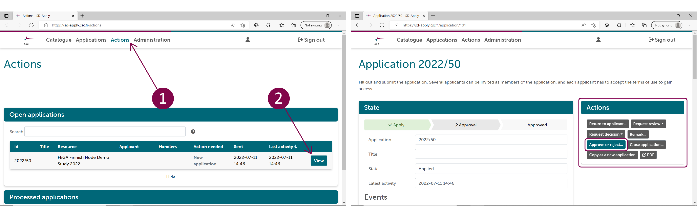

# Submitting secondary use health and social data for research use via SD Apply

These instructions are for data controllers who have issued a data permit for a research project and need to make their data available on SD Desktop.

!!! Note 
    The first register data set must always be submitted in collaboration with the CSC Sensitive Data (SD) services team. You can start a conversation with the SD services team by sending a message to the CSC service desk (servicedesk@csc.fi, subject: Sensitive Data).

After the process is established for the first time, the representative of the data controller can manage the following data submissions on their own. Help is always available via the service desk. Below are the instructions for the data submission and access control.

## Data submission

### Step 1: CSC account and organizational profile in SD Apply

Create [CSC account](../../accounts/how-to-create-new-user-account.md) by logging in with Haka or Virtu credentials at the [My CSC portal](https://my.csc.fi/). If you don't have Haka or Virtu credentials, you need to request an account from the service desk (servicedesk@csc.fi, subject: Sensitive Data).

When you have created an CSC account, you can log in to [SD Apply service](https://sd-apply.csc.fi/).

[](images/apply/apply_login.png)

!!! note
    Always use the same identity provider when you log in to SD Apply because all your actions are connected to your login identity (i.e. use always only Haka/Virtu login or the CSC login).

After the first log in, CSC service desk can create an organizational profile for the data controller, which will be used for all the data submissions coming from this organization, and assign you as an owner of the organizational profile. There can also be multiple owners for one organization.

### Step 2: Creating objects in SD Apply

After you have been set as the owner of the organization profile, you can create a workflow, form and license for the organization in SD Apply.

1. With a workflow, you define who will manage the access applications of the organization in SD services. These named users will always receive a notification via email about new access applications and can approve or reject the applications in SD Apply.
2. To the form, you add all the information needed for access applications. This information will be shown to the applicants in SD Apply. To the form, you can also add fields for the applicant to fill, e.g. ask them to confirm the journal number by submitting it via the form.
3. License specifies the terms of use for the data, which the applicants need to approve when they fill in the access application form. In the license, you can for example refer to the terms specified in the data permit.

The forms and licenses are public in SD Apply, so these should not include sensitive information.

### Step 3: Preparations for the data transfer

Next, you can log in to the [user administration portal](https://admin.sd.csc.fi/). In the administration portal, you need to

1. add the IP address from which the data will be transferred (IP address can be checked with [CSC’s My IP app](https://apps.csc.fi/myip/)), and
2. add your public SSH key.

With this information, the CSC service desk will make the necessary preparations for data submission from the CSC side.

After the service desk has confirmed that the preparations are done, you can test the SFTP connection. This can be done with the following command (replace *username(a)org.fi* with your credentials and *X:\folder\filename.key* with the location of your SSH key):

```
sftp -i X:\folder\filename.key -P 50527 username@org.fi@porin.lega.csc.fi
exit
```

### Step 4: Data encryption and upload 

Before the data transfer, the data must be encrypted with a [CSC public key](https://admin.sd.csc.fi/publickey/?instance=single%20registry). CSC provides a convenience tool that encrypts and uploads data automatically. This SDA Uploader tool is available on [GitHub](https://github.com/CSCfi/sda-uploader/releases), and has both graphical user interface (GUI) and command line (CLI) options for Linux, Mac and Windows.

The encrypted data is sent via SFTP to a directory which should be named according to the journal number of the data permit. The final dataset ID will be a combination of the organization’s identifier and the journal number (e.g. org.fi/example_dataset_123). The file to be uploaded should also be named with the journal number.

**Option 1: With the GUI tool**, you add the [CSC public key](https://admin.sd.csc.fi/publickey/?instance=single%20registry), the file you want to upload, and your SSH key (SFTP key) to the interface. You also need to fill in your username (*username(a)org.fi*) and the SFTP server: ```porin.lega.csc.fi:50527```

**Option 2: With the CLI tool**, you add the following command to the command line (replace *example_dataset_123* with the journal number, *username(a)org.fi* with your credentials, and *X:\folder\filename.key* with the location of your SSH key):

```
sdacli example_dataset_123 -host porin.lega.csc.fi -p 50527 -u username@org.fi -i X:\folder\filename.key -pub registry.pub
```

After a successful upload, the dataset can be found in SD Apply.

## Data access management

After the data has been submitted, it is discoverable in SD Apply with the dataset ID (organization's identifier + the journal number).

The researcher who has received the data permit can contact the CSC service desk and ask for a CSC project with the data permit. After the project has been established, they can log in to SD Apply and apply for data access.

The assigned representatives of the data controller will receive a notification of the application via email. They can review and approve the application and set an end date for the data access in SD Apply. The permission can also be revoked manually in the future, but automated end date is preferred to avoid unauthorised access after the data permit has expired.

### Step 1: Confirm availability

When a new dataset you are associated with is uploaded to CSC, you will receive an automated email via SD Apply asking you to confirm your availability to act as a data access controller. Follow the link in your email or log in directly to SD Apply at https://sd-apply.csc.fi/ and confirm your availability. 

### Step 2: Login

As a data access controller, you receive email notifications each time when an applicant applies for data access to the dataset you are associated with.

To start processing applications, follow the link in your email or log in directly to SD Apply at <https://sd-apply.csc.fi/>. Login to SD Apply is possible either with user identity federation systems (Haka or Virtu login) or with CSC account.

[](images/apply/apply_login.png)

!!! note
    Always use the same identity provider when you log in to SD Apply because all your actions are connected to your login identity.

### Step 3: Process the application

In SD Apply, navigate to the "Actions" tab to see all the applications that are waiting for approval. Select *View* to open the application you want to process. You do not have to follow any specific order when you process the applications. The approval process is fully dynamic.

[](images/apply/apply_dac.png)

#### Approve or reject the application

You can approve or reject the application right away if the applicant has provided all the needed information. Select *Approve or reject application* under "Actions". If you reject an application, we recommend telling the applicant why the application was rejected by writing a comment.

When approving the application, you can also set an end date for the access right, e.g. the expiration date of the data permit. If no end date is set, the access right needs to be cancelled manually when the data permit expires by closing the application (see (Step 4)[./single-register-submission.md#step-4-after-processing-the-application]).

The applicant will receive an email notification about the decision. Once you approve or reject the application, the decision is final. You cannot edit it later. If the applicant has added members to their application, the members will get access rights too when the application is approved, if they have accepted the terms of use. Any member not having accepted the terms of use by that time will get access rights after they log in to SD Apply and accept the terms of use.

!!! note
    If the owner of the dataset has removed the dataset that applicant is applying for access, SD Apply will give a warning, but you can still process the application. However, if the dataset has been removed, you cannot approve or reject the application.

#### Return the application to the applicant

If the application is missing some information, you can return it to the applicant. Write a comment on the application or attach a file of the changes you want the applicant to make. Select *Return to applicant* under "Actions" to return the application.

The applicant will receive an email notification about a returned application. They can resubmit the application after editing it. Resubmitted applications will show up in the "Actions" tab. The changes the applicant has made will show as highlighted on the application form.

#### Close the application
You can close the application at any stage of the process by selecting *Close application*. Closing means that the application process is cancelled and that the application cannot be modified or opened again. Write a comment on the comment field to explain why did you close the application.

We recommend closing the application, if it is somehow inappropriate. Deleting applications is not possible because we want to always provide a full history of the application process. You can find closed applications in the "Actions" tab under "Processed applications".

#### Edit the application

You can also edit applications by the following ways:

- **Change the licenses**. The applicant will receive an email notification about the change in terms of use and has to accept the new licenses before they will be granted access rights.

- **Add or remove members**. If you do not want to grant access to all members in the application, you can remove additional members. Adding members is also possible.

- **Change the applicant**. You can change the applicant to another member of the application. This can be useful if, for example, the original applicant has left the applying organisation.

- **Change the resources of the application**. If the applicant is applying for access rights to multiple datasets and you do not want to grant access to all of them, you can remove some of the datasets. It is also possible to add new resources if they can be applied for using the same application form. These will show as available in the drop-down list.

!!! note
    You can comment on the application throughout the application process by selecting *Remark* and choosing if you want to show the comment to the applicant or not. Applicants will receive a notification about new public comments. Sometimes it is useful for the applicant to see the comments so that they know how the approval process is proceeding. Note that the applicant cannot respond to the comments.

### Step 4: After processing the application

You are able to manage the access rights of the applicant even after you have processed the application. You can find the processed applications from the "Actions" tab under "Processed applications". "Processed applications" view shows all the applications that have been approved, rejected, closed, or returned to the applicant. Select *View* to open a specific application.

#### Close the application
Closing the application cancels the access rights of the applicant and other application members. When the applicant and the application members do not need the access rights anymore, for example because the data permit has expired, you can cancel their access rights by selecting *Close application*.

#### Revoke access rights
If the applicant has been granted access rights but they misuse them, you can revoke their rights by selecting *Revoke entitlement*. Revoking will add the applicant and all the application members to a blacklist. This means that if any of them tries to apply for access rights to the same dataset again, SD Apply will warn the application handlers. The owner of the dataset can edit the blacklist. You can find the blacklist from the "Administration" tab. 

### Email notifications
You will receive email notifications about the actions of other SD Apply users. There might be more than one data access controller in one organization. Therefore, all the controllers who have been assigned to a certain dataset, receive an email notification when one of them has processed an application.

You can see and edit your email address from the "Settings" tab in the top right corner of the page.

You will be notified when another handler has:

- commented an application.

- returned the application to the applicant.

- approved an application.

- rejected an application.

- closed an application.

- revoked the access rights of the applicant.

You will also receive notifications when an applicant has submitted or resubmitted an application.
