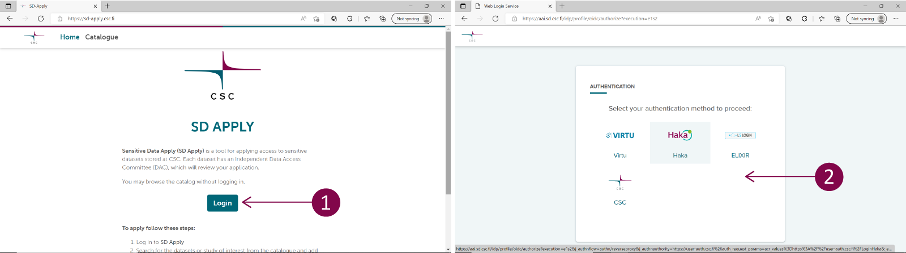
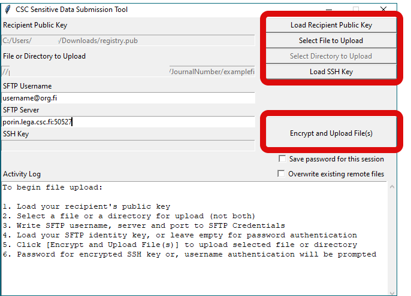

[Käyttöoppaan sisällysluettelo :material-arrow-right:](sd-services-toc.md)

# Toissijaisen käytön terveys- ja sosiaalidatan toimittaminen tutkimuskäyttöön SD Applyn kautta { #submitting-secondary-use-health-and-social-data-for-research-use-via-sd-apply }

Nämä ohjeet on tarkoitettu rekisterinpitäjille, jotka ovat myöntäneet tietoluvan tutkimusprojektille ja joiden tulee tehdä aineistonsa saataville SD Desktopissa.

!!! Note 
    Ennen kuin aineisto voidaan tehdä tutkijoiden saataville Sensitive Data -palveluissa, sinun tulee varmistaa, että tarvittavat oikeudelliset sopimukset CSC:n ja rekisterinpitäjän välillä ovat kunnossa. Ensimmäinen rekisteriaineisto tulee aina toimittaa yhteistyössä CSC:n Sensitive Data (SD) -palvelutiimin kanssa. Voit aloittaa keskustelun SD-palvelutiimin kanssa lähettämällä viestin [CSC Service Deskiin](../../support/contact.md) (aihe: Sensitive Data).

Kun prosessi on luotu ensimmäistä kertaa, rekisterinpitäjän edustaja voi hoitaa seuraavat aineistotoimitukset itsenäisesti. Apua on aina saatavilla Service Deskin kautta. Alla ovat ohjeet aineiston toimittamiseen ja käyttöoikeuksien hallintaan.


## Aineiston toimittaminen { #data-submission }

!!! Note
    Rekisterinpitäjän ja aineistonsiirrosta vastaavien henkilöiden tulee luoda CSC-tilit kirjautumalla Haka- tai Virtu-tunnuksilla [MyCSC-portaaliin](https://my.csc.fi/). Jos sinulla ei ole Haka- tai Virtu-tunnuksia, pyydä tiliä [CSC Service Deskiltä](../../support/contact.md) (aihe: Sensitive Data).

### Vaihe 1: Organisaatioprofiili SD Applyssa { #step-1-organizational-profile-in-sd-apply }

Rekisterinpitäjän edustajan on asetettava aineisto tutkijaryhmän haettavaksi SD Apply -palvelussa. Tutkijat käyttävät SD Applyta hakeakseen käyttöoikeutta siihen aineistoon, johon heillä on tietolupa, ja rekisterinpitäjän edustaja hyväksyy tai hylkää hakemuksen.

Kun olet luonut CSC-tilin, voit kirjautua sisään [SD Apply -palveluun](https://sd-apply.csc.fi/).

[](images/apply/apply_login.png)

!!! note
    Käytä aina samaa tunnistautumispalvelua kirjautuessasi SD Applyhin, koska kaikki toimintosi kytkeytyvät kirjautumisidentiteettiisi (ts. käytä aina joko Haka/Virtu-kirjautumista tai CSC-kirjautumista).

Ensimmäisen kirjautumisen jälkeen CSC Service Desk voi luoda rekisterinpitäjälle organisaatioprofiilin, jota käytetään kaikkiin tästä organisaatiosta tuleviin aineistotoimituksiin, ja merkitä sinut organisaatioprofiilin omistajaksi. Yhdellä organisaatiolla voi olla useita omistajia.

### Vaihe 2: Objektien luominen SD Applyssa { #step-2-creating-objects-in-sd-apply }

Kun sinut on asetettu organisaatioprofiilin omistajaksi, sinun tulee luoda organisaatiolle SD Applyhin policy (käyttöehdot) sekä DAC (Data Access Committee). Voit myös luoda hakemuslomakkeen, jonka hakijan tulee täyttää jättäessään käyttöoikeushakemuksen. Lomakkeet ovat valinnaisia; jos et tarvitse lisätietoja hakijalta (esim. diaarinumeron vahvistus hakemusta lähettäessä), lomaketta ei tarvitse luoda. 

1. Siirry SD Applyn "Administration"-välilehdelle
2. Valitse "Policies"-välilehti ja sitten **create Policy**. Policy määrittää aineiston käyttöehdot, jotka hakijoiden tulee hyväksyä jättäessään käyttöoikeushakemuksen. Koska tässä tapauksessa ehdot on jo määritelty tietoluvassa, voit esimerkiksi viitata tietolupaan policy-tekstissä. Lyhyille teksteille voit käyttää policy-tyyppinä inline-tekstiä.  
3. Seuraavaksi siirry "DACs"-välilehdelle ja **create DAC**. DAC (Data Access Committee) määrittelee henkilöt, jotka käsittelevät organisaation käyttöoikeushakemuksia SD-palveluissa. Nämä nimetyt käyttäjät saavat aina sähköpostitse ilmoituksen uusista käyttöoikeushakemuksista ja voivat hyväksyä tai hylätä hakemukset SD Applyssa.  

Lomakkeet ja policyt ovat julkisia SD Applyssa, joten niihin ei tule sisällyttää arkaluonteista tietoa. Näitä objekteja käytetään kaikkiin organisaatiosi toissijaisen käytön aineistoihin, joten niiden tulisi olla mahdollisimman yleisiä. **Identifier** ja **Catalogue item** luodaan automaattisesti kullekin aineistolle, kun aineisto siirretään SFTP:n kautta. 

### Vaihe 3: Suojatun SSH-yhteyden muodostaminen CSC:hen { #step-3-establishing-a-secure-ssh-connection-with-csc }

Valmistellaksemme aineistonsiirtoa meidän on ensin muodostettava suojattu SSH-yhteys kannettavasi ja CSC:n välille. Toimi seuraavasti:

1. Luo SSH-avaipari **RSA**-muodossa komentorivillä. [Katso tarkemmat ohjeet](../../cloud/pouta/tutorials/ssh-key.md#creating-an-ssh-key-pair-on-a-computer) Älä käytä salasanaa SSH-avaimellesi, jätä kenttä tyhjäksi.
2. Kirjaudu sisään [Sensitive Data -käyttäjähallinnan portaaliin](https://admin.sd.csc.fi/). Jos sinulla ei ole HAKA-tunnusta, kirjoita palvelupisteeseemme pyytääksesi CSC-tiliä. Tilin perustaminen vie muutaman päivän.

[](images/apply/SUP_Login.png)


3. Lisää hallintaportaalissa julkinen SSH-avaimesi ja sille määritelty nimi (esimerkki: organisaatiosi ja päivämäärä). 
4. Lisää IP-osoite, josta aineisto siirretään, sekä sille määritelty nimi (esim.: organisaatio-päivämäärä). IP-osoitteen voi tarkistaa [CSC:n My IP -sovelluksella](https://apps.csc.fi/myip/).


5. Kirjoita seuraavaksi Service Deskille (vastaa samaan sähköpostiketjuun) ja kerro, että nämä vaiheet on suoritettu.

Hyväksymme tilisi pääsyn suojattuun yhteyteen ja vahvistamme sen sinulle sähköpostitse. Vasta tämän jälkeen voit testata, onko suojatun SSH-yhteyden muodostaminen CSC:hen mahdollista käyttämällä tätä komentoa ja SSH-avaintasi:

```
sftp -i X:\folder\privateshhfilename.key -P 50527 username@org.fi@porin.lega.csc.fi
exit
```

Missä:

```
-X:\folder\privateshhfilename.key is the path to the correspondent private shh key
```

`username` on [käyttäjähallintaportaalissa](https://admin.sd.csc.fi/) näkyvä käyttäjätunnus ja `org.fi` on sama kuin sähköpostiosoitteessasi.


[](images/apply/SUP.png)


### Vaihe 4: Tiedostojen salaaminen ja siirtäminen suojatun yhteyden kautta { #step-4-encrypt-and-upload-the-files-via-the-secure-connection }

Voit nyt salata ja siirtää aineiston turvallisesti. Vaikka tähän on useita tapoja, suosittelemme graafista SDA (Sensitive Data Archive) Uploader -työkalua. Tämän yksinkertaisen sovelluksen asentaminen saattaa vaatia järjestelmäsi ylläpidolta erillisen luvan, mutta se mahdollistaa suojatun yhteyden käyttöönoton aiemmin testaamillasi SSH-avaimilla, tiedostojen salaamisen [CSC:n rekistereitä varten tarkoitetulla julkisella salausavaimella](https://admin.sd.csc.fi/publickey/?instance=single%20registry) sekä niiden lähettämisen. 

Tämä tarkoittaa, että luomiasi SSH-avaimia käytetään CSC-yhteyden muodostamiseen, kun taas erillistä julkista salausavainta käytetään datan salaamiseen, jotta tutkijat voivat käyttää sitä SD Desktopissa.

#### 4.1 Siirto SDA Uploader -työkalulla { #41-upload-with-the-sda-uploader-tool }

SDA Uploader -työkalulla sinun tulee kerätä kaikki data yhdelle kansiolle tietokoneellasi ennen siirtoa.

!!! Note 
    Nimeä kansio lyhyesti (enintään 64 merkkiä) ilman välilyöntejä tai henkilötietoja, kuten henkilön nimiä. Kansion nimi tulee julkisesti näkyviin SD Applyssa. Siksi on hyvä käytäntö käyttää kansion nimenä diaarinumeroa tai muuta yksilöllistä tunnistetta. Näin varmistetaan, että oikea data toimitetaan aina oikealle hakijalle myös lisäsiirroissa. 
      
1. Luo tietokoneellesi kansio ja nimeä se diaarinumerolla tai muulla sopivalla lyhyellä yksilöllisellä tunnisteella, joka ei sisällä välilyöntejä. Lisää kaikki aineistoon kuuluvat tiedostot tähän kansioon.
2. Lataa [GitHubista](https://github.com/CSCfi/sda-uploader/releases) saatavilla oleva SDA (Sensitive Data Archive) Uploader -työkalu Linuxille, Macille tai Windowsille. Tarvitset mahdollisesti järjestelmänvalvojiesi luvan SDA Uploader -työkalun asentamiseen kannettavallesi.
    * Windows (sdagui-python3.11-windows-amd64.zip )
    * Mac (sdagui-python3.11-macos-amd64.zip)
    * Linux (sdagui-python3.11-linux-amd64.zip)


3. Lataa [CSC:n rekistereitä varten tarkoitettu julkinen salausavain](https://admin.sd.csc.fi/publickey/?instance=single%20registry).
4. Avaa SDA Uploader -graafinen työkalu ja tee seuraavat vaiheet:
    * Lisää CSC:n julkinen avain rekistereille `Load Recipient Public Key` -painikkeella.
    * Valitse siirrettävä kansio `Select Directory to Upload` -painikkeella.
    * Lisää yksityinen SSH-avaimesi (RSA-muoto) `Load SSH Key` -painikkeella.
    * Täytä käyttäjätunnuksesi (username@org.fi) `SFTP Username` -kenttään.
    * Täytä SFTP-palvelin: porin.lega.csc.fi:50527 `SFTP Server` -kenttään.
    
5. Lopuksi klikkaa upload and encrypt. Kaikki tiedostot salataan, ladataan CSC:lle ja liitetään samaan tunnisteeseen SD Applyssa. Jos työkalu pyytää salasanaa SSH-avaimellesi, jätä kenttä tyhjäksi. Data tulee automaattisesti löydettäväksi SD Applyssa kansion nimellä.

[](images/apply/SDA_Uploader.png)


#### 4.2 Edistyneet vaihtoehdot { #42-advanced-options }

SDA (Sensitive Data Archive) Uploader -työkalu on saatavilla GitHubissa myös komentorivivaihtoehdoilla (CLI, vaihtoehto 1 alla) Linuxille, Macille ja Windowsille. Lisätietoja työkalusta löytyy [GitHub-repositorystä](https://github.com/CSCfi/sda-uploader/?tab=readme-ov-file#cli-demo). Vaihtoehtoisesti voit salata datan Crypt4GH:lla (myös GUI saatavilla, vaihtoehto 2 alla) ja lähettää datan suoraan SFTP:llä komentoriviltä. Molemmissa vaihtoehdoissa sinun tulee käyttää [CSC:n rekistereitä varten tarkoitettua julkista salausavainta](https://admin.sd.csc.fi/publickey/?instance=single%20registry) tiedostojen salaamiseen. Tämä avain on erillinen SSH-avaimistasi.

##### Edistynyt vaihtoehto 1 { #advanced-option-1 }

SDA CLI -työkalulla luot ensin tietokoneellesi kansion ja nimeät sen diaarinumerolla tai muulla lyhyellä yksilöllisellä tunnisteella, joka ei sisällä välilyöntejä. Lisää kaikki aineistoon kuuluvat tiedostot tähän kansioon. Lisää sitten seuraava komento komentoriville (korvaa example_dataset_123 kansion nimellä, username@org.fi omilla tunnuksillasi ja X:\folder\filename.key (tai ~/.ssh/filename Linux/macOS) SSH-avaimesi sijainnilla):

```
sdacli example_dataset_123 -host porin.lega.csc.fi -p 50527 -u username@org.fi -i X:\folder\filename.key -pub registry.pub
```

##### Edistynyt vaihtoehto 2 { #advanced-option-2 }

Crypt4GH:lla ja SFTP:llä salaat ensin datan CSC:n julkisella avaimella joko Crypt4GH Python -moduulilla tai GUI-versiolla. Tämän jälkeen avaat SFTP-yhteyden seuraavalla komennolla (korvaa username@org.fi omilla tunnuksillasi ja X:\folder\filename.key (tai ~/.ssh/filename Linux/macOS) yksityisen SSH-avaimesi sijainnilla):

```
sftp -i X:\folder\filename.key -P 50527 username@org.fi@porin.lega.csc.fi
```

Luo sitten siirrettävälle aineistolle kansio:

```
mkdir example_dataset_123
cd example_dataset_123
```

Siirrä sitten kaikki kyseiseen aineistoon kuuluvat tiedostot kansioon:

```
put example_dataset_123_file-1
put example_dataset_123_file-2
put example_dataset_123_file-3
exit
```

Onnistuneen siirron jälkeen aineisto on näkyvissä SD Applyssa. Suoralla SFTP-siirrolla voit odottaa hetken ensimmäisen tiedoston siirtämisen jälkeen, jotta kansio ehtii tulla näkyviin SD Applyssa, eikä järjestelmä luo useita merkintöjä samalle kansiolle. Näin voi käydä, jos tiedostoja lähetetään liian nopeasti peräkkäin. Tiedostot eivät ole näkyvissä SFTP-hakemistossa siirron jälkeen, koska ne otetaan välittömästi sisään.

!!! Note 
    Voit aina toimittaa lisää dataa samaan projektiin/tietolupaan käyttämällä samaa kansiota. Data tulee näkyviin käyttäjälle SD Desktopissa, kun hän kirjautuu uudelleen. Jos lähetät useita samannimisiä tiedostoja, tiedostoja ei korvata, vaan molemmat versiot säilytetään ja ne ovat käyttäjän saatavilla.
    Jos sinun täytyy poistaa tiedostoja siirron jälkeen, esimerkiksi tietoluvan umpeutuessa, ota yhteyttä CSC Service Deskiin. Pääsyä dataan voidaan rajoittaa tietoluvan päätyttyä tai missä tahansa projektin vaiheessa tarpeen mukaan (ks. alla), mutta datan poistaminen CSC:ltä on ylläpitäjiemme tehtävä ja tehdään manuaalisesti.

## Tietojen käyttöoikeuksien hallinta { #data-access-management }

Aineisto on toimituksen jälkeen löydettävissä SD Applysta aineistotunnisteella (organisaation tunniste + diaarinumero). 

Tutkijan, joka on saanut tietoluvan, tulee luoda toissijaisen käytön CSC-projekti ja lähettää tietolupa CSC Service Deskille tarkistettavaksi. Tietoluvan myöntäjän tulisi kertoa tutkijalle, mikä on se aineistotunniste SD Applyssa, johon tämän tulee hakea pääsyä.

Rekisterinpitäjän nimetyt edustajat saavat sähköpostitse ilmoituksen uusista hakemuksista. He voivat tarkastella ja hyväksyä hakemuksen sekä asettaa käyttöoikeudelle päättymispäivän SD Applyssa. Käyttöoikeus voidaan perua myös manuaalisesti myöhemmin, mutta automaattinen päättymispäivä on suositeltava luvattoman käytön välttämiseksi tietoluvan umpeuduttua.

### Vaihe 1: Kirjautuminen { #step-1-login }

Tietoihin pääsyn valvojana saat sähköposti-ilmoituksen aina, kun hakija hakee käyttöoikeutta aineistoon, johon sinut on liitetty.

Aloita hakemusten käsittely seuraamalla sähköpostissasi olevaa linkkiä tai kirjaudu suoraan [SD Applyhin](https://sd-apply.csc.fi/). SD Applyhin voi kirjautua joko käyttäjätunnistusliittojen (Haka tai Virtu) tai CSC-tilin avulla.

[](images/apply/apply_login.png)

!!! note
    Käytä aina samaa tunnistautumispalvelua kirjautuessasi SD Applyhin, koska kaikki toimintosi kytkeytyvät kirjautumisidentiteettiisi.

### Vaihe 2: Hakemuksen käsittely { #step-2-process-the-application }

SD Applyssa siirry "Actions"-välilehdelle nähdäksesi kaikki hyväksyntää odottavat hakemukset. Valitse *View* avataksesi käsiteltävän hakemuksen. 

[](images/apply/apply_dac.png)

#### Hakemuksen hyväksyminen tai hylkääminen { #approve-or-reject-the-application }

Voit hyväksyä tai hylätä hakemuksen heti, jos hakija on antanut kaikki tarvittavat tiedot. Valitse "Actions"-kohdasta *Approve or reject application*. Jos hylkäät hakemuksen, suosittelemme kertomaan hakijalle hylkäyksen syyn kommentilla.

Hyväksymisen yhteydessä voit asettaa käyttöoikeudelle päättymispäivän, esim. tietoluvan viimeisen voimassaolopäivän. Jos päättymispäivää ei aseteta, käyttöoikeus täytyy perua manuaalisesti tietoluvan umpeutuessa sulkemalla hakemus (ks. [Step 4](./single-register-submission.md#step-4-after-processing-the-application)).

Hakija saa sähköposti-ilmoituksen päätöksestä. Kun hyväksyt tai hylkäät hakemuksen, päätös on lopullinen eikä sitä voi myöhemmin muokata. Jos hakija on lisännyt hakemukseensa jäseniä, myös he saavat käyttöoikeudet, kun hakemus hyväksytään, mikäli he ovat hyväksyneet käyttöehdot. Jäsen, joka ei siihen mennessä ole hyväksynyt ehtoja, saa käyttöoikeudet sen jälkeen, kun hän kirjautuu SD Applyhin ja hyväksyy ehdot.

CSC Service Desk lisää tutkijoille pääsyn dataan, kun he lähettävät CSC Service Deskille pdf-tiedoston hyväksytystä hakemuksesta. 

!!! note
    Jos aineisto, johon hakija hakee pääsyä, on poistettu käytöstä, SD Apply antaa varoituksen hakemuksen käsittelijöille, mutta voit silti hyväksyä tai hylätä hakemuksen. 

#### Hakemuksen sulkeminen { #close-the-application }
Voit sulkea hakemuksen missä tahansa prosessin vaiheessa valitsemalla *Close application*. Sulkeminen tarkoittaa, että hakemusprosessi perutaan eikä hakemusta voi enää muokata tai avata uudelleen. Kirjoita kommenttikenttään selitys, miksi suljit hakemuksen.

Suosittelemme sulkemaan hakemuksen, jos se on jollain tavalla asiaton. Hakemuksia ei voi poistaa, koska haluamme säilyttää aina täydellisen historiamerkkinnän hakemusprosessista. Löydät suljetut hakemukset "Actions"-välilehden "Processed applications" -osiosta.

### Vaihe 4: Hakemuksen käsittelyn jälkeen { #step-4-after-processing-the-application }

Voit hallinnoida hakijan käyttöoikeuksia myös sen jälkeen, kun olet käsitellyt hakemuksen. Löydät käsitellyt hakemukset "Actions"-välilehden "Processed applications" -osiosta. "Processed applications" -näkymä näyttää kaikki hyväksytyt, hylätyt, suljetut ja hakijalle palautetut hakemukset. Valitse *View* avataksesi tietyn hakemuksen.

#### Hakemuksen sulkeminen { #close-the-application }
Hakemuksen sulkeminen peruu hakijan ja muiden hakemuksen jäsenten käyttöoikeudet. Kun hakija ja hakemuksen jäsenet eivät enää tarvitse käyttöoikeuksia, esimerkiksi tietoluvan umpeutuessa, voit perua käyttöoikeudet valitsemalla *Close application*.

#### Käyttöoikeuksien peruminen { #revoke-access-rights }
Jos hakijalle on myönnetty käyttöoikeudet mutta hän käyttää niitä väärin, voit perua oikeudet valitsemalla *Revoke entitlement*. Peruminen lisää hakijan ja kaikki hakemuksen jäsenet estolistalle. Tämä tarkoittaa, että jos kuka tahansa heistä yrittää hakea uudelleen käyttöoikeutta samaan aineistoon, SD Apply varoittaa hakemuksen käsittelijöitä. Aineiston omistaja voi muokata estolistaa. Löydät estolistan "Administration"-välilehdeltä. 

### Sähköposti-ilmoitukset { #email-notifications }
Saat sähköposti-ilmoituksia muiden SD Apply -käyttäjien toimista. Yhdessä organisaatiossa voi olla useampi tietoihin pääsyn valvoja. Siksi kaikki tiettyyn aineistoon liitetyt valvojat saavat sähköposti-ilmoituksen, kun joku heistä on käsitellyt hakemuksen.

Näet ja voit muokata sähköpostiosoitettasi sivun oikean yläkulman "Settings"-välilehdellä.

Saat ilmoituksia myös silloin, kun hakija on jättänyt tai lähettänyt hakemuksen uudelleen.