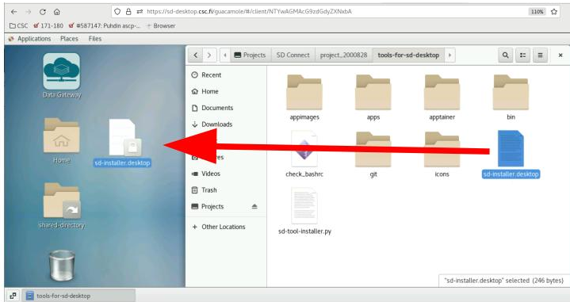

# Backup server for SD Desktop

For security reasons only the Project Manager can export data from SD Desktop. Thus, normal SD desktop users can not 
make backup copies of the data that they have in SD Desktop. This tutorial demonstrates the usage of `backup_server.sh` 
process and `sd-backup` commands that provide a way for SD Users to back up their data to SD Connect.

## Installation 

The tools for running backup process are not by default installed in SD Desktop Virtual Machines. Thus, the first step is that the 
manager installs the **SD Backup tool** package using the [SD software installer](./sd-software-installer.md). 

Log in to your SD Desktop and open **Data Gateway**. If the software installation help tools are enabled for your project, then you should have folder: 
`tools-for-sd-desktop` included in the directory that Data Gateway created (in `Projects/SD-Connect/your-project-name`). If you don't find `tools-for-sd-desktop` 
directory through Data Gateway **send a request to [CSC Service Desk](../../../support/contact.md)**. In the request, indicate that you wish that the SD Desktop software installation help tools would 
be made available for your project. You must also include to the message the **Project identifier string** of your project.
You can check this random string for example in the [SD Connect service](https://sd-connect.csc.fi). There you find the 
Project Identifier in the **User information** view.

Open `tools-for-sd-desktop` folder and from there, drag/copy file `sd-installer.desktop` to your desktop.

[](../images/desktop/sd-installer1.png)

**Figure 1.** Copying `sd-installer.desktop` file to SD desktop.
 
Double-click the copy of `sd-installer.desktop` to start the software installation tool. Use this tool to install _SD Backup_ tool
to your SD Desktop virtual machine if you have not yet done so. 

## Project Mangers Starts backup server

When the SD Backup tool is installed, the Project Manager should start a new terminal session and there start a virtual terminal session with command:

```text
screen
```

and then launch the backup process with command:

```text
sd-backup-server.sh
```

When launched, `sd-backup-server.sh` asks for the CSC password of the Project Manager.

After that the project manager can leave the virtual session running in background by pressing:
`Ctrl+a+d`.

This way the `sd-backup-server.sh` command remains active in the virtual terminal session even when the connection to SD Desktop is closed.

The actual server process is very simple. It checks the content of the backup directory once in a minute and moves the contents of this directory 
to a bucket in SD Connect. The data is encrypted with CSC public key so that the backups can be used only in SD Desktop environment.
The default backup directory is `/shared-data/auto-backup` and target bucket in SD Connect is `sdd-backup-<virtual-machine-name>`. 

Note that the server is not able to check if the given password was correct. If a wrong password was given then backup requests will fail. 
Thus, it may be good to test the backup process once the server is running.

## Doing backups

When the backup server is running, all users of the VM can use command `sd-backup` to make a backup copy of the dataset to SD Connect.
The syntax of the `sd-backup` command is:

```text
sd-backup file.csv
```

or

```text
sd-backup directory
```

The command copies the given file or directory to the backup directory from where the server process is able to move it to SD Connect.
In SD Connect a timestamp is added to the file name in order to make the file name unique. In addition, a metadata file is
created. This file contains information about the user who requested the backup, original host and location of the file. If backup is done for 
a directory, then the content of the directory is stored as one tar-archive file and the metadata file will contain list of the backed-up files. 
 
For example, for a file called `my_data.csv` that locates in SD Desktop virtual machine called `secserver-1683868755`, a backup command:

```text
sd-backup  my_data.csv
```

Will create a backup file that will be available through Data Gateway in path:

```text
Projects/SD-Connect/project_number/sdd-backup-secserver-1683868755/my_data.csv-2023-05-15-07:41
```

Note that you have to refresh the Data Gateway connection in order to see the changes in SD Connect.
