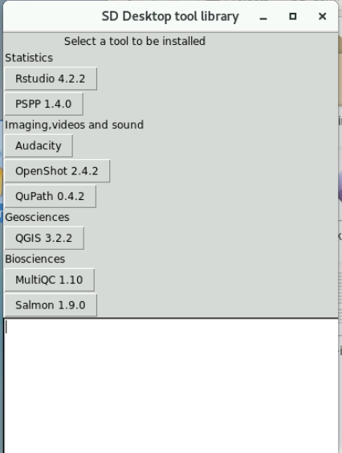

# SD Desktop Software Installer

As SD desktop virtual desktops are isolated from internet, installing additional software and libraries 
to your virtual desktop is not straight forward. Adding extra software is possible, but it requires that 
you convert the installation processes into files that can be uploaded to SD Connect and from there 
copied to your SD Desktop environment for installation and usage.

In general, we recommend using Apptainer containers for importing the software you need.

To make additional software installations easier, CSC has created a **SD Software Installer** tool,
that provides an easy way to add few commonly used software packages and help tools to your virtual desktop. 
This document describes the usage of this tool.

<iframe width="512" height="288" srcdoc="https://www.youtube.com/embed/S4hpjPy-TDQ" title="How to install software on SD Desktop" frameborder="0" allow="accelerometer; autoplay; clipboard-write; encrypted-media; gyroscope; picture-in-picture; web-share" allowfullscreen></iframe>

## Requirements

In order to get access to the installation tool, you need to **[send a request to CSC Service Desk](../../../support/contact.md)**.
In the request, indicate that you wish that the SD software installer would be 
made available for your project. You must include the **Project identifier string** of your project to the request.
You can check this 32 characters long random string for example in the [SD Connect service](https://sd-connect.csc.fi). 
There you find the Project Identifier in the **User information** view. 

## Installing the SD Software Installer

Log in to your SD Desktop and open **Data Gateway**. If the software installation help tools are enabled for your project,
then you should have folder `tools-for-sd-desktop` included in the directory that Data Gateway created 
(in `Projects/SD-Connect/your-project-name`).

Open `tools-for-sd-desktop` folder and from there, drag/copy file `sd-installer-centos7.desktop` or `sd-installer-ubuntu22.desktop` to your desktop.
Select the version that matches the operating system of your SD Desktop.

**Figure 1.** Copying `sd-installer.desktop` file to SD desktop.
 
Double-click the copy of the installer tool in your desktop to start the software installation tool. In Ubuntu based virtual desktops you
need to right-click the and select _Allow Launching_ before you can use the installer.

**Figure 2.** SD Software installer

## Usage

In order to use the installer, you must have an active Data Gateway connection running and 
mounting of the SD Connect data should be done through the default location in the file system 
(_Projects_ directory in the users home directory). 

The installer shows a panel of buttons that allow you to install a software by just clicking the button.
The available software include graphical and command line applications. For graphical applications, a launching icon is added 
to the desktop. All software is installed to directory `/shared-directory/sd-tools/` where the installation is available for all the
users of the virtual desktop.

In case of some applications, part of the installation process occurs only when the application is started for the first time.
Thus, you should start the application once after the installation, to make sure that the process is completed. After that
the installed software should work also when Data Gateway connection has not been opened.

## Tool selection

Notes about the available tools. Note that this list may be outdated:

### Statistics
*  [Rstudio 4.2.2](../r-in-sd-desktop.md) R statistics tool with graphical user interface and help tools for adding libraries.
    *  After installation, right-click the Rstudio desktop icon and select: _Allow launching_.
*  [PSPP](https://www.gnu.org/software/pspp/) Open Source alternative for SPSS statistics tool.
    *  After installation, right-click the PSPP desktop icon and select: _Allow launching_.

### Imaging and videos
*  [Audacity](https://www.audacityteam.org/). Sound editor.
    *  After installation, right-click the Audacity desktop icon and select: _Allow launching_.
*  [ELAN 6.7](https://archive.mpi.nl/tla/elan/). Annotation tool for audio and video recordings.
    *  After installation, right-click the ELAN desktop icon and select: _Allow launching_.
*  [OpenShot 3.1.1](https://www.openshot.org/). Video editor.
    *  This tool works only in Ubuntu22 based virtual desktops.
    *  After installation, right-click the OpenShot desktop icon and select: _Run as a program_.
*  [QuPath 0.4.2](https://github.com/qupath/qupath/). Software for bioimage analysis.
*  [Whisper](whisper.md) Automatic speech recognition.
  
### Geosciences
*  [QGis 3.1.1](https://qgis.org/en/site/) A Free and Open Source Geographic Information System. 
    *   [QGis at CSC servers](../../../apps/qgis.md)

### Biosciences
*  [GATK](https://gatk.broadinstitute.org/hc/en-us) A genomic analysis toolkit focused on variant discovery.
*  [GCTA 1.94.1](https://yanglab.westlake.edu.cn/software/gcta/#Overview) A tool for Genome-wide Complex Trait Analysis.
*  [GCTB 2.05b](https://cnsgenomics.com/software/gctb/#Overview) Genome-wide Complex Trait Bayesian analysis
*  [IGV 2.16.2](https://igv.org/doc/desktop/) Integrated Genomics Viewer.
    *  After installation, right-click the IGV desktop icon and select: _Allow launching_.
*  [MultiQC 1.10](https://multiqc.info/) NGS Read quality checking tool.
*  [PRSice 2.0](https://choishingwan.github.io/PRSice/) Polygenic Risk Score software for calculating, applying, evaluating and plotting the results of polygenic risk scores (PRS) analyses.
*  [Regenie 3.3](https://rgcgithub.github.io/regenie/) Program for whole genome regression modelling of large genome-wide association studies.
*  [Salmon 1.9.0](https://combine-lab.github.io/salmon/) Program to produce transcript-level quantification estimates from RNA-seq data.
    *   [Salmon 1.9.0 at CSC servers](../../../apps/salmon.md)
   

### Miscellaneous
*   [auto-apptainer](./auto-apptainer.md) Tool to add command line applications using the Apptainer container library provided by CSC.
*   [add-python-lib](./sd-pythonlibs.md) Help tool to add Python libraries.
*   [Crypt4gh-gui](../sd-connect-upload-for-analysis.md#sensitive-data-encryption-and-upload-for-analysis-up-to-100-gb) Encryption tool.
*   [Backup tool](./backup_sd_desktop.md) Help tool to automatize backup and export in SD Desktop.
*   [VS Code 1.90.2](./vscode.md) Code editor.
    *  After installation, right-click the VS Code desktop icon and select: _Allow launching_.
*   [WEKA 3-8-6](https://ml.cms.waikato.ac.nz/weka/index.html)

