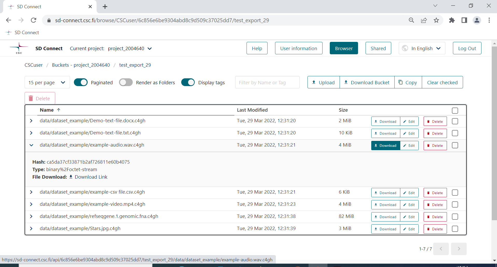

## Data download and decryption


<iframe width="280" height="155" srcdoc="https://www.youtube.com/embed/SQJ8QEKV7BE" title="YouTube video player" frameborder="0" allow="accelerometer; autoplay; clipboard-write; encrypted-media; gyroscope; picture-in-picture" allowfullscreen></iframe>

You can easily download entire buckets or single encrypted files from the SD Connect _Browser page_ by clicking on _download_. 

Next, you can decrypt the data using the Crypt4GH application and your secret encryption key. Unfortunately, it is currently only possible to single files. However, we are working on adding this option and integrating it with the SD Connect user interface.

1- Open the Crypt4GH application and click on _load Your Private Key_.

2- Click on _Select File_ and upload the file you want to decrypt.

3- Click on _Open_.

4- Next, click on _Decrypt File_.

5-The tool will ask you to write the secret key's password. Press _ok_. 

The secret key must match the public key used to encrypt the data.
In the case of decryption, adding the public key is not mandatory, but if you have the public key of the person who has encrypted the file, you can use it to verify the encryption signature. If you don't select a public key, the activity log will display the following (the decryption will be executed anyway):

```
Sender public key has not been set, authenticity will not be verified.
```

If your decryption runs successfully, the activity log will display the following:

```
Decrypting.....

Decryption has finished

Decrypted file: C:/users/username/exampledirectory/examplefile
```




The decrypted file will no longer display the .c4gh extension and will be saved in the same folder from which the original file was uploaded.  

