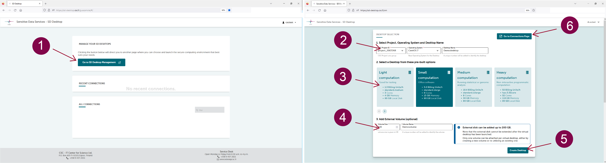

### Creating your virtual desktop

<iframe width="280" height="155" srcdoc="https://www.youtube.com/embed/t6xXKPTB6H0" title="YouTube video player" frameborder="0" allow="accelerometer; autoplay; clipboard-write; encrypted-media; gyroscope; picture-in-picture" allowfullscreen></iframe>

Once you have access to the service, you can create your virtual desktop, choosing between four pre-built options (Light, Small, Medium, or Heavy computing). This operation can be carried out with a few simple steps and does not require any technical expertise. The services will automatically start your virtual desktop (or, in technical terms: launch a virtual machine) and create a secure connection between CSC and your browser. After this operation, your virtual desktop will be directly available whenever you log in to the service and it will consume billing units (or resources) from your CSC project until it is paused or deleted.

Each CSC project supports the launch of up to three virtual Desktops. In addition, each desktop supports the simultaneous connection of 10 project members. Therefore, all project members can connect to the virtual desktop and access the data stored in your project. Furthermore, all the desktops are provided with the same open-source software (pre-installed and managed by CSC). The complete and updated list of the software can be found in the following paragraph.

To start your virtual desktop, log in to the services and on the _Connection_ page, click on _Go To SD Desktop Management_. 

Here you can specify several parameters:

1. _Select CSC project, operating system and desktop name_.
Currently, the only available operating system is Linux CentOS 7. It is good practise to assign a descriptive name for a Desktop so that all project members can quickly identify it later on.

2. _Select a desktop from the pre-built options_. Based on the computing needs, choose one of the pre-built options (Light, Small, Medium, or Heavy computing).

3. _Add external volume (optional)_. Each desktop's default disk space is 80 GB. With this option, you can extend the disk space up to 200 GB, adding an external volume where you can save your files. You can add a new volume by selecting the  _Volume size_  and adding a name in the field _Volume name_. **It is a good practice to save a copy of your analysis or important file on the volume that can also have a backup function in case the virtual desktop becomes unresponsive.** Note: you can't extend the disk space after you have created the virtual desktop. Additional disk space can be requested by writing to servicedesk@csc.fi (subject: Sensitive data). 
You can detach and attach a volume from your virtual desktop. This operation corresponds to connecting or disconnecting a hard drive to your laptop and is availale only on desktops created after February 2023. For more informations see: [Managing volume and desktops](./sd_desktop.md#managing-volumes-and-virtual-desktops).

4. Finally, press on _Create desktop_. The operation is entirely automated and can take up to 30 minutes. If you try accessing the virtual desktop during this process, an error message will be displayed asking you to return later.

You can choose between four different pre-built virtual desktop options:

*  **Light computation**. Technical specifications: _Core: 3; memory 4 GiB; Root disk: 80 GB; Correspondent Pouta Flavour: standard.medium; Billing Units: 1.3 units/h_. This option is ideal for testing the services (for example: starting a virtual desktop, accessing data stored in SD Connect, and deleting the desktop). For this reason, we advise you to start this option only for testing purposes and delete it when the testing is completed. 

* **Small computation**. Technical specifications: _Core: 6; memory 15 GiB; Root disk: 80 GB; Correspondent Pouta Flavour: standard.xlarge; Billing Units: 5.2 units/h_. This option is ideal for analyzing sensitive data using office software (similar to simple statistical analysis using spreadsheets, watching videos, listening to audio files, and working on text files). You can compare this desktop to your laptop. 

* **Medium computation**. Technical specifications:_Core: 8; memory 30 GiB; Root disk: 80 GB; Correspondent Pouta Flavour: standard.xxlarge; Billing Units: 10.4 units/h**_. This option is ideal for running complex statistical or genome analysis (for example: using the command line to run specific scripts). You can compare this desktop to a powerful laptop provided by your organization's  IT unit. 

* **Heavy computation**: Technical specifications: _Core: 32; memory 116 GiB; Root disk: 80 GB; Correspondent Pouta Flavour: hpc.5.32core; Billing Units: 52 units/h_. This option is ideal for running non-interactive programmatic analysis (machine learning) that requires heavy computation. Please do not choose this option for simple analysis, as it consumes a considerable amount of resources. 

!!! Note
    For support in choosing the correct desktop option for your needs, don't hesitate to contact us at servicedesk@csc.fi (email subject: Sensitive data). 

The following paragraphs will discuss how to work with your virtual desktop, which software is available, and how to customize your workspace.

### Working with your virtual desktop

<iframe width="280" height="155" srcdoc="https://www.youtube.com/embed/EhuAYNLS90g" title="YouTube video player" frameborder="0" allow="accelerometer; autoplay; clipboard-write; encrypted-media; gyroscope; picture-in-picture" allowfullscreen></iframe>

Once a virtual desktop has been created, each CSC project member can securely access it from their browser.

When you log in to SD Desktop **Homepage**,  you will be able to access your virtual computing environment from:

* **Recent connections**. Click on your desktop's image (visible only if recently accessed).

* **All connections**. Click on + next to the CSC project ID (e.g. project_NNNNN): this allows you to view and access all the desktops associated with the project (desktopname-NNNNNNNNNN) via a secure connection. 

When you open the connection, a virtual computing environment (Linux Centos operating system) will open in your browser. If you are accessing the virtual desktop for the first time, you will see the *Getting started*-panel, from which you can, for example, adjust the screen resolution.

You can work with the desktop like in a standard computing environment, accessing several pre-installed programs from the *Applications*-menu (top left corner). Examples include Open Office, image viewing applications, video and audio players, Jupiter Notebook etc. You can also open a terminal and use Linux from the command line. For more information on accessing R-Studio, please check the paragraph below.

Security-related features of SD Desktop include:

1. The computing environment (visible from your browser) is isolated from the internet. You can, for example, open a Firefox web browser but not access any site online. At this moment, you will also not be able to access any repositories directly.

2. You can access or import files into the computing environment only using the *Data Gateway* application (see below for more information);

3. Unencrypted files are not visible via the SD Desktop service. You can access and visualize only encrypted files (uploaded to CSC using SD Connect or encrypted programmatically with the service's public encryption key). 

4. The copy-paste function from your computer/laptop to the secure desktop is entirely disabled for security reasons. However, you can use this function inside the virtual desktop.

5. Only files saved in the shared-directory or the external volume are accessible to all project members via the virtual desktop. 

You can close the connection to your virtual desktop in two ways:

1. _Log out_ from the desktop (in the workspace view, top right corner of the browser, select your _username_ and _log out_). This will close all applications and disconnect the work session. You can access the same desktop anytime after logging in to the services.

2. If you initiated an analysis programmatically (running a script), you can close the browser window. This doesn't interfere with the processes running. Thus, when you reconnect to your desktop, all your tools and interfaces are still open and you can continue working. However, log out from the desktop once the analysis is finished. If you leave more than ten connections open, you will be unable to re-access the services. 

!!! Note
    SD Desktop only supports ten simultaneous connections. You will be automatically logged out from the virtual desktop if a connection has been left active for two days.
 
 
 

     

