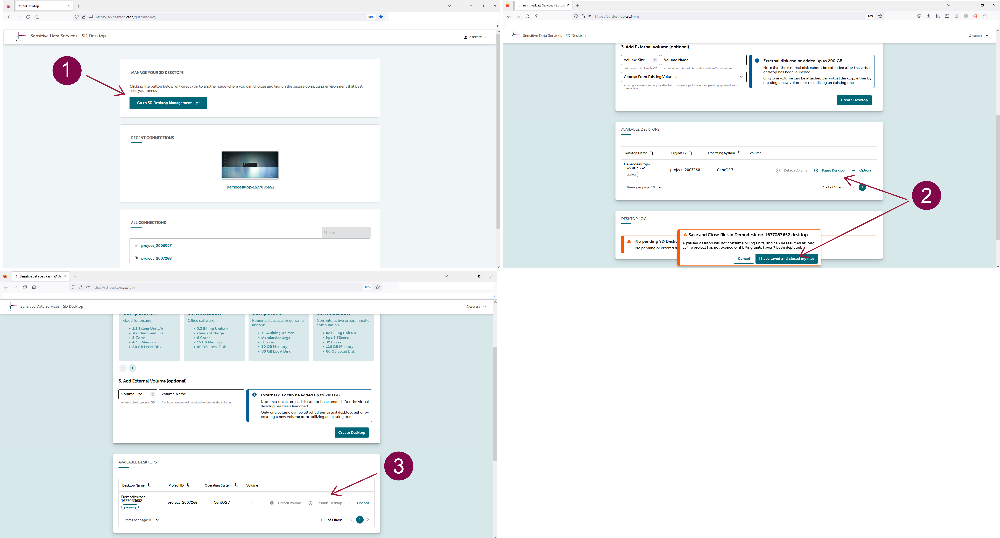

## Managing volumes and virtual desktops

With the SD Desktop service, you can easily manage volumes and pause, reboot, rebuild or delete your virtual desktops. Below we illustrate the main available options. 

!!! Note
    These options are available only on virtual desktops created after February 2, 2023. Please contact us at servicedesk@csc.fi if you are working with older desktops. 

### Detaching and reattaching a volume 

With the option  _Detach volume_, you can easily disconnect a volume from your virtual desktop. The volume and its content will be stored in the same CSC project where it was initially created. You can compare this operation to disconnecting or attaching a hard drive to your laptop.

To detach a volume from your virtual desktop:

1. Save and close all the files on the volume to prevent data corruption and log out from the virtual desktop.

2. From SD Desktop homepage, click on  _SD Desktop management page_.

3. Here, under _Available desktops_ choose the correct virtual desktop, and in the same raw, on the right side, click on _Detach volume_.
A message will ask to confirm the operation.

When you want to access the data saved in the detached volume, you can reattach it to a new desktop:

1. From the SD Desktop homepage, click on  _SD Desktop management page_.

2. Under _Desktop selection_  choose the necessary options (CSC project, operating system etc). 

3. Under _Add External Volume (optional)_ click inside _Choose from existing volumes_. The user interface will visualize available volumes stored in the same CSC project. Note: do not click on the options _volume size_ or _volume name_. 

4. Click on _Create desktop_

Limitations:

- A detached volume can not be reattached to an existing virtual desktop, only to new virtual desktops during creation phase. 

- The content of a detached volume can not be accessed or deleted.

- To delete or access the volume content, attach it to a desktop with the same operating system during the desktop creation phase. 

- Volumes can not be moved or transferred between CSC projects for security reasons.

### Pausing or restarting a virtual desktop

You can pause a virtual desktop. In this manner, the desktop will stop consuming billing units. 

To pause the desktop:

1. Close all the programs, save/close all the files, and log out from the virtual desktop to prevent data corruption.

2. On the SD Desktop homepage, click on _Go To SD Desktop Management_;

3. Here, under _Available desktops_  select the correct virtual desktop, and in the same raw, on the right side, click on _Pause desktop_. Note: you can not detach a volume or access a paused desktop. 

4. A message will ask to confirm the operation, which can take up to 30 minutes.

You can restart the virtual desktop at any time from the same page. Also, in this case, the restart processes can take up to 30 minutes. 

!!! Note
    This option is available only for active CSC projects with available billing units. 

### Rebooting or rebuilding a desktop

If the virtual desktop or software has become unresponsive, you can use this option to reboot (or restart) your desktop. All the files/ software saved on the virtual desktop will remain available after the reboot. 

!!! Note
    You don't need to reboot your desktop if the Data Gateway application becomes unresponsive (for example, because old sessions are still running in the background). Instead, you can use the terminal to check the ID number of the running process and stop it. Contact us at servicedesk@csc.fi (subject: Sensitive data) for support. 

To reboot a virtual machine:

1- Close all the programs, save/close all the files and log out from the virtual desktop to prevent data corruption.

2-  On the SD Desktop homepage, click on _Go To SD Desktop Management_;

3- Here, under _Available desktops_  select the correct virtual desktop, and in the same raw, on the right side, click _Options _ and select _Reboot_.

4- A message will ask to confirm the operation, which can take up to 30 minutes.

If the virtual desktop or software has become obsolete, you can use this option to rebuild your virtual desktop. 

!!! Note
    This operation will delete all the files/software or scripts imported into the virtual desktop, and you will delete the entire virtual workspace. Only       the files saved in the volume will still be available. Please contact us at servicedesk@csc.fi before using this option.

To reboot a virtual desktop:

1. On the SD Desktop homepage, click on _Go To SD Desktop Management_;

2. Here, under _Available desktops_  select the correct virtual desktop, and in the same raw, on the right side, click on _Options _ and select _Rebuilt_.

3. A message will ask to confirm the operation, which can take up to 30 minutes. 

 

### Deleting a desktop

At the end of your analysis, you can delete your virtual desktop, including the external volume and all files saved in it. You cannot undo this action:

1- On SD Desktop Homepage, click on _Go to SD Desktop Management page_.

2- Under _Available desktops_  select the correct virtual desktop.

3- On the same raw, on the right side, click on _Options_ and on _Delete_.

!!! Note
    Please contact all the project members before deleting a virtual desktop. With this action, you will delete the entire workspace, including all files saved in the virtual desktop or external volume by other project members. 

 

