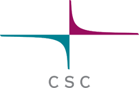

<h1> CSC's data management and computing environment user guide</h1>

Work in progress, migration of content from [research.csc.fi/guides](https://research.csc.fi/guides) is underway.

| [Accounts](accounts/index.md) | [Connecting](connecting/index.md) |
  [Computing](computing/index.md) | [Cloud](cloud/index.md) | [Data](data/index.md) | [Applications](apps/index.md) |  [Support](support/index.md)

 

A collection of topical issues, like how to get started with Puhti and Allas will appear
on this page.