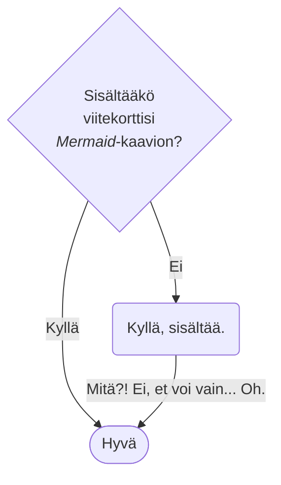

---
search:
  boost: 0.1
---

# Viitekortti

!!! default "Dokumentaatio"

    Docs CSC perustuu [_Material for MkDocs_](https://squidfunk.github.io/mkdocs-material/){ target=_blank }. Huomaa, että jotkin ominaisuudet eivät välttämättä ole käytettävissä Docs CSC:ssä ([katso alla](#available-features)).

!!! info "Vinkki pro-tason käyttäjille"

    Koska [Material for MkDocs -ohjeistus](https://squidfunk.github.io/mkdocs-material/reference/){ target=_blank } on itsessään toteutettu Material for MkDocsilla, voit selailla sitä ideoiden saamiseksi siihen, miten esittää dokumentaatiosi Docs CSC:ssä. Näet tietyn dokumentaation sivun Markdown-lähdekoodin napsauttamalla "view" -ikonia :material-file-eye-outline: sivun oikeassa yläkulmassa (sama koskee Docs CSC:tä, paitsi että täällä meillä on nykyisin vain "edit" -ikoni :material-pencil:). Lisäksi voit esimerkiksi

    - [Etsiä käytettävissä olevia ikoneita ja emojeita](https://squidfunk.github.io/mkdocs-material/reference/icons-emojis/#search)
    - Katsoa, kuinka he esittävät ominaisuuden tai konfiguraatiokohdan käytön tuloksen. Esimerkiksi, [välilehtivertailu kuvan "align"-ominaisuuden muuttamisen tuloksen osalta](https://squidfunk.github.io/mkdocs-material/reference/images/#image-alignment) (napsauta :material-file-eye-outline: nähdäksesi lähteen)
    - Saada käsityksen siitä, onko jokin ominaisuus käytettävissä Docs CSC:ssä vertaamalla nykyistä konfiguraatiota [_mkdocs.yml_](https://github.com/CSCfi/csc-user-guide/blob/master/mkdocs.yml) asiakirjaan, joka käsittelee ominaisuuden käyttöön ottoa](https://squidfunk.github.io/mkdocs-material/reference/content-tabs/#configuration)
    { id=available-features }

Tämä sivu sisältää joitakin elementtejä, jotka ovat käytettävissä Docs CSC:ssä. Esimerkiksi täällä on jonkin verran rungon tekstiä [ulkoinen linkki](https://example.com){ target=_blank }. **Osa siitä on lihavoitua**, *osa kursivoitua*. `Osa saattaa olla monospacea`. Joitain lyhenteitä, kuten HPC, määritellään automaattisesti (katso: [Sanasto](#glossary)). Yksi pieni lisäys: <small>Pientä tekstiä.</small>

Kuten tässä näkyy:
joissain tapauksissa [ulkoiset linkit](https://example.com){ target=_blank } tekstin jälkeen _kursivoituna_
käyttäen alaviivoja tuottavat ei-toivottuja tuloksia. Kursivoi *kursiivilla* sen sijaan.

> Nyt on jopa tekstiä blockquotessa. Blockquotea seuraa vähän täytetekstiä tyhjän rivin jälkeen. Kutsun sitä mielikuvituksessani kirjoituskoneen uneksi.
>
> Vel suscipit quia voluptates quis. Rerum sequi voluptatem in non ipsam tempora quod natus. Soluta
perferendis illo saepe sint ipsa vitae provident non. Et qui quaerat et rerum libero officia omnis
enim. Laboriosam autem vel vel aut quod.

Tässä viitataan alaviitteeseen:[^1]

Ja tässä viitataan toiseen alaviitteeseen:[^2]

Sitten&mdash;yleisenä sääntönä&mdash;vaakasuora viiva:

---

## Bannerit {#banners}

Etusivulle voidaan lisätä banneri esimerkiksi kurssin mainostamiseksi. Banneraan hallitaan `extra.landing_banner`-määritteen kautta _mkdocs.yml_-tiedostossa. Kuva tiedostossa _docs-files_ Allas korissa tulisi sijoittaa _banners/_ alle.

- `path:` _Älä koske!_
- `image:` Kuvan tiedostonimi _docs-files/banners/_ Allas korissa.
- `title:` Näkyy esimerkiksi työkaluvihjeenä, kun osoittaa kuvaa hiiren osoittimella.
- `link:` URL, lisätietoja tai esimerkiksi kurssi-ilmoittautumissivu.
- `description:` Lyhyt kuvaus bannerista. Tärkein esteettömyyden vuoksi, kuten ruudunlukuohjelmille.
- `visible:` Aseta `true` tai `false`, jotta banneri näkyy tai ei.

=== "mkdocs.yml"

    ```yaml
    extra:
      # ...
      landing_banner:
        path: https://a3s.fi/docs-files/banners/ # Sijoita kuvatiedosto tähän koriin; älä koske tähän arvoon.
        image: example-banner.png
        title: Esimerkki banneri nyt näkyy laskeutumissivulla
        link: https://example.org/courses/example-course/
        description: |-
          Banneri tulevaa esimerkkikurssia varten.
          Toisen rivin esimerkkikuvaus.
        visible: true
    ```

    <div class="result" markdown>

    

    </div>

=== "Näytä/piilota"

    Näyttääksesi/piilottaaksesi bannerin, käännä `extra.landing_banner.visible` `false`-tilasta `true`-tilaan (ja _päinvastoin_):

    ```yaml
    extra:
      # ...
      landing_banner:
        # ...
        visible: false
    ```

    <div class="result" markdown>

    

    </div>

## Sanasto

HPC:hen liittyvä sanasto, jossa lyhenteet korostetaan automaattisesti. Esimerkiksi: CPU, GPU, QPU jne. Lyhenteet määritellään markdown-tiedostossa
_csc-overrides/assets/snippets/glossaries/hpc.md_. Lisää lyhenteitä (kirjainkokoherkkiä) voidaan lisätä sinne tai toiseen
markdown-tiedostoon, esimerkiksi näin:

=== "toinen_sanasto.md"

    ```markdown
    *[GNU]: GNU's not Unix!
    *[DFT]: 1. Diskreetti Fourier-muunnos, 2. Tiheysfunktionaaliteoria
    ```

=== "mkdocs.yml"

    ```yaml
    markdown_extensions:
    - ...
    - pymdownx.snippets:
        base_path: csc-overrides/assets/snippets
        auto_append:
        - glossaries/hpc.md
        - glossaries/another_glossary.md
    - ...
    ```

Sanasto on myös katseltavissa sivuna osoitteessa [docs.csc.fi/sanasto](support/glossary.md).


## Otsikot {#headings}

Otsikko Otsikoihin liittyen on tason 2 otsikko. Muista käyttää vain yhtä tason 1 -otsikkoa sivullasi ja säilytä otsikkohierarkia ehjänä. Älä ohita tasoja.

```markdown
### Tämä on tason 3 otsikko

Tämä on tason 3. Tässä on tekstiä sen alla.


#### Nyt tason 4 otsikko

Jotain tekstiä _täällä_.


##### Tasolla 5 otsikko: `nyt lisätty monospace`

Ei tekstiä tällä kertaa.


###### Taso 6

Lisää tekstiä tulossa seuraavassa Tekstissä.
```

<div class="result" markdown>

### Tämä on tason 3 otsikko

Tämä on tason 3. Tässä on tekstiä sen alla.


#### Nyt tason 4 otsikko

Jotain tekstiä _täällä_.


##### Tasolla 5 otsikko: `nyt lisätty monospace`

Ei tekstiä tällä kertaa.


###### Taso 6

Lisää tekstiä tulossa seuraavassa Tekstissä.

</div>


## Teksti {#text}

Lorem ipsum dolor sit amet, consectetur adipiscing elit. Vestibulum nulla ex, elementum ultrices
tempor quis, commodo sit amet quam. Sed accumsan placerat nunc. Suspendisse elementum augue et est
tempor lacinia. Pellentesque vel ante id nunc luctus euismod id non est. Vivamus porttitor dui et
porta maximus. Sed quis orci finibus, feugiat orci vitae, luctus nisl. Praesent lorem turpis,
tristique id lacus sed, sollicitudin ultricies velit. In maximus ante massa, in ullamcorper eros
IaaS fermentum in. Nulla condimentum urna sit amet leo scelerisque, et iaculis odio iaculis. Donec
quis tortor non metus tincidunt placerat. Curabitur rhoncus libero ut augue scelerisque varius.
Nunc bibendum sit amet nisi in varius. Nullam eu eros elementum, pellentesque nisl non, laoreet
felis. Ut et risus enim. Proin tempor tellus eu commodo blandit. Interdum et malesuada fames ac
ante ipsum primis in faucibus.

Nam erat dui, ullamcorper sit amet erat nec, interdum posuere diam. Nam aliquet gravida hendrerit.
Sed erat justo, feugiat sollicitudin scelerisque id, luctus sit amet velit. Sed suscipit at nisi eu
ornare. Nam in mauris ex. In ut sagittis nibh, eleifend pharetra tortor PaaS. Integer sapien
tortor, ullamcorper ac diam ut, vehicula mattis augue. Pellentesque a enim eget est ornare
ullamcorper vitae nec mi. Quisque quis congue augue, eu aliquam tortor. In risus lectus, pharetra
eu fermentum non, gravida volutpat magna. Morbi in congue erat.

Donec a est quis nulla scelerisque cursus ut vitae ligula. In risus felis, finibus et tortor eu,
volutpat efficitur turpis. Praesent vitae vulputate dolor, at posuere urna. Aenean ullamcorper orci
sit amet purus tincidunt, id vehicula lectus aliquet. Ut auctor dapibus magna at hendrerit. Nam
lobortis convallis lacus blandit tempus. Proin et ex ut dolor vehicula suscipit a vitae nisi. Nam
feugiat accumsan purus, sit amet efficitur felis. Integer vitae enim eu massa placerat faucibus
eget vel ipsum. Nullam tincidunt, sapien at blandit pulvinar, lacus mauris finibus turpis, sit amet
suscipit magna tortor sit amet tortor. Ut tortor neque, convallis non volutpat a, pharetra nec
sapien. In in congue nisl, quis egestas nisi. Fusce ut orci luctus sem tincidunt malesuada.
Pellentesque id consequat tortor, sed egestas metus. Phasellus sed venenatis purus, in dapibus
magna SaaS. Cras interdum ornare risus, a condimentum magna lacinia eget. Morbi dapibus elementum
massa et ultrices. Nulla vel lobortis ex. Ut egestas posuere odio, sit amet mollis lacus placerat
at. Quisque ut laoreet purus. Etiam id consectetur ipsum. Phasellus lectus ante, scelerisque in
nunc a, vulputate efficitur nunc. Suspendisse nec nisi ut massa mattis interdum vel eget orci.
Aenean porttitor erat nulla. Vivamus ac urna et orci faucibus pharetra. Integer in urna tincidunt,
tempor turpis nec PaaS, malesuada justo. Vivamus ornare sem ut mi ultricies fringilla. Ut in semper
diam, vitae porta neque. Donec maximus tellus et orci bibendum hendrerit. Ut ut consectetur magna.
Aliquam vel rhoncus elit. Praesent vitae tincidunt urna, et pulvinar orci. Phasellus auctor augue
eu sagittis fermentum. Nullam tempus malesuada augue, nec volutpat mi sodales quis. Vivamus mollis
commodo eros sed porta. Praesent ultrices elementum metus, sit amet fringilla turpis luctus vitae.
Mauris turpis felis, molestie eget ipsum ac, fringilla euismod risus. Phasellus at arcu ante. Cras
eu enim dui. Quisque eu hendrerit magna. Donec ac elit laoreet, mattis tortor et, feugiat nisl.
Duis maximus ultrices elit, quis hendrerit orci.

## Luettelot {#lists}

```markdown
### Järjestämätön luettelo

Tässä on järjestämätön luettelo:

- Siinä on yksi kohta
- Toinen kohta
- Ja vielä yksi kohta


### Järjestetty luettelo

Tehdään järjestetty luettelo:

1. Kohta luettelosta
1. Toinen kohta
1. Vielä kolmas kohta
```

<div class="result" markdown>

### Järjestämätön luettelo

Tässä on järjestämätön luettelo:

- Siinä on yksi kohta
- Toinen kohta
- Ja vielä yksi kohta


### Järjestetty luettelo

Tehdään järjestetty luettelo:

1. Kohta luettelosta
1. Toinen kohta
1. Vielä kolmas kohta

</div>


## Lähdekoodi {#source-code}

````text
```python hl_lines="2 3"
# Tässä on laatikko, jossa on syntaksivalaistusta Pythonia

from somewhere import some_code


NUMBER = 42
LIST = [1, 2, 'three']


class PythonClass:
    def __init__(self) -> None:
        self.__property = 'A string property'

    @property
    def property(self) -> str:
        return self.__property

    @staticmethod
    def method(parameter: int = 1) -> list[None]:
        return [None] * (parameter + NUMBER)

def main():
    string = f'Length of list is {len(LIST)}.'
    print(string)
```
````

<div class="result" markdown>

```python hl_lines="2 3"
# Tässä on laatikko, jossa on syntaksivalaistusta Pythonia

from somewhere import some_code


NUMBER = 42
LIST = [1, 2, 'three']


class PythonClass:
    def __init__(self) -> None:
        self.__property = 'A string property'
    
    @property
    def property(self) -> str:
        return self.__property

    @staticmethod
    def method(parameter: int = 1) -> list[None]:
        return [None] * (parameter + NUMBER)

def main():
    string = f'Length of list is {len(LIST)}.'
    print(string)
```

</div>

Huomaa linjan korostaminen (riveillä 2 ja 3). Lisäksi koodilaatikoilla voi olla otsikko:

````text
```javascript title="looong_comment.js"
// Tässä on JavaScript-kommentti, joka sisältää erittäin pitkiä rivejä. Tiedätkö, testitarkoituksiin. Kerrotaanpa se vielä hieman pidemmäksi.
```
````

<div class="result" markdown>

```javascript title="looong_comment.js"
// Tässä on JavaScript-kommentti, joka sisältää erittäin pitkiä rivejä. Tiedätkö, testitarkoituksiin. Kerrotaanpa se vielä hieman pidemmäksi.
```

</div>

Diff toimii myös:

````text
```diff
-Lähtemässä
+Saapumassa
```
````

<div class="result" markdown>

```diff
-Lähtemässä
+Saapumassa
```

</div>

Muista jättää tyhjä rivi ` ``` `-merkin jälkeen lähdekoodilaatikkoon. Jos et tee niin, mikä tahansa välittömästi seuraava teksti saattaa jäädä "löyhän", eli HTML-kappaleen (`<p>`) ulkopuoliseksi tekstiksi.


## Taulukot {#tables}

```markdown
| Tämä | Taulukko | Sisältää | Viisi | Saraketta |
|-|-|-|-|-|
| ja | | | | |
| | se | | | |
| | | sisältää | | |
| | | | viisi | |
| | | | | riviä |
```

<div class="result" markdown>

| Tämä | Taulukko | Sisältää | Viisi | Saraketta |
|-|-|-|-|-|
| ja | | | | |
| | se | | | |
| | | sisältää | | |
| | | | viisi | |
| | | | | riviä |

</div>


## Huomautukset {#admonitions}

### Varmuuskopiointityyli

```markdown
!!! note "Tässä on tärkeä ilmoitus"

    Varmista, että luet tämän huomautuksen tärkeän näköisestä laatikosta, sillä tämä on varmuuskopio tuntemattomille tyyppimaakareille.

    Tyyppimaakari voi olla mitä tahansa, kunhan se ei ole
    `default`,
    `default-label`,
    `info`,
    `info-label`,
    `warning`,
    `warning-label`,
    `error`,
    `error-label`,
    `success` tai
    `success-label`.
    Ehkä sopiva voisi yksinkertaisesti olla: `note`.

!!! note ""

    Otsikko voidaan poistaa `note ""`-komennolla.
```

<div class="result" markdown>

!!! note "Tässä on tärkeä ilmoitus"

    Varmista, että luet tämän huomautuksen tärkeän näköisestä laatikosta, sillä tämä on varmuuskopio tuntemattomille tyyppimaakareille.

    Tyyppimaakari voi olla mitä tahansa, kunhan se ei ole
    `default`,
    `default-label`,
    `info`,
    `info-label`,
    `warning`,
    `warning-label`,
    `error`,
    `error-label`,
    `success` tai
    `success-label`.
    Ehkä sopiva voisi yksinkertaisesti olla: `note`.

!!! note ""

    Otsikko voidaan poistaa `note ""`-komennolla.

</div>


### Tyyppimaakareilla saatavilla olevat tyylit

#### Hälytys tyyli

```markdown
!!! default "Ei mitään erityistä"

    Tyyppimaakari: `default`.

    !!! default-label

        Tämä ei ole varsinainen kehotus (varmuuskopiona) vanhentunut syistä.

!!! info "Saatavilla oleva tieto"

    Tyyppimaakari: `info`

!!! success "Olet onnistunut!"

    Tyyppimaakari: `success`

!!! warning "Olet vaarassa!"

    Tyyppimaakari: `warning`

!!! error "Oho!"

    Tyyppimaakari: `error`
```

<div class="result" markdown>

!!! default "Ei mitään erityistä"

    Tyyppimaakari: `default`.
    
    !!! default-label
    
        Tämä ei ole varsinainen kehotus (varmuuskopiona) vanhentunut syistä.

!!! info "Saatavilla oleva tieto"

    Tyyppimaakari: `info`

!!! success "Olet onnistunut!"

    Tyyppimaakari: `success`

!!! warning "Olet vaarassa!"

    Tyyppimaakari: `warning`

!!! error "Oho!"

    Tyyppimaakari: `error`

</div>


#### Romahtava

```markdown
???+ default "Romahtava oletus"

    Jotain sisältöä näkyvissä oletuksena (napsauta otsikkoa piilottaaksesi).

??? default "Romahtava oletus (napsauta paljastaaksesi sisältöä)"

    Jotain sisältöä piilotettuna oletuksena.

??? info "Romahtava tieto (napsauta paljastaaksesi sisältöä)"

    Jotain sisältöä piilotettuna oletuksena.

??? success "Romahtava menestys (napsauta paljastaaksesi sisältöä)"

    Jotain sisältöä piilotettuna oletuksena.

??? warning "Romahtava varoitus (napsauta paljastaaksesi sisältöä)"

    Jotain sisältöä piilotettuna oletuksena.

??? error "Romahtava virhe (napsauta paljastaaksesi sisältöä)"

    Jotain sisältöä piilotettuna oletuksena.
```

<div class="result" markdown>

???+ default "Romahtava oletus"

    Jotain sisältöä näkyvissä oletuksena (napsauta otsikkoa piilottaaksesi).

??? default "Romahtava oletus (napsauta paljastaaksesi sisältöä)"

    Jotain sisältöä piilotettuna oletuksena.

??? info "Romahtava tieto (napsauta paljastaaksesi sisältöä)"

    Jotain sisältöä piilotettuna oletuksena.

??? success "Romahtava menestys (napsauta paljastaaksesi sisältöä)"

    Jotain sisältöä piilotettuna oletuksena.

??? warning "Romahtava varoitus (napsauta paljastaaksesi sisältöä)"

    Jotain sisältöä piilotettuna oletuksena.

??? error "Romahtava virhe (napsauta paljastaaksesi sisältöä)"

    Jotain sisältöä piilotettuna oletuksena.

</div>


#### Otsikosta poistettu tyyli

```markdown
!!! default ""

    Tyyppimaakari: `default ""`

!!! info ""

    Tyyppimaakari: `info ""`

!!! success ""

    Tyyppimaakari: `success ""`

!!! warning ""

    Tyyppimaakari: `warning ""`

!!! error ""

    Tyyppimaakari: `error ""`
```

<div class="result" markdown>

!!! default ""

    Tyyppimaakari: `default ""`

!!! info ""

    Tyyppimaakari: `info ""`

!!! success ""

    Tyyppimaakari: `success ""`

!!! warning ""

    Tyyppimaakari: `warning ""`

!!! error ""

    Tyyppimaakari: `error ""`

</div>


#### Etikettityyli

```markdown
!!! default-label

    Etikettityyppi saatavilla tyyppimaakarilla `default-label`.

!!! info-label

    Etikettityyppi saatavilla tyyppimaakarilla `info-label`.

!!! success-label

    Etikettityyppi saatavilla tyyppimaakarilla `success-label`.

!!! warning-label

    Etikettityyppi saatavilla tyyppimaakarilla `warning-label`.

!!! error-label

    Etikettityyppi saatavilla tyyppimaakarilla `error-label`.
```

<div class="result" markdown>

!!! default-label

    Etikettityyppi saatavilla tyyppimaakarilla `default-label`.

!!! info-label

    Etikettityyppi saatavilla tyyppimaakarilla `info-label`.

!!! success-label

    Etikettityyppi saatavilla tyyppimaakarilla `success-label`.

!!! warning-label

    Etikettityyppi saatavilla tyyppimaakarilla `warning-label`.

!!! error-label

    Etikettityyppi saatavilla tyyppimaakarilla `error-label`.

</div>


#### Rivin sisäiset huomautukset

````markdown
Rivin sisäisissä huomautuksissa määrittelet ensin huomautuksen joko `inline` tai `inline end`. Sitten määrittelet sisällön.

!!! warning inline "Pidä kiinni!"

    Tämä skripti saattaa tuottaa odottamattomia tuloksia!

    `warning inline "Pidä kiinni!"`

!!! info inline end ""

    Toisaalta se saattaa olla, että ei.

    `info inline end`


```bash
a="odottamattomia"
b="tuloksia"
if [ $RANDOM -eq $RANDOM ];
then
    echo $a $b
fi
```

&nbsp;
````

<div class="result" markdown>

Rivin sisäisissä huomautuksissa määrittelet ensin huomautuksen joko `inline` tai `inline end`. Sitten määrittelet sisällön.

!!! warning inline "Pidä kiinni!"

    Tämä skripti saattaa tuottaa odottamattomia tuloksia!

    `warning inline "Pidä kiinni!"`

!!! info inline end ""

    Toisaalta se saattaa olla, että ei.

    `info inline end`


```bash
a="odottamattomia"
b="tuloksia"
if [ $RANDOM -eq $RANDOM ];
then
    echo "${a} ${b}"
fi
```

&nbsp;

</div>

Kokeile lisätä `&nbsp;`, kuten edellä olevan esimerkin viimeisellä rivillä, jos rivin sisäiset huomautukset aiheuttavat sinulle ongelmia.


## Kuvia {#images}

Kuvat voidaan lisätä Markdownin kuvan lisäämiseen tarkoitetulla syntaksilla

```markdown

```

tai kuvatekstin kanssa käyttämällä joitakin HTML-tägejä seuraavasti

```markdown
<figure markdown="span">
  
  <figcaption>Tässä on kuva Viitekortista, jossa on kuva Viitekortista, jossa...</figcaption>
</figure>
```

<div class="result" markdown>

<figure>
  
    <figcaption>Tässä on kuva Viitekortista, jossa on kuva Viitekortista, jossa...</figcaption>
</figure>

</div>


## Upotetut videot {#embedded-videos}

Tällä hetkellä, välttääksemme evästeiden asettamisen, upotetut videot renderöidään vain kuvana, jossa on linkki kyseiseen videoon. Esimerkiksi: Katso! Tässä on video hevosesta, joka potkaisee puuta, piereskelee koirien päälle ja sitten juoksee pois:

```html
<iframe
    width="400"
    height="300"
    srcdoc="https://www.youtube.com/embed/KCzwyFHSMdY"
    title="Horse kicks tree, farts on dogs then runs away."
    frameborder="0"
    allow="accelerometer; autoplay; clipboard-write; encrypted-media; gyroscope; picture-in-picture"
    allowfullscreen
></iframe>
```

<div class="result" markdown>

<iframe
    width="400"
    height="300"
    srcdoc="https://www.youtube.com/embed/KCzwyFHSMdY"
    title="Horse kicks tree, farts on dogs then runs away."
    frameborder="0"
    allow="accelerometer; autoplay; clipboard-write; encrypted-media; gyroscope; picture-in-picture"
    allowfullscreen
></iframe>

</div>


### Animaatiot {#animations}

Jos et tarvitse ääntä (tai säätimiä), voit käyttää animaatioita vaihtoehtona upotetuille videoille. Niitä
käytetään samalla tavalla kuin [staattisia kuvia](#images). Sekä _.gif_- että _.png_-tiedostot toimivat.


## Kaaviot {#diagrams}

### Mermaid

Dokumentoitu täällä: <https://mermaid.js.org/intro/>, mutta esimerkiksi aidattu lohko, kuten tämä:

````markdown

````

tuottaa virtauskaavion, kuten tämä:


### Draw.io

Kaaviot (mukaan lukien työkalupalkki) [draw.io:sta](https://draw.io) voidaan upottaa iframes:iksi valitsemalla _File -> Embed -> IFrame..._. Rivinvaihtojen lisäämisen jälkeen tuloksena oleva HTML-kappale voi
näyttää tältä:

```html
<iframe
  frameborder="0"
  style="width: 100%;
         height: 301px;"
  src="https://viewer.diagrams.net/?tags=blahblahblahblah%blah
       blahblahblah%blahblah%blah%blahblahblahblah%blahblah"
></iframe>
```

**`src`-attribuutti on nimettävä uudelleen `srcdoc`:iksi:**

```html
<iframe
  ...
  srcdoc="..."
  ...
></iframe>
```

Kokoa voidaan hallita muuttamalla _style_-attribuutin arvoa. Huomaa yksiköt: _%_ leveydelle ja _px_ korkeudelle. Tässä on esimerkki, jossa leveys on 100 prosenttia ja korkeus 500 pikseliä:

<iframe frameborder="0" style="width:100%;height:500px;" srcdoc="https://viewer.diagrams.net/?tags=%7B%7D&lightbox=1&highlight=0000ff&edit=_blank&layers=1&nav=1#R%3Cmxfile%3E%3Cdiagram%20name%3D%22Page-1%22%20id%3D%22ftzXAFIqJNWyvfU7Nhta%22%3E7Zpbc9o4FMc%2FDY%2FxGN9wHgMk6UN2lllmJ7tPHWELW8W2WFmOIZ9%2BJUsy8gUwKWnSaZtkgo4uls7%2Fp%2BMjpSN7lu4eCdjGf%2BAQJiPLDHcjez6yrLFp2uwXt%2ByF5dZxhCEiKJSNDoYleoWqp7QWKIR5oyHFOKFo2zQGOMtgQBs2QAgum83WOGk%2BdQsi2DEsA5B0rc8opLGw%2Bq55sH%2BBKIrVk9mKRU0KVGNpyGMQ4lIz2fcje0YwpuJTupvBhDtP%2BUX0ezhSW0%2BMwIz2dPg7h%2BTP1TfuE8tMwIrpUjUS3RKUbUQ5ppS78o53tB5CHORGkAfGGrFSgNNtQVEW8RqUb6o2doxTeBMiwobGZC%2FGU7Pal%2BvNX8%2Fea%2Fa4%2BM83X2dP4fL5ZuzWy62XkdO9cjHBRRZCPsB4ZE%2FLGFG43IKA15YMKmaLaZrI6hS%2FgFXVk5cIzNGrXsYUUK3MaIR6GYZILyY42FQPNllBEqRVdz0snf4CCYU7zSTX9giZayj3ialqbam%2BxN9R5VKDSZpijaOafyD5jeqhDxKzD9KfqqiJfhKCRRFTxGcBV1y8jEKy5h4%2FyUZZlsaWd6wBOau8dVL4fANpEEv3axqDfCu28hrtuDzTnBK8gTOcYMKsGc4gN6r9xHuvUZKoeoaoPfXnD3worhRiu%2FkuQVHG6ijmPFWeWOAcUYS5NYDcA1rzp1aDFaYUp%2BKhWz77dBfxeGdEwdYyogSv4NcSExZbvh8ZxxqAjGOogXVq%2FHeFZrac8UCOgyJlqwOVa4YHk7Os2CdZ0fA4KxKQYteyVouYgmATVbFGA2Vd%2FTsKigBPBX6rg2II16BIaJvGEORxHVfayCCcTwzEok1uKF8yl023GFUf5iN3yr5NgwXNGdN4Zsofyx65c%2F59lcDktShz3S5lrmtMbruUeVehrPNC64XCk%2BsCSQH199exKIILymhk%2BqhsoAoOOKOa5uzrgU9hyvQIETzUycDSiiVV8%2FmxKNSQ%2BiyZ%2FZR1eNVg53OXWdHYUmW5eLMvVlYcQXL%2FIriqBmkjCMrcMYq8etZVIpZXhyOJk9eD08TvsqRsF7A0DJxJhxMYssROFjGhMY5wBpL7g3V6SEQqlOo2T5jLVHnyG6R0L%2FUABcVNsZgLyf4f3t9w7Yky%2FMtrDctV5flOPkGU9nppAQliDuDKVMaj6uS4IAE8v3MoIBGk517Rlsm9c1JrAhMW8l%2BaafHVZRt7H6rbWNeMh%2BDTkr1dHX%2BgOiJ1%2FjTy%2BBeG46HR6cirU5OoN%2Fi%2BPY8bGIhbrwLTHPv%2BvC%2BgvhYEGuK4xDp%2Bf0itUzn1evZ7Xs895wbHfSflbz86njai6ecMpf4P2qvHj%2FZelYuyM50X8Q%2FL5RdlY0PU5guy9sYVgDwhi8KAjH6sr7%2Bb0nM%2FPYnZN05%2F7U3Y3qspCkPBl3b6NzspdH%2BifAruzvasr5XkQ0b6zU3ftr0xDdN37cbWlfddg0WXgy%2F4Yg6j3DjNHni9zhmMbUjqKV01C1eXEZ9%2F97ND0odtf%2Fva279FgmTMHTdfDd5t6zwmFiR76TeIrYE812kO5LQGEivuDHRHCNhrzeS2Ozphz%2FF7J3zgVow4kOKByFoXpirXzUxaiYNr8q93yFh6z7udCNpOV1jwQAE0QvjCfuVGDEj4tbrf%2FfnuV93WZZljd%2FIkpydPclvh9HoHGPs3d78gd3VQ%2FjDunN%2Fc%2FYrcTVzD%2FWDyJj3ktQ4iC0BAklR%2FGmakwHyfU5geP5pozDK%2F0Av5k6bh54i%2BPzk2s9efjRKnlSL23MZ6PYzYb7rZP%2FwJWyRvh%2F8IYN%2F%2FDw%3D%3D%3C%2Fdiagram%3E%3C%2Fmxfile%3E"></iframe>


## Napit {#buttons}

Markdown-linkkeihin voidaan lisätä luokat .md-button ja .md-button--primary, jotta saadaan linkit, jotka näyttävät napeilta. Seuraavassa esimerkissä napeilla on vastaavat otsikot/ankkurit (esim. `#button` kohdalle `### Button` ja `#primary-button` kohdalle `### Primary button`) linkkikohteena.

```markdown
### Nappi

[Nappi](#button){ .md-button }


### Ensisijainen nappi

[Ensisijainen](#primary-button){ .md