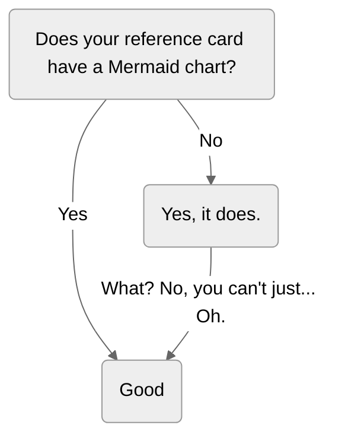

---
search:
  boost: 0.1
---

# Reference card

!!! default "Documentation"

    Docs CSC is based on *Material for MkDocs*. Note that not all (by far) features are supported.

    [Reference - Material for MkDocs](https://squidfunk.github.io/mkdocs-material/reference/){ .md-button target=_blank }

!!! info "Source"

    This page is more useful when viewed side-by-side with [the Markdown source at GitHub](https://github.com/CSCfi/csc-user-guide/blob/master/docs/ref.md?plain=1){ target=_blank }.

This page contains some elements that are available in Docs CSC. For example, here we have some
body text [with an external link](https://example.com){ target=_blank }. **Some of it is
boldfaced**, *some italicized*. `Some might be monospaced`. Some acronyms, like HPC, are
defined automatically (see: [Glossary](#glossary)). One small addition: <small>Some small text.</small>

As you can see here:
in some cases [external links](https://example.com){ target=_blank } followed by text _italicized_
using underscores will produce unwanted results. *Italicize* with asterisks instead.

> Now, there's even text in a blockquote. The blockquote has some filler text after an empty line. I
like to imagine it's what a typewriter would dream.
>
> Vel suscipit quia voluptates quis. Rerum sequi voluptatem in non ipsam tempora quod natus. Soluta
perferendis illo saepe sint ipsa vitae provident non. Et qui quaerat et rerum libero officia omnis
enim. Laboriosam autem vel vel aut quod.

Here's a reference to a footnote:[^1]

Then&mdash;as a rule&mdash;a horizontal rule:

---


## Banners

The front page can be fitted with a banner to promote a course for example.

{ width=80% style="margin: 0 10%; border: var(--csc-border);" }

There is currently no special mechanism in place for controlling banners.

=== "index.md"

    There is a `<center>` block in _index.md_ to hold the banner. The images themselves
    should go to _docs/img/banners/_. The width of the image can be controlled with a
    `width` attribute. A `target=_blank` attribute should be present when a link
    is pointing outside of Docs.

    ```html
    <center>
      [{ width=80% }
      ](https://example.org/courses/example-course/){ target=_blank }
    </center>
    ```

=== "Show/hide"

    To hide the banner, it can just be commented out (mind that the commented-out `<center>`
    block will still be visible in the HTML source of the page):

    ```html
    <!--
    <center>
      [{ width=80% }
      ](https://example.org/courses/example-course/){ target=_blank }
    </center>
    -->
    ```


## Glossary

There is a glossary of HPC-related acronyms that get highlighted automatically. For example: CPU,
GPU, QPU, etc. The acronyms are defined in the markdown file
_csc-overrides/assets/snippets/glossaries/hpc.md_. More acronyms (case-sensitive) can be added there or into another
markdown file, like so:

=== "another_glossary.md"

    ```markdown
    *[GNU]: GNU's not Unix!
    *[DFT]: 1. Discrete Fourier Transform, 2. Density Functional Theory
    ```

=== "mkdocs.yml"

    ```yaml
    markdown_extensions:
    - ...
    - pymdownx.snippets:
        base_path: csc-overrides/assets/snippets
        auto_append:
        - glossaries/hpc.md
        - glossaries/another_glossary.md
    - ...
    ```

The glossary is also viewable as a page at [docs.csc.fi/glossary](support/glossary.md).


## Headings

The heading for Headings is a heading of a heading level 2. Remember to only use one heading level
1 heading on your page and to keep the heading hierarchy intact. So no skipping levels.


### This is a heading level 3 heading

That one's a level 3. Here is some text under it.


#### Now for a level 4 heading

Some text _four_ it here.


##### Level 5 heading: `now with added monospace`

No text this time.


###### Level 6

More text coming up next in Text.


## Text

Lorem ipsum dolor sit amet, consectetur adipiscing elit. Vestibulum nulla ex, elementum ultrices
tempor quis, commodo sit amet quam. Sed accumsan placerat nunc. Suspendisse elementum augue et est
tempor lacinia. Pellentesque vel ante id nunc luctus euismod id non est. Vivamus porttitor dui et
porta maximus. Sed quis orci finibus, feugiat orci vitae, luctus nisl. Praesent lorem turpis,
tristique id lacus sed, sollicitudin ultricies velit. In maximus ante massa, in ullamcorper eros
IaaS fermentum in. Nulla condimentum urna sit amet leo scelerisque, et iaculis odio iaculis. Donec
quis tortor non metus tincidunt placerat. Curabitur rhoncus libero ut augue scelerisque varius.
Nunc bibendum sit amet nisi in varius. Nullam eu eros elementum, pellentesque nisl non, laoreet
felis. Ut et risus enim. Proin tempor tellus eu commodo blandit. Interdum et malesuada fames ac
ante ipsum primis in faucibus.

Nam erat dui, ullamcorper sit amet erat nec, interdum posuere diam. Nam aliquet gravida hendrerit.
Sed erat justo, feugiat sollicitudin scelerisque id, luctus sit amet velit. Sed suscipit at nisi eu
ornare. Nam in mauris ex. In ut sagittis nibh, eleifend pharetra tortor PaaS. Integer sapien
tortor, ullamcorper ac diam ut, vehicula mattis augue. Pellentesque a enim eget est ornare
ullamcorper vitae nec mi. Quisque quis congue augue, eu aliquam tortor. In risus lectus, pharetra
eu fermentum non, gravida volutpat magna. Morbi in congue erat.

Donec a est quis nulla scelerisque cursus ut vitae ligula. In risus felis, finibus et tortor eu,
volutpat efficitur turpis. Praesent vitae vulputate dolor, at posuere urna. Aenean ullamcorper orci
sit amet purus tincidunt, id vehicula lectus aliquet. Ut auctor dapibus magna at hendrerit. Nam
lobortis convallis lacus blandit tempus. Proin et ex ut dolor vehicula suscipit a vitae nisi. Nam
feugiat accumsan purus, sit amet efficitur felis. Integer vitae enim eu massa placerat faucibus
eget vel ipsum. Nullam tincidunt, sapien at blandit pulvinar, lacus mauris finibus turpis, sit amet
suscipit magna tortor sit amet tortor. Ut tortor neque, convallis non volutpat a, pharetra nec
sapien. In in congue nisl, quis egestas nisi. Fusce ut orci luctus sem tincidunt malesuada.
Pellentesque id consequat tortor, sed egestas metus. Phasellus sed venenatis purus, in dapibus
magna SaaS. Cras interdum ornare risus, a condimentum magna lacinia eget. Morbi dapibus elementum
massa et ultrices. Nulla vel lobortis ex. Ut egestas posuere odio, sit amet mollis lacus placerat
at. Quisque ut laoreet purus. Etiam id consectetur ipsum. Phasellus lectus ante, scelerisque in
nunc a, vulputate efficitur nunc. Suspendisse nec nisi ut massa mattis interdum vel eget orci.
Aenean porttitor erat nulla. Vivamus ac urna et orci faucibus pharetra. Integer in urna tincidunt,
tempor turpis nec PaaS, malesuada justo. Vivamus ornare sem ut mi ultricies fringilla. Ut in semper
diam, vitae porta neque. Donec maximus tellus et orci bibendum hendrerit. Ut ut consectetur magna.
Aliquam vel rhoncus elit. Praesent vitae tincidunt urna, et pulvinar orci. Phasellus auctor augue
eu sagittis fermentum. Nullam tempus malesuada augue, nec volutpat mi sodales quis. Vivamus mollis
commodo eros sed porta. Praesent ultrices elementum metus, sit amet fringilla turpis luctus vitae.
Mauris turpis felis, molestie eget ipsum ac, fringilla euismod risus. Phasellus at arcu ante. Cras
eu enim dui. Quisque eu hendrerit magna. Donec ac elit laoreet, mattis tortor et, feugiat nisl.
Duis maximus ultrices elit, quis hendrerit orci.


## Lists

### Unordered list

Here is an unordered list:

- It has an item
- Another item
- And yet another item


### Ordered list

Let's make an ordered list:

1. An item on a list
1. Another item
1. Even a third item


## Source code

``` py linenums="1" hl_lines="2 3"
# Here is a box with some syntax highlighted Python

from somewhere import some_code


NUMBER = 42
LIST = [1, 2, 'three']


class PythonClass:
    def __init__(self) -> None:
        self.__property = 'A string property'
    
    @property
    def property(self) -> str:
        return self.__property

    @staticmethod
    def method(parameter: int = 1) -> list[None]:
        return [None] * (parameter + NUMBER)

def main():
    string = f'Length of list is {len(LIST)}.'
    print(string)
```

Notice the optional line numbers and the line highlighting (on lines 2 and 3). Additionally, the code boxes can have a title:

```javascript title="looong_comment.js"
// Here's a JavaScript comment with a loooooooooooooooooooooooooooooooong line. You know, for testing purposes. Tell you what, let's make it just a bit longer still.
```

Diff works too:

```diff
-Departing
+Arriving
```

Remember to leave an empty line after the ` ``` ` in a source code box. Failing to do so can leave
any immediately following text as "loose", i.e., outside of an HTML paragraph (`<p>`).


## Tables

| This | Table | Has | Five | Columns |
|-|-|-|-|-|
| and | | | | |
| | it | | | |
| | | has | | |
| | | | five | |
| | | | | rows |


## Admonitions

### The fallback style

!!! note "Here we have an important announcement"

    Make sure you read this note inside this very important-looking box, since this is the fallback
    for unknown type qualifiers.

    Type qualifier can be anything, as long as it's not
    `default`,
    `default-label`,
    `info`,
    `info-label`,
    `warning`,
    `warning-label`,
    `error`,
    `error-label`,img/ref/image.png)
    `success` or
    `success-label`.
    Perhaps a suitable one would just simply be: `note`.

!!! note ""
    Title may be removed with `note ""`.


### Styles available with type qualifiers

#### Alert style

!!! default "Nothing special"

    Type qualifier: `default`.
    
    !!! default-label
    
        This isn't the actual default (fallback) admonition for legacy reasons.

!!! info "Information available"

    Type qualifier: `info`

!!! success "You've got it!"

    Type qualifier: `success`

!!! warning "You're on thin ice!"

    Type qualifier: `warning`

!!! error "Oopsie!"

    Type qualifier: `error`


#### With the title removed

!!! default ""

    Type qualifier: `default ""`

!!! info ""

    Type qualifier: `info ""`

!!! success ""

    Type qualifier: `success ""`

!!! warning ""

    Type qualifier: `warning ""`

!!! error ""

    Type qualifier: `error ""`


#### Label style

!!! default-label

    Label type available with type qualifier `default-label`.

!!! info-label

    Label type available with type qualifier `info-label`.

!!! success-label

    Label type available with type qualifier `success-label`.

!!! warning-label

    Label type available with type qualifier `warning-label`.

!!! error-label

    Label type available with type qualifier `error-label`.


#### Inline admonitions

For inline admonitions, you first define the admonition as either `inline` or `inline end`. Then,
you define the content.

!!! warning inline "Hold on!"

    This script might give unexpected results!

    `warning inline "Hold on!"`

!!! info inline end ""

    Then again, it might not.

    `info inline end`


```bash
a="unexpected"
b="results"
if [ $RANDOM -eq $RANDOM ];
then
    echo $a $b
fi
```

&nbsp;

Try adding a `&nbsp;` if inline admonitions give you trouble. Example found right above this line
in [the Markdown source](https://github.com/CSCfi/csc-user-guide/blob/master/docs/ref.md?plain=1).


## Images

Here's an image of the Reference card with an image of the Reference card with...

{ width=80% style="margin: 0 10%; border: var(--csc-border);" }


## Embedded videos

At the moment, to avoid setting cookies, embedded videos are rendered only as an image with a link
to the video in question. For example: Behold! Here is a video of a horse kicking a tree, farting
on some dogs, and then running away:

<iframe
    width="400"
    height="300"
    srcdoc="https://www.youtube.com/embed/KCzwyFHSMdY"
    title="Horse kicks tree, farts on dogs then runs away."
    frameborder="0"
    allow="accelerometer; autoplay; clipboard-write; encrypted-media;gyroscope; picture-in-picture"
    allowfullscreen
></iframe>


### Animations

If you don't need sound (or controls), you can use animations as an alternative for embedded videos. They are
used just like [static images](#images). Both _.gif_ and _.png_ files work.


## Diagrams

### Mermaid

Documented here: <https://mermaid.js.org/intro/>, but for example a fenced block like this:

````markdown

````

produces a flowchart like that:


### Draw.io

Diagrams (including a toolbar) from [draw.io](https://draw.io) can be embedded as iframes by selecting _File ->
Embed -> IFrame..._. With line breaks added for illustration, the resulting piece of HTML could
look something like this:

````html
<iframe
  sandbox
  style="width: 100%;
         height: 301px;"
  frameborder="0"
  src="https://viewer.diagrams.net/?tags=blahblahblahblah%blah
  blahblahblah%blahblah%blah%blahblahblahblah%blahblahblahblah"
></iframe>
````

The size can be controlled by changing the value of the _style_ attribute. Note the units: _%_ for
width and _px_ for height. Here's an example with a width of 100 percent and a height of 500 pixels:

<iframe frameborder="0" style="width:100%;height:500px;" src="https://viewer.diagrams.net/?tags=%7B%7D&highlight=0000ff&edit=_blank&layers=1&nav=1#R%3Cmxfile%3E%3Cdiagram%20name%3D%22Page-1%22%20id%3D%22ftzXAFIqJNWyvfU7Nhta%22%3E7Zlbc9o4FMc%2FDY%2Fx%2BArOY4GQPmRnmWU62X3qCFvYKrbFSjKGfPpKtmTkC7eUNOm04SHo6GLp%2FH86OhYDZ5LuHgnYxH%2FhECYD2wx3A2c6sG3Lslz%2BT1j20mLao8oSERRK28GwQC9QNZTWHIWQNhoyjBOGNk1jgLMMBqxhA4TgotlshZPmUzcggh3DIgBJ1%2FqMQhZXVt8zD%2FbPEEWxerJlypoUqMbSQGMQ4kIzOQ8DZ0IwZtW3dDeBifCe8kvVb3aktp4YgRnr6fCFQvL38pvwiW0mYMmFKRtV3RKUratyzJhw5SfR0Z6FOKBGQANjhXgpwOkmZyiLRA2i67KNE%2BMU3oWI8KEx2VfjqVnti9X6n%2BfhS%2FY4%2F983XyZP4eL5zvLq5dbLoGyvXExwnoVQDGANnHERIwYXGxCI2oJTxW0xSxNZneItWJY9RYlAil70MmaAaWWOI9TLMER6McHBunywyQuSIK2662Hp9C0kDO40k1zbI%2BSuYcInpqp1pPqSf1eVCw0maYo1jmr%2BgeQ3qoc%2BSMy%2FSH%2Bqoib6SQjmecyQmAVcooxBsgqEv0%2BSURSFsRHdajzO6m6flJ2uIQti6XxNYUA31UZeoZ0QZ0wZwWs4wQkm3JrhDAqj2k2i9woliarngDpjfzoTQwmdEN%2FLnxIUZbyOYUFT6Yc5poghLKwBFC7Qmj%2B1GiwxYzitHroRs093kQh3RhRsbCNK8BJ%2BLTDhkeXHgXHtC4BxDTWwzoz%2FpshMFhMRx3GQp3x1oHTN5aHkLCvOSVY0PM6KBKTYtazlIsYgWEdlpNFAWZV%2FR0GpwFNh3%2B6gyEcwTd%2BcmW0eQ0DjOq60oUGYjgzEow01lDfpbYLNsMWO53XZ8TxjdN9lZ3gTdjqHVK%2FUQ7kukORQP5OOxQacM84Y97o64cstjzOm6cA%2FMzGFMfdxiOChToaLVoQom0%2BPxZaGfGd562enQ6GGsJi7zHQsW5Xl4s2%2BCLjBZZR%2B2FaslIO0sQIFdY2cls%2B6SRwa1kFG4jTswWnkd1lStitYugycUYcTGPJkTRYxYTGOcAaSh4N1fEguSpTqNk9YyFR68htkbC%2F1ADnDTbG4C8n%2BX9Hf8JyRMvwnag3bU%2BXpTj6hKu310hwSxB0glCmNR9WhOCcBPL9zGCARZOcOXtsU3jmpNYEJD%2BTbZqp7c9ms4bvqZumacRHPSPZ6dfwL1anS4Q8jj39lOL40Oh05DjWJeoPv67OzCwNx6ygwTcv3p30B9SUn0KhegXjHHw%2BpdYKmjme%2F53jueRdwvTdS%2Fv6942kjmn7MUOr%2FpL16%2FHV9mPD5jZf8SyS%2BLBaflY0PUZuvyMUbr%2FXyrbcqXJCnW%2Fr6u4m68NNTNfvGO117E7b3aorCsOJLe6M3VXAp3eiNB960V%2FNTcHe2Z31VJB8y0G9j%2BrbtnWmYvuc0tq681bpYdDn4XCxGa4JXK8rpa1NRz%2BGmabe6UXi37e46zZP4fjj6mHve%2BVDns2VfeUDf9jxuHZeeKT5vcE73vuV14kb7kOY7CAXQCOGW%2F6NGDEj4tbyp%2FPVuCr3WxY%2FrdLIDtyc78Ny34s75w91vyJ1ndbPSn8ud%2B4e735G7kWd470zeqIe8Vvo9BwQkSfkrJycF0j1lMD2ekGvMcr%2BwK%2FmTpsuz574fz5op3K9GidukpO8OctjDiPOq%2B%2BzDj7FVHn74Tdt5%2BA4%3D%3C%2Fdiagram%3E%3Cdiagram%20id%3D%22vBa_PaVnEDiTYJhkc75Y%22%20name%3D%22Page-2%22%3ErZRNj5swEIZ%2FDceu%2BAjZ9JjvVuqecujZCxNwazzIDIHk19cOQwChRrvS5kDw49f2zDtjvGhbtEcjyvwNU1Be6KetF%2B28MAyCYGH%2FHLky8cPXjmRGpswGcJI36IVMa5lCNRESoiJZTmGCWkNCEyaMwWYqO6OanlqKDGbglAg1p79lSnlHV7E%2F8B8gs7w%2FOfB5phC9mEGVixSbEYr2XrQ1iNS9Fe0WlHOv96Vbd%2FjP7CMwA5o%2BsuD1782XSyF%2Fxsc1rA97%2Ffa%2B%2FhZxbHTtE4bU5s9DNJRjhlqo%2FUA3BmudgtvVt6NB8wuxtDCw8A8QXbmYoia0KKdC8ew8ck6mwtok8CTcvgOEyYCe6MJO53IZHcC%2BHAELIHO1AgNKkLxMay24ZbKHbnDVvrCxnzCZ970IVfNJ9racJcHM%2FMFa51OTW82pFHdLGnvBPmjjBQxB%2BzRxno0ibk6%2BnuF3HjdDrz86Oh%2F1eb%2Fuy70KZ17NTJLF%2Fc5uRFV2N%2F4sW%2BfZ2JsSpaZ7bPHGi3dOrWSmLUisW2AsOKMmbtHAWrThbXeyyGzkSr7bp7jVBlxGSLldFB5c4YQWL9Ul%2B6IKLJbTCvjzCixX8wLE4cvKH%2F8Wny6IHQ5fn%2Fvc6CMe7f8B%3C%2Fdiagram%3E%3C%2Fmxfile%3E"></iframe>


## Buttons

### Button

[Button](#button){ .md-button }


### Primary button

[Primary](#primary-button){ .md-button .md-button--primary }


## Tabbed content

=== "First tab"
    Content can be divided into tabs. The first one is visible by default.

    !!! default ""
        There can be any content, like this admonition, under tabs.

=== "Second tab"
    | Tables | work | fine | too |
    |-|-|-|-|
    | just  | as | an | example |

=== "And so on..."
    It can get quite messy:

    !!! warning ""

        === "Probably not what you want"
            You can even have nested tabs under admonition under tabs.

        === "But possible, nonetheless"
            I would recommend against it, though.


## Snippets

Files under _csc-overrides/assets/snippets/_ may be added as snippets on the current page.

Suppose we have two Markdown files, _a.md_ and _b.md_ with the content

```markdown title="a.md"
Yes, this is _a.md_.
```

and

```markdown title="b.md"
Hello from _b.md_!
```

The file _ref/a.md_ (relative to the base path above) added as a snippet with

```markdown
;--8<-- "ref/a.md"
```

would look like this:

--8<-- "ref/a.md"

Adding _ref/a.md_ and _ref/b.md_ using

```markdown
;--8<--
ref/a.md
ref/b.md
;--8<--
```

would look like this:

--8<--
ref/a.md
ref/b.md
--8<--

Snippets also work from inside the source code boxes. For example

````markdown
```markdown
;--8<-- "ref/a.md"
```
````

would produce

````markdown
```markdown
--8<-- "ref/a.md"
```
````

More examples (untested in Docs CSC) can be found in [PyMdown Extensions Documentation](https://facelessuser.github.io/pymdown-extensions/extensions/snippets/).


[^1]: This is the footnote ...and here's a shoenote for the footnote: 👞🎵
[^2]:
    Here's another footnote. Though, this one's a _barefootnote_!  
    Get it? 'Cause it's got no shoenote! Ahuehuehuehue!
