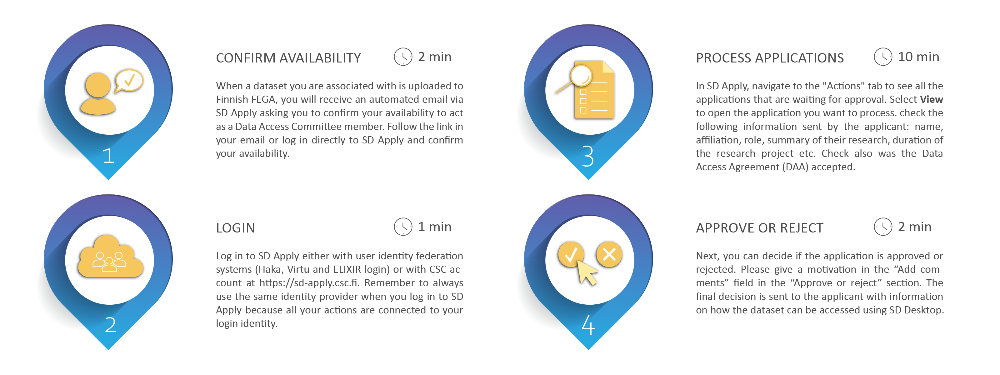
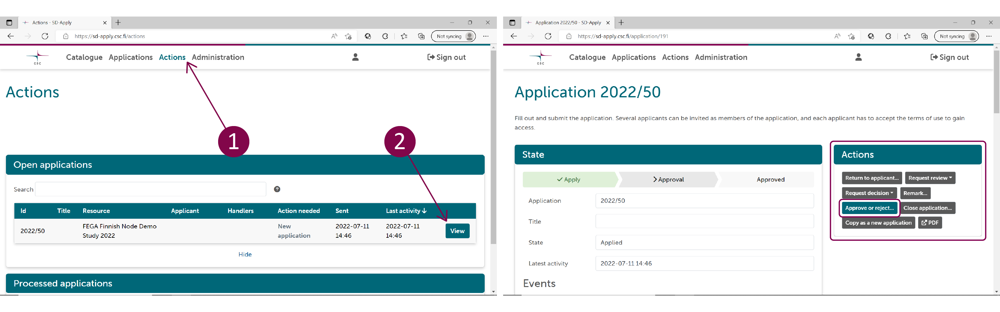

# Data access approval for DAC
Data Access Committee (DAC) is established during the data submission process and all the communication between DAC and the data applicant is managed using SD Apply. Each DAC is linked to a specific dataset present in the SD Apply catalogue. DAC members can process data access applications separately, thus only one DAC member needs to approve or reject the application. The SD Apply user interface guides you during the data access revision process. For more information about SD Apply and the data approval process, please check [SD Apply user guide](./sd-apply.md).

## Approval process overview

## Step 1: Confirm availability
When a dataset you are associated with is uploaded to Finnish FEGA, you will receive an automated email via SD Apply asking you to confirm your availability to act as a Data Access Committee member. Follow the link in your email or log in directly to SD Apply at <https://sd-apply.csc.fi/> and confirm your availability. 
 
## Step 2: Login
As a DAC member you receive an email notification via SD Apply, when an applicant applies for data access. Log into SD Apply with your Haka or ELIXIR account. 

## Step 3: Process applications
In SD Apply, under “Actions”, check the following information sent by the applicant: name, affiliation, role, summary of their research, duration of the research project etc. Check also was the Data Access Agreement (DAA) accepted. You can ask for more information from the applicant if necessary.

## Step 4: Approve or reject
Next, you can decide if the application is approved or rejected. Please give a motivation in the “Add comments” field in the “Approve or reject” section. The final decision is sent to the applicant with information on how the dataset can be accessed using SD Desktop.

!!! note
    Every action is recorded in SD Apply (e.g. previous applications from the same applicant are available).

