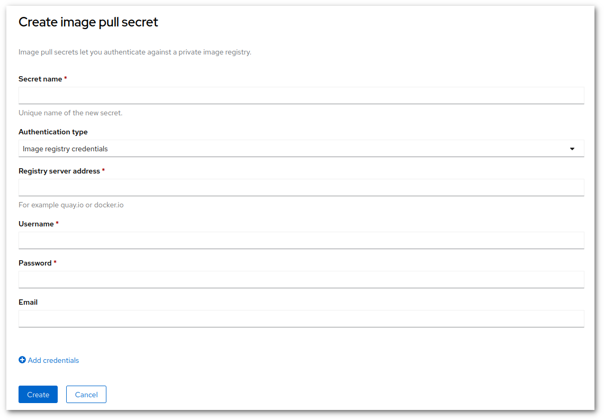

# Kuinka lisätä Docker Hub -tunnistetiedot projektiin {#how-to-add-docker-hub-credentials-to-a-project}

2. marraskuuta 2020 alkaen Docker Hub on asettanut rajoituksia kuvien latausmäärille. Rahdin osalta tämä tarkoittaa 200 latausta 6 tunnin välein. Tämä raja voidaan helposti saavuttaa ja se estää uusien sovellusten käyttöönoton, jos kuva sijaitsee Docker Hubissa.

Virhe näyttää tältä:

```
Pulling image "docker.io/centos/python-38-centos7@sha256:da83741689a8d7fe1548fefe7e001c45bcc56a08bc03fd3b29a5636163ca0353" ...
pulling image error : toomanyrequests: You have reached your pull rate limit. You may increase the limit by authenticating and upgrading: https://www.docker.com/increase-rate-limit
```

Ratkaisu sisältää sekä Web-käyttöliittymän että asiakasohjelman käytön:

* Ensinnäkin tarvitset Docker Hub -tilin. Se voi olla maksuton tili. Tässä tapauksessa rajoitukset ovat voimassa, mutta vain omien tunnistetietojesi avulla tekemäsi lataukset otetaan huomioon rajoja laskettaessa. Maksullisilla tileillä ei ole rajoituksia.
    * Tarvitset TOKENin, mene osoitteeseen <https://hub.docker.com/settings/security> ja luo token. Näet, milloin tokenia on viimeksi käytetty. Voit myös luoda useita tokeneja ja käyttää niitä eri projekteissa turvallisuuden lisäämiseksi.

* Toiseksi, siirry Web-käyttöliittymään ja valitse kehittäjänäkymä. Vasemmasta valikosta, valitse **Secrets**.

* Yläoikealla, klikkaa "Create"-valikkoa ja valitse "Image pull secret". Aseta seuraavat arvot:
    * Secret name = anna selkeä nimi, tätä käytetään myöhemmin
    * Authentication type = "Image Registry Credentials"
    * Registry server address = "docker.io"
    * Username = Docker-käyttäjänimesi
    * Password = Docker-**tokenisi**
    * Email = Dockeriin rekisteröity sähköpostiosoitteesi



* Varmista, että arvot ovat oikein, ja valitse "Create".

* Seuraavaksi siirrymme komentoriviin. Kirjaudu sisään ja käytä seuraavia komentoja tietojen linkittämiseen palvelutilien kanssa:

```sh
$ oc -n <project-name> secrets link builder <secret-name>
```

**Huom**: Korvaa <project-name> paikkamerkki oikealla projektin nimellä (ilman <>) ja <secret-name> oikealla secret-nimellä.

## Vianmääritys {#troubleshooting}

Jos virhe jatkuu, voit tarkistaa kaksi asiaa:

1. Osoitteesta <https://hub.docker.com/settings/security> voit nähdä, milloin tokenia on viimeksi käytetty. Tarkista, vastaako se viimeisintä käyttöajankohtaa.

1. Tarkista, että linkitykset salaisuuden ja palvelutilien välillä ovat kunnossa:

    ```sh
    $ oc -n <project-name> describe sa builder
    ```

    **Huom**: Korvaa <project-name> paikkamerkki oikealla projektin nimellä (ilman <>).

1. Tarkista rakennukseen käytetty Pod ja varmista, että luomasi secret on käytössä:

  ```sh
  $ oc get pod
  NAME                               READY     STATUS      RESTARTS   AGE
  my-hello-1-build                   0/1       Error       0          5h
  my-hello-2-build                   0/1       Error       0          1h
  ```

  Ylläolevat Podit ovat epäonnistuneita rakennuksia. Ne nimetään seuraavasti:

  ```sh
  <buildname>-<number>-build
  ```

  Ota viimeisin rakenne, tässä tapauksessa `my-hello-2-build`. Kuvaile sen tila ja etsi Volume mounts:

  ```sh
  $ oc describe pod my-hello-2-build
  (...)
    Mounts:
      /tmp/build from buildworkdir (rw)
      /var/run/crio/crio.sock from crio-socket (rw)
      /var/run/docker.sock from docker-socket (rw)
      /var/run/secrets/kubernetes.io/serviceaccount from builder-token-r5zp8 (ro)
      /var/run/secrets/openshift.io/pull from estivadores-secreto2-pull (ro)
      /var/run/secrets/openshift.io/push from builder-dockercfg-kn8h6-push (ro)
  ```

  Yllä olevassa koodissa näemme, että käytetty `pull secret` oli `estivadores-secreto2-pull`. Varmistamme, että polkua käytettiin hakemiseen seuraavasti:

  ```sh
  $  oc describe pod my-hello-2-build | grep PULL_DOCKERCFG_PATH
        PULL_DOCKERCFG_PATH:  /var/run/secrets/openshift.io/pull
  ```

  ja näemme, että secretimme on asennettu kyseiseen polkuun.

Jos tarvitset lisää tietoa, tutustu [upstream image pull secrets](https://docs.openshift.com/container-platform/3.11/dev_guide/managing_images.html#using-image-pull-secrets) dokumentaatioon.

