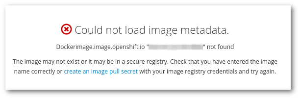
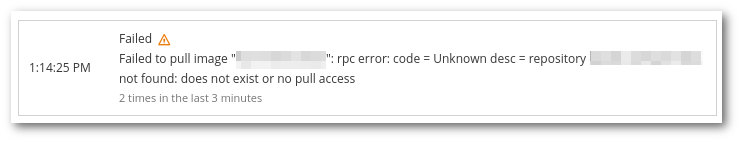

# Why Rahti cannot find this docker image?



Often there are simple causes for this problem. Maybe there is a typo in the image name, or the image might have been removed since the last time it was successfully pulled. These two problems are common, and as such, it is worth double-checking the image source.



## Private image

Another cause is that maybe the image is private. In this case, it is necessary to set up a `docker-registry` secret with an account credential having the required permissions to pull the image. For example, for an image stored in docker hub:

```bash
$ oc create secret docker-registry <SECRET-NAME> \
      --docker-username=<USERNAME> \
      --docker-server=docker.io \
      --docker-email=<EMAIL> \
      --docker-password=<PASSWORD>

$ oc secrets link default myprivaterepoaccess --for=pull
```

**Note**: Substitute placeholders with actual username, password, email, and an appropriate name for the secret (without <>).

You can find more information in the [How to add docker hub credentials to a project](../../../cloud/rahti/tutorials/docker_hub_login/) article.

## Unsupported image format

A more obscure problem is when the format of the image is not supported by the current version of Rahti (v3.11), which uses an old version of the docker client. Currently there are two docker image formats, docker (`application/vnd.docker.container.image.v1+json`) and OCI (`application/vnd.oci.image.manifest.v1+json`), the current version of Rahti only supports `docker`.

When an old client is used to try to pull a image with the newer format, the client cannot find it and returns a `repository does not exist` error. The easiest way to check the `mediaType` of an image is to use `docker manifest inspect <image>:<tag>`. This command will show the media type of the image and each of its layers.


## Workarounds

* A trivial fix is to pull the image using a compatible client, re-tag it, and push it to Rahti's internal registry. This newly pushed image will be using the old docker format. Follow the link for a guide on [How to manually cache images in Rahti's registry](../../../cloud/rahti/tutorials/docker_hub_manual_caching/).

* If the image was built by your team, the [buildah](https://buildah.io) tool can be used. It allows to build docker images without the extra privileges the `docker build` requires, and even though by default it will build an image using the `OCI` format, it has an option to use the `docker` format instead:

```bash
buildah bud -t image/name:tag --format=docker
```
