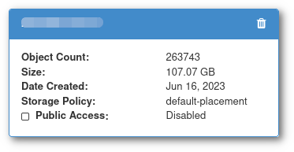

# How to make a bucket public?

By default Allas buckets are only accessible using authentication (See [Accessing Allas](../../data/Allas/accessing_allas.md) ), but it is possible to make a bucket public. Making a bucket public means that every file and directory on the bucket will be accessible without any kind of authentication from anywhere on the internet using the HTTPS protocol.

!!! Info "Allas UI does not support public buckets (yet)"
    At this moment it is not possible to make buckets public from <allas.csc.fi>. The plans are to add this feature in the future.

To do this, we need to go to [Pouta's web interface](https://pouta.csc.fi) and:

1. Navigate to **Object Store** > **Containers**. This will open the "Containers" page with a list of every bucket on the selected CSC Project.
1. Click on the bucket name, the bucket information will appear:

    

1. Click in the checkbox near "Public Access".
1. Check if there is a "segments" bucket, if so the name will be the same as the "main" bucket but with a `_segments` suffix, for example:

  * If the name is `musel-photos`, the segments bucket will be `musel-photos_segments`

1. If there is a "segments" bucket, click also in the "Public Access" checkbox.

Now the bucket is public and its contents will be available throw the URL: `https://$BUCKETNAME.a3s.fi/`. Where `$BUCKETNAME` is the name of the bucket (so the bucket named `musel-photos` will be available in `https://musel-photos.a3s.fi/`).
