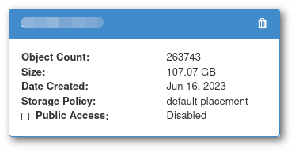

# How to make a bucket public?

By default Allas buckets are only accessible using authentication (See [Accessing Allas](../../data/Allas/accessing_allas.md) ), but it is possible to make a bucket public. Making a bucket public means that every file and directory on the bucket will be accessible without any kind of authentication from anywhere on the internet using the HTTPS protocol.

!!! warning "Public access"
    Anyone with the URL can access all objects in a public bucket.
    Do not store sensitive or personal data in public buckets.

To do this, you have two options:

## Allas Web Interface

Go to [Allas web interface](https://allas.csc.fi) and:

1. On the main dashboard you can see the `Public Access` column.
2. Click the checkbox to make the bucket public.
3. Press on the link. This will open a new tab with the public URL. 
4. Append the file name to the url to see it publicly.
5. Uncheck to make the bucket private.

{ width=80% }
 Making a bucket public

## Pouta Web Interface

Go to [Pouta's web interface](https://pouta.csc.fi) and:

1. Navigate to **Object Store** > **Containers**. This will open the "Containers" page with a list of every bucket on the selected CSC Project.
1. Click on the bucket name, the bucket information will appear:

    

1. Click in the checkbox near "Public Access".
1. Check if there is a "segments" bucket, if so the name will be the same as the "main" bucket but with a `_segments` suffix, for example:

  * If the name is `musel-photos`, the segments bucket will be `musel-photos_segments`

1. If there is a "segments" bucket, click also in the "Public Access" checkbox.

Now the bucket is public and its contents will be available throw the URL: `https://$BUCKETNAME.a3s.fi/`. Where `$BUCKETNAME` is the name of the bucket (so the bucket named `musel-photos` will be available in `https://musel-photos.a3s.fi/`).
