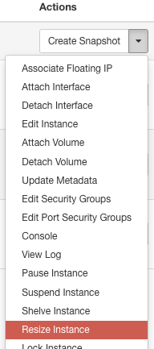
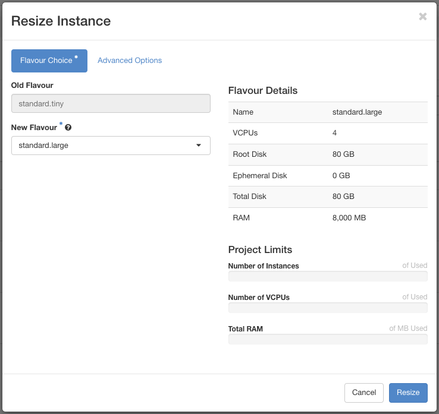
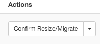
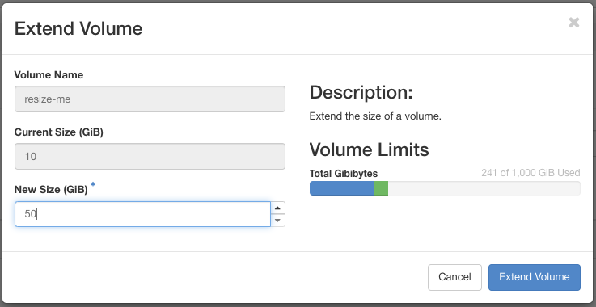
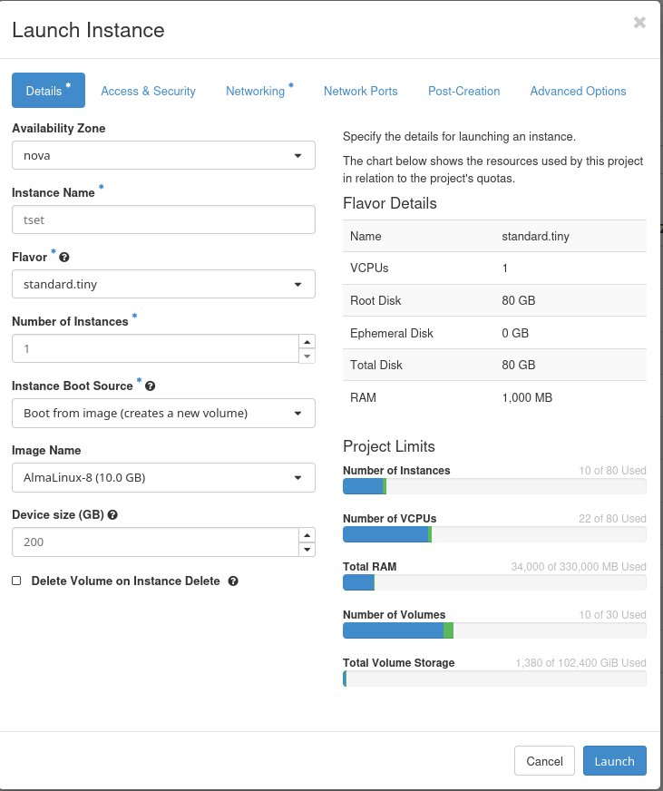

# How to resize an instance or volume in Pouta
## Resize an instance
### Using a snapshot
We might face performance issue with your initial instance and you'd like to run your instance with a bigger flavor?  
It's possible to proceed by taking a snapshot of your instance and then boot the new instance with the new flavor using the snapshot.  
You can find more information about snapshot [here](../../cloud/pouta/snapshots.md) and how to proceed.

### Using the resize functionality 
!!! Warning    
    [I/O flavors](../../cloud/pouta/vm-flavors-and-billing.md#io-flavors_2) and [GPU flavors](../../cloud/pouta/vm-flavors-and-billing.md#gpu-flavors_2) cannot be resized to a different family flavors. We recommend to use [snapshots](../../cloud/pouta/snapshots.md#launching-an-instance-from-a-volume-snapshot).

!!! Warning  
    It's possible to resize from a `standard` flavor *family* to a `hpc` flavor *family*. Nothing will prevent you to do that but it's **highly not recommended!**  
    You may lose data during the process and CSC is not responsible. We recommend to only resize to the flavors of the same *family* (except for I/O flavors, see above).

In the **Actions** menu of your instance, choose **Resize** to begin the process:  

A window will open. Select the new flavor:

Click **Resize**

Wait few minutes and during the process, it will ask you to confirm the resize:

When your instance is in `Confirm Resize/Migrate` it means that you can connect to your instance to check if everything is working fine because it's already converted into the new flavor.  
In the case that you spot something wrong, you can revert to the previous state with the `Revert Resize/Migrate` button in the drop menu.  

!!! error-label  
    Be aware that an automatic confirm process will be triggered after three days of pending `Confirm or Revert Resize/Migrate` status

After the process finished, you should have your instance with a new flavor.

## Resize a volume
!!! Notes  
    You can only extend a volume. Currently, shrink a volume is not supported in Openstack.

Pouta let you create [external volumes](../../cloud/pouta/storage.md). If your initial volume is too small, you can resize it.

!!! Note
    If your volume is attached to your instance, you must detach it to be able to resize

From the Volumes page, in the **Actions** menu, click **Extend Volume**:

A window will open. Enter the new amount of your volume:

Click **Extend Volume**

You should see the new size of your volume.

You can now attach the new volume back to your instance.

## Customize disk size when creating the instance

To customize the root disk size during instance creation (instead of using a snapshot), follow these steps:

1. Go to **Project > Compute > Instances** and click on **Launch Instance**.
2. In the **Details** section:
   - **Instance Name**: Enter a name for your instance.
   - **Flavor**: Choose the appropriate flavor, such as `standard.tiny` (with default 80 GB disk space).
   - **Instance Boot Source**: Choose **Boot from image (creates a new volume)**.
   - **Image Name**: Select the image you want to use (e.g., AlmaLinux-8).
   - **Device Size**: Adjust the size of the root volume to your desired size, as shown in the image (e.g., 200 GB instead of the default 80 GB).
   
   - This field allows you to customize the root volume size beyond the flavor's default disk size as shown in figure below.

3. After configuring the rest of the options (security, networking, etc.), click **Launch**.

If you'd like to extend the volume using a snapshot instead, please visit [Volume snapshots](../../cloud/pouta/snapshots.md#volume-snapshots) for more detailed instructions.
