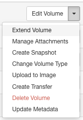

# Kuinka muuttaa instanssin tai taltion kokoa Poutassa { #how-to-resize-an-instance-or-volume-in-pouta }
## Instanssin koon muuttaminen { #resize-an-instance }
### Tilannevedon (snapshotin) käyttäminen { #using-a-snapshot }
Alkuperäisessä instanssissasi saattaa ilmetä suorituskykyongelmia ja haluat ehkä ajaa instanssia suuremmalla flavorilla?  
Voit toimia ottamalla instanssistasi tilannevedon ja käynnistämällä uuden instanssin uudella flavorilla käyttäen tilannevedosta.  
Lisätietoja tilannevedoksista ja etenemisestä löydät [täältä](../../cloud/pouta/snapshots.md).

### Koonmuutos-toiminnon käyttäminen { #using-the-resize-functionality }

- [I/O flavors](../../cloud/pouta/vm-flavors-and-billing.md#io-flavors_2) ja [GPU flavors](../../cloud/pouta/vm-flavors-and-billing.md#gpu-flavors_2) -flavoreja ei voi muuttaa koonmuutos-toiminnolla, koska juurilevyn ja efemeerisen levyn dataa ei kopioida sen yhteydessä. Tämä tarkoittaa, että kone ei välttämättä käynnisty ja konsolissa näkyy viesti "No bootable device". Suosittelemme käyttämään [snapshoteja](../../cloud/pouta/snapshots.md#launching-a-snapshot-from-the-web-interface).

!!! Warning    
    Muista, että snapshotia luotaessa vain juurilevyn sisältö säilyy. Jos sinulla on dataa efemeerisellä levyllä (yleensä hakemistossa `/mnt`), voit varmuuskopioida sen [taltiolle](../../cloud/pouta/persistent-volumes.md) tai `Allakseen` käyttäen työkalua kuten [rclone](../../data/Allas/using_allas/rclone.md) tai [s3cmd](../../data/Allas/using_allas/s3_client.md)

!!! Warning  
    On mahdollista muuttaa koosta `standard`-flavorin *perheestä* `hpc`-flavorin *perheeseen*. Mikään ei estä tekemästä niin, mutta sitä **ei todellakaan suositella!**  
    Saatat menettää dataa prosessin aikana, eikä CSC ole vastuussa. Suosittelemme muuttamaan kokoa vain saman *perheen* flavorien välillä.

Instanssisi **Actions**-valikosta valitse **Resize** aloittaaksesi prosessin:  

Ikkuna avautuu. Valitse uusi flavor:

Valitse **Resize**

Odota muutama minuutti. Prosessin aikana sinulta pyydetään koonmuutoksen vahvistusta:

Kun instanssisi tila on `Confirm Resize/Migrate`, voit yhdistää instanssiin ja tarkistaa, että kaikki toimii, koska instanssi on jo muunnettu uuteen flavoriin.  
Jos huomaat jotain ongelmia, voit palata edelliseen tilaan pudotusvalikon painikkeella `Revert Resize/Migrate`.  

!!! error-label  
    Huomaa, että kolmen päivän kuluttua tilasta `Confirm or Revert Resize/Migrate` käynnistyy automaattinen vahvistusprosessi

Kun prosessi on valmis, instanssillasi pitäisi olla uusi flavor.

## Taltion koon muuttaminen { #resize-a-volume }
!!! Notes  
    Voit ainoastaan kasvattaa taltion kokoa. Taltion pienentäminen ei tällä hetkellä ole tuettu Openstackissa.

Poutassa voit luoda [ulkoisia taltioita](../../cloud/pouta/storage.md). Jos alkuperäinen taltiokokosi on liian pieni, voit muuttaa sitä.

!!! Note
    Jos taltiotasi käytetään instanssissa (se on liitettynä), sinun täytyy irrottaa se ennen koon muuttamista

Volumes-sivulla, **Actions**-valikosta, valitse **Extend Volume**:

Ikkuna avautuu. Anna taltion uusi koko:

Valitse **Extend Volume**

Näet nyt taltion uuden koon.

Voit nyt liittää taltion takaisin instanssiisi.

## Instanssia luotaessa levyn koon mukauttaminen { #customize-disk-size-when-creating-the-instance }

Voit mukauttaa juurilevyn kokoa instanssin luonnin yhteydessä (snapshotin käytön sijaan) seuraavasti:

1. Siirry kohtaan **Project > Compute > Instances** ja valitse **Launch Instance**.
2. **Details**-osiossa:
   - **Instance Name**: Anna instanssillesi nimi.
   - **Flavor**: Valitse sopiva flavor, kuten `standard.tiny` (oletusarvoisesti 80 GB levytilaa).
   - **Instance Boot Source**: Valitse **Boot from image (creates a new volume)**.
   - **Image Name**: Valitse käytettävä levykuva (esim. AlmaLinux-8).
   - **Device Size**: Säädä juuritaltion koko haluamaksesi, kuten kuvassa (esim. 200 GB oletuksen 80 GB:n sijaan).
   
   - Tämä kenttä mahdollistaa juuritaltion koon mukauttamisen flavorin oletuslevykokoa suuremmaksi, kuten alla olevassa kuvassa.

3. Kun olet määrittänyt loput asetukset (turvallisuus, verkko jne.), valitse **Launch**.

Jos haluat sen sijaan laajentaa taltiota snapshotin avulla, katso tarkemmat ohjeet kohdasta [Volume snapshots](../../cloud/pouta/snapshots.md#volume-snapshots).