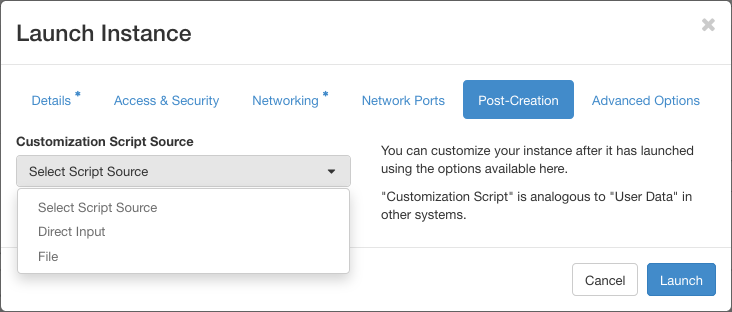

# How to use cPouta for Remote Desktop

This article will go through how to set up a remote desktop with noVNC and
ssh-tunnel into a non-GPU flavor in c- and ePouta. We are using noVNC because
it allows us to use our browser to access the desktop, i.e. no 
local installations needed. If you would like to have
instructions on how to use a GPU instance for rendering look
here: [How to use cPouta GPU for rendering](how-to-use-cpouta-gpu-for-rendering.md)

First, we will show you how to install the different softwares needed manually. At the end of this article, 
we will show you how to do it automatically when creating an instance (post install scripts). If you want to 
go directly to the post install script, click [here](#post-install-scripts)

## Preparations

We will utilize the following technologies to install the remote desktop:

  - A standard-flavor, for example, _standard.medium_ 
  - Almalinux-9 image (In Pouta they have already the epel-repository installed)
  - noVNC, since it allows us to use our browser instead of a traditional VNC-client to view the desktop
  - tigervnc-server as our VNC server
  - Xfce as our Desktop environment
  - ssh-tunnel so that the VNC server is not open to the internet. This is very important.

### Create and access your instance for remote desktop

!!! Warning  
    Do not use the `standard.tiny` flavor. As this flavor has only 1Go of RAM, noVNC cannot be installed

1. Launch a standard-flavor instance with the Alamlinux-9 image.
2. Attach a floating IP to the instance.
3. In the security rules allow ingress ssh (port 22).
4. We will ssh into the instance with this command and create a ssh-tunnel.

```
ssh -L2001:localhost:6081 almalinux@YOUR-FLOATING-IP
```

This also works at least in the Windows Powershell. If you don't have
an ssh-agent running, you will need to specify also your ssh-key:

```
ssh -i C:\users\localusername\.ssh\yourkey.pem -L2001:localhost:6081 almalinux@YOUR-FLOATING-IP
```

Note, that the port 2001 is the one that you will use with the browser later.
    
`-L2001:localhost:6081` means that we will be able to access port 6081 on the server
from our computer's local port 2001. Keep the terminal alive. The ssh-command is the only step
needed on the local computer.

### Install the required software on the VM

In this example we are using Xfce for our Desktop Environment. If you want to use
some other Desktop environment you will probably need to modify the
vncserver-config-defaults configuration file.

```
sudo dnf update
sudo dnf install -y epel-release
sudo dnf groupinstall -y "Xfce" "base-x"
sudo systemctl set-default graphical
sudo reboot
```

Install noVNC and tigervnc for the vncserver

```
sudo dnf install -y novnc tigervnc-server
```

### Configure the software

Create a new user called `vncuser` for example.

```
sudo useradd vncuser
sudo passwd vncuser
sudo su - vncuser
```

Create a base configure for the user `vncuser` to be able to use the remote desktop.

```
vncpasswd

Password:
Verify:
Would you like to enter a view-only password (y/n)? n
```

Exit the `vncuser` shell

```
exit
```

Configure a resolution you would like to use. 1440x900 is a common resolution
but this have been tested to work with an resolution as big as 3840x2160 .
This can be configured globally for all the users.

```
sudo sed -i -e 's/=gnome/=xfce/g' /etc/tigervnc/vncserver-config-defaults
sudo sh -c "cat >> /etc/tigervnc/vncserver-config-defaults" <<EOF
## CONFIGURATION FOR ALL USERS ##
geometry=1440x900
depth=24
localhost=no
EOF
```

Or each user can have their own configuration. Here, with `vncuser`

```
sudo su - vncuser
cat >> ~/.config/tigervnc/config <<EOF
geometry=1440x900
depth=24
session=xfce
localhost=no
EOF
```

### Starting your remote desktop

Note, that with this documentation the NoVNC session will only work with ':1'.

A good practice is to use the `systemd` service to start `vncserver`. There is a template in
`/lib/systemd/system` called `vncserver@.service`. Copy it to `/etc/systemd/system/vncserver@:1.service`

```
sudo cp /lib/systemd/system/vncserver@.service /etc/systemd/system/vncserver@:1.service
```

Assign `vncuser` to screen :1

```
sudo sh -c "cat >> /etc/tigervnc/vncserver.users" <<EOF
:1=vncuser
EOF
```

Enable and start `vncserver` service

```
sudo systemctl enable vncserver@:1.service && sudo systemctl start vncserver@:1.service
```

You can check the status of the service

```
sudo systemctl status vncserver@:1.service
```

And it's listening on port `5901` and `0.0.0.0` (not only localhost `127.0.0.1`)

```
ss -tulpn | egrep -i 'vnc|590'
```

You can start the noVNC client by running

```
novnc_server --listen 6081 --vnc localhost:5901
```

The application location might differ based on the Linux distribution you are using.
The `--listen 6081` means on which port the service will be accessed from. The
`--vnc localhost:5901` means on what port it is expecting the vncserver to be 
accessed from. You can exit out of the noVNC session by `ctrl+c`.

You should now be able to access the noVNC session by going to this link in
your browser `http://127.0.0.1:2001/vnc.html` . Note, that the port number is the
same as the one you used with the ssh-command.

## Important information if you don't want to use the ssh-tunnel

It is of course also possible to use noVNC or VNC directly over the internet
but we strongly recommend against this. VNC is one of the easiest services to
exploit on the internet, it is not a question if your server will get hacked 
but when. If you are still going to disregard our recommendation at least be sure
that you add a good security rule to your server so that you can only access the
server from your IP.


## Deploy Guacamole

Guacamole is a clientless remote desktop gateway. It supports standard protocols like VNC, RDP, and SSH.
More information on the [official website](https://guacamole.apache.org/)

You can easily deploy guacamole using this [ansible script](https://github.com/cscfi/ansible-openstack-guacamole)

Previously we deployed a new graphical server. In the `templates/user-mapping.xml.j2` file, 
you have to specify a name, the local address of the server, and the port.

After the deployment, guacamole is accessible via `https://<YOUR_FLOATING_IP>:8080/guacamole`

It allows you to access different machines with a `vncserver` from one place.


## If you want to use Ubuntu

As of this writing, `ubuntu-desktop` and `tigervnc-server` works with `Ubuntu-22`. 
If you want to use `Ubuntu-24`, use `Xfce` as graphical environment.

Here are the steps to install `tigervnc-server` on Ubuntu-22. 
The steps are quite similar to `Almalinux-9` seen previously, few packages name are different.

1. Launch a standard-flavor instance with the Ubuntu-22.04 image.
2. Attach a floating IP to the instance.
3. In the security rules allow ingress ssh (port 22).
4. We will ssh into the instance with this command and create a ssh-tunnel.

```
ssh -L2001:localhost:6081 ubuntu@YOUR-FLOATING-IP
```

This also works at least in the Windows Powershell. If you don't have
an ssh-agent running, you will need to specify also your ssh-key:

```
ssh -i C:\users\localusername\.ssh\yourkey.pem -L2001:localhost:6081 ubuntu@YOUR-FLOATING-IP
```

Note, that the port 2001 is the one that you will use with the browser later.
    
`-L2001:localhost:6081` means that we will be able to access port 6081 on the server
from our computer's local port 2001. Keep the terminal alive. The ssh-command is the only step
needed on the local computer.

In this example we are using Ubuntu-desktop for our Desktop Environment. If you want to use
some other Desktop environment you will probably need to modify the
vncserver-config-defaults configuration file.

```
sudo apt update && sudo apt upgrade
sudo apt install ubuntu-desktop -y
sudo systemctl set-default graphical
sudo reboot
```

Install noVNC and tigervnc for the vncserver

```
sudo snap install novnc
sudo apt install -y tigervnc-standalone-server
```

### Configure the software

Create a new user called `vncuser` for example.

```
sudo useradd vncuser
sudo su - vncuser
```

Create a base configure for the user `vncuser` to be able to use the remote desktop.

```
vncpasswd

Password:
Verify:
Would you like to enter a view-only password (y/n)? n
```

Exit the `vncuser` shell

```
exit
```

Configure a resolution you would like to use. 1440x900 is a common resolution
but this have been tested to work with an resolution as big as 3840x2160 .
This can be configured globally for all the users.

```
sudo sh -c "cat >> /etc/tigervnc/vncserver-config-defaults" <<EOF
## CONFIGURATION FOR ALL USERS ##
\$geometry = "1440x900";
\$depth = "24";
\$session = "ubuntu";
\$localhost = "no";
EOF
```

Or each user can have their own configuration. Here, with `vncuser`

```
sudo su - vncuser
cat >> ~/.vnc/config <<EOF
\$geometry = "1440x900";
\$depth = "24";
\$session = "ubuntu";
\$localhost = "no";
EOF
```

### Starting your remote desktop

Note, that with this documentation the NoVNC session will only work with ':1'.

A good practice is to use the `systemd` service to start `vncserver`. There is a template in
`/lib/systemd/system` called `tigervncserver@.service`. Copy it to `/etc/systemd/system/tigervncserver@:1.service`

```
sudo cp /lib/systemd/system/tigervncserver@.service /etc/systemd/system/tigervncserver@:1.service
```

Assign `vncuser` to screen :1

```
sudo sh -c "cat >> /etc/tigervnc/vncserver.users" <<EOF
:1=vncuser
EOF
```

Enable and start `vncserver` service

```
sudo systemctl enable tigervncserver@:1.service && sudo systemctl start tigervncserver@:1.service
```

You can check the status of the service

```
sudo systemctl status tigervncserver@:1.service
```

And it's listening on port `5901` and `0.0.0.0` (not only localhost `127.0.0.1`)

```
ss -tulpn | egrep -i 'vnc|590'
```

You can start the noVNC client by running

```
novnc --listen 6081 --vnc localhost:5901
```

The application location might differ based on the Linux distribution you are using.
The `--listen 6081` means on which port the service will be accessed from. The
`--vnc localhost:5901` means on what port it is expecting the vncserver to be 
accessed from. You can exit out of the noVNC session by `ctrl+c`.

You should now be able to access the noVNC session by going to this link in
your browser `http://127.0.0.1:2001/vnc.html` . Note, that the port number is the
same as the one you used with the ssh-command.


## Post install scripts
When you create an instance in cPouta, it is possible to add a `Post-Creation` step.

It allows you to run automatic tasks to install softwares and/or run updates.



You have the choice between `Direct Input` meaning that you have to type the commands 
or `File` meaning that you can upload a bash script or a [cloud-init](https://docs.cloud-init.io/en/latest/index.html) 
script.

You can find here two scripts using `cloud-init`. One for `AlmaLinux` and one for `Ubuntu`:

`init_vnc_almalinux.yaml`:

```yaml
#cloud-config
#
# Above first line indicates that the file is a Cloud-Init configuration file. Don't remove it

# Update the package list
package_update: true

# Upgrade all installed packages to their latest versions
package_upgrade: true

# List of packages to install
packages:
  - epel-release

runcmd:
  - dnf install -y tigervnc-server novnc
  - dnf groupinstall -y "Xfce" "base-x"
  - systemctl set-default graphical
  - cp /lib/systemd/system/vncserver@.service /etc/systemd/system/vncserver@:1.service
  - systemctl enable vncserver@:1.service

users:
  - default
  - vncuser

write_files:
  - content: |
      ## CONFIGURATION FOR ALL USERS ##
      geometry=1440x900
      depth=24
      session=xfce
      localhost=no
    path: /etc/tigervnc/vncserver-config-defaults
    append: true
  - content: |
      :1=vncuser
    path: /etc/tigervnc/vncserver.users
    append: true

final_message: |
  init_vnc_almalinux has finished
  version: $version
  timestamp: $timestamp
  datasource: $datasource
  uptime: $uptime

power_state:
  mode: reboot
  message: rebooting machine
```

`init_vnc_ubuntu.yaml`:

```yaml
#cloud-config
#
# Above first line indicates that the file is a Cloud-Init configuration file. Don't remove it

# Update the package list
package_update: true

# Upgrade all installed packages to their latest versions
package_upgrade: true

# List of packages to install
packages:
  - ubuntu-desktop
  - tigervnc-standalone-server
  - snap:
    - novnc

users:
  - default
  - vncuser

write_files:
  - content: |
      ## CONFIGURATION FOR ALL USERS ##
      $geometry = "1440x900";
      $depth = "24";
      $session = "ubuntu";
      $localhost = "no";
    path: /etc/tigervnc/vncserver-config-defaults
    append: true
  - content: |
      :1=vncuser
    path: /etc/tigervnc/vncserver.users
    append: true

runcmd:
  - systemctl set-default graphical
  - cp /lib/systemd/system/tigervncserver@.service /etc/systemd/system/tigervncserver@:1.service
  - systemctl enable tigervncserver@:1.service

final_message: |
  init_vnc_ubuntu has finished
  version: $version
  timestamp: $timestamp
  datasource: $datasource
  uptime: $uptime

power_state:
  mode: reboot
  message: rebooting machine
```

We recommend to save these scripts in a yaml file and use **File** from the Post-Creation menu.

After the installation of your machine, you still need to create a vnc password. Connect to your machine via SSH 
(`ssh -L2001:localhost:6081 {ubuntu | almalinux}@{YOUR-FLOATING-IP}`) and run the following commands:

For AlmaLinux:

```sh
$ sudo su - vncuser
$ vncpasswd

Password:
Verify:
Would you like to enter a view-only password (y/n)? n

$ exit
$ sudo systemctl start vncserver@:1.service
```

For Ubuntu:

```sh
$ sudo su - vncuser
$ vncpasswd

Password:
Verify:
Would you like to enter a view-only password (y/n)? n

$ exit
$ sudo systemctl start tigervncserver@:1.service
```

Once the service is running, you can run `novnc`:

Almalinux:

```sh
novnc_server --listen 6081 --vnc localhost:5901
```

Ubuntu:

```sh
novnc --listen 6081 --vnc localhost:5901
```

and access the noVNC session via `http://127.0.0.1:2001/vnc.html` using the `vncpasswd` you set previously.
