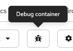

# How to debug a container?

Sometimes when deploying your pod, after a few seconds, the status of it will be `CrashLoopBackOff` or `Error`. In this case, you can check the logs of the pods but you might need to enter the Terminal to check what's wrong. You cannot because the pod fails to start.

In this article, we will see how to debug a container with two methods:

- The first one using the Rahti web interface
- The second one using the [oc](../../cloud/rahti/usage/cli.md) command line tool.

## Deploying a failing pod

Let's deploy a failing pod. For that, we will use the official NGINX image. This image will fail because it runs with super-privilege, which is not possible on Rahti (OpenShift). More information [here](../../cloud/rahti/security-guide.md)

Here is our Deployment:

```yaml
kind: Deployment
apiVersion: apps/v1
metadata:
  name: test-debug
spec:
  replicas: 1
  selector:
    matchLabels:
      app: test-debug
  template:
    metadata:
      labels:
        app: test-debug
    spec:
      containers:
        - name: nginx
          image: 'nginx:latest'
          ports:
            - containerPort: 8080
              protocol: TCP
          imagePullPolicy: Always
      restartPolicy: Always
  strategy:
    type: RollingUpdate
    rollingUpdate:
      maxUnavailable: 25%
      maxSurge: 25%
```

Save it in a file named `deployment-fail.yaml` (for example)

Deploy it by running this command:

```
oc apply -f deployment-fail.yaml
```

Now, check your pod. It should fail. Take a look at the logs, you should see this:

```
/docker-entrypoint.sh: /docker-entrypoint.d/ is not empty, will attempt to perform configuration
/docker-entrypoint.sh: Looking for shell scripts in /docker-entrypoint.d/
/docker-entrypoint.sh: Launching /docker-entrypoint.d/10-listen-on-ipv6-by-default.sh
10-listen-on-ipv6-by-default.sh: info: can not modify /etc/nginx/conf.d/default.conf (read-only file system?)
/docker-entrypoint.sh: Sourcing /docker-entrypoint.d/15-local-resolvers.envsh
/docker-entrypoint.sh: Launching /docker-entrypoint.d/20-envsubst-on-templates.sh
/docker-entrypoint.sh: Launching /docker-entrypoint.d/30-tune-worker-processes.sh
/docker-entrypoint.sh: Configuration complete; ready for start up
2026/07/10 13:21:40 [warn] 1#1: the "user" directive makes sense only if the master process runs with super-user privileges, ignored in /etc/nginx/nginx.conf:2
nginx: [warn] the "user" directive makes sense only if the master process runs with super-user privileges, ignored in /etc/nginx/nginx.conf:2
2026/07/10 13:21:40 [emerg] 1#1: mkdir() "/var/cache/nginx/client_temp" failed (13: Permission denied)
nginx: [emerg] mkdir() "/var/cache/nginx/client_temp" failed (13: Permission denied)
```

## Debug a container using the Rahti web interface

Let's take these errors:

```
2026/07/10 13:21:40 [warn] 1#1: the "user" directive makes sense only if the master process runs with super-user privileges, ignored in /etc/nginx/nginx.conf:2
nginx: [warn] the "user" directive makes sense only if the master process runs with super-user privileges, ignored in /etc/nginx/nginx.conf:2
2026/07/10 13:21:40 [emerg] 1#1: mkdir() "/var/cache/nginx/client_temp" failed (13: Permission denied)
nginx: [emerg] mkdir() "/var/cache/nginx/client_temp" failed (13: Permission denied)
```

It would be interesting to check the file `nginx.conf` but you cannot because the pod is failing. Here comes the debug container!

On Rahti, navigate to Workloads > Pods and select your pod in status `Error` or `CrashLoopBackOff`. Click on the tab `Logs` and click on the icon that looks like a ladybug:



It will automatically start a debug container. You can now check the content of the file `/etc/nginx/nginx.conf` by running the command:

```
cat /etc/nginx/nginx.conf
```

And also the permission on `/var/cache/nginx/` by running the command:

```
ls -l /var/cache/nginx
```

!!! note "Terminal"
    If you cannot see the commands in the Terminal, please everyxpand it by clicking "Expand" on the top right. You can collapse and the commands will still be displayed

Two things that needs to be done:

1. The user directive isn't necessary because every pod in Rahti starts with a random UID and GID (check our [security guide](../../cloud/rahti/security-guide.md))

2. We need to update the permission on `/var/cache/nginx`

### How to?

We need to create a custom image based on the official NGINX one. CSC developed one and it can be pulled on dockerhub: `cscfi/nginx-okd`. For more information, you can find the Dockerfile in our [GitHub repository](https://github.com/CSCfi/nginx-okd/blob/main/Dockerfile)

You can see that we updated the permissions on these [lines](https://github.com/CSCfi/nginx-okd/blob/06fb3f7e8dbf17ff1ad31c85f4b48732d7668fe2/Dockerfile#L4-L5) and we commented the `user` directive [here](https://github.com/CSCfi/nginx-okd/blob/06fb3f7e8dbf17ff1ad31c85f4b48732d7668fe2/Dockerfile#L10-L11)

!!! note
    It is not possible to run an application on the ports 80 and 443. That's why we also updated the port in the [configuration](https://github.com/CSCfi/nginx-okd/blob/06fb3f7e8dbf17ff1ad31c85f4b48732d7668fe2/Dockerfile#L6-L7)

After debugging your pod, you can exit the terminal, it will automatically kill the debug container.

## Debug a container using the CLI tool

The procedure is the same, the only difference is that you need to run this command:

```
oc debug pod/<the name of your pod>
```

A new debug container will start and you will arrive directly to the prompt.

## Troubleshooting

If your debug container cannot start, it might be because a volume is attached. Rahti doesn't support ReadWriteMany (RWX) for the moment. You need to remove the volume to start your debug container by updating your deployment.

You can check the tab **Events**
