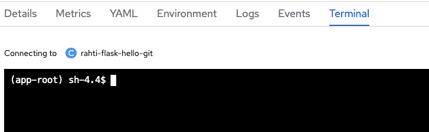

# How to open a terminal to a Pod?

In order to open a terminal to a **Running** Pod there are two options:

## Using the web interface

1. Log into Rahti 2's web interface and navigate to **Project > Pods**. (Or **Workloads > Pods** in Administrator view)

1. Click on any of the Pod names whose status is **Running**.

1. Click on the **Terminal** tab to reveal the terminal.



## Using the command line with `oc`

1. First, get the name of the Pod you want to open an interactive terminal session to:

	```sh
	$ oc get pods
	NAME                READY     STATUS      RESTARTS   AGE
	django-ex-1-build   0/1       Completed   0          2h
	django-ex-1-svwg2   1/1       Running     0          2h
	django-ex-1-rtbak   1/1       Running     0          2h
	```

1. We see that a terminal to either `django-ex-1-svwg2` or `django-ex-1-rtbak` can be opened.

	```sh
	oc rsh pod/django-ex-1-rtbak
	```

