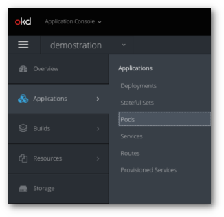
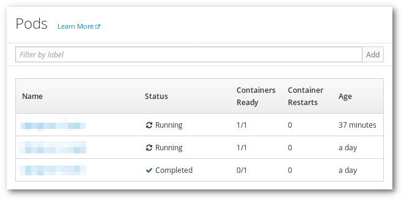
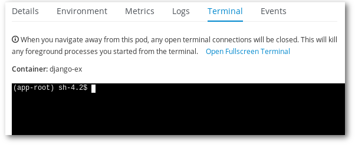

# How to open a terminal to a Pod?

In order to open a terminal to a **Running** Pod there are two options:

## Using the web interface

1. Log into Rahti's web interface and navigate to **Applications > Pods**.



1. Click in any of the Pod names whose status is **Running**.



1. Click in the **Terminal** tab to reveal the terminal.



## Using the command line with `oc`

1. First, get the name of the Pod you want to open the interactive terminal session:

	```sh
	$ oc get pods
	NAME                READY     STATUS      RESTARTS   AGE
	django-ex-1-build   0/1       Completed   0          2h
	django-ex-1-svwg2   1/1       Running     0          2h
	django-ex-1-rtbak   1/1       Running     0          2h
	```

1. We can open a terminal to either `django-ex-1-svwg2` or `django-ex-1-rtbak`.

	```sh
	oc rsh pod/django-ex-1-rtbak
	```

