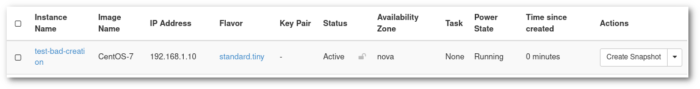
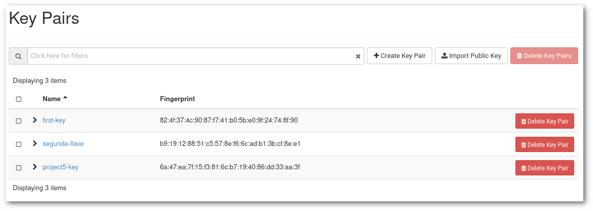
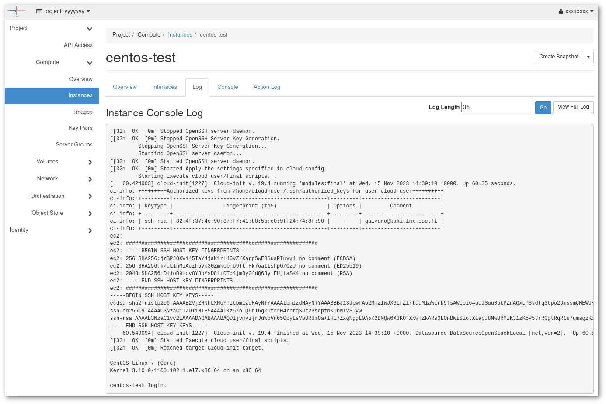

# Why can't I connect to my virtual machine in Pouta?

There are several reasons that can cause problems when connecting to a VM. We will go through all the steps one by one.

## Network

### Floating IP

Before connecting to a cPouta VM, it is necessary to add a Floating IP. This step is not necessary in ePouta, indeed ePouta does not provide Virtual IPs, one must connect directly to the Private IP.

In order to add a virtual ip, follow the [Post creation step](/cloud/pouta/launch-vm-from-web-gui/#post-creation-step) guide.

### Security groups - Openstack's firewall

```sh
$ ssh cloud-user@yy.yy.yyy.yy
ssh: connect to host yy.yy.yyy.yy port 22: Connection timed out
```

The most common reason that cause connection problems are firewalls and security groups that are too restrictive. Newly launched virtual machines will by default block all traffic. You need to create a new security group. The security group must open the SSH port 22 to the ingress traffic.

Please follow the [Firewalls and security](/cloud/pouta/launch-vm-from-web-gui/#firewalls-and-security-groups) groups article. If the problem persists you may check the firewall setup of your local institution.

### REMOTE HOST IDENTIFICATION HAS CHANGED

Sometimes Floating IPs are reused with different Virtual Machines at different times. By default your SSH client will have `stricthostkeychecking=yes` configured, and will show you the error message:

```sh
$ ssh cloud-user@86.50.xxx.xxx
@@@@@@@@@@@@@@@@@@@@@@@@@@@@@@@@@@@@@@@@@@@@@@@@@@@@@@@@@@@
@    WARNING: REMOTE HOST IDENTIFICATION HAS CHANGED!     @
@@@@@@@@@@@@@@@@@@@@@@@@@@@@@@@@@@@@@@@@@@@@@@@@@@@@@@@@@@@
IT IS POSSIBLE THAT SOMEONE IS DOING SOMETHING NASTY!
Someone could be eavesdropping on you right now (man-in-the-middle attack)!
It is also possible that a host key has just been changed.
The fingerprint for the ECDSA key sent by the remote host is
SHA256:JURkzITHXHGavwz6fAahou5g4ii1q9CVuzLyImH5+tI.
Please contact your system administrator.
Add correct host key in /home/yyyy/.ssh/known_hosts to get rid of this message.
Offending ECDSA key in /home/yyyy/.ssh/known_hosts:28
  remove with:
  ssh-keygen -f "/home/yyyy/.ssh/known_hosts" -R "86.50.xxx.xxx"
ECDSA host key for 86.50.xxx.xxx has changed and you have requested strict checking.
Host key verification failed.
```

You can safely do as it suggests and remove the entry. But only if you are sure that it is the first time you connect to said IP since it has been assigned to a new instance, or since the instance has been reinstalled. The example shows the output of the ssh command, different tools and versions might have a slightly different output, but the principle is the same.

## Authentication

```sh
Received disconnect from xx.xx.xxx.xx port 22:2: Too many authentication failures
```

If the authentication is not confired properly, you may see an error similar to the one above.

### Are you using the corect user?

Different distributions are configured with different defaults users. See here the up to date list of [images](/cloud/pouta/images/#images) and their corresponding default users.

It is a common practise for Pouta images, when you try to login as `root`, to get a message back telling you which username to use instead:

```sh
$ ssh root@86.xxx.xxx.xxx               
Please login as the user "cloud-user" rather than the user "root".
```

### Is a key pair configured in the Instance?

It can happen that when the instance was created you forgot to add a key pair during the creation. This can be checked from the [instance page](https://pouta.csc.fi/dashboard/project/instances/).



The only solution for this issue is to recreate the instance, this time remember to add a key pair. See the [SSH Key Pair](/cloud/tutorials/ssh-key/) and the [Creating a virtual machine](/cloud/pouta/launch-vm-from-web-gui/) articles.

### Are you offering the correct private key?

It could be that there is a public key configured in the instance, but you lack the correct corresponding private key. It is possible to double check this thanks to the key's finger print. There are two ways to check which fingerprint is configured in the Virtual machine.

1. Go to the [instance page](https://pouta.csc.fi/dashboard/project/instances/), find the row corresponding to your VM and write down the name of the key pair configured. Then go to the [Key Pairs](https://pouta.csc.fi/dashboard/project/key_pairs) page and find the key pair corresponding to the key pair you wrote earlier.

    

1. You can also see the finger print of the key from the Instance log. Go to [instance page](https://pouta.csc.fi/dashboard/project/instances/) and click in the name of the instance. Then click in the Log tab. You will need to find the lines that begin with `ci-info`. This is the output of the cloud init script.

    

You will be able to see the username, the file where the keys are configured and the list of finger prints of the configured keys.

Finally you need to compute the finger prints of the private keys you have configured in your PC:

```sh
$ ssh-keygen -lf ~/.ssh/id_rsa -E md5  
3072 MD5:85:bb:dc:2e:65:5f:d7:8f:b3:d1:25:5c:7c:16:26:b5 someone@somewhere (RSA)
$ ssh-keygen -lf ~/.ssh/id_rsa.pub -E md5
3072 MD5:85:bb:dc:2e:65:5f:d7:8f:b3:d1:25:5c:7c:16:26:b5 someone@somewhere (RSA)
```

As you can see, the MD5 finger prints match.

!!! Info "Generate public from private"

    If you have lost the public key corresponding to a private key, it is possible to regenerate it:

    ```sh
    $ ssh-keygen -yf id_rsa
    ```
