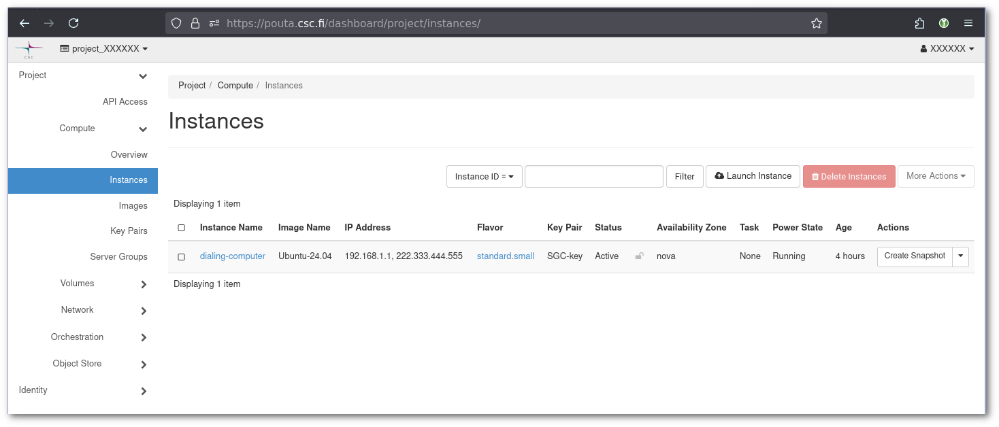
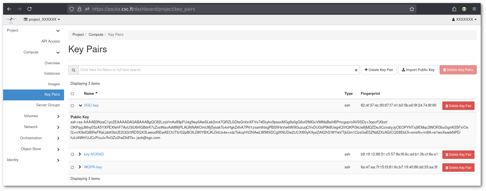

# Miksi en voi yhdistää virtuaalikoneeseeni Poutassa?

On useita syitä, jotka voivat aiheuttaa ongelmia yhdistettäessä VM:ään. Käymme kaikki vaiheet läpi yksi kerrallaan.

## Verkko {#network}

### Kelluva IP {#floating-ip}

Ennen kuin yhdistät cPouta VM:ään, on tarpeen lisätä kelluva IP-osoite. Tätä vaihetta ei tarvita ePoutassa, sillä ePouta ei tarjoa virtuaali IP-osoitteita, vaan yhteys on otettava suoraan yksityiseen IP-osoitteeseen.

Jotta lisätään virtuaali-IP, seuraa [Post creation step](../../cloud/pouta/launch-vm-from-web-gui.md#post-creation-step) -ohjetta.

### portti 22: Yhteyden aikakatkaisu {#port-22-connection-timed-out}

```sh
$ ssh cloud-user@yy.yy.yyy.yy
ssh: connect to host yy.yy.yyy.yy port 22: Connection timed out
```

Jos et pysty yhdistämään VM:ään, yleisin syy näihin ongelmiin ovat **palomuurit** ja **turvaryhmät** (Openstackin palomuuri), jotka ovat liian rajoittavia. Uudet virtuaalikoneet estävät oletuksena kaiken liikenteen. Sinun on luotava uusi turvaryhmä. Turvaryhmän on avattava SSH-portti 22 saapuvalle liikenteelle.

Seuraa [Firewalls and security](../../cloud/pouta/launch-vm-from-web-gui.md#firewalls-and-security-groups) -artikkelia. Jos ongelma jatkuu, voit tarkistaa paikallisen laitoksesi palomuuriasetukset.

!!! Varoitus "Käyttöoikeus evätty"
    Väärin määritetyt turvaryhmät voivat johtaa käyttöoikeuden evätty -virheisiin, koska VM tarvitsee hakea julkiset SSH-avaimet ensimmäisellä käynnistyksellään. Jos verkkoa ei ole määritetty oikein, julkista avainta ei ehkä lisätä eikä pääsyä konfiguroida.
    Siksi sinun on varmistettava, että `default`-turvaryhmä on määritetty VM:ään sen luomisessa.

### REMOTE HOST IDENTIFICATION HAS CHANGED {#remote-host-identification-has-changed}

Joskus kelluvia IP-osoitteita käytetään uudelleen eri virtuaalikoneiden kanssa eri aikoina. Oletuksena SSH-asiakkaasi on määritetty `stricthostkeychecking=yes` ja näyttää sinulle virheilmoituksen:

```sh
$ ssh cloud-user@86.50.xxx.xxx
@@@@@@@@@@@@@@@@@@@@@@@@@@@@@@@@@@@@@@@@@@@@@@@@@@@@@@@@@@@
@   WARNING: REMOTE HOST IDENTIFICATION HAS CHANGED!      @
@@@@@@@@@@@@@@@@@@@@@@@@@@@@@@@@@@@@@@@@@@@@@@@@@@@@@@@@@@@
IT IS POSSIBLE THAT SOMEONE IS DOING SOMETHING NASTY!
Someone could be eavesdropping on you right now (man-in-the-middle attack)!
It is also possible that a host key has just been changed.
The fingerprint for the ECDSA key sent by the remote host is
SHA256:JURkzITHXHGavwz6fAahou5g4ii1q9CVuzLyImH5+tI.
Please contact your system administrator.
Add correct host key in /home/yyyy/.ssh/known_hosts to get rid of this message.
Offending ECDSA key in /home/yyyy/.ssh/known_hosts:28
  remove with:
  ssh-keygen -f "/home/yyyy/.ssh/known_hosts" -R "86.50.xxx.xxx"
ECDSA host key for 86.50.xxx.xxx has changed and you have requested strict checking.
Host key verification failed.
```

Voit turvallisesti tehdä mitä se ehdottaa ja poistaa merkinnän. Mutta vain jos olet varma, että se on ensimmäinen kerta, kun yhdistät kyseiseen IP:hen, sen jälkeen kun se on määritetty uudelle instanssille tai kun instanssi on asennettu uudelleen. Esimerkki näyttää ssh-komennon tulosteen, eri työkalut ja versiot voivat tarjota hieman erilaisen tulosteen, mutta periaate on sama.

## Autentikointi - Käyttöoikeus evätty (liian monta kirjautumisyritystä) {#authentication-permission-denied-too-many-authentication-failures}

```sh
Received disconnect from xx.xx.xxx.xx port 22:2: Too many authentication failures
```

Jos autentikointi ei ole määritetty oikein, saatat nähdä virheen, joka on samanlainen kuin yllä. Tämä virhe voi johtua eri perusongelmista.

### Käytätkö oikeaa käyttäjää? {#are-you-using-the-correct-user}

Eri jakelut on määritetty eri oletuskäyttäjillä. Katso päivitetty lista [kuvista](../../cloud/pouta/images.md#images) ja niiden vastaavista oletuskäyttäjistä. Esimerkiksi, jos käytät "Ubuntu 24.04", oikea käyttäjä on "ubuntu", mutta jos käytät "AlmaLinux-9", oikea käyttäjä on "almalinux".

Pouta-kuville on yleistä, että kun yrität kirjautua sisään käyttäjänä `root`, saat viestin, joka kertoo sinulle, mitä käyttäjänimeä sinun pitäisi käyttää sen sijaan:

```sh
$ ssh root@86.xxx.xxx.xxx
Please login as the user "cloud-user" rather than the user "root".
```

### Mikä avainpari on konfiguroitu instanssissa? Ja onko sinulla vastaava yksityinen avain? {#which-key-pair-is-configured-in-the-instance-and-do-you-have-the-matching-private-key}

Jotta näet, mikä "**Avainpari**" on konfiguroitu kyseiselle VM:lle. Mene osoitteeseen <https://pouta.csc.fi/dashboard/project/instances/> ja katso avainparin nimi.



Mene sitten osoitteeseen <https://pouta.csc.fi/dashboard/project/key_pairs>, jossa kaikki **sinun** avaimet on konfiguroitu. Sivusto antaa sinulle listan **julkisista avaimista**. Yllä olevassa kuvakaappauksessa "**Avainpari**" on `SGC-key`.



Kopioi julkisen avaimen sisältö (`ssh-rsa AAA.... jack@sgc.com`) tiedostoon nimeltä `SGC-key.pub`. Voit sitten laskea **julkisen avaimen** sormenjäljen seuraavasti:

```sh
$ ssh-keygen -lf SGC-key.pub
2048 SHA256:FjN0zrymP3mMZzTJ/UJrypmVVcH8Wgok9+JBiBhcvFc no comment (RSA)
```

Yllä oleva esimerkki käyttää oletuksena `SHA256`-algoritmia. Voit pakottaa sen käyttämään `MD5`:ta seuraavasti:

```sh
$ ssh-keygen -lf .ssh/SGC-key.pub -E md5
2048 MD5:eb:b3:eb:ff:65:2f:cb:a5:fa:ab:f4:84:04:a2:d3:9a no comment (RSA)
```

!!! Info "Avainpari puuttuu"
    On mahdollista, että VM luotiin ilman "**avainparia**" (vastaava kenttä on tyhjä `-`), tässä tapauksessa sinun on [luotava VM uudelleen](../../cloud/pouta/launch-vm-from-web-gui.md), tällä kertaa avainparilla konfiguroituna.
    

Seuraavaksi sinun on löydettävä vastaava **yksityinen avain**. Linuxissa ja MacOS:ssa yksityiset avaimet tallennetaan yleensä `.ssh`-kansioon. Voit käyttää samaa komentoa genXCategorías sormenjäljen luomiseen yksityiselle avaimelle:

```sh
$ ssh-keygen -lf .ssh/SGC-key
2048 SHA256:FjN0zrymP3mMZzTJ/UJrypmVVcH8Wgok9+JBiBhcvFc no comment (RSA)
```

Sormenjälkien on vastattava toisiaan.

!!! Info "Instanssiloki"
    Voit myös nähdä avaimen sormenjäljen **instanssilokista**. Mene [instanssisivulle](https://pouta.csc.fi/dashboard/project/instances/) ja klikkaa instanssin nimeä. Klikkaa sitten Lokit-välilehteä. Sinun on löydettävä rivit, jotka alkavat `ci-info`. Tämä on pilven aloitusskriptin tuloste.

    

    Voit nähdä käyttäjänimen, tiedoston, jossa avaimet on konfiguroitu, ja konfiguroitujen avainten sormenjälkiluettelon. Yllä oleva esimerkki näyttää `MD5`-algoritmin tulosteen.

Jos et löydä vastaavaa yksityistä avainta, sinun on joko [luotava VM uudelleen](../../cloud/pouta/launch-vm-from-web-gui.md) ssh-avainparilla, joka on sinun omasi ja hallinnassasi, tai käytettävä [Kuinka pelastaa instanssit?](./pouta-openstack-rescue-mode.md) -opastamme, jotta voit käyttää VM:n levyä ja vaihtaa julkisen avaimen `authorized_keys`-tiedostoon. Tämä viimeinen vaihtoehto on monimutkainen ja tarpeen vain, jos sinulla on jo dataa ja/tai ohjelmistoa VM:n paikallisella levyllä. Jos sinun on noudatettava tätä toista vaihtoehtoa, mutta et tiedä miten, tee tiketti meille osoitteessa <servicedesk@csc.fi>, niin autamme sinua askel askeleelta.

### Tarjoatko oikean yksityisen avaimen? {#are-you-offering-the-correct-private-key}

Oletuksena ssh-asiakas tarjoaa vain ne ssh-avaimet, joilla on _vakionimi_ ja jotka ovat _vakiohakemistossa_ (`.ssh` hakemistossa `$HOME`-kansiossa). Jos sinulla on ei-vakioniminen tiedosto tai ei-vakiosijaintinen tiedosto, voit käyttää `-i <yksityinen_avain_tiedosto>` -vaihtoehtoa varmistaaksesi, että avain tarjotaan, ja `-v` kasvattaaksesi lokitulosteita, nähdäksesi milloin asiakas tarjoaa sen. Komento on seuraavanlainen:

```sh
$ ssh -v -i .ssh/SGC-key ubuntu@193.166.200.200 2>&1 | grep SGC-key
debug1: identity file /home/galvaro/.ssh/SGC-key type 0
debug1: identity file /home/galvaro/.ssh/SGC-key-cert type -1
debug1: Will attempt key: /home/galvaro/.ssh/SGC-key RSA SHA256:FjN0zrymP3mMZzTJ/UJrypmVVcH8Wgok9+JBiBhcvFc explicit agent
debug1: Offering public key: /home/galvaro/.ssh/SGC-key RSA SHA256:FjN0zrymP3mMZzTJ/UJrypmVVcH8Wgok9+JBiBhcvFc explicit agent
```

Jos mikään näistä ei toimi, ota yhteyttä osoitteeseen <servicedesk@csc.fi>.