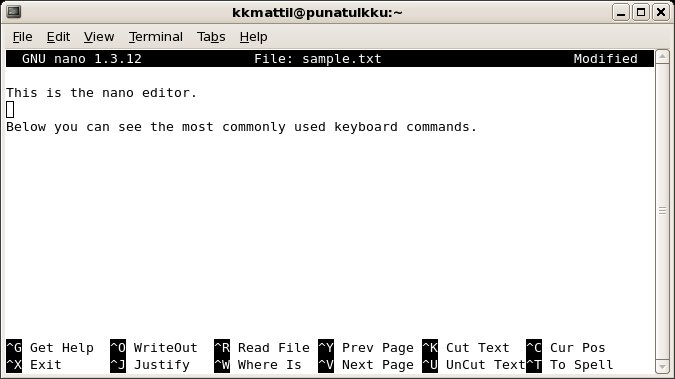
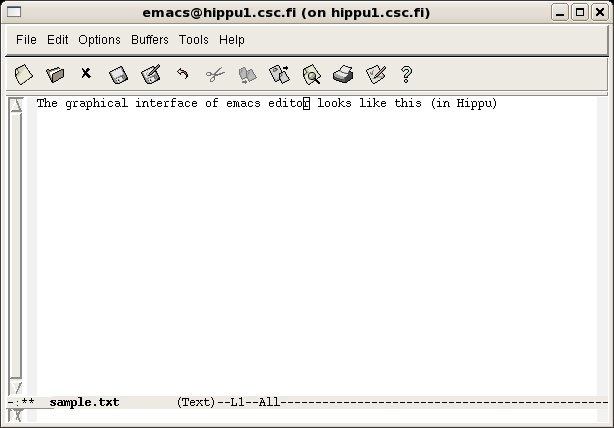
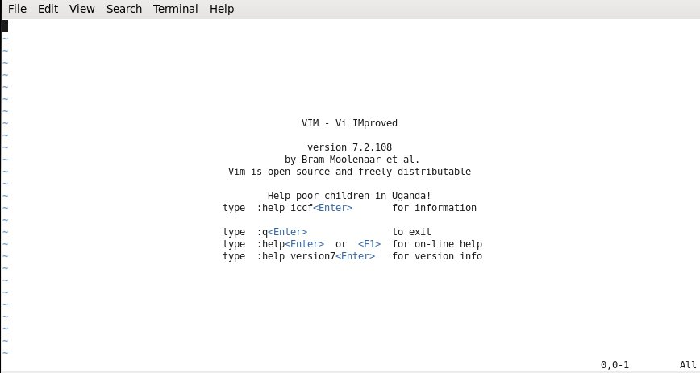
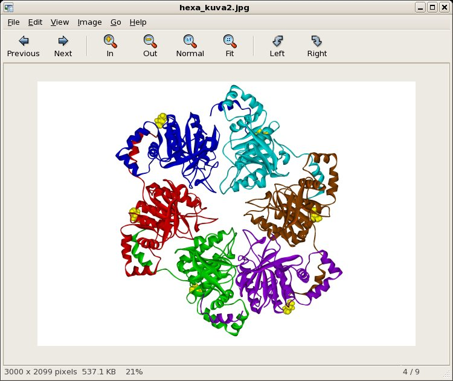

# Editing text and viewing images

Editing text files by typing in Linux systems can be done with so-called
*text editor* programs. Editors are normally used to modify or create
relatively small files like programs, parameter files or small input
files. Systematic modifications to large input or output data files are
normally done with other tools.

Several text editors are available in the CSC computing environment.
Here we briefly introduce just three of them: **nano**, **Emacs** and
**Vim**. Other frequently used text editors include **vi** and
**gedit**. In addition to these general purpose text editors, many
application programs include their own special editing tools.

## nano

**nano** is a simple and handy tool for editing small files. It is
easy to use, and it suits well as the first text editor of a novice Linux
user. nano is a text based editor: it does not include any mouse based
functions or command menus. nano starts with command:

```bash
nano text_file_name
```

This command opens the given file to the editor or creates a new empty
file if the file does not already exist.

When the nano editor has started, you can see the basic commands listed
at the bottom of the screen. The listed commands are executed by
pressing simultaneously the control key `Ctrl`, to which the program
refers with `^` sign, and some listed keys. For example, you can
read the exit from the program with `Ctrl-x`, save the changes with
`Ctrl-o` or read a new file to the editor with `Ctrl-r`. If
you already have some text in nano, `Ctrl-r` will add the content
of the selected file to the end of the previously created text. With
`Ctrl-v` you can browse the text one page forward and with
`Ctrl-y` one page backwards. `Ctrl-w` command can be used to
search certain strings (words) from the text. `Ctrl-k` cuts one line
of text. To cut larger regions, first mark the beginning of the text to
be copied with `Ctrl-6` then move the cursor to the end of the area
and press `Ctrl-k`. To paste the text that was cut, press
`Ctrl-u`. More commands can be found from the nano help text that
is opened by pressing `Ctrl-g`.



## Emacs

**Emacs** is a versatile editor that contains a large amount of
commands, functions and extensions. Emacs can be used in two ways: as a
character based editor like nano or through a graphical interface.
Using the graphical interface requires that you have X-term
connection to CSC or are using a
[web interface remote desktop](../../../computing/webinterface/desktop.md).
In the character based mode Emacs commands are given
using `Ctrl` and `Esc` keys much like in the case of nano commands. In
the graphical interface you can use also mouse-based command menus which
makes working much more feasible for a new Emacs user. To start Emacs in
CSC environment, type:

```bash
emacs file_name
```

If using a web interface remote desktop, you can open the
graphical Emacs interface from `Application > Accessories > Emacs`.
In the graphical user interface the *File* menu is used to read in and save
files. *Edit* menu include commands to copy, cut and paste text. This menu
also contains tools to search and replace strings. With the commands in
the *Options* menu you can control many properties of Emacs. You can
for example use syntax highlighting when you are working with a
program or a shell script file. You can have several files opened in one
Emacs session. The *Buffers* menu allows you to choose the buffer to
be edited. The *Tools* menu contains miscellaneous commands and
tools.

If you don't have remote graphics enabled, you need to know the
[command shortcuts](https://www.gnu.org/software/emacs/refcards/pdf/refcard.pdf).
For example, the shortcut to exit is `ctrl-x ctrl-c`.



## Vim

**Vim** is a highly configurable text editor built to enable
efficient text editing. It is an improved version of the **vi** editor
distributed with most UNIX systems. vi is the de facto standard
Linux editor. Essentially all Linux systems come with vi (or a
variant, like Vim) built in.

Vim is often called a "programmer's editor" as it is useful for
programming. It's however not just for programmers, though. Vim is
suitable for all kinds of text editing, from composing email to editing
configuration files.

To start Vim in CSC environment, type:

```bash
vi file_name
```

or

```bash
vim file_name
```

Vim differs from many editors in that it has two main modes of
operation: *command mode*, and *insert mode*. This is the cause of much
of the confusion when a new user is learning it.

To switch to the insert mode one needs to press the `i` key. When you
have finished entering a text, press `Esc` to return to the command
mode. To save the file enter command `:w file_name`.

!!! info "Tip"
    The command to quit Vim is `:q`, which needs to be issued in command mode.

To exit Vim without saving, and ignoring any warnings about unsaved
data, use a variation of the `:q` command, i.e., `:q!`. This will return you to
the prompt without saving any changes to the file, and with no warnings about
unsaved data. This command should be used carefully.

To enter insert mode and insert text at current position, type `i` and
start typing a text, to append text after current position, type `a`.
To delete characters while in insert mode, use *Backspace* and *Delete*
keys.

For more options, please refer to the Vim manual.



## Image and PostScript viewers

In some cases application programs executed at CSC, produce image files
instead of text files. If you have a working X-term connection you can use
**eog** (Eye of GNOME) and **Evince** programs to view image files. eog is a
simple image viewing program that can display common image formats like png,
bmp, jpg and tiff. However eog is not able to show PostScript (ps) or
pdf files. For these file types you can use program Evince.

To view a jpg file, type:

```bash
eog image_name.jpg
```

and to view a PostScript file, type:

```bash
evince file_name.ps
```

PostScript files can be converted to pdf documents with command
`ps2pdf`. This command reads a PostScript file and prints out
corresponding pdf file. For example command:

```bash
ps2pdf file1.ps
```

produces a pdf-formatted file `file1.pdf`


