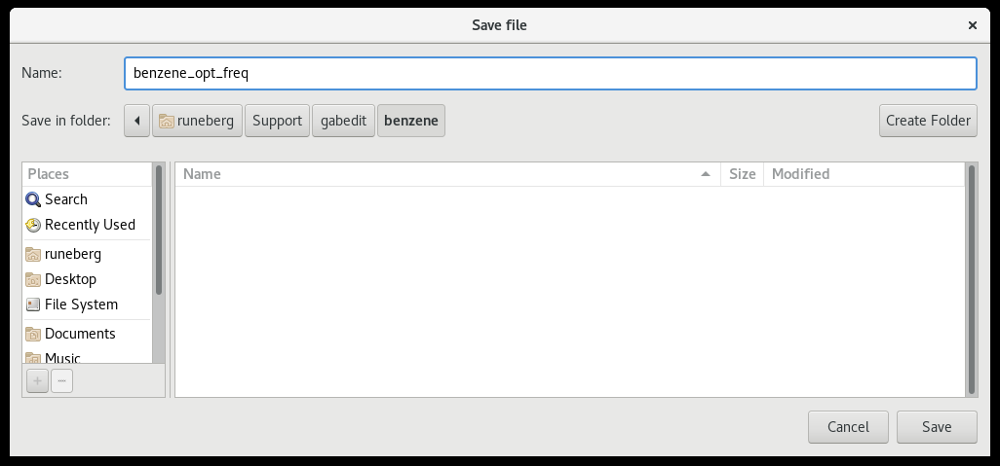
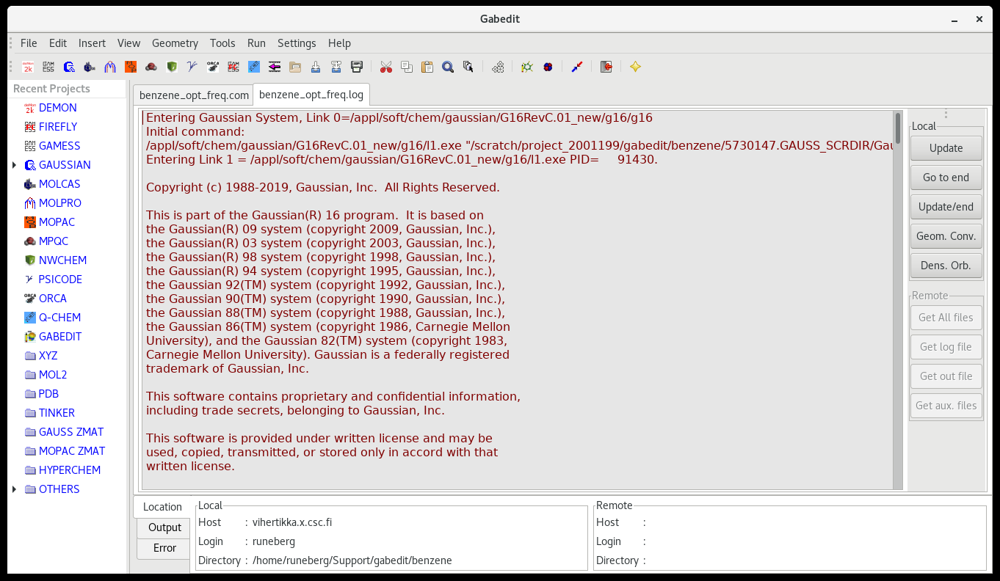

# Using Gabedit as GUI for Gaussian jobs on Puhti

[Gabedit](http://gabedit.sourceforge.net/) is a free graphical user interface
(GUI) to many computational chemistry packages. Here we introduce how it can be
used to prepare and analyze [Gaussian](../../apps/gaussian.md) jobs on Puhti.
The prerequisites are that you have a valid CSC account that belongs to the
Gaussian group, and that you are a member of a CSC project that has access to
Puhti. This tutorial also assumes that you have Gabedit installed on your local
computer.

## The workflow

In short, the major steps to construct, run and analyze a Gaussian job on Puhti
using Gabedit are:

1. Create the Gaussian input using Gabedit on your local computer.
2. Copy the input files from your local computer to a suitable working
   directory on Puhti.
3. Start the calculation on Puhti.
4. Copy the results from Puhti to your local computer.
5. Use Gabedit to analyze the results.

### 1. Create the Gaussian input

1. In Gabedit, build or load your molecular structure.
2. Define the method and other details you want to use.
   
3. Save it as a Gaussian input in a separate directory (here called `benzene`).
   

### 2. Copy the input files to Puhti

1. Copy the whole input directory (here called `benzene`) to a suitable scratch
   directory on Puhti. Here we use `rsync`. For other methods, see
   [Moving data between CSC and local workstation](../../data/moving/index.md).

      ```bash
      rsync -rP benzene username@puhti.csc.fi:/scratch/project_2001234/gabedit
      ```

### 3. Start the calculation on Puhti

1. Login to Puhti and go that directory:

      ```bash
      cd /scratch/project_2001234/gabedit/benzene
      ```

2. Load the gaussian module with `module load gaussian`.
3. Submit the calculation:

      ```bash
      subg16 00:10:00 benzene_opt_freq project_2001234
      ```

### 4. Copy the results back to your own computer

1. Once the gaussian job has finished, copy the whole directory from Puhti back
  to your own computer. Give this command on your own computer:

      ```bash
      rsync -rP username@puhti.csc.fi:/scratch/project_2001234/gabedit/benzene/ .
      ```

### 5. Use Gabedit to analyze the results

1. In Gabedit use `File -> Open` to navigate to the directory where the results
   are.
2. In the lower right corner of the `Open file` window change the `*.inp` to
   `*.com`.
3. Select the com-file corresponding to your Gaussian job and open it. This
   opens the main Gabedit window.
4. Select the tab showing the log file.
   
5. The panel on the right shows various options that can be analyzed.
6. In the example above we calculated the vibrational frequencies. These
   results can be studied by selecting `Dens. Orb` that opens the
   `Gabedit: Orbitals/Density/Vibration` window.
      1. On the canvas do right-click.
      2. Select `Animation -> Vibration`.
      3. By selecting a particular mode from the table, it can be animated by
         hitting `Play`.
      4. The calculated spectrum is shown by selecting from the `Vibration`
         window `Tools -> Draw IR spectrum`.
