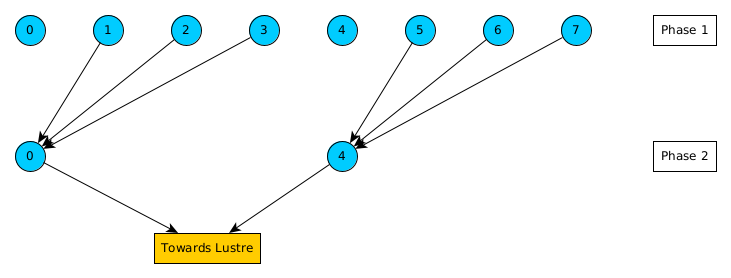
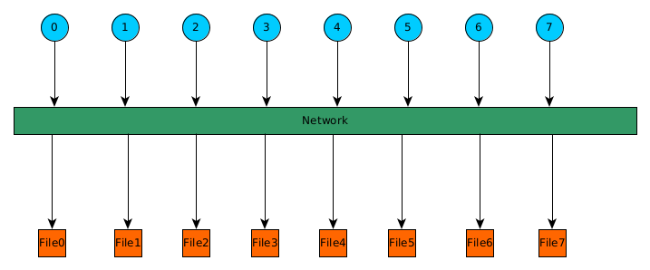

# How to achieve better I/O performance on Lustre

In this tutorial, we discuss some technical details about parallel I/O
and provide examples for achieving higher performance. Please note also
the [Technical description about Lustre filesystem](../../computing/lustre.md)
used in CSC supercomputers.

## MPI I/O

When performing parallel I/O with MPI (or with libraries using MPI-IO
underneath), disk access can be done independently or collectively. In
independent I/O each MPI process access the filesystem directly, while
with collective I/O the MPI runtime gathers/scatters data via set of
aggregator I/O tasks. Collective I/O provides typically much higher
bandwidth than independent I/O.

* Example 8 MPI processes, 4 MPI processes per computing node, collective I/O,
  all the processes write on the same file.



*MPI-IO Aggregators example*

## Improving I/O with ROMIO hints

By default, for collective I/O, the OpenMPI on Mahti uses 1 MPI I/O
aggregator per compute node. This means that in our example above,
only 2 MPI processes do the actual I/O. They gather the data from the
rest of the processes (phase 1), and in the second phase they send the
data to the storage. The usage of the default MPI aggregators could be
enough, but in many cases, it is not. The number of aggregators per
node, as well as some other parameters affecting I/O, can be adjusted
with ROMIO hints.

Available hints for collective buffering (two-phase I/O) with the focus on
Lustre:

| Hint                | Description                                                                                                        |
|---------------------|--------------------------------------------------------------------------------------------------------------------|
|cb_buffer_size       | The buffer size, in bytes, of the intermediate buffer used in two-phase collective I/O                             |
|romio_cb_read        | Collective read operations during collective buffering, values: enable, disable, automatic                         |
|romio_cb_write       | Collective write operations during collective buffering, values: enable, disable, automatic                        |
|romio_no_indep_rw    | Controls if no independent read/write is enabled or not, values: enable, disable, automatic                        |
|cb_config_list       | Defines how many MPI I/O aggregators can be used per node, values: `*:X` where X aggregators per each compute node |
|cb_nodes             | The maximum number of aggregators to be used                                                                       |


### How can I change the MPI I/O hints?

Hints can be declared in a text file, as an example set the number of
MPI I/O aggregators per node to two:

```
cb_config_list *:2
```

In addition, environment variable `ROMIO_HINTS` needs to be set in your
batch job script:

```
export ROMIO_HINTS=/path/to/file_with_hints
```

Hints can be set also in the application code:

```
...
call MPI_Info_create(info,ierror)
call MPI_Info_set(info,'romio_cb_write','enable',ierror)
...
call MPI_File_open(comm,filename,amode,info,fh,ierror)
...
```

In order to check that your declarations were really applied, the used hints
and their values can be seen by setting in your batch job script:

```
export ROMIO_PRINT_HINTS=1
```

If, and only if there is collective I/O, the hints will be
printed in the standard output of the job, for example:

```
key = cb_buffer_size            value = 33554432
key = romio_cb_read             value = enable
key = romio_cb_write            value = enable
key = cb_nodes                  value = 64
key = romio_no_indep_rw         value = false
key = romio_cb_pfr              value = disable
...
```


## File per process

Some applications create one file per MPI process. Although this is
easy to implement, it is not necessarily efficient. If you use a lot
of processes per compute node there can be contention both for the
network on the node (as all processes need to access filesystem)
as well as for the actual I/O operations. There can be cases where
file per process is an efficient approach, but always be careful and
think about scalability, as this approach is not scalable.



*File Per Process*

## Benchmark - NAS BTIO

### Blocking I/O

For testing purposes we use the [NAS BTIO](https://github.com/wkliao/BTIO)
benchmark with support to PnetCDF in order to test the I/O performance on 16
compute nodes of Mahti.

We create an input file with:

```
w                  # IO mode:    w for write, r for read
2                  # IO method:  0 for MPI collective I/O, 1 for MPI_independent I/O,
                   # 2 for PnetCDF blocking I/O, 3 for PnetCDF nonblocking I/O
5                  # number of time steps
2048 1024 256      # grid_points(1), grid_points(2), grid_points(3)
/scratch/project_xxxxx/BTIO/output # output filew
```

This means that we do write operations with blocking PnetCDF, 5 time steps,
and with a total of almost half-billion grid points. The output file will be
almost 105 GB. We use 256 processes, 16 per compute node.

Executing with default settings, from the output of the benchmark:

```
I/O bandwidth    :    1292.96 MiB/s
```

#### Striping

We know that the Lustre striping is 1 MB, thus we set this in a file called
`romio`

```
striping_unit 1048576
```

and provide ROMIO hint:

```
export ROMIO_HINTS=/path/romio
```

When executing the benchmark again we get:

```
I/O bandwidth    :    2939.85 MiB/s
```

The performance is improved by a factor of 2.27.


#### MPI I/O Aggregators

By default there is one MPI I/O aggregator per compute node, so we increase it
to two by adding to the `romio` file:

```
cb_config_list *:2
```

When executing the benchmark again and we have now:

```
I/O bandwidth    :    3699.31 MiB/s
```

The performance is improved in total by factor of 2.86.

#### Increasing the number of Lustre OSTs

If we use two Lustre OSTs without any ROMIO hints, the performance is
3500 MiB/s, which is less than the previous result.

When using 2 OSTs with the `romio` file

```
striping_unit 1048576
romio_cb_write enable
romio_no_indep_rw true
romio_ds_write disable
```

performance is increased to 4667 MiB/s, an increase of 33%. In this
case, increasing the number of the aggregators does not improve the
performance.

Overall, the effect of ROMIO hints depends on the application and the used
hardware, the optimum parameters are not necessarily the same across various
applications.

### Non-Blocking I/O

We create an input file for non-blocking PnetCDF with:

```
w                  # IO mode:    w for write, r for read
3                  # IO method:  0 for MPI collective I/O, 1 for MPI_independent I/O,
                   # 2 for PnetCDF blocking I/O, 3 for PnetCDF nonblocking I/O
5                  # number of time steps
2048 1024 256      # grid_points(1), grid_points(2), grid_points(3)
/scratch/project_xxxxx/BTIO/output # output file
```

With the default ROMIO parameters the performance is 1820 MiB/s for 1 OST,
which is quite low for 16 compute nodes.

Next, we setup the `romio` file:

```
striping_unit 1048576
cb_config_list *:4
romio_ds_write disable
```

The achieved performance is 4565 MiB/s, this is 2.5 times improvement.

If we use 2 OSTs with the same `romio file`, the performance is 9520 MiB/s
which is more than twice that with 1 OST and more than twice than with
blocking I/O. With the default parameters, the achieved performance would be
7772 MiB/s, so the hints boost the performance by 22.5%.


## Conclusion

* First, verify that your I/O causes issues or it takes significant time from
  your total execution.
* Then, try to use I/O libraries such as
  [PNetCDF](https://parallel-netcdf.github.io/),
  [HDF5](https://www.hdfgroup.org/),
  [ADIOS](https://csmd.ornl.gov/software/adios2).
* Use non-blocking I/O for more efficient I/O
* Lustre striping and ROMIO hints can improve performance a lot.
