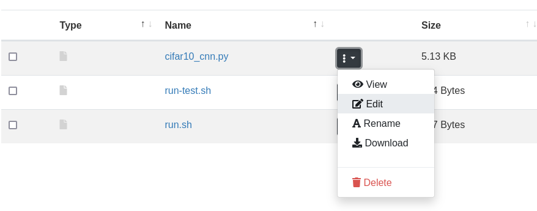

# Getting started with machine learning at CSC

*You have some machine learning code in Python running on your laptop, but it's
really slow. You've learned that moving to GPUs and CSC's supercomputers might
be the answer but the documentation seems a bit daunting.*

CSC's computing environment is well-documented at [docs.csc.fi](../../index.md),
but for a newcomer it might be a bit difficult to know how to get started.
**This guide will show you, step by step, how to get your codes and data to the
Puhti supercomputer and running on GPUs**. It is part of our [Machine learning
guide](ml-guide.md).

CSC has several supercomputers: [Puhti](../../computing/systems-puhti.md),
[Mahti](../../computing/systems-mahti.md) and
[LUMI](https://docs.lumi-supercomputer.eu/hardware/). In this guide we
will focus on using Puhti as it has the widest selection of software, and has a
web user interface, making it very easy to access.

When you are moving your code from your laptop to the Puhti supercomputer, it's
important to acknowledge that Puhti isn't just a "faster laptop". Because of the
fundamental difference in scale, some things work quite differently in a
supercomputer. So **be prepared to take a step back and relearn some things
about how computing is done**. We consider this a reasonable price to pay for
getting access to Finland's most powerful GPU resource for researchers!

!!! note

    While this guide tries to explain every step carefully, it is still recommended
    to have at least a basic familiarity with the Linux command line, as you will
    need to use that for a few of the steps. You can, for example, take a look at
    the first section of our [Linux basics tutorial](env-guide/index.md).


## Step 1: Get a CSC user account

First of all, you need to get a CSC user account, if you don't have one already.
If you work or study at a Finnish university just **go to the My CSC portal at
[my.csc.fi](https://my.csc.fi) and click "Get Started"**. Select Haka-Login and
your university from the pull-down menu. After that you should be able to log in
with your normal university credentials. Fill in your information on the *Sign
up*-page. Once you're done, you should get a confirmation email.

For more information, and special cases, check our separate ["How to create new
user account" documentation](../../accounts/how-to-create-new-user-account.md).

## Step 2: Join an existing project, or create a new one

Second, you need to belong to a computing project. This is because CSC needs to
keep track of how our resources are used, and computing projects are the
mechanism for that. 

If you are part of a research group, **ask your professor or group leader if you
already have a CSC project that you can join**. If that is the case the manager
of the project (most likely the professor) can add you to the project via the
[My CSC portal](https://my.csc.fi). Check our more [detailed documentation on
how to add a new user to a
project](../../accounts/how-to-add-members-to-project.md)

Otherwise, for example if you are working on your own doctoral thesis project,
you can create your own project. **To create a new project, go to [My
CSC](https://my.csc.fi)** and log in as in Step 1 above. Choose *My Projects*
and click the *New project* button. Give your project a name, and describe
briefly the research you are doing. "Academic" is probably the appropriate
category in most cases. For more information, check our "[Creating a new
project" documentation](../../accounts/how-to-create-new-project.md).

Once your project is created you also need to **add Puhti access to your
project**. See [Adding service access for a
project](../../accounts/how-to-add-service-access-for-project.md) for more
information on that.

**Make a note of the unix group of the project**, which is typically something
like `project_2001234`. In the remainder of this document we will use
`project_2001234` as a placeholder whenever we are referring to the unix group
of the project, but **remember to always replace that with your actual project
number**.

## Step 3: Log in to Puhti

There are many ways to access Puhti. The traditional way is via an SSH client
giving you a purely text based command line access to the Linux system running
on Puhti. However, here **we recommend the Puhti web interface accessible via a
web browser at [puhti.csc.fi](https://www.puhti.csc.fi)**. Log in with the
username and password created in Step 1 of this guide.

!!! note

    If you have just created your account minutes ago, it might be that it
    hasn't yet been activated on Puhti. Just go get a coffee, or beverage of
    your choice, and try again in a
    few minutes! &nbsp;  ☕

After logging in, you will see the Puhti web interface, which looks something
like this:


If you are unfamiliar with Puhti's web interface (based on [Open
OnDemand][OOD]), take some time to familiarize yourself with its functions.

For now, the main things to check are:

- The *Files* menu, it should show several disk areas for your use: your
  personal *Home directory* and `projappl` and `scratch` directories for each of
  your projects.

- The *Tools* → *Login node shell* to start a terminal session on Puhti. From
  here you can run Linux commands.

## Step 4: Copy your code to Puhti

**It is recommended to keep your code in the `projappl` directory of the project
to which your code belongs**, for example `/projappl/project_2001234/`. You can
navigate to this location in the Files browser in the Puhti web interface.

If you have code on your own computer, one option is to use the "Upload" button,
in the upper right corner in the Files browser. 

In our case we will clone the [code from a GitHub repository][GHExample], and
for that we need to open a terminal session. Click "Open in Terminal" in the
Files browser or start the *Login node shell* from the *Tools* menu. Then type
the following commands (and press ENTER at the end of each line):

```bash
cd /projappl/project_2001234  # needed only if your didn't navigate to correct directory
git clone https://github.com/mvsjober/pytorch-cifar10-example
```

This should create a copy of the code from the given GitHub repository to the
Puhti drive. You can now enter the newly created directory, either from the
terminal, or via the Files browser.

!!! note

    Here we have provided some example code for training a simple neural network on
    CIFAR10 data. You can of course replace that with your own code, for example
    from your own computer.

In the Files browser you can view a file by simply clicking on it. In particular
check the main source code in `cifar10_cnn.py`. Towards the end of the file you
can see the command line options. Notice that `--data_path` is a required
option, it is the path to where the dataset is stored.

In the Files browser you can edit a file by clicking on the file-specific menu
(three dots) and selecting *Edit*, as shown below.




## Step 5: Copy your data to Puhti

**It is recommended to keep your training data in the `scratch` directory of the
project**, for example `/scratch/project_2001234/`. **Remember that the scratch
will be regularly cleaned, so don't keep anything important there.** Datasets
should typically have another more permanent location, such as in
[Allas](../../data/Allas/index.md) for storing during the project's life-time.

You can navigate to `/scratch/project_2001234/` in the *Files* browser in the
Puhti web interface. Here we will fetch the dataset from a public Allas bucket
with `wget`. The `wget` command can be used to download any files which has a
URL address.

Type the command to download the dataset (launching the terminal as in Step 4 if
you haven't already done that):

```bash
cd /scratch/project_2001234  # needed only if your didn't navigate to correct directory
wget https://a3s.fi/mldata/cifar-10-python.tar.gz
```

The downloaded file is a compressed archive of the CIFAR10 dataset in a
Python-friendly format. 

Next you could extract the archive, but in this example we have opted not to do
so. We will instead extract the files to the fast local drive at the start of
each job. More on this in the next section.

## Step 6: Check what Python libraries you need

Before running your code, you should check what Python frameworks or libraries
you need. If you are using code that you have downloaded from the Internet,
there will usually be some installation instructions or a `requirements.txt`
file which tells what Python libraries are needed. Keep in mind, that **often
you should not follow the installation instructions exactly as they often assume
that you are installing on a personal computer**.

**CSC provides many pre-installed Python environments for popular frameworks and
libraries**. It's usually a good idea to use these as a starting point, even if
they don't contain all the packages you need. Check the list of
[data analytics and machine learning modules provided on CSC's supercomputers](../../apps/by_discipline.md#data-analytics-and-machine-learning).

For example [PyTorch](../../apps/pytorch.md) and
[TensorFlow](../../apps/tensorflow.md) have their own dedicated modules, while
[Python Data](../../apps/python-data.md) is a general module containing many
data analytics libraries such as numpy, SciPy, Scikit-learn, Dask, JupyterLab
and many others. These software environments can be activated with the `module
load` command. See the specific documentation pages listed above for more
details.

If you find a module that has most of what you need, but a few packages are
missing, you can easily install them yourself (to your home directory) with the
`pip install --user` command. See our [Python documentation for more information
on how to install packages
yourself](../../apps/python.md#installing-python-packages-to-existing-modules).

If you have more complex software needs which are not easily covered by our
existing modules, it is always possible to [create your own Python
environments](../../apps/python.md#creating-your-own-python-environments). If
you are unsure what to do, you can always [contact our service
desk](../contact.md).


## Step 7: Create your first batch job script

Puhti is a supercomputer cluster, which means that it's a collection of hundreds
of computers. Instead of running programs directly, they are put in a queue and
a scheduling system (called "Slurm") decides when and where the program will
run.

To run a program in Slurm we need to define a batch job script. This is just a
text file with a set of Slurm options defining the resources we need for our
program and the actual commands needed to run it. You can read more about
defining [batch job scripts in our separate documentation
page](../../computing/running/creating-job-scripts-puhti.md).

In the file `run-cifar10.sh` in our code directory, you can find an example
batch job script:

```bash
#!/bin/bash
#SBATCH --account=project_2001234
#SBATCH --partition=gputest
#SBATCH --nodes=1
#SBATCH --ntasks=1
#SBATCH --cpus-per-task=10
#SBATCH --mem=32G
#SBATCH --time=15
#SBATCH --gres=gpu:v100:1,nvme:10

module purge
module load pytorch

tar xf /scratch/project_2001234/cifar-10-python.tar.gz -C $LOCAL_SCRATCH

srun python3 cifar10_cnn.py --data_path=$LOCAL_SCRATCH/cifar-10-batches-py
```

This will run a job in the `gputest` partition, with 10 CPU cores, 32GB memory
and one NVIDIA V100 GPU. The job's maximum run time is 15 minutes. In fact, 15
minutes is the maximum run time that you can request in the `gputest` partition
as it is meant for short testing runs only. Finally, the `nvme:10` text in the
`gres` options requests 10GB of the fast local drive (called "NVMe").

Below the `#SBATCH` options, you can see the actual commands. Our script does
three things:

1. Load the `pytorch` module (and first purges any other previously loaded
   modules)
2. Extract the CIFAR10 dataset from the archive found in the scratch drive to
   the fast local drive. The path to the fast local drive can be found from the
   `$LOCAL_SCRATCH` environment variable. The path to the scratch drive will
   vary depending on your project name, so **you will have to edit the script to
   set the correct path for your case.**
3. Finally, it runs the actual Python script with the path to where the data is
   stored given in the `--data_path` argument. Note that the data now resides on
   the fast local drive.


!!! note

    You don't need to use the fast local NVMe drive like we do in this example,
    but it is a good practice to do so as reading a large number of files from
    the shared file system (such as scratch and projappl) can cause a poor
    performance, and in extreme cases degrade the performance for all users.
    [Read more about efficient file system usage in our Machine learning guide.](ml-data.md)


## Step 8: Run your first test job

To run the script, that is pass it to the Slurm queue, run the command (from the
code directory):

```bash
sbatch run-cifar10.sh
```

If submission was successful it should report something like:

```
Submitted batch job 12345678
```

If you're instead seeing some error message, take a look at our [page of common
batch job errors](../faq/why-does-my-batch-job-fail.md). If you cannot find a
solution there, don't hesitate to [contact our service desk](../contact.md).

You can check your running job, either from the terminal:

```bash
squeue -l -u $USER
```

or via the *Jobs* → *Active Jobs* menu in the Puhti web interface.

## Step 9: Check the output of the job

Once the job has finished, its output should appear in a file called something
like `slurm-12345678.out`, with the number being the batch job ID of your jobs
(printed at submission time). You can view this file by clicking on it in the
Files browser or using for example `less` in the command line (press 'q' to quit
`less`).

Once you're satisfied that the job runs as it should, you can run in the real
`gpu` partition that allows for jobs longer than 15 minutes. Just edit the
`run-cifar10.sh` file to change the partition to `gpu` and submit the job again.

Note that you can submit many jobs at the same time, for example with different
parameters. But please don't submit hundreds of jobs at the same time.

## Step 10: Further reading and getting help

Now, that you've gotten started, you might be interested in checking out the
rest of our documentation. For example:

* [Running jobs with Slurm](../../computing/running/getting-started.md)
* [Applications on Puhti and Mahti](../../apps/index.md), in particular
  [PyTorch](../../apps/pytorch.md) and [TensorFlow](../../apps/tensorflow.md).
* [CSC's Machine learning guide](ml-guide.md)

In case you have any questions about this guide or any other problems getting
started with using machine learning on CSC's services, don't hesitate to [contact
our service desk](../contact.md).


[OOD]: http://openondemand.org/
[GHExample]: https://github.com/mvsjober/pytorch-cifar10-example
