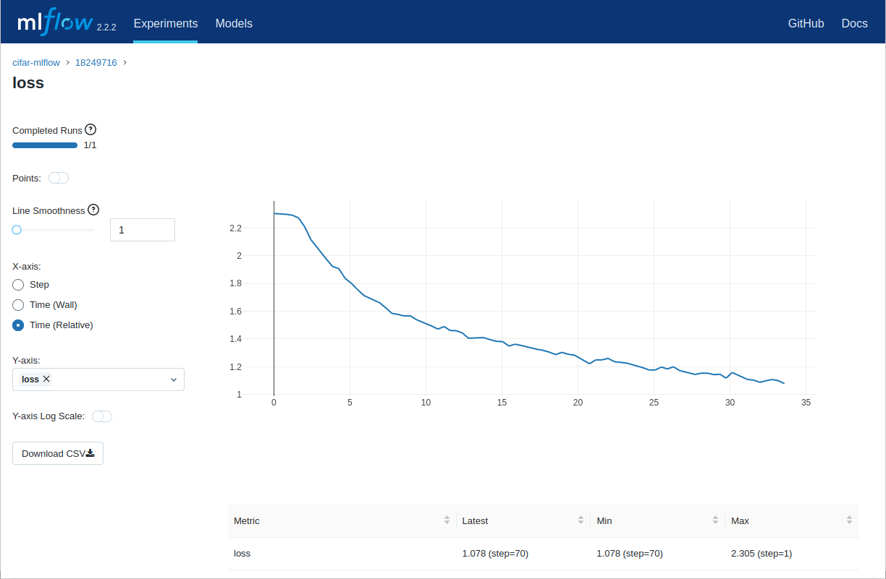

# Managing machine learning workflows on CSC's supercomputers

This guide discusses various ways for managing your machine learning
workflows on CSC's supercomputers. It is part of our [Machine learning
guide](ml-guide.md).

Instead of providing a single integrated machine learning workflow
system, our approach is to support a wide range of ML workflow tools
so that users can pick and choose what fits their needs best.

## MLflow

[MLflow][MLflow] is an open source tool for tracking experiments and
models in machine learning projects. You can easily install MLflow
yourself with `pip` (see [our documentation on how to install Python
packages][own-install]) but it should be included in most of [our
pre-installed modules][ml-apps], such as `pytorch`, `tensorflow` and
`python-data`.

### Tracking runs

Enabling MLflow tracking in your Python code is easy. Some libraries
support [automatic logging with MLflow][autolog], but even if the
library you are using does not, logging can be added with just a few
lines of code. For example:

```python
import mlflow
mlflow.set_tracking_uri("/scratch/project_2001234/mlruns")
mlflow.start_run(run_name=os.getenv("SLURM_JOB_ID"))
```

With `mlflow.set_tracking_uri()` we set the location where the MLflow
files should be stored, replace with the appropriate path for your own
project in the example. If you don't set a location it will create a
directory called `mlruns` in you current working directory.

Instead of a directory, you can also use an SQLite database, just start the tracking location with `sqlite://`, for example:

```python
mlflow.set_tracking_uri("sqlite:////scratch/project_2001234/mlruns.db")
```

It is not mandatory to set a name for the run, but in the example
above we show how to use the Slurm job id for the name.

Finally in the code where you calculate metrics that you wish to track
you need to add a line to track it with MLflow:

```python
mlflow.log_metric("loss", loss)
```

For a full example for PyTorch see [mnist_ddp_mlflow.py][pytorch-ex]
or [mnist_lightning_ddp.py](lightning-ex) for PyTorch Lightning.

In addition to metrics you can also log parameters and artifacts. See
the [MLflow documentation for a list of logging functions][log-func].

### MLflow tracking UI

To visualize and monitor your runs you can start the [MLflow tracking
UI][mlflow-app] using the [Puhti web user interface][webui].

To launch it, log in to the web interface at
<https://www.puhti.csc.fi/> and select "MLflow" from the "Apps"
menu. In the submission form you need to select where the MLflow files
are stored. This is the same path that you used for the
`mlflow.set_tracking_uri()` method, i.e., typically:

- a directory like `/scratch/<project>/mlruns/`, or
- an SQLite database like `sqlite:////scratch/<project>/mlruns.db`

The default resource settings should be fine for most cases.

Once the session has started you should see a list of your runs similar to this screenshot:


If you select a run (here named based on the Slurm id), you can for
example click on the "Metrics" field and select "loss" to see a plot
of that metric over time:




## Weights & Biases

TODO: adapt https://docs.wandb.ai/quickstart for Puhti usage


[MLflow]: https://www.mlflow.org/
[ml-apps]: ../../apps/by_discipline.md#data-analytics-and-machine-learning
[own-install]: ../../apps/python.md#installing-python-packages-to-existing-modules
[autolog]: https://www.mlflow.org/docs/latest/tracking.html#automatic-logging
[pytorch-ex]: https://github.com/CSCfi/pytorch-ddp-examples/blob/master/mnist_ddp_mlflow.py
[lightning-ex]: https://github.com/CSCfi/pytorch-ddp-examples/blob/master/mnist_lightning_ddp.py
[mlflow-app]: ../../computing/webinterface/mlflow.md
[webui]: ../../computing/webinterface/index.md
[log-func]: https://www.mlflow.org/docs/latest/tracking.html#logging-data-to-runs
