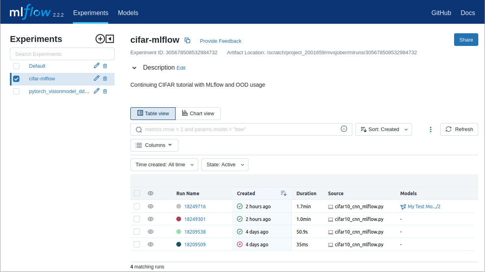

# Managing machine learning workflows on CSC's supercomputers

This guide discusses various ways for managing your machine learning
workflows on CSC's supercomputers. It is part of our [Machine learning
guide](ml-guide.md).

Instead of providing a single integrated machine learning workflow
system, our approach is to support a wide range of ML workflow tools
so that users can pick and choose what fits their needs best.

## MLflow

[MLflow][MLflow] is an open source tool for tracking experiments and
models in machine learning projects. It is included in most of [our
pre-installed modules for machine learning][ml-apps], such as
`pytorch`, `tensorflow` and `python-data`. You can also easily install
MLflow yourself with `pip` (see [our documentation on how to install
Python packages][own-install]).

We document **two ways to use MLflow on CSC's supercomputers**:

1. Storing the tracking data on the supercomputer's filesystem (e.g.,
   on `/scratch/`) and viewing the results via the [MLflow tracking
   UI](#mlflow-tracking-ui) in the web interface. (This is currently
   only supported on Puhti.)
   
2. Using your own [MLflow tracking server](#mlflow-tracking-server),
   for example running on [CSC's Rahti
   service](../../cloud/rahti/index.md).
   
Option 1 is simpler to get started with - just add a few lines in
your code and open the MLflow UI in the web interface - however it may
not scale up very well to hundreds of runs or multiple users. For more
advanced use cases we recommend Option 2.

First we'll explain how to modify your code to enable MLflow tracking.


### Tracking runs

Enabling MLflow tracking in your Python code is easy. Some libraries
support [automatic logging with MLflow][autolog], but even if the
library you are using does not, logging can be added with just a few
lines of code. For example:

```python
import mlflow
mlflow.set_tracking_uri("/scratch/project_2001234/mlruns")
mlflow.start_run(run_name=os.getenv("SLURM_JOB_ID"))
```

With `mlflow.set_tracking_uri()` we set the location where the MLflow
files should be stored, replace with the appropriate path for your own
project in the example. If you don't set a location it will create a
directory called `mlruns` in you current working directory.

Instead of a directory, you can also use an SQLite database, just
start the tracking location with `sqlite://`, for example:

```python
mlflow.set_tracking_uri("sqlite:////scratch/project_2001234/mlruns.db")
```

Instead of setting the tracking URI in the Python code, you can also
set it using an environment variable, for example in the Slurm job
script:

```bash
export MLFLOW_TRACKING_URI=/scratch/project_2001234/mlruns
```

It is not mandatory to set a name for the run, but in the example
above we show how to use the Slurm job id for the name.

Finally in the code where you calculate metrics that you wish to track
you need to add a line to track it with MLflow:

```python
mlflow.log_metric("loss", loss)
```

For a full example for PyTorch see [mnist_ddp_mlflow.py][pytorch-ex]
or [mnist_lightning_ddp.py][lightning-ex] for PyTorch Lightning.

In addition to metrics you can also log parameters and artifacts. See
the [MLflow documentation for a list of logging functions][log-func].

### MLflow tracking UI

To visualize and monitor your runs you can start the [MLflow tracking
UI][mlflow-app] using the [Puhti web user interface][webui].

To launch it, log in to the web interface at
<https://www.puhti.csc.fi/> and select "MLflow" from the "Apps"
menu. In the submission form you need to select where the MLflow files
are stored. This is the same path that you used for the
`mlflow.set_tracking_uri()` method, i.e., typically:

- a directory like `/scratch/<project>/mlruns/`, or
- an SQLite database like `sqlite:////scratch/<project>/mlruns.db`

The default resource settings should be fine for most cases.

Once the session has started you should see a list of your runs similar to this screenshot:



If you select a run (here named based on the Slurm id), you can for
example click on the "Metrics" field and select "loss" to see a plot
of that metric over time:


### MLflow tracking server

For more advanced use cases you may want to use an [MLflow remote
tracking server][tracking-server]. For this the tracking UI in the
Puhti web interface is not suitable, as it cannot be accessed over the
network, and it would typically not be running all the time when you
need to store data to it.

A more suitable platform for running an MLflow tracking server is
CSC's Rahti service.  We have provided a ready-made MLflow template in
Rahti's service catalog which makes starting an MLflow tracking server
easy. See our [user guide on how to start your own MLflow tracking
server on Rahti][mlflow-rahti]. There's even a [nice
video!](https://video.csc.fi/media/t/0_2frjyzz9).

You can also set it up to use Allas for storing artifacts.

Once you have your server running on Rahti you can access the web user
interface. The address can be found from Rahti (Applications → Routes
→ mlflow-ui-route) and will be something similar to
`https://your-mlflow-app.rahtiapp.fi`, depending on what name you gave
the application in the setup. Also the username and password will be
the same ones given in the setup phase.

Next, change your Python script to point to the new MLflow tracking
server:

```python
mlflow.set_tracking_uri("https://your-mlflow-app.rahtiapp.fi/")
```

Again, the URL depends on what name you gave to the application in
Rahti. In addition, you need to set two environment variables with the
username and password that you gave when creating the Rahti
application, for example:

```bash
 export MLFLOW_TRACKING_USERNAME=mlflow
 export MLFLOW_TRACKING_PASSWORD=secretPassword123
```

!!! warning ""

    It is not very secure to store the password in a plain text file such as
    the Slurm job script. One option is to give the password on the
    command line before launching the job. If you **prefix the export
    command with a single space** (as above) the bash shell will not store
    the command (including the password) in its history.


[MLflow]: https://www.mlflow.org/
[ml-apps]: ../../apps/by_discipline.md#data-analytics-and-machine-learning
[own-install]: ../../apps/python.md#installing-python-packages-to-existing-modules
[autolog]: https://www.mlflow.org/docs/latest/tracking.html#automatic-logging
[pytorch-ex]: https://github.com/CSCfi/pytorch-ddp-examples/blob/master/mnist_ddp_mlflow.py
[lightning-ex]: https://github.com/CSCfi/pytorch-ddp-examples/blob/master/mnist_lightning_ddp.py
[mlflow-app]: ../../computing/webinterface/mlflow.md
[webui]: ../../computing/webinterface/index.md
[log-func]: https://www.mlflow.org/docs/latest/tracking.html#logging-data-to-runs
[tracking-server]: https://www.mlflow.org/docs/latest/tracking.html#mlflow-tracking-servers
[mlflow-rahti]: https://github.com/CSCfi/mlflow-openshift/blob/master/docs/USER_GUIDE.md
