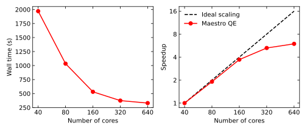

# Extended instructions for using Maestro at CSC

Please first read the actual [CSC Maestro page](../../apps/maestro.md)
and then consult the power user and special case instructions below.
Further down there are steps to help solving or diagnosing issues
and to prepare data for support requests.

[TOC]

## Standalone jobs on Puhti

!!! warning "Note"
    All Maestro jobs must be run on compute nodes via the queuing system.
    Don't run any Maestro jobs, including the GUI, on the login nodes.
    Maestro jobs on the login node will be terminated without warning.

The recommended way to run Maestro jobs on Puhti is to create the input files on
your local computer and instead of running them, write them to disk. The procedure
is shown in [a video](../../apps/maestro.md#standalone-usage-on-puhti) on our
main Maestro page. Use e.g. `scp` on your local machine to copy the inputs to
Puhti (edit your username and project accordingly):

```bash
scp -r my_job <your username>@puhti.csc.fi:/scratch/<your project>
```

Note that `scp` works also in Windows PowerShell. See
[Moving data between CSC and local workstation](../../data/moving/index.md) for
other alternatives.

Once the folder `my_job` containing all input files has been copied:

1. SSH to Puhti.
2. Load the Maestro module.
3. Go to the input directory.

```bash
ssh <your username>@puhti.csc.fi
module load maestro
cd /scratch/<your project>/my_job
```

The job is submitted to a compute node(s) by running the `job_name.sh` script
written out by Maestro. It will formulate the task(s) as Slurm batch job(s) and
ask resources according to the selected HOST in your `schrodinger.hosts` file in
your Puhti `$HOME` directory.

```bash
bash job_name.sh  # note the usage of `bash`, not `sbatch`!
```

Once the simulation has finished, copy the outputs back to your local computer
for analysis. On your local machine, run e.g. `scp` again:

```bash
scp -r <your username>@puhti.csc.fi:/scratch/<your project>/my_job .
```

Note that you can also use e.g. the [Puhti web interface](../../data/moving/web-interface.md)
for copying files between Puhti and your local computer.

Another more advanced version is to use e.g. the `pipeline` tool which allows
you to bypass some of the Schrödinger jobcontrol machinery, but requires you to
write the job script yourself. This may be useful in case some of your subjobs
terminate unexpectedly. In this case, please make note of those JobIds and
[contact us](../contact.md).

The remainder of this article explains some implementation details on Puhti
and helps setting up efficient simulation workflows.

## Maestro `schrodinger.hosts` file

This file specifies the resources your jobs can get either locally
or from the queuing system. To use the recommended procedure
you need to edit the local (on your computer) `schrodinger.hosts` file to
include the same HOSTs that you want to use on Puhti. On Windows, this will
require admin privileges.

On Puhti, Maestro complains about the location of this file, but ignore it,
it's ok. The file is created by a script (echoed on your screen when you give
`module load maestro`) that you need to run if the file does not exist.

As the script requests, select the computing project that will be used for
CPU/GPU usage and scratch storage. You can find the actual Slurm options
in the HOST descriptions in the `schrodinger.hosts` file. If your jobs require
resources that are not satisfied by any of the predefined HOST descriptions,
feel free to edit the file.

On Puhti, you can take a look at the `schrodinger.hosts` file with:

```bash
less $HOME/schrodinger.hosts
```

On your local computer this file will be in the Maestro installation directory,
e.g. on Windows in `C:\Program Files\Schrodinger-version\schrodinger.hosts`

After the longish header and the `localhost` entry, you should see the
Puhti HOST entries as something like:

```bash
name:        test
queue:       SLURM2.1
qargs:       -p test -t 00:10:00 --mem-per-cpu=2000 --account=project_2042424
host:        puhti-login11
processors:  4
```

For example, this HOST entry, available for Schrödinger jobs as _test_ (from `name: test`),
will use the Slurm partition _test_ (from `-p test`), allocate a maximum of 10 minutes of time,
2 GB of memory and consume resources from Project_2042424. If you need different resources you
can edit this file e.g. by adding a new entry. The requests must be within the
[partition limits](../../computing/running/batch-job-partitions.md).

If your `schrodinger.hosts` file **on Puhti** does not have the `--account=<project>` defined,
delete the file and rerun the script to create it (`module load maestro` will print out the
path to the script, copy/paste it to the command line). You don't need to have the
`--account=` option set in your **local** `schrodinger.hosts` file. In your local file,
it's enough that the different HOST entries exist (and the GPU-ones have GPUs specified).

Note that the HOST entries and Slurm partitions (or queues) are two
different things. The HOST entries define resources using Slurm partitions.

## How to speed up simulations?

All other Maestro modules run serial jobs, except Jaguar and Quantum Espresso, which can run
"real" parallel jobs. Don't choose a "parallel" HOST for any other job type. Instead of
MPI-parallel jobs, Maestro modules typically split the workload into multiple parts, each
of which can be run independent of the others.
[The Maestro documentation has an excellent section on this topic](https://www.schrodinger.com/documentation).
In the documentation, go to "Getting started" > "Running Schrödinger Jobs" >
"Running Distributed Schrödinger Jobs".

It is typical to process a lot of molecules as part of a particular workload.
If you have enough molecules, you can split the full set into smaller subsets
and process each of the subsets as a separate job. The Maestro modules have
easy-to-use options for defining the number of subjobs. However, you must know
in advance how many subjobs to launch. In principle, this requires knowing
how long one molecule takes, or testing for each different use case.

!!! warning "Important note"
    When you start working with a new system/dataset, don't test if you got the
    syntax right with 1 000 000 molecules and 1000 subjobs. Instead, start out with e.g.
    50 molecules and 2 subjobs. Learn how long it takes per molecule, confirm that your
    submit syntax is correct, adjust your parameters if needed and only then scale up.

If you're using the GUI to set up your job script, specify how many (sub)jobs
(processors) you want to use. You can easily edit this later in the submit
script if you change your mind.

The "default" submit script will work "as is" for small jobs. Just make
sure you don't ask for too many (sub)jobs. As a rule of thumb, each subjob
should last at least 1 hour, and for very large jobs preferably 24 hours.
Running a lot of very short jobs is inefficient in many ways and may degrade
the performance of the system for all users, see our [high-throughput computing
guidelines](../../computing/running/throughput.md). For large workflows, you'll
need to edit your scripts, see below.

### Quantum ESPRESSO

Running multi-node jobs using the "parallel" HOST works well with Quantum ESPRESSO when appropriate
parallelization flags are carefully specified. The default parallelization is over plane waves if
no other options are specified. To improve on this, k-points (if more than one) can be partitioned
into "pools" using the `-npools` flag. Also, when running on several hundred cores, the scalability
can be further extended by dividing each pool into "task groups" which distributes the workload
associated with Fast Fourier Transforms (FFTs) on the Kohn-Sham states. This is done using the
`-ntg` flag. In order to have good load balancing among MPI processes, the number of k-point pools
should be an integer divisor of the number of k-points and the number of processors for FFT
parallelization should be an integer divisor of the third dimension of the smooth FFT grid (this
can be checked from the output file, `grep "Smooth grid" *.out`). Further parallelization levels are
presented in the [QE documentation](https://www.quantum-espresso.org/Doc/user_guide/node20.html).

The QE parallelization options can be specified in the Job Settings dialog of the QE calculations
panel of the Maestro GUI. Running a job using 160 cores on Puhti (4 nodes) could be parallelized
for example with `-npools 4 -ntg 4` so that each k-point pool is given 40 cores, which are further
divided into 4 task groups of 10 cores each.

!!! info "Using full nodes"
    When running Maestro modules such as Quantum ESPRESSO on multiple nodes, remember to explicitly
    request the appropriate number of nodes by editing the `schrodinger.hosts` file with the
    `--nodes=<number of nodes>` flag. Requesting full nodes prevents fragmenting of the job and
    decreases the amount of unnecessary communication between surplus nodes. For large subjobs you
    may also need to tune the time and memory requested in the `schrodinger.hosts` file to suit your
    needs.

!!! info "Host selection"
    A single core job as required by the driver process cannot be run on the `large` partition on
    Puhti. To run multi-node subjobs you need to modify the submission script generated by the GUI
    by specifying a separate driver HOST (e.g. `-DRIVERHOST interactive -SUBHOST parallel`, see also
    [below](#advanced-host-selection)).

The following figures show the time to solution and scaling of the [PSIWAT
benchmark](https://github.com/QEF/benchmarks/tree/master/PSIWAT) (2552 electrons,
4 k-points, Maestro 2021.3, pure MPI).



* Scaling is almost ideal up to 4 nodes when using `-npools 4 -ntg 4` .
* For this system and QE binary the performance does not scale beyond 320 cores.
* Always confirm the appropriate scaling of your system before running large multi-node jobs
  (minimum 1.5 times speedup when doubling the number of cores).

## Additional flags for Maestro modules

Different modules have different options. You can set some of them in
the GUI, but you may find more options with the `-h` flag, e.g.

```bash
glide -h
```

where `glide` would be the Maestro module you want to run, like
`qsite`, `pipeline`, `bmin`, `ligprep`, etc.

[The Maestro documentation](https://www.schrodinger.com/documentation) has a nice summary
of the different options for different modules. In the documentation, go to
"Getting started" > "Running Schrödinger Jobs" > "Running Distributed Schrödinger Jobs".

### Simple HOST selection

For jobs that finish within about two days and run 10 subjobs, just use:

```bash
-HOST normal_72h:10
```

or if they all finish within 14 days, use:

```bash
-HOST longrun:10
```

If you have a workflow that will last longer, read on.

### Advanced HOST selection

The general aim is to have the "driver process" running on a "HOST"
that will be alive for the whole duration of the workflow. Good
options are _interactive_ and _longrun_ if you estimate the complete
workflow to take more than 3 days (queuing included). A "driver process"
that is not using a lot of CPU is also allowed on a login node, but
a subjob is not. Never submit jobs on Puhti _login nodes_ with
`-HOST localhost`. It's ok if you create your own batch script or
[interactive session](../../computing/running/interactive-usage.md) _and_ use
localhost on a compute node, but that's for special cases only and not
discussed on this page.

Set the "driver" or "master" to run on a HOST that allows for long
run times (if it's a big calculation). The driver needs to be alive
for the whole duration of the workflow, otherwise your subjob
likely ends up fizzled. You can use "interactive" which allows
for 7 days for one core, or "longrun" which allows for 14 days.
If you need to run multiple workflows at the same time, choose
"longrun" for the next drivers. In both cases select some "normal"
HOST (i.e. "small" Slurm partition) for the (sub)jobs. Suitable
splitting will reduce your queuing time. Asking for the longrun HOST
"just in case" is not forbidden, but may lead to unnecessary queuing.

You may be able to set the number of subjobs already in the GUI.
Typically, it would set the "number of processors", which in many drivers
will be equal to the number of subjobs. Alternatively, you may be able
to set also the number of subjobs. This enables you to limit the number
of simultaneous jobs with the "processor count" (so that you and others
won't run out of licenses) but keep a single subjob at a suitable size.
Please have a look at the help text of your driver via the Help path
described above.

In summary, for a large workflow, edit the GUI-generated script along the
lines: `-HOST "normal_72h:10"` to `-HOST "longrun:1 normal_72h:9"` or e.g.
`-HOST "normal_72h"` to `-HOST "interactive:1 normal_72h:9"`. Another
alternative is to use explicit flags, `-DRIVERHOST interactive -SUBHOST normal_72h`.

Note that you can only have two jobs running in the interactive HOST at the same time.

Desmond jobs can have the `-HOST gpu` flag as set by the GUI, but Windows users
need to change the forward slash "/" to backward slash "\" in the binary name.

### Authoritative job control instructions from the manual

A more detailed discussion on advanced jobs can be found in the Maestro documentation
via the GUI or the [Schrödinger website](https://www.schrodinger.com/documentation):

* "Getting Started" > "Running Schrödinger Jobs" > "Running Schrödinger Applications from the Command Line" >
  "The HOST, DRIVERHOST, and SUBHOST Options"

and a table of driver process conventions from:

* "Getting started" > "Running Schrödinger Jobs" > "Running Distributed Schrödinger Jobs"

## Setting number of subjobs or molecules per subjob

!!! info "Tip"
    If you don't know how long your full workflow will take, don't ask
    for more than 10 subjobs and/or `NJOBS`. More is not always better!
    If you have very large cases, don't exceed 50 simultaneous (sub)jobs.

As an example, the "run settings dialog" of `glide` offers three options:

* Recommended number of subjobs.
* Exactly (fill in here) subjobs.
* Subjobs with no more than (fill in here) ligands each.

Aim for such numbers that an average subjob takes 1-24 hours to run. This
ensures that the overhead per subjob remains small while offering efficient
parallelization, i.e. you get your results quickly and each subjob (as well as
the master job) has time to finish.

Don't run subjobs that complete faster than 15 minutes. You can check the
subjob duration afterwards with [seff](../faq/how-much-memory-my-job-needs.md)
and use this info in your following jobs: `seff <slurm jobid>`.

If time runs out for a subjob, search for "restart" in the
[Schrödinger Knowledge Base](https://support.schrodinger.com/s/)
for your module, and/or look again for the options of your driver with
the `-h` flag. Most jobs are restartable, so you don't lose completed
work or used resources.

If you choose too many subjobs, Maestro may get confused with the Slurm
messages and sorting out the issue can be difficult. Also, running too
many subjobs at a time can lead to the [license tokens running out](#availability-of-licenses),
and the time spent waiting in the queue will be wasted.

## Optimal disk usage

The Schrödinger HOSTs in Puhti have not been configured to use the
[local NVMe disk](../../../computing/running/creating-job-scripts-puhti/#local-storage),
which is available only on some of the compute nodes. Since most jobs don't
gain speed advantage from NVMe disk, you'll likely queue less by not asking
for it. If your job performs a lot of I/O operations, please contact
[CSC Service Desk](../contact.md) on how to request fast disk. The only disk available
for the jobs is the same where your input files already are. Hence, it does not make
sense to copy the files to a "temporary" location at the start of the job.

## Running the Maestro GUI on Puhti

[The _Desktop_ app in the Puhti web interface](../../computing/webinterface/desktop.md)
can be used to run the Maestro GUI on Puhti. The performance may, however, be
slower than running the GUI locally (recommended). Running the GUI on Puhti over
SSH using X11 forwarding over SSH is **not recommended** as it performs extremely
poorly.

## Availability of licenses

The CSC Maestro license has a fixed amount of tokens that are available for everyone.
First, Maestro uses _module specific_ tokens, of which there are many for each module.
If they run out, then more jobs (of that same type) can be run with _general tokens_,
but when they run out, no more jobs of that type (or any new jobs which need a
general token) can be run by anyone. Therefore, this situation should be avoided.
Once a job ends, the tokens are released, and are available for everyone.

You can check the currently available licenses (tokens) with:

```bash
$SCHRODINGER/utilities/licutil -avail
```

and currently used licenses (tokens) with:

```bash
$SCHRODINGER/utilities/licutil -used
```

Note that some Maestro tools or workflows use multiple modules and hence licenses
or tokens from multiple modules. Typically, one running instance of a module (a job or
a subjob) requires several tokens. For example, Desmond and Glide jobs take 8 tokens each.

CPU time (billing units) is a different resource and has nothing to do with license tokens.
When you run out of billing units, you or your project manager can
[apply for more via the My CSC portal](../../accounts/how-to-apply-for-billing-units.md).

## Fizzled jobs

Sometimes the jobs are launched, but don't finish. The state of the job as
reported by `jobcontrol` (see below) is _fizzled_. This might be due to a
number of reasons, but cleaning up and restarting the jobcontrol service
might help. When you don't have any Maestro jobs running (in Puhti), give:

```bash
$SCHRODINGER/utilities/jserver -cleanall
$SCHRODINGER/utilities/jserver -shutdown
```

Sometimes the `jserver -cleanall` command will not work because the program thinks
some jobs are still running. To force purge these jobs, run:

```bash
$SCHRODINGER/jobcontrol -delete -force <jobid>
```

before running the above `jserver` commands. `<jobid>` should be replaced by the
ID of your stranded job, for example `puhti-login11-0-626be035`.

Another reason for jobs ending up fizzled is too many simultaneous jobs. Please have a look at the
error files for suggestions, and if this is the case, ask for less subjobs.

## Run a test job to help diagnosing problems

Run one of the test jobs that come with Maestro to narrow down
potential issues. In your scratch directory on Puhti, give

```bash
installation_check -test test
```

to try running a test job using the `test` HOST. If the test succeeds,
the problem is likely in your input. In this case, please proceed to the
_postmortem_ step below.

## Asking for support

Maestro has a tool called _postmortem_ that can be used to create a zip file
containing the details of a failed job and the Maestro environment. Please add
that to your support request to help us analyze your issue. On Puhti, first run:

```bash
jobcontrol -list 
```

to find the right JobId (something like `puhti-login11-0-4d34ce08`). Then,
check the right flags for `postmortem` with:

```bash
$SCHRODINGER/utilities/postmortem -h
```

and create the postmortem file with:

```bash
$SCHRODINGER/utilities/postmortem <your schrodinger jobid>
```

The file may be large, so instead of sending it as an email attachment, consider
using [a-flip](../../data/Allas/using_allas/a_commands.md#a-flip) and just sending
a link instead. Also, see the previous recommendation to first start
[testing with small systems](#how-to-speed-up-simulations), as this will also enable
you to use the `test` HOST and avoid queueing.

Please have a look at our [instructions on writing support requests](../support-howto.md).
An efficient support request will help us to solve your issue faster.

## Recap of Maestro usage on Puhti

1. Always test your workflow first with a **small** sample.
      * Please mind the [Slurm partition limits](../../computing/running/batch-job-partitions.md).
2. Don't run the Maestro GUI on a login node.
      * If you _must_ run the GUI on Puhti, use the Puhti web interface _Desktop_ app.
3. Don't specify too many subjobs – an optimal subjob takes 1-24 hours.
4. Don't specify too many subjobs – there are many researchers using the same license.
5. Don't run a heavy "driver process" on the login node
      * If the driver process is heavy, use e.g. `-HOST "longrun:1 normal_72h:9"` for 10 subjobs.
6. Never run anything in parallel on the login node.
      * Do not use `localhost` in your script unless you write your own batch script or run
        Maestro in an [interactive session](../../computing/running/interactive-usage.md).
7. Submit all jobs from your `/scratch` area.
8. If your local computer uses Windows, edit `\` to `/` in your script.
9. Use the same version of Maestro locally and on Puhti.
