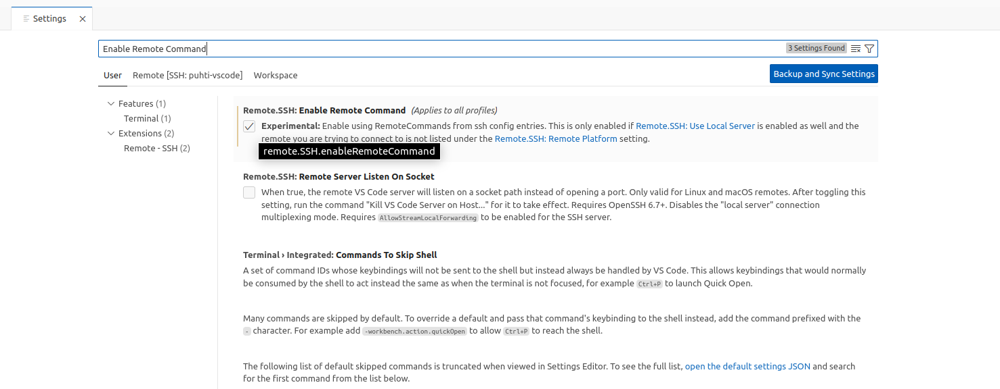
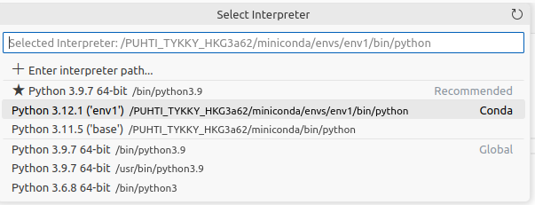

# Developing scripts remotely

Often it is more efficient to use an IDE like Visual Studio Code or a text editor like Notepad++ to modify and develop the scripts you are running in Puhti, Mahti or cPouta virtual machine. 

**Pros:**

* No need to use command line text editors like vi, vim or nano
* No need to transfer files back and forth between your local computer and Puhti/Mahti/cPouta

Here are some installation and usage instructions for the following programs:

* [Visual Studio Code](#visual-studio-code-with-remote-ssh-plugin)
* [Notepad++](#notepad-with-nppftp-plugin)

## Visual Studio Code with Remote SSH plugin

Visual Studio Code is a widely used open source code editor made by Microsoft that can be used remotely with the __Remote SSH__ extension. It is especially great for Python and bash scripts but can be used with any programming language. VS Code has a lot of extensions for your needs, some notable are the Python extension and the Jupyter notebook extension. 

### Installation

You can install VS Code to your computer [from the VS Code webpage](https://code.visualstudio.com) and the Remote SSH Plugin from the Extension tab on the program. 


!!! note
        __Windows users__ also need an SSH client installed as PuTTy is not supported. 

        If you have access to admin privileges, you can [enable the OpenSSH on Windows 10](https://docs.microsoft.com/en-gb/windows-server/administration/openssh/openssh_install_firstuse). 

        If you don't have access to admin privileges, you can install [Git for Windows from here](https://gitforwindows.org/) and configure VS Code to use the SSH client included in Git (__File__ -> __Preferences__ -> __Settings__ -> search for __"Remote SSH Path"__ and add path to your ssh.exe e.g __C:\Users\<YOUR_USER>\AppData\Local\Programs\Git\usr\bin\ssh.exe__). You might also need to disable the setting "useLocalServer" if you encounter problems with VS Code using your Windows username rather than CSC username.


### Usage

After installation go to the Remote Explorer tab in VS Code and add new remote machine from the __+__ symbol. When VS Code asks for the SSH command, type
```
ssh <csc_username>@puhti.csc.fi
```
Also you need to choose a config file where it will save that connection to.


See also the [Remember hosts and advanced settings](https://code.visualstudio.com/docs/remote/ssh#_remember-hosts-and-advanced-settings) section of the VS Code documentation for further details.

After that you can connect to the new host and it will ask you what operation system the target machine has (Puhti is Linux) and also your CSC password.


You are now in Puhti and can open a folder and edit files remotely. Notice that you can also transfer files to Puhti/Mahti by dragging and dropping them to VS Code.

If you prefer to use an ssh private key instead of your password, you can add `-i <path_to_your_keyfile>` to the command shown above. This is mandatory for LUMI, but for Puhti and Mahti you need to first add the corresponding public key to the `~/.ssh/known_hosts` file on the remote system.

### Configuring CSC software environments in VS Code Remote SSH

Due to usage of the [module](../../computing/modules.md) system and singularity containers for loading software environments, the VS Code Remote SSH extension is sometimes unable to correctly detect installed software, especially in Python environments. This means that e.g. code completion hints and many other convenient features will not work. Some additional configuration is required in order for VS Code to enable these.

This typically requires running an SSH remote command upon connection and varies depending on your exact use case - details on the exact commands that need to be run are listed below for a few examples. However, in all cases you need to

1. Enable remote commands in the Visual Studio Code Remote-SSH extension:
   Open the settings screen (`Ctrl ,`) and type "enable remote command" in the search field. The `Enable Remote Command` setting should appear as the first search result. Make sure it is enabled (shows the tick mark). .

2. Configure a connection with remote command in your SSH configuration file:
   Open the SSH configuration file (`Ctrl Shift p` or `F1`) and type `ssh configuration`, then `Remote-SSH: Open SSH Configuration File` should appear as the first result. Click it.

   In the now opened file, add a new block like the following and save the file:
   ```
   Host puhti-software-environment
        HostName puhti.csc.fi
        User <csc_username>
        RemoteCommand <remote_command>
   ```
   Adjust the `HostName` to the system you want to connect to. You can freely choose the label after `Host` (`puhti-software-environment`) and this is how it will appear in the remote host selection of the VS Code Remote SSH extension when you make a connection. We recommend giving each combination of system and software environment you work with a recongnizable name (e.g., `puhti-pytorch`).

   If you prefer to use an SSH key instead of being prompted for your password, you can add `IdentityFile <path_to_your_keyfile>` to the host configuration block shown above (this is mandatory for LUMI).

#### Loading CSC modules

You can load a module into the VS Code remote connection using the following `remote_command`:

```bash -c "source /appl/profile/zz-csc-env.sh; module load <your_module>; singularity_wrapper shell"```

On LUMI, you will instead need to use

```module use /appl/local/csc/modulefiles/; module load <your_module>; singularity_wrapper shell```

`<your_module>` is the module (or modules) you want to load, e.g. `pytorch`.

!!! note

    The `singularity_wrapper shell` part of the above `remote_command` assumes that the module is built using a singularity container,
    which is true in the majority of cases. However, if this does not work, try to replace it with `bash`.

#### Loading CSC modules with additional packages (Python)

If your environment is based on a CSC module but you have installed some additional packages on top either via `venv` or using `pip install --user` (see also our [Python usage guide](python-usage-guide.md#installing-python-packages-to-existing-modules)) you will need to use the following `remote_command` (on Puhti/Mahti):

- `pip` installation to custom `PYTHONUSERBASE`: insert `export PYTHONUSERBASE=<your_pip_user_base_dir>; ` before `singularity_wrapper shell`, i.e. on Puhti/Mahti the `remote_command` becomes: ```bash -c "source /appl/profile/zz-csc-env.sh; module load <your_module>; export PYTHONUSERBASE=<your_pip_user_base_dir>;  singularity_wrapper shell"```
- `venv`: insert `export APPTAINERENV_PREPEND_PATH='<your_venv_dir>/bin/'` before `singularity_wrapper shell` - you may also have to [select the Python interpreter used by VS Code](https://code.visualstudio.com/docs/python/environments#_select-and-activate-an-environment) as the one provided by the venv


!!! note

    Unfortunately the support for venv is currently limited to environments that are set-up from within the singularity container. To set up the venv, do the following in the system terminal:
    1. Load the respective (base) module: `module load <your_module>`
    2. Enter the container environment: `singularity_wrapper shell`
    3. Create the virtual environment: `python -m venv --system-site-packages <path_where_to_create_the_venv_directory>`

    Step 2 is crucial - if you create the venv from outside the container, it will not work from within and therefore not with the VS Code remote setup described above.

#### Loading tykky containers (Python)

To connect to a custom Python environment container created with our [Tykky container wrapper](../../computing/containers/tykky.md), use the following `remote_command`:

```<tykky_installation_dir>/bin/_debug_shell```

where `<tykky_installation_dir>` is the path in which the Tykky environment installation was made.

Once you are connected to the remote environment in VS Code, the integrated terminal should show as prompt line

```bash
Apptainer>
```

indicating that you have a shell inside the Tykky container.

Finally, you need to [select the Python interpreter used by VS Code](https://code.visualstudio.com/docs/python/environments#_select-and-activate-an-environment) as `/<SYSTEM>_TYKKY_*/miniconda/envs/env1/bin/python`, where `<SYSTEM>` is a placeholder for `PUHTI`, `MAHTI`, `LUMI`, and `*` for some string of random characters.



!!! note

        You will not be able to modify the contents of the container using this VS Code remote connection, including installing new packages via pip or conda. Please modify the container using the [instructions for tykky](../../computing/containers/tykky.md#modifying-a-conda-installation) outside the configured VS Code remote connection.

### Running the code

You can also run the code in Puhti by opening a terminal from the Terminal tab or using VS Code's debuggers. Note that this runs the code on a login node by default which is __not meant for demanding computations__. Unfortunately it is currently not possible to easily start interactive slurm sessions on computation nodes using the above VS Code remote setup for the majority of modules since the slurm commands are not available from within the singularity containers. Please contact servicedesk@csc.fi if you require help on this.

## Notepad++ with NppFTP plugin

Notepad++ with [NppFTP plugin](https://ashkulz.github.io/NppFTP/) enables viewing and editing remote files. Also creating, renaminig and deleting files is possible. 

* Install the plugin from Plugin Manager.
* Open NppFTP window from Plugins -> NppFTP.
* Set up the connection to Puhti, add new profile to Profile settings, use values similar to [FileZilla Puhti settings](../../data/moving/graphical_transfer.md#filezilla-a-general-file-transfer-tool).
* Navigate to correct folder in Puhti and open the file.
* Saving the file in Notepad++ uploads the file automatically to Puhti.
