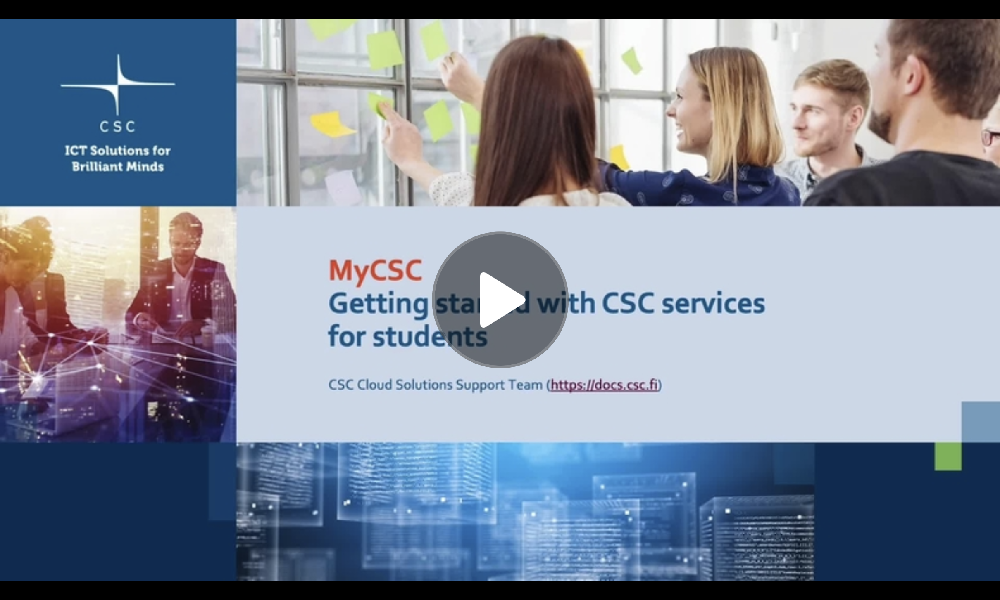

# Getting started with CSC services for students

!!! warning-label

    Please read this page carefully!

[{ width=400px }](https://video.csc.fi/id/0_oesbi3v1?width=608&height=402&playerId=14971191){ target="_blank" }

This tutorial gathers all the information you, as a student, need to get started with using CSC services.

The easiest way is to **create a student project**.

## Project Details

- The student may have **one project** at a time but be a member of many.
- The student project is access to **a fixed amount of resources** for **a fixed period of time** for [selected CSC services](#available-services).
- Its purpose is to help students with their studies **free of charge**[^1].
- The services are provided through **the same infrastructure** used by researchers, teachers and other students at Finnish higher education institutions.[^2]

!!! warning ""

    So - please **be mindful** of your use of resources. Respect infrastructure and other users.[^3]

## Managing Project

- Thanks to our updated terms and conditions, you - the student - can now be **the project manager** of the student project.
- You will have **the same responsibilities** as any other CSC Project Manager.[^4]
- As a project manager, you can **invite people** to your project[^5]. _(but you're also responsible for their actions in the project)_
- Student projects are **not intended for sensitive data**[^6] and cannot store such data.

## Available Services

- [Allas](../../data/Allas/index.md){:target="_blank"} storage service
- [Pouta](../../cloud/pouta/index.md){:target="_blank"} cloud service
- [Puhti](hpc-quick.md){:target="_blank"} computing service
- [Pukki](../../cloud/dbaas/index.md){:target="_blank"} database service
- [Rahti](../../cloud/rahti/index.md){:target="_blank"} container service

!!! success-label

    That's it! Now you know your rights and responsibilities in the student project.

## Student Project 1-2-3

Below's the life cycle of a student project:

0. [Create a new user account](../../accounts/how-to-create-new-user-account.md#getting-an-account-with-haka-or-virtu) _(done once at first login)_
1. [Create a student project](../../accounts/how-to-create-new-project.md#student)
2. [Add members to your project](../../accounts/how-to-add-members-to-project.md) _(optional)_
3. [Add access to services](../../accounts/how-to-add-service-access-for-project.md)
4. [Use the services](#available-services).
5. Manage your data across multiple services and plan to **back it up** before the project ends.
6. [Project ends](../../accounts/how-to-manage-your-project.md#when-the-project-is-closed)

You can be a project manager for **one student project** at a time, but a member for many.

You can create a new project (step 2) when your project ends.

[^1]: [Free-of-charge use cases for students](https://research.csc.fi/free-of-charge-use-cases#2){:target="_blank"}
[^2]: [Computing](https://research.csc.fi/computing){:target="_blank"}
[^3]: [General Terms of Use](https://research.csc.fi/general-terms-of-use){:target="_blank"}
[^4]: [Prerequisites and Responsibilities for a Project Manager](https://research.csc.fi/prerequisites-for-a-project-manager){:target="_blank"}
[^5]: [How to add members to project](../../accounts/how-to-add-members-to-project.md){:target="_blank"}
[^6]: [Sensitive data](https://research.csc.fi/sensitive-data){:target="_blank"}
