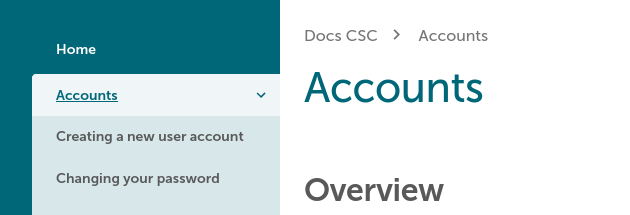

# Koulutus ja ohjeet {#training-tutorials}

## Uudistunut research.csc.fi-sivusto julkistettu, 26.02.2025 {#renewed-research-csc-fi-website-launched-26-02-2025}

Palautteen perusteella ja parhaita käyttöliittymä- ja käyttäjäkokemussuunnittelun käytäntöjä noudattaen, _Palvelut tutkijoille_ -sivusto on uudistettu antaen sille raikkaan ulkoasun. Sisältöä on virtaviivaistettu tavoitteenamme helpottaa tietojen löytämistä CSC:n palveluista. Yksi uusista ominaisuuksista—esiväliotsikko, joka auttaa navigoimaan eri CSC-sivustojen välillä—on otettu käyttöön myös Docs CSC:ssä. [Lue lisää uudistuksista blogista research.csc.fi-sivustolla.](https://research.csc.fi/2025/01/23/renewed-research-csc-fi-website-aims-to-clarify-cscs-service-offering-and-improve-end-user-communication/){ target=_blank }

## Docs CSC:n visuaaliset muutokset, 17.10.2024 {#visual-changes-for-docs-csc-17-10-2024}

Docs CSC -alustan teknisen kehityksen virtaviivaistamiseksi osa visuaalisista mukautuksista on poistettu käytöstä, merkittävin muutos koskee navigointisivupalkkien tyylejä. Tämä muutos ei vaikuta sivuston sisältöön eikä rakenteeseen, ja se mahdollistaa uusien ominaisuuksien käyttöönoton _Material for MkDocs_ -teknologian avulla pienemmällä vaivalla.

## Uusi opas suurten kielimallien kanssa työskentelyyn CSC:n supertietokoneilla, 6.9.2024 {#new-guide-for-working-with-large-language-models-on-cscs-supercomputers-6-9-2024}

Olemme luoneet uuden [oppaan suurten kielimallien (LLMs) kanssa työskentelyyn CSC:n supertietokoneilla](../tutorials/ml-llm.md). Oppaassa käsitellään LLM:ien ja GPU-muistin käyttöä, hienosäätöä sekä ennustamista. Liitetyssä GitHub-repossa on esimerkkejä suosittujen mallien hienosäätöön Puhti- ja Mahti-koneilla. LUMI-esimerkit ja syvällisemmät aiheet lisätään myöhemmin.

## Uusi opas CSC:n superlaskennan aloittamiseen, 24.7.2024 {#new-guide-for-getting-started-with-supercomputing-at-csc-24-7-2024}

Olemme kirjoittaneet uuden oppaan [CSC:n superlaskennan aloittamiseen](../tutorials/hpc-quick.md), jossa autamme käyttäjiä löytämään heidän tarpeisiinsa parhaiten soveltuvat resurssit ja tehokkaimman tavan käyttää niitä. Opas on hyödyllinen sekä täysin uusille HPC-käyttäjille että kokeneille ammattilaisille, jotka ovat kuitenkin uusia CSC:n tietojenkäsittely-ympäristössä.

## Uusi opas Pythonin tehokkaaseen käyttöön CSC:n supertietokoneilla, 27.6.2024 {#new-guide-for-using-python-effectively-on-csc-supercomputers-27-6-2024}

Olemme uudistaneet Python-dokumentaatiotamme. Ohjeet pakettien asentamiseen, eri kehitysympäristöjen käyttöön ja rinnakkaisten tehtävien suorittamiseen on päivitetty ja ne löytyvät nyt oppaasta nimeltä [*Using Python on CSC supercomputers*](../tutorials/python-usage-guide.md).

[Python-sovellussivu](../../apps/python.md) on yksinkertaistettu kuvaamaan vain eri Python-toteutuksia tietojenkäsittely-ympäristössämme. Uutena lisäyksenä siellä on [luettelo valmiista Python-ympäristömoduuleistamme](../../apps/python.md#pre-installed-python-environments), sekä niiden käyttötarkoitukset ja sisäänrakennetut paketit.

## Computaatiokemian kevätkoulun materiaalit saatavilla omatoimiseen opiskeluun, 10.5.2024 {#spring-school-on-computational-chemistry-materials-available-for-self-learning-10-5-2024}

[Koulun materiaalit](https://zenodo.org/records/11172973) kattavat johdannon molekyylidynamiikkaan ja elektronirakenteen teoriaan liittyvät luennot ja harjoitukset sekä koneoppimisen molekyyli- ja materiaalitieteisiin liittyvissä sovelluksissa. Voit myös käyttää Notepadia suoraan [Puhtin verkkoliittymän kautta](https://www.puhti.csc.fi) (kirjauduttuasi valitse "Jupyter for courses" ja haluamasi kurssimoduuli).

## Kuinka ajaa GROMACSia tehokkaasti LUMI-materiaalit julkaistu, 6.2.2024 {#how-to-run-gromacs-efficiently-on-lumi-training-materials-published-6-2-2024}

Työpajan "Kuinka ajaa GROMACSia tehokkaasti LUMI:lla" materiaalit ovat nyt [saatavilla Zenodo-repossa](https://zenodo.org/records/10610643).

## CSC:n uutiskirjeen ja postituslistan arkistot saatavilla Docs CSC:stä, 13.12.2023 {#access-csc-newsletter-and-mailing-list-archives-from-docs-csc-13-12-2023}

_Yhteyssivu_ on päivitetty ja se sisältää valikoiman [CSC:n uutiskirjeen ja postituslistan arkistoja](../contact.md#archives). Katso täältä, jos sinulla on vaikeuksia löytää sähköpostia tai sinulle lähetettyä uutiskirjettä CSC:ltä!

## Uusi tapa antaa palautetta Docs CSC sivujen kautta, 30.10.2023 {#new-way-to-provide-feedback-on-pages-in-docs-csc-30-10-2023}

Docs CSC:ssa on nyt palautepainikkeet jokaisen sivun alareunassa.

>

Painikkeet tarjoavat nopean ja helpon tavan antaa palautetta tietystä sivusta.

## Muutoksia Docs CSC:n navigoinnissa, 22.02.2023 {#changes-in-navigation-on-docs-csc-22-02-2023}

Docs CSC:n sivupalkkinavigoinnissa on tehty muutoksia. Monet osiot, kuten _Yleiskatsaus_, _Sisältö_ tai muut indeksin kaltaiset sivut ovat siirtyneet itse osioiden otsikoiden alle, joista on nyt tehty linkkejä:

| Ennen | Jälkeen |
|-|-|
|  |  |

## Uusi opas kaukokartoitusdatan kanssa työskentelyyn, 19.01.2023 {#new-guide-for-working-with-earth-observation-data-19-01-2023}

[Maanhavainnointidata-opas](../tutorials/gis/eo_guide.md) on suunniteltu auttamaan tutkijoita työskennellessä Maan havainnointidatan (EO) kanssa antamalla yleiskatsauksen käytettävissä olevista datalähteistä ja työkaluista rasteripohjaisiin EO-tehtäviin. Oppaan keskiössä on CSC:n tietojenkäsittelyresurssien käyttö EO-datan käsittelyssä ja analysoinnissa. Lisäksi se sisältää tietoa CSC:n ulkopuolisista vaihtoehdoista EO-datan prosessointiin ja lataamiseen.

## Koulutusmateriaalit ja lähteet CSC:ltä ja partnereilta, 12.12.2022 {#training-materials-and-sources-from-csc-and-partners-12-12-2022}

Tutustu tähän [tiiviiseen taulukkoon koulutusmateriaaleista](../training-material/index.md#training-materials-and-sources-from-csc-and-partners), jotka ovat saatavilla meiltä ja kumppaneiltamme liittyen moniin tietokoneavusteisen tieteen aiheisiin.

## Uusi ulkoasu Docs CSC:lle, 18.8.2022 {#a-new-visual-appearance-for-docs-csc-18-8-2022}

Pyrkimyksenä ylläpitää yhtenäistä tyyliä CSC:n verkkosivustoilla, Docs CSC on saanut päivitetyn visuaalisen ilmeen.

## Dokumentaatio räätälöidyistä Jupyter Notepadeista kursseillesi, 13.6.2022 {#documentation-on-custom-jupyter-notebooks-for-your-courses-13-6-2022}

Dokumentaatiomme [räätälöidyistä Jupyter Notepadeista kursseillesi](https://github.com/CSCfi/Jupyter_www_puhti) on laajennettu. Kouluttajat tai kurssijärjestäjät voivat hyödyntää supertietokoneiden voimaa kursseillaan helppokäyttöisissä Jupyter-notebookeissa CSC:llä. Räätälöityjen jukaisujen käyttö kursseilla on erittäin käyttäjäystävällistä ja skaalautuu sekä etä- että lähikursseille.

## Dokumentaatio korkean läpimenon laskennasta ja työnkuluista päivitetty, 6.6.2022 {#documentation-on-high-throughput-computing-and-workflows-updated-6-6-2022}

Dokumentaatiomme [korkean läpimenon laskennasta ja työnkuluista](../../computing/running/throughput.md) on päivitetty ja laajennettu. Sivulla on tärkeitä ohjeita kuinka suorittaa maskimalaiset tulokastrategiat painavaa IO-kuormitusta sisältävissä työnkuluissa CSC:n tietojenkäsittely-ympäristössä. Oikean teknologiapinon valinnalla työsi jonoutuvat vähemmän, IO-operaatiot tehostuvat ja koko HPC-järjestelmän suorituskyky säilyy vakaana ja nopeana kaikille käyttäjille. Tältä osin sivulla esitellään vuokaavioita, jotka auttavat sinua rajaamaan käyttöösi parhaiten soveltuvan työkalun.

## Uusi opas koneoppimisen aloittamiseen CSC:llä, 8.4.2022 {#new-guide-for-getting-started-with-machine-learning-at-csc-8-4-2022}

Jopa kokeneilla koneoppimiskäyttäjillä saattaa olla vaikeuksia astua supertietokoneympäristöön, sillä asiat toimivat hiukan eri tavalla kuin henkilökohtaisessa tietojenkäsittelyssä. Olemme nyt luoneet [oppaan auttamaan koneoppimisen aloittamisessa CSC:llä](../tutorials/ml-starting.md). Opas näyttää vaihe vaiheelta kuinka saat koodisi ja datasi Puhtiin ja käynnistät GPU:illa.

## Kuinka LUMI-C eroaa Mahtista? 6.4.2022 {#how-does-lumi-c-differ-from-mahti-6-4-2022}

[Tiivis katsaus keskeisiin eroihin LUMI-C:n ja CSC:n supertietokoneiden välillä](../../computing/lumi-vs-mahti.md), erityisesti Mahti, on julkaistu. Katso tämä sivu saadaksesi nopeasti käsityksen, mihin seikkoihin uusien LUMI-käyttäjien tulisi kiinnittää huomiota ja mistä saat lisätietoa!

## Opetusohjelma datan hallinnasta `scratch`-levyillä, 5.4.2022 {#tutorial-on-managing-data-on-scratch-disks-5-4-2022}

[Paras käytöntiä opas siitä, kuinka hallita dataa Puhtin ja Mahtin `scratch`-levyillä](../tutorials/clean-up-data.md) on julkaistu. Oppaassa selitetään, miksi on tärkeää pitää projektisi `scratch`-levy vapaana passiivisesta datasta ja annetaan suosituksia, mitä tehdä datalla, joka ei ole aktiivisessa käytössä. Opit myös tunnistamaan, missä sinulla on suuria määriä dataa sekä saamaan tietoa tulevasta automaattisesta tiedostojen poistamisesta.

## FireWorks työnkulkuväline, 15.2.2022 {#fireworks-workflow-tool-15-2-2022}

Opas [FireWorks välineen käytöstä](../../computing/running/fireworks.md) CSC:n tietojenkäsittely-ympäristössä on julkaistu. Opas selittää, kuinka käyttää ulkoista MongoDB-tietokantaa Rahti-alustalla FireWorks-työnkulun taustatietokantana ja kuinka käynnistää rinnakkaisia ajoja batch-työjonoa käyttämällä.

## Tietokantojen käyttö Rahti-alustalla CSC:n supertietokoneilta, 8.2.2022 {#accessing-databases-on-rahti-from-csc-supercomputers-8-2-2022}

[Opetusohjelma siitä, kuinka yhdistää tietokantoihin Rahti-alustalla CSC:n supertietokoneilta](../../cloud/rahti/tutorials/connect-database-hpc.md) on julkaistu. Opetusohjelma kuvaa prosessin MongoDB:n asettamista Rahti-alustalla ja kuinka luoda HTTP-yhteensopiva yhteys tietokannan ja Puhtin/Mahtin välille käyttämällä WebSocat-työkalua.

## Uusi koneoppimisen opas julkaistu, 20.12.2021 {#new-machine-learning-guide-released-20-12-2021}

Koneoppimisoppaamme [Machine learning guide](../tutorials/ml-guide.md) on päivitetty ja laajennettu. Se sisältää nyt alaluvut:

* [GPU-kiihdytetty koneoppiminen](../tutorials/gpu-ml.md)
* [Koneoppimiseen liittyvä datan tallennus](../tutorials/ml-data.md)
* [Moni-GPU ja moni-nodi koneoppiminen](../tutorials/ml-multi.md)
* [Hyperparametrien haku](../tutorials/hyperparameter_search.md)