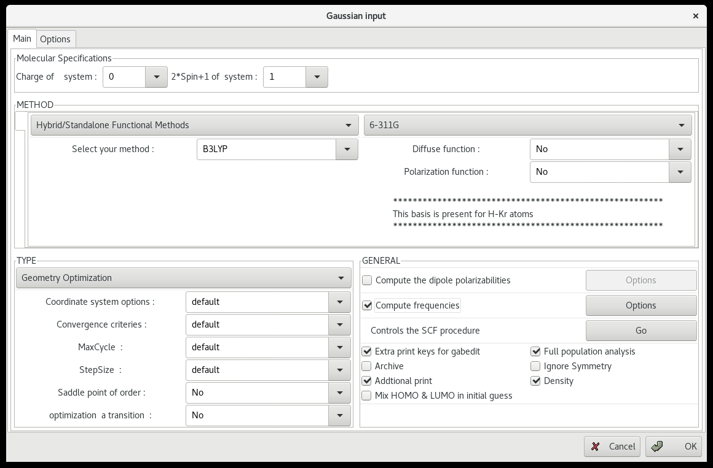
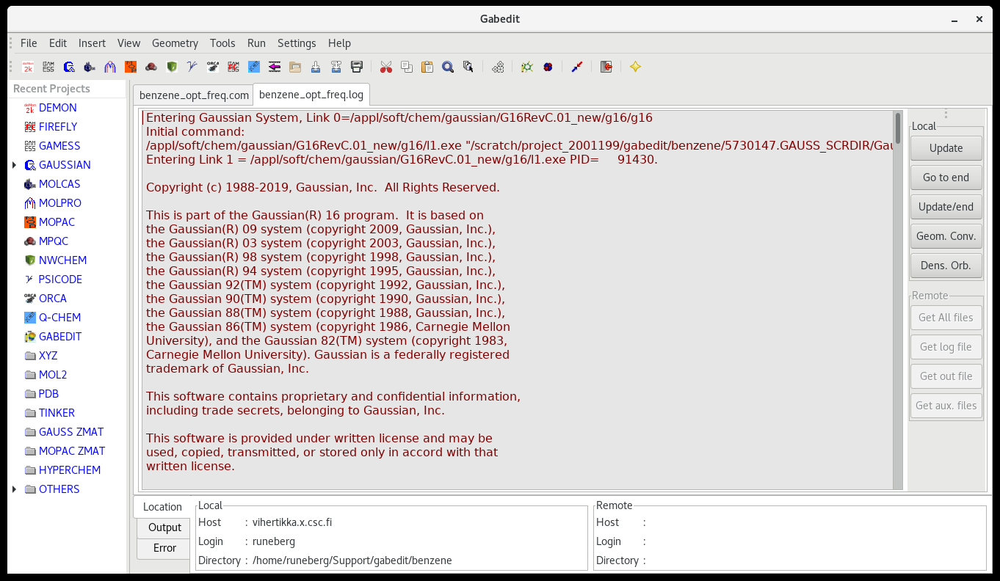

# Using Gabedit as GUI for Gaussian jobs on Puhti
 
[Gabedit](http://gabedit.sourceforge.net/) is a free graphical user interface 
(GUI) to many computational chemistry packages. Here we introduce how it can be used to prepare and analyze [Gaussian](../apps/gaussian.md) jobs on Puhti.
The prerequisites are that you have a valid CSC account that belongs to the Gaussian group, and that you are a member of a CSC project that has access to Puhti. This tutorial also assumes that you have Gabedit installed on your local computer.

## The workflow
In short, the major steps to construct, run and analyze a 
Gaussian job on Puhti using Gabedit are:

1.  Create the Gaussian input using Gabedit on your local computer.
2.  Copy the input files from your local computer to a suitable working directory on Puhti.
3.  Start the calculation on Puhti.
4.  Copy the results from Puhti to your local computer.
5.  Use Gabedit to analyze the results.

### 1.  Create the Gaussian input 
   - In Gabedit, build or load your molecular structure 
   - Define the method and other details you want to use

   - Save it as a Gaussian input in a separate directory (here called ```benzene```)


### 2.  Copy the input files to Puhti
   - Copy the whole input directory (here called ```benzene```) to a suitable scratch directory on Puhti (here we use ```rsync```. For other methods, see ["Moving data between CSC and local workstation"](../data/moving/index.md)) 
     
     ```rsync -rP benzene username@puhti.csc.fi:/scratch/project_2001199/gabedit```
     
### 3.  Start the calculation on Puhti
   - Login to Puhti and go that diretory 

     ```cd /scratch/project_2001199/gabedit/benzene```

   - Load the gaussian module ```module load gaussian```
   - Submit the calculation

     ``` subg16 00:10:00 benzene_opt_freq project_2001199```

### 4.  Copy the results back to your own computer
   - Once the gaussian job has finished, copy the whole directory from Puhti back to your own computer. Give this command on your own computer: 

    ```rsync -rP username@puhti.csc.fi:/scratch/project_2001199/gabedit/benzene/ .```

### 5.  Use Gabedit to analyze the results
   - In Gabedit use ```File ->Open``` to navigate to the directory where the results are 
   - In the lower right corner of the ```Open file``` window change the ```*.inp``` to ```*.com```
   - Select the com-file corresponding to your Gaussian job and open it. This opens the main Gabedit window
   - Select the tab showing the log file
 
   
   - The panel on the right shows various options that can be analyzed
   - In the example above we calculated the vibrational frequencies. These results can be studied by selecting ```Dens. Orb``` that opens the ```Gabedit: Orbitals/Density/Vibration``` window. 
       - On the canvas do right-click
       - Select ``` Animation -> Vibration```
       - By selecting a particular mode from the table, it can be animated by hitting ```Play```
       - The calculated spectrum is shown by selecting from the ```Vibration``` window ```Tools -> Draw IR spectrum```
       
